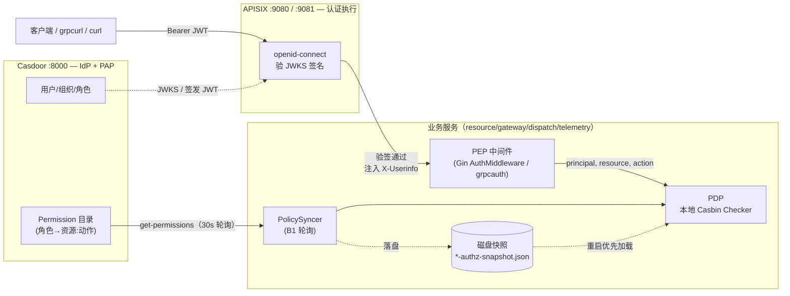
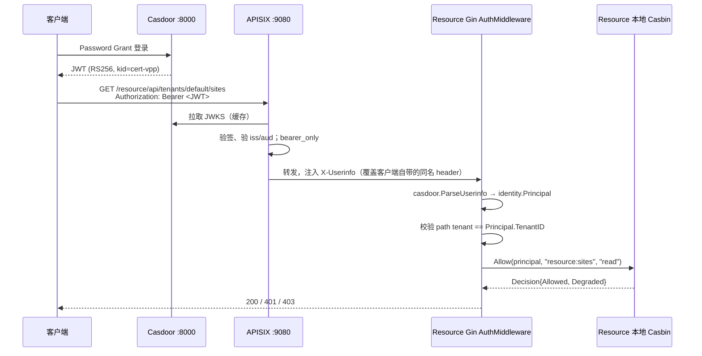
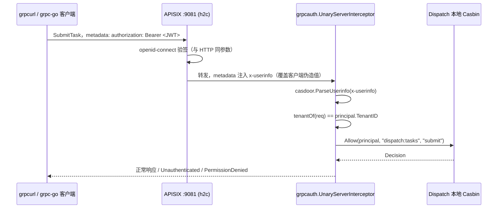
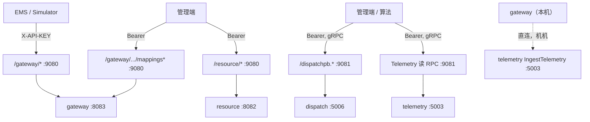

# VPP Backend 认证鉴权架构

本文说明项目中 **Casdoor**（身份提供方 + 策略源）、**APISIX**（北向网关 + 认证执行点）、**本地 Casbin**（策略决策点）三者如何配合，覆盖一次请求从客户端到业务 Handler 的完整身份/权限判断路径。风格与 [`observability.md`](observability.md) 对齐，供后续回顾架构时对照阅读。

---

## 一、总览

一句话概括：**Casdoor 签发身份、管理策略；APISIX 验证身份、统一北向入口；各服务本地 Casbin 做权限决策，PEP 中间件负责拦截和执行。** 四个角色分工明确，且授权判断**不在业务请求热路径上依赖 Casdoor 的实时可用性**。

| 角色 | 全称 | 组件 | 职责 |
|------|------|------|------|
| **IdP** | Identity Provider | Casdoor `:8000` | 用户/组织/角色管理；登录；签发 JWT |
| **PAP** | Policy Administration Point | Casdoor（同一进程） | 管理"角色能做什么"（Permission/Role 绑定），提供 `get-permissions` / `add-permission` API |
| **认证执行** | （HTTP 语境常称 PEP，但本项目 §二 中 PEP 专指授权执行点，避免和下面的 PEP 混淆） | APISIX `:9080`(HTTP) / `:9081`(gRPC) | 校验 Bearer JWT 签名（JWKS），注入可信 `X-Userinfo` / `x-userinfo`；限流；路由 |
| **PDP** | Policy Decision Point | 各服务本地 `platform/authz.Checker`（Casbin） | 根据 `(角色, 资源, 动作)` 判断允许/拒绝；策略从 Casdoor 定期同步到本地内存+磁盘快照 |
| **PEP** | Policy Enforcement Point | 各服务 Gin/`grpcauth` 中间件 | 解析身份、校验租户、调用 PDP、放行或拒绝 |



**关键设计取舍：Casdoor 只做 PAP + 身份签发，不做在线 PDP。** 各服务请求进来时在本地内存里做决策，不对每个业务请求同步调用 Casdoor 的 `/api/enforce`——因为 dispatch/gateway 最终会驱动物理设备动作，鉴权判断不能被"Casdoor 一次网络抖动"卡死或绕过。

---

## 二、四层职责再拆一次（术语澄清）

项目文档里 "PEP" 出现在两个不同层级，容易混淆，这里统一说明：

| 层级 | 例子 | 验证的是什么 |
|------|------|--------------|
| **认证层（AuthN）执行点** | APISIX `openid-connect` 插件 | "这个 JWT 是不是 Casdoor 签发的、没过期、签名对得上 JWKS" —— 回答"你是谁" |
| **授权层（AuthZ）执行点，即狭义 PEP** | `resource/adapter/inbound/http/auth.go`、`platform/middleware/grpcauth/auth.go` | "这个已认证的身份，能不能对这个资源做这个动作" —— 回答"你能不能做这件事" |

`docs/AUTHZ_CENTRALIZATION_PLAN.md` 里的 PEP/PDP/PAP 术语表专指授权层；`docs/CASDOOR.md` 里提到 APISIX 是 "PEP" 时指的是认证层的执行点。两份文档对同一个词的语境不同，读的时候按上表区分即可，不代表设计有矛盾。

---

## 三、一次请求的完整旅程

### 3.1 HTTP（以 Resource 为例）



### 3.2 gRPC（以 Dispatch 为例，2026-08 新增）

和 HTTP 走的是**同一套信任模型**：APISIX 验签后注入身份，服务信任网关转发过来的 header，不引入服务自验签 JWT。差别只是承载协议——gRPC 走 HTTP/2 metadata，APISIX 在 `:9081` 明文 HTTP/2（h2c）上跑同一个 `openid-connect` 插件。



**两条链路唯一的实质差异**：`trust-proxy-headers` 开关默认都是 `false`（本地直连调试旁路），HTTP 侧多年来一直这样用，gRPC 侧是这次改造后才补齐、且经过 Gate 0 实测验证（见 §四.3）。

---

## 四、Casdoor：身份与策略的唯一源头

### 4.1 双重角色

| 角色 | 对外接口 | 谁调用 |
|------|----------|--------|
| IdP（签发身份） | OIDC discovery、JWKS、Password Grant `/api/login/oauth/access_token` | 终端用户（人）、APISIX（验签） |
| PAP（管理策略） | `/api/get-permissions`、`/api/add-permission`、`/api/update-permission` | 各服务的 `PolicySyncer`（用内置 admin 账号，**不是**业务用户凭据） |

这两套接口用的是**不同的凭据体系**：终端用户用 `vpp-resource-dev-client` 这个 OIDC Application 登录拿业务 token；`PolicySyncer` 用 `built-in / app-built-in / admin` 这个内置控制台账号去读写 Permission —— 混用会导致 `AuthzPolicySyncFailing` 告警（见 `docs/AUTHZ_RUNBOOK.md` §2）。

### 4.2 JWT Claim → `Principal` 的映射（防腐层）

`internal/platform/identity/identity.go` 定义的 `Principal` 是**稳定契约**，不暴露 Casdoor 的字段名；`internal/platform/authn/casdoor/userinfo.go` 是唯一知道 Casdoor wire 格式的地方，换 IdP 只需要重写这一个文件：

| `Principal` 字段 | Casdoor claim | 实测类型 |
|---|---|---|
| `UserID` | `sub`（缺省 `id`） | string (UUID) |
| `TenantID` | `owner` | string，即 Casdoor Organization |
| `Username` | `name` | string |
| `Roles` | `roles[].name` | **对象数组**，不是纯字符串数组 |
| `IsAdmin` | `isAdmin` | bool（仅提示，RBAC 判断只看 `Roles`） |

```go
// internal/platform/identity/identity.go
type Principal struct {
    UserID   string
    TenantID string
    Username string
    Roles    []string
    IsAdmin  bool
}
```

### 4.3 权限目录（Catalog）：谁声明、谁绑定

各服务在代码里声明自己有哪些 `resource:动作`（如 `dispatch:tasks` × `submit`/`read`/`cancel`），启动时 upsert 到 Casdoor（`authz.RegisterCatalog`，只建目录、**不覆盖角色绑定**）；"哪个角色能用哪个权限"完全在 Casdoor 侧管理（UI 或种子 `deploy/casdoor/conf/init_data.json`），改绑定不需要碰任何服务代码。

命名规范：

| 层 | 格式 | 例 |
|---|---|---|
| Casbin `obj` | `{service}:{resource}` | `dispatch:tasks` |
| Casbin `act` | `{action}` | `submit` / `read` / `cancel` |
| Casdoor Permission 名 | `catalog-{obj替换冒号为-}-{act}` | `catalog-dispatch-tasks-submit` |

---

## 五、APISIX：北向唯一入口

### 5.1 路由一览

| 路径 / 目标 | 端口 | 插件 | 身份来源 |
|---|---|---|---|
| `/gateway/*`（EMS 遥测上报等机机流量） | `:9080` HTTP | `key-auth` + `limit-req` | API Key（`X-API-KEY`），**不经 Casdoor** |
| `/gateway/api/v1/tenants/*/mappings*`（人管映射 CRUD） | `:9080` HTTP，priority 100 | `openid-connect` + `limit-req` | Casdoor Bearer |
| `/resource/*` | `:9080` HTTP | `openid-connect` + `limit-req` | Casdoor Bearer |
| `/dispatchpb.DispatchService/*` | `:9081` gRPC (h2c) | `openid-connect` + `limit-req` | Casdoor Bearer |
| Telemetry 读 RPC（`QueryTelemetry`/`GetSnapshot`/`GetFleetSnapshot`/`QueryAggregation`） | `:9081` gRPC (h2c) | `openid-connect` + `limit-req` | Casdoor Bearer |
| Telemetry `IngestTelemetry` | 不经 APISIX 用户鉴权，gateway 直连 `127.0.0.1:5003` | — | 机机旁路 |



### 5.2 一个必须记住的插件顺序坑

`openid-connect` 和 `proxy-rewrite` 在 APISIX 里同属 `rewrite` 阶段，`openid-connect` 优先级（2599）高于 `proxy-rewrite`（1008），**同阶段内优先级高的先跑**。这意味着：

- ✅ 正确做法（当前所有路由都是这样）：只配 `openid-connect`，靠它自身 `set_userinfo_header` 的**覆盖语义**清掉客户端伪造的 `X-Userinfo`/`x-userinfo`。
- ❌ 错误做法（2026-08 复审时发现并否决）：额外加一条 `proxy-rewrite.headers.remove: ["x-userinfo"]` 想"先删伪造身份"——实际上它会跑在 `openid-connect` **之后**，把刚注入的可信值也一起删掉，导致合法请求被误判为"missing x-userinfo"而拒绝。

Gate 0（`deploy/apisix/gate0/probe.sh`）专门用一条"客户端自带伪造 admin 身份 + 合法 viewer token"的用例验证覆盖语义生效，不是靠读文档假设。

### 5.3 gRPC 北向的两个限制

1. **明文 HTTP/2（h2c）**：`:9081` 上 Bearer token 是明文传输的，仅限本机 `localhost` 使用；跨机联调必须先配 TLS（`:9443` 已预留），不能在局域网内明文传 token。
2. **只做认证网关，不做零信任验签**：这条链路的安全边界依赖"业务 gRPC 端口只绑定 `127.0.0.1`、只有 APISIX 能到达"这个网络假设，不是密码学层面不可绕过的。是否要升级为服务自验签 JWT（不依赖网络拓扑），是一个需要 HTTP + gRPC 一起做的独立架构决策，当前没有采用（详见 `ROADMAP.md` 已知限制表）。

---

## 六、本地 Casbin：策略决策与分级降级

### 6.1 为什么不直接实时调用 Casdoor 判断

见 §一的"关键设计取舍"。各服务本地跑一个 `authz.Checker`（内嵌 Casbin Enforcer），策略由 `authz.Syncer` 每 30 秒轮询 Casdoor 的 `get-permissions` 刷新（B1 轮询模式），请求进来时纯内存判断，微秒级，不产生跨网络调用。

### 6.2 Casbin Model（所有服务共用）

```ini
[request_definition]
r = sub, obj, act

[policy_definition]
p = sub, obj, act

[role_definition]
g = _, _

[policy_effect]
e = some(where (p.eft == allow))

[matchers]
m = g(r.sub, p.sub) && keyMatch2(r.obj, p.obj) && r.act == p.act
```

`r.sub` 是 `Principal.Roles` 里的裸角色名（`admin`/`operator`/`viewer`），多角色时逐个 enforce，任一 allow 即通过；`keyMatch2` 支持策略侧通配（如 `resource:*`）。

### 6.3 三档健康状态 + fail-closed

策略同步状态按"距上次成功同步的时间"分三档，**默认原则是 fail-closed（拒绝优先于放行）**，这是虚拟电厂场景的刻意选择——授权判断出错的代价不是"数据泄露"，dispatch 链路误放行可能直接作用于物理设备：

| 档位 | 判定条件 | 行为 |
|---|---|---|
| **健康（Healthy）** | staleness < `healthy-after` | 正常用本地缓存策略判断 |
| **过期但可用（Stale）** | `healthy-after` ≤ staleness < `stale-after` | 继续用旧缓存判断，`Degraded=true`；控制类服务（dispatch）可配 `deny-writes-when-stale: true`，此档直接拒绝非 `read` 动作 |
| **失效（Invalid）** | staleness ≥ `stale-after`，或从未同步成功 | 若本地有历史策略仍按 fail-closed 拒绝写操作（`allow-read-when-invalid` 可选放行只读）；若**完全没有**策略缓存（真正冷启动），进入 §6.4 安全网 |

```go
// internal/platform/authz/casbin_checker.go（简化）
switch tier {
case TierHealthy:
    ok, err = c.enforceLocked(principal, resource, action)
case TierStale:
    if c.cfg.DenyWritesWhenStale && action != "read" {
        ok = false
    } else {
        ok, err = c.enforceLocked(principal, resource, action)
    }
default: // TierInvalid
    if !c.hasPolicies {
        ok = principal.HasRole(c.cfg.SafetyNetRole) // 冷启动安全网
    } else if action == "read" && c.cfg.AllowReadWhenInvalid {
        ok, err = c.enforceLocked(principal, resource, action)
    } else {
        ok = false
    }
}
```

控制类服务（dispatch）的阈值比管理类服务（resource/telemetry）更严格：

| 服务 | healthy-after | stale-after | deny-writes-when-stale |
|---|---|---|---|
| resource / telemetry | 5m | 30m | 否 |
| **dispatch**（控制面） | **1m** | **5m** | **是** |

### 6.4 冷启动安全网 + 磁盘快照

服务重启后、尚未完成过一次成功同步时本地没有任何策略——此时**不会**默认放行任意角色，只放行 `SafetyNetRole`（默认 `admin`），其余全部拒绝，且这个范围比业务角色矩阵更收紧。

`PolicySyncer` 会把最近一次成功同步的策略连同时间戳落盘（`./data/<service>-authz-snapshot.json`），进程重启后优先加载磁盘快照并按其时间戳走正常的三档判断——避免把"服务重启几十秒"和"Casdoor 真的失联"混为一谈，误入冷启动安全网。

### 6.5 观测点

`Checker.Allow()` 每次判断都会：①按结果打 `authz_decision_total{result=allow|deny|degraded_allow|degraded_deny}`；②档位发生迁移（如 healthy→stale）时打一条 `ERROR` 级日志 `authz policy sync tier degraded`，方便和普通的偶发 deny 区分开。

---

## 七、各服务 PEP 接入现状

| 服务 | 协议 | PEP 位置 | 授权范围 | `trust-proxy-headers` 默认 |
|---|---|---|---|---|
| **resource**（C3/C7） | HTTP (Gin) | `adapter/inbound/http/auth.go` | 全量 CRUD（sites/assets/cus/points/import-jobs） | `false` |
| **gateway**（C10b） | HTTP (Gin) | `adapter/inbound/http/auth.go`，只挂在 `mappings` 路由组 | 仅 `mappings` CRUD；`telemetry:ingest` 走 APISIX `key-auth`，不挂用户 PEP | `false` |
| **dispatch**（C10a） | gRPC | `platform/middleware/grpcauth` + `dispatch/adapter/inbound/grpc/catalog.go` | `SubmitTask`/`GetTask`/`CancelTask` | `false` |
| **telemetry**（C10c） | gRPC | `platform/middleware/grpcauth` + `WithMachineBypass` | 4 个只读 RPC；`IngestTelemetry` 跳过用户 PEP（gateway→telemetry 机机） | `false`（且 `IngestTelemetry` 永远旁路，与开关无关） |

四个服务共用同一套 `identity.Principal` / `authz.PermissionChecker` / Casbin Model，差异只在：① PEP 挂在 Gin 还是 gRPC 拦截器上；② 各自的 `catalog.go` 把 `(method,path)` 或 `fullMethod` 翻译成 `(resource,action)`；③ 降级阈值严格程度不同（dispatch 更严）。

`gateway`/`dispatch`/`telemetry` 之间的**内部** gRPC 调用（`dispatch→gateway ExecuteCommand`、`gateway→telemetry IngestTelemetry`）不经过这套用户身份体系，依赖"同一台机器/同一内网可信"的假设——这是当前明确接受的 perimeter security 模型，东西向 mTLS/零信任留给以后的 K8s + service mesh 阶段。

---

## 八、端口与配置速查

| 组件 | 端口 | 说明 |
|---|---|---|
| Casdoor | **`:8000`** | UI / OIDC discovery / JWKS / Password Grant |
| APISIX HTTP | **`:9080`** | 北向 HTTP 入口 |
| APISIX gRPC (h2c) | **`:9081`** | 北向 gRPC 入口，仅 localhost |
| APISIX Admin API | `:9181` | 管理 routes/consumers |
| APISIX HTTPS（预留） | `:9443` | Phase 1+，gRPC 跨机时需先启用 |
| resource | HTTP `:8082` / gRPC `:5002` | `config/resource.yaml` |
| gateway | HTTP `:8083` / gRPC `:5005` | `config/gateway.yaml` |
| dispatch | gRPC `:5006` | `config/dispatch.yaml` |
| telemetry | gRPC `:5003` | `config/telemetry.yaml` |

各服务配置文件里的 `auth` 小节结构一致：

```yaml
auth:
  trust-proxy-headers: false   # true 时要求合法身份 + 本地 PDP；false 时本地直连旁路调试
  authz:
    casdoor-url: http://127.0.0.1:8000
    casdoor-organization: built-in     # PolicySyncer 登录用，非业务 Organization
    casdoor-application: app-built-in
    casdoor-username: admin
    casdoor-password: "123"
    owner: default                    # 业务租户 / Casdoor Organization
    model-filter: default/vpp-rbac
    snapshot-path: ./data/<service>-authz-snapshot.json
    sync-interval: 30s
    healthy-after: 5m      # dispatch: 1m
    stale-after: 30m       # dispatch: 5m
    allow-read-when-invalid: false
    deny-writes-when-stale: true   # 仅 dispatch
```

打开 `trust-proxy-headers` 前必须过一遍 `docs/AUTHZ_RUNBOOK.md` §6 的前置清单（网络隔离、身份只信网关、明文 gRPC 限本机等），也可以直接用 `make run-dispatch-secured` / `make run-telemetry-secured` 走一次性验证配置。

---

## 九、可观测性：指标 / 告警 / Runbook

| 指标 | 含义 |
|---|---|
| `authz_policy_sync_last_success_timestamp{service}` | 上次成功同步的 Unix 时间戳 |
| `authz_policy_sync_failures_total{service}` / `_successes_total` | 同步失败/成功累计 |
| `authz_policy_stale_seconds{service}` | 距上次成功同步的秒数，从未成功为 `-1` |
| `authz_policy_loaded{service}` | 本地是否已有策略规则（冷启动判断依据） |
| `authz_policy_tier{service,tier}` | 当前档位（healthy/stale/invalid），活跃档为 1 |
| `authz_decision_total{service,result}` | PEP 决策计数，按 allow/deny/degraded_allow/degraded_deny 分 |

告警规则：`config/prometheus-authz-alerts.yaml`（`AuthzPolicySyncFailing` / `AuthzPolicyStale` / `AuthzPolicyInvalid` / `AuthzPolicyNotLoaded`，后两者是 critical）。完整排障步骤见 `docs/AUTHZ_RUNBOOK.md`。

---

## 十、验证命令

```bash
# 起基础设施
make casdoor-up && make casdoor-init
make apisix-up && make apisix-init

# HTTP：Resource 全流程
curl -s -o /dev/null -w '%{http_code}\n' http://127.0.0.1:9080/resource/api/tenants/default/sites   # 401 无 token
curl -s -o /dev/null -w '%{http_code}\n' \
  -H "Authorization: Bearer $(make -s casdoor-token USER=admin)" \
  http://127.0.0.1:9080/resource/api/tenants/default/sites                                          # 200

# gRPC：Dispatch（需 make run-dispatch-secured）
make apisix-gate0-probe   # grpcurl + grpc-go 双客户端，含"伪造 x-userinfo 应被覆盖"用例

# 查看当前判断依据是哪个 JWT claim
make -s casdoor-token USER=admin DECODE=1

# authz 健康度
curl -s http://127.0.0.1:9102/metrics | grep '^authz_'   # resource
curl -s http://127.0.0.1:9105/metrics | grep '^authz_'   # dispatch
```

---

## 十一、代码与文档索引

| 职责 | 路径 |
|---|---|
| 身份契约 `Principal` | `internal/platform/identity/identity.go` |
| `PrincipalParser` 接口 | `internal/platform/authn/parser.go` |
| Casdoor claim → `Principal`（唯一知道 wire 格式的地方） | `internal/platform/authn/casdoor/userinfo.go` |
| PDP 端口定义 | `internal/platform/authz/checker.go` |
| PDP 实现（本地 Casbin + 三档降级） | `internal/platform/authz/casbin_checker.go` |
| PDP 阈值配置 | `internal/platform/authz/config.go` |
| Casdoor B1 拉取客户端（PermissionSource/PermissionAdmin） | `internal/platform/authz/casdoor.go` |
| 策略同步器（定时 pull + 落盘） | `internal/platform/authz/syncer.go` |
| 权限目录声明 + 自动注册 | `internal/platform/authz/catalog.go` |
| Prometheus 指标 | `internal/platform/authz/metrics.go` |
| Casbin Model | `internal/platform/authz/model.conf` |
| gRPC PEP（dispatch/telemetry 共用） | `internal/platform/middleware/grpcauth/auth.go` |
| Resource HTTP PEP | `internal/resource/adapter/inbound/http/auth.go` |
| Gateway HTTP PEP（仅 mappings） | `internal/gateway/adapter/inbound/http/auth.go` |
| Telemetry 机机旁路 | `internal/telemetry/adapter/inbound/grpc/auth_bypass.go` |
| Casdoor 部署 + IdP 概念 | `docs/CASDOOR.md` |
| APISIX 部署 + 路由详解 + 踩坑记录 | `docs/APISIX.md` |
| 集中式授权改造设计文档（PAP/PDP/PEP 全套推导） | `docs/AUTHZ_CENTRALIZATION_PLAN.md` |
| 联调测试清单 | `docs/AUTHZ_TEST.md` |
| 运维 Runbook（告警处置 + 开关前置清单） | `docs/AUTHZ_RUNBOOK.md` |
| gRPC 网关 Gate 0 探针 | `deploy/apisix/gate0/probe.sh`、`internal/dispatch/cmd/gate0client/main.go` |
| APISIX 路由参考（gRPC） | `deploy/apisix/routes/dispatch-grpc.yaml`、`telemetry-grpc.yaml` |
| Casdoor 种子（角色绑定、Model） | `deploy/casdoor/conf/init_data.json`、`authz_model.conf` |

---

## 十二、已知边界（不是遗漏，是明确的阶段性取舍）

1. **东西向无鉴权/mTLS**：`dispatch→gateway`、`gateway→telemetry` 的内部 gRPC 调用完全依赖同网络可信假设。perimeter security 模型，留给 K8s + service mesh 阶段。
2. **gRPC 北向依赖网络隔离，不是密码学零信任**：APISIX 注入的身份靠"业务端口只有 APISIX 能到达"这个拓扑假设成立，不是自证的；打开 `trust-proxy-headers` 前必须先满足 `AUTHZ_RUNBOOK.md` §6 的前置清单。
3. **`:9081` 明文 HTTP/2**：仅限本机，跨机联调需先接 TLS（`:9443`）。
4. **角色模型是占位的三元角色**（`admin`/`operator`/`viewer`）：真实业务角色/权限模型尚未确定，但架构本身（`PermissionChecker` 接口 + Casbin Model）不需要因此改动，等业务角色明确后在 Casdoor 侧调整绑定即可。
5. **B1 轮询而非事件推送**：策略生效有最多 `sync-interval`（30s）的延迟；服务数量增多后如果轮询打到 Casdoor 的请求成为负担，`docs/AUTHZ_CENTRALIZATION_PLAN.md` §7.2 里有演进到"集中同步 + Kafka 广播"（B1′）的方案，当前未启用。
6. **Casdoor 自身是 SPOF**，且底层根源是与业务服务共享的单实例 Postgres，不是 Casdoor 应用层本身。分级 HA 建议见 `docs/AUTHZ_CENTRALIZATION_PLAN.md` §6·补。
