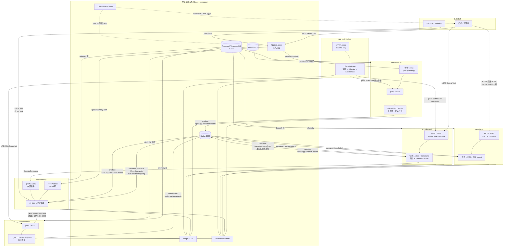
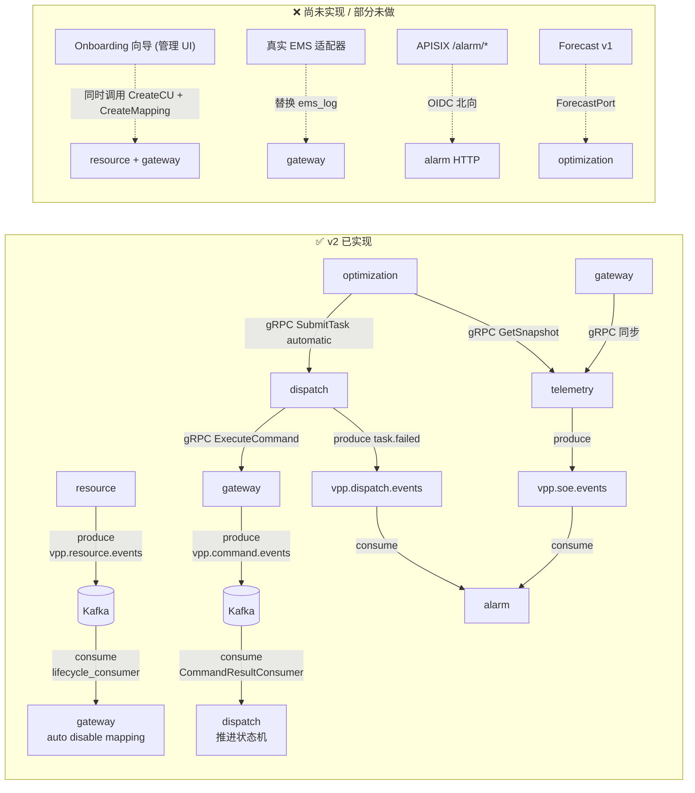

下面是目前 **v2 实际已打通** 的全局架构，以及仍在规划中的部分（虚线标注）。

## 一、当前全局架构（实线 = 已实现）




## 二、服务间调用矩阵（v2 当前）


| **调用方**   | **被调用方**                 | **协议**       | **状态**      | **说明**                                        |
| --------- | ------------------------ | ------------ | ----------- | --------------------------------------------- |
| EMS       | gateway（经 APISIX）     | HTTP `:9080/gateway` | ✅ 已通 | `X-API-KEY`；也可直连 `:8083` 本地调试 |
| 管理端       | resource（经 APISIX）    | HTTP `:9080/resource` | ✅ 已通 | Casdoor JWT + OIDC；直连 `:8082` 可关应用鉴权 |
| gateway   | telemetry                | gRPC `:5003` | ✅ 已通        | `IngestTelemetry`，配置写死在 `gateway.yaml`        |
| 管理端       | dispatch                 | gRPC `:5006` | ✅ **v2 已通** | 人工 `SubmitTask` / `GetTask` / `CancelTask`   |
| **optimization** | telemetry            | gRPC `:5003` | ✅ **已通**    | `GetSnapshot`；绕开 Resource Runtime 缓存；熔断默认开 |
| **optimization** | resource             | gRPC `:5002` | ✅ 已接线      | `GetAsset` 额定容量；仅 `AggregateTarget`；v1 规则不调用 |
| **optimization** | dispatch             | gRPC `:5006` | ✅ **已通**    | `SubmitTask` `TriggerType=automatic`；熔断默认开；服务端 `submit-task` 限流 `rps=20 burst=40` |
| **任意**    | **optimization 业务 API** | —          | ❌ 无         | 无入站业务 gRPC/HTTP，只有 `/healthz` + `/metrics` |
| dispatch  | gateway                  | gRPC `:5005` | ✅ **v2 已通** | `ExecuteCommand`（CommandID / PointKey / oneof Value） |
| gateway   | 外部系统 / Simulator     | HTTP         | ✅ **simulator 已通** | `ExternalSystem=simulator` → Simulator；其它 → `ems_log`；成功后发 Kafka 回调 |
| simulator | gateway                  | HTTP `:9080/gateway` 或 `:8083` | ✅ **新增**    | 遥测 `telemetry:ingest`（经 APISIX 需 api-key） |
| gateway   | simulator                | HTTP `:8084` | ✅ **新增**    | 命令 `POST /api/v1/commands` |
| **任意**    | **resource**             | —            | ❌ 无         | gateway **不调用** resource（通过 Kafka 解耦）         |
| **任意**    | **telemetry → resource** | —            | ❌ 无         | telemetry 不查 resource，只认 `(TenantID, CUCode)` |
| telemetry | Kafka                    | 生产           | ✅ 已通        | 离散量 SOE → `vpp.soe.events`                    |
| resource  | Kafka                    | 生产           | ✅ **v2 已通** | CU/资源生命周期事件 → `vpp.resource.events`          |
| gateway   | Kafka                    | 消费           | ✅ **v2 已通** | 订阅 resource 事件，自动 disable mapping             |
| gateway   | Kafka                    | 生产           | ✅ **v2 已通** | 命令终态 → `vpp.command.events`（供 dispatch 消费）   |
| dispatch  | Kafka                    | 消费           | ✅ **v2 已通** | 订阅 `command.completed`，推进 Task 状态机            |
| dispatch  | Kafka                    | 生产           | ✅ **v2 已通** | 任务生命周期 → `vpp.dispatch.events`（alarm 消费 `task.failed`；payload 含 `trigger_type`） |
| alarm     | Kafka                    | 消费           | ✅ **已通**    | `vpp.dispatch.events`（仅 `task.failed`）+ `vpp.soe.events` |
| 管理端       | alarm                    | HTTP `:8087` | ✅ **已通**    | List / Get / Ack / Close；路径含 `tenant_id`；**无 APISIX 北向** |
| **任意**    | Kafka SOE                | 消费           | ✅ **alarm**   | `vpp-alarm` 消费全部离散量变位；其它服务仍不消费 |





## 三、关键架构约定

### 3.1 CUCode = Resource CU UUID（必须遵守）

`gateway.DeviceMapping.CUCode` **必须填写 resource 服务分配的 CU UUID (UUID v7)**。  
这是整个 lifecycle sync 能工作的前提：`lifecycle_consumer` 收到 `resource.deleted` 事件后，用 `ResourceID`（= CU UUID）作为 `CUCode` 查 mapping。  

违反这个约定将导致 `DisableMappingByCUCode` 查不到 mapping（no-op，不报错），mapping 不会被清理。

> **Onboarding 时的约束：** 在管理后台创建 CU 后，调用 `Gateway.CreateMapping` 时 `CUCode` 字段填入 resource 返回的 CU ID。  
> **Dispatch 侧：** 任务里的 `ControlCommand.CUCode` 同样使用该 UUID；Gateway 反查 mapping 后下发。

### 3.2 Kafka 的非对称角色（cleanup-only）

```
CU 删除 / 禁用  → Kafka 事件 → gateway 自动 Disable Mapping    ✅ 已实现
CU 创建        → 不触发 gateway 自动创建 Mapping               ✅ 有意设计
```

**理由：** 创建 Mapping 需要 `ExternalSystem` 和 `ExternalID`，这些信息在 `resource.cu.created` 时未知（不同外部系统可能在 CU 创建后很久才接入）。  
**正确流程：** 管理端的 Onboarding 向导同时调用 `resource.CreateCU` 和 `gateway.CreateMapping`，两个服务互不知情。  

这保持了服务的自治性：resource 只管"VPP 里有什么资源"，gateway 只管"这些资源如何与外部系统建立连接"。

### 3.3 ConnStatus 数据归属

| 存储位置 | 内容 | 说明 |
|---|---|---|
| Redis `CURuntime` (db=0) | `ConnStatus`, `LastSeenAt`, `LatencyMS`, … | ⚠️ 端口/Redis 实现已完整（`resource/domain/port/runtime_cache.go`），但**目前无任何服务写入**，见 §3.3.1 |
| Postgres `cus.conn_status` | （已废弃，不再写入）| ⚠️ 列保留但不写，下次 migration 可删 |

`CU` domain model 不再有 `ConnStatus` 字段。

> **2026-09 更新：** 本节曾计划"连接状态由 gateway / IoT 平台通过 `CURuntimeWriter.PatchCURuntime` 写入 Redis"，但这条写入路径从未被实现——`resource_service.proto` 没有暴露任何写 Runtime 的 RPC，gateway/telemetry 代码里也找不到对应调用。`GetCU`/`ListCUs` 读到的 `CURuntime` 目前恒为空。详见 §3.3.1 的现状说明与后续方案。

`UpdateCURequest` 不再接受 `ConnStatus` 参数（proto field 12 已 reserved）。

### 3.3.1 三级 Runtime 缓存（AssetRuntime / CURuntime / PointRuntime）现状与后续方案

`resource/domain/port/runtime_cache.go` 为 Asset / CU / Point 三级都定义了完整的 Reader + Writer + Redis 实现（`adapter/outbound/redis/{asset,cu,point}_cache.go`），这是早期"冷热分离"设计的产物：Postgres 存配置，Redis 存高频运行态。**读路径完整可用**（`GetAsset`/`ListAssets` 等 query handler 会合并 Runtime 一起返回），但**写路径至今是空的**——没有任何服务、任何 RPC 调用过 `Set*Runtime`/`Patch*Runtime`。

**和 Telemetry 的关系（按级拆开看，不能一概而论）：**

| 级别 | 内容 | 与 Telemetry `Snapshot`（Redis db=1，按 CUCode 存 `map[MetricName]float64`）的关系 |
|---|---|---|
| `PointRuntime` | 单点最新值 `Value`/`NumericValue`/`QualityStatus`/`Sequence` | **概念重复**：Telemetry `Snapshot.Metrics[metricName]` 就是同一份"最新点值"，只是粒度组织不同。若两边都写会产生数据不一致风险 |
| `CURuntime` | 连接健康度 `ConnStatus`/`LatencyMS`/`LastError` | **不重复，纯空白**：Telemetry 只有整体 `Snapshot.UpdatedAt` + `IsStale()` 做粗粒度判断，没有细粒度连接诊断字段 |
| `AssetRuntime` | 业务聚合 `Dispatchable`/`SOC`/`MaxChargePowerKW` | **不重复，是衍生数据**：一个 Asset 可能对应多个 CU，这层"多 CU 汇总成一个可调度判断"的加工逻辑，Telemetry（只认单 CU）和 Resource 都没实现 |

**为什么应该是 Resource 主动拉取 Telemetry（pull），而不是 Telemetry 主动写 Resource（push）：**

1. Telemetry 自身文档明确"只认 `(TenantID, CUCode)`，不查 Resource、不做资产树"——push 模型要求 Telemetry 理解 Asset 分组，直接违反它自己的边界声明（见 `internal/telemetry/OVERVIEW.md`）。
2. Asset 级聚合（哪些 CU 组成一个 Asset、怎么算 `Dispatchable`）是纯 Resource 业务概念，理应由 Resource 自己算，不需要教会 Telemetry 任何业务规则。
3. push 会把"通知 Resource"这一步塞进 Telemetry 的 ingest 热路径（现有 硬门槛写 Timescale + 快照 Apply + SOE 发布三步已经够多），增加故障点；pull 由 Resource 按自己的节奏轮询，Telemetry 挂了只影响 Resource 侧缓存新鲜度，不影响 Telemetry 的可用性。
4. 项目里已有同构先例可以直接复用：`ImportWorker`（单 goroutine 定时轮询，ADR-002/003）。

**后续方案（未实现）：** 在 Resource 内新增 `RuntimeSyncWorker`，定时调用 Telemetry 的 `GetFleetSnapshot`/`QueryAggregation`（只读接口，Telemetry 无需新增任何 API），按 Asset→CU→Point 映射做聚合，写入本地 `AssetRuntime`/`PointRuntime`；`CURuntime.ConnStatus` 可用 Telemetry Snapshot 的 staleness 判断推导，不需要 Gateway 单独上报。

**谁该用这层缓存——纠正一个容易搞反的直觉：**

- **前端 / 管理端才是这层缓存的主要受益者，不是 Optimization。** 资产详情页/列表页需要"配置 + 当前状态"一次性拿全，`GetAsset`/`ListAssets` 已经在做这件事（`AssetView{Asset, Runtime}`），前端不用自己分别调 Resource 和 Telemetry 再拼接。这类场景对新鲜度的容忍度高（滞后 15~30s 不影响体验），恰好匹配"周期轮询缓存"的特性。
  - 例外：如果前端要看的是**原始 Telemetry 指标的历史曲线/图表**（不是资产详情页的当前状态摘要），那应该直接查 Telemetry 的 `QueryAggregation`，和这层缓存无关，Resource 加工一遍没有意义。
- **Optimization 应该绕开这层缓存，直连 Telemetry。** 决策对新鲜度的要求比前端高，缓存的轮询间隔对它是实质性的延迟成本，不是可以忍受的体验损失。`Optimization v1` 已落地：直连 Telemetry `GetSnapshot`，不依赖 `RuntimeSyncWorker`。详见 [`internal/optimization/README.md`](internal/optimization/README.md)。
- 如果以后 Optimization 也想复用 Resource 已经算好的"多 CU 聚合成 Asset 级判断"这层业务规则（不想在 Optimization 里重复写一遍），可以再给 `GetAssetRuntime` 加一个按需强制刷新的变体（调用时同步现拉 Telemetry 再返回），但这是一个独立的复杂度，不必现在实现。

**现状结论：** `RuntimeSyncWorker` 的驱动力来自"前端想要一次性聚合视图"，不是"Optimization 需要它"；先不实现，前端如果暂时不需要"资产详情页一次拿全"这种体验，可以继续搁置。Optimization 无论这层缓存实现与否，都应该直连 Telemetry。

### 3.4 CU.ExternalID / CU.Provider 的处置

当前状态：保留字段，但降级为**展示性备注**，不参与任何业务逻辑。  
路由的 Source of Truth 是 `gateway.DeviceMapping`。

proto 注释：
> `ExternalID` / `Provider` are informational only.  
> The authoritative integration configuration lives in `gateway.DeviceMapping`.  
> Do not use these fields for routing or dispatch.

**移除时机：** 待 Onboarding 向导上线且管理 UI 能从 gateway 查询映射关系后，做 proto reserved + DB migration 删除列。

### 3.5 服务边界

| 服务 | 职责 | 不负责 |
|---|---|---|
| resource | VPP 内部资产层级 (Site/Asset/CU/Point)，资产配置，生命周期 | 外部系统接入，设备协议，连接状态 |
| gateway | EMS / 外部系统适配，设备 ID 映射，协议转换，命令结果事件；对 `simulator` 走专用出站适配器 | 资产业务属性，调度编排 |
| telemetry | 时序数据存储，快照，SOE | 资产业务语义，设备路由 |
| dispatch | 控制任务编排 (Task/Action/Command)，顺控/并发，超时重试，FailFast 熔断 | 协议转换，CU→外部 ID 映射，与外部系统直连 |
| **simulator** | 虚拟设备运行时：Tick 演化、遥测上报、命令执行、故障注入 | 资源权威、协议转换、调度决策 |
| **alarm** | 消费 `task.failed` + SOE，规则开单/合单，租户内查询 / ack / close | 全量审计、命令/资源生命周期、规则 DSL、自动恢复、APISIX 北向 |
| **optimization** | 内部闭环决策：ticker 读 Telemetry，阈值规则 → Allocate → Dispatch `SubmitTask`（`TriggerType=automatic`） | 入站业务 API、真实预测、多级任务分解、Resource Runtime 缓存 |

### 3.6 Dispatch ↔ Gateway 协作约定

```
Dispatch 负责：何时发、发哪条、失败如何熔断
Gateway 负责：发给谁、怎么发、结果何时回调
```

- 同步 gRPC `ExecuteCommand` 成功 → Dispatch 记为 `GatewayAccepted`（命令进入 `Sending`）
- 终态以 Kafka `vpp.command.events` / `command.completed` 为准（v1 `ems_log` 在同步成功后立即发事件，便于闭环联调）
- 关联键：`CommandID`（Dispatch 分配的 UUID v7）

详情见 [`internal/dispatch/README.md`](internal/dispatch/README.md)。

### 3.7 Alarm 约定

- 人管面 **纯 HTTP `:8087`**，无 gRPC / proto；v1 **不挂** APISIX `/alarm/*`（管理端直连或 `kubectl port-forward svc/alarm`）
- **Fingerprint** 只决定和哪条 **open** 告警聚合；**`alarm_event_dedup`** 只负责 Kafka 精确一次。二者不要混用
- Fingerprint / SOE `event_id` 是落库后不可默默改的哈希契约，见 [`internal/alarm/README.md`](internal/alarm/README.md)
- `vpp.dispatch.events` 的 `trigger_type` 只进 `DispatchAttributes` 做展示（区分人工 / 自动），**不进** fingerprint

---

## 四、各服务数据边界

```

┌──────────────────────────────────────────────────────────────────────────┐

│                         Postgres (单实例)                                  │

│  ┌────────────┐ ┌────────────┐ ┌────────────┐ ┌────────────────────┐     │

│  │ resource 库 │ │ telemetry 库│ │ gateway 库  │ │ dispatch 库         │     │

│  │ 资源树/节点  │ │ 时序超表    │ │ mappings   │ │ tasks/actions/cmds │     │

│  └────────────┘ └────────────┘ └────────────┘ └────────────────────┘     │

│  ┌────────────┐                                                          │

│  │ alarm 库    │  alarms + alarm_event_dedup（独立库，不出站查其它业务库） │

│  └────────────┘                                                          │

└──────────────────────────────────────────────────────────────────────────┘

┌──────────────────────────────────────────────────────────────────────────┐

│                         Redis (单实例，分 db)                              │

│  db=0: resource 运行时状态 (Asset/CU/Point Runtime)                         │

│  db=1: telemetry CU 实时快照 (GetSnapshot)                                 │

└──────────────────────────────────────────────────────────────────────────┘

┌──────────────────────────────────────────────────────────────────────────┐

│                         Kafka Topics                                      │

│  vpp.resource.events  — resource 生产 / gateway 消费（lifecycle cleanup）   │

│  vpp.command.events   — gateway 生产 / dispatch 消费（命令终态回调）         │

│  vpp.dispatch.events  — dispatch 生产 / alarm 消费（task.failed + trigger_type） │

│  vpp.soe.events       — telemetry 生产 / alarm 消费（全部离散量变位）         │

└──────────────────────────────────────────────────────────────────────────┘

```

**关键设计点：** gateway 的 `CUCode` 与 resource 的 CU UUID **必须一致**（CUCode = Resource CU UUID 约定）；gateway 的 `lifecycle_consumer` 订阅 `vpp.resource.events`，在 CU 删除或禁用时自动 disable 对应 mapping，实现异步清理解耦。**Optimization 无 Postgres / Redis / Kafka**；冷却态仅进程内 map。决策读 Telemetry 快照（gRPC `GetSnapshot`），写路径仍是 Dispatch Postgres + `vpp.dispatch.events`。

## 五、典型数据流（v2）

**遥测上报（已跑通）：**

```

EMS ──HTTP──▶ gateway ──查 mapping(DB)──▶ gRPC IngestTelemetry ──▶ telemetry

                                                      ├──▶ TimescaleDB

                                                      ├──▶ Redis 快照

                                                      └──▶ Kafka SOE (离散量变位)

```

**控制下发（dispatch 闭环已跑通，EMS 仍为 log-only）：**

```

管理端 ──gRPC SubmitTask──▶ dispatch
                              ├──▶ Postgres (dispatch 库)
                              └──▶ gRPC ExecuteCommand ──▶ gateway
                                                              ├──▶ 反查 mapping
                                                              ├──▶ ems_log (v1)
                                                              └──▶ Kafka: vpp.command.events
                                                                           │
                                                                           ▼
                                                              dispatch CommandResultConsumer
                                                                           │
                                                                           ▼
                                                              Task/Action/Command → completed

```

**资源管理（独立链路）：**

```

管理端 ──Bearer JWT──▶ APISIX :9080/resource/* ──X-Userinfo──▶ resource :8082
                                                                      │
                                                                      └──▶ Postgres + Redis(db=0)
                                                                             │
                                                                             └──▶ Kafka: vpp.resource.events ──▶ gateway lifecycle_consumer

EMS / Simulator ──X-API-KEY──▶ APISIX :9080/gateway/* ──▶ gateway :8083

Casdoor :8000 签发 JWT；APISIX 验签（详见 docs/CASDOOR.md、docs/APISIX.md）。

```

**Onboarding 工作流（管理端协调，无后端服务耦合）：**

```

管理端 ──① CreateCU──▶ resource   (返回 CU UUID)
        ──② CreateMapping──▶ gateway  (CUCode = CU UUID, ExternalSystem, ExternalID)

两步由管理端显式调用，resource 和 gateway 互不感知。
之后管理端可通过 dispatch.SubmitTask 对该 CUCode 下发控制；Optimization 用同一 RPC、`TriggerType=automatic`。

```

**告警 ingest（已跑通）：**

```

telemetry ──Kafka vpp.soe.events──────────────────────────┐
                                                           ├──▶ alarm ──规则 / 去重 / 原子 upsert──▶ Postgres (alarm 库)
dispatch  ──Kafka vpp.dispatch.events (仅 task.failed，含 trigger_type)─┘

管理端 ──HTTP :8087──▶ alarm  List / Get / Ack / Close
（APISIX /alarm/* 未接；kind：kubectl -n vpp port-forward svc/alarm 8087:8087）

```

**内部闭环决策（optimization v1 已跑通）：**

```

ticker（默认 60s，须 > Telemetry 采集周期 30s）
    → telemetry GetSnapshot
    → SOC 阈值规则 + 冷却期
    → Allocate（PointTarget 1:1）
    → dispatch SubmitTask（TriggerType=automatic）
            → Gateway ExecuteCommand → Kafka command.completed → 任务闭环
            → 失败：vpp.dispatch.events task.failed（含 trigger_type）→ alarm 属性展示

无入站业务 API。tenant-ids / soc-thresholds 默认空，填上才会真正决策。
本机：`make run-optimization`；kind：ClusterIP `:8088`（仅 `/healthz`），镜像 `ghcr.io/mushroomyuan/vpp-backend/optimization:latest`

```

---

## 六、服务端口一览

| 服务 | gRPC | HTTP | Metrics |
|---|---|---|---|
| **APISIX**（北向） | — | **`:9080`**（Admin API `:9181`） | — |
| **Casdoor**（IdP） | — | **`:8000`** | — |
| resource | `:5002` | `:8082` (grpc-gateway) | `:9102` |
| telemetry | `:5003` | — | `:9103` |
| gateway | `:5005` | `:8083` | `:9104` |
| **dispatch** | **`:5006`** | — | **`:9105`** |
| **simulator** | — | **`:8084`** | **`:9106`** |
| **alarm** | — | **`:8087`**（直连；无 APISIX） | **`:9107`** |
| **optimization** | — | **`:8088`**（仅 `/healthz`） | **`:9108`** |

北向鉴权：管理端 → `:9080/resource/*`（Casdoor OIDC）；EMS → `:9080/gateway/*`（`key-auth`）。alarm 人管面 v1 不经 APISIX。optimization 无北向、无业务 HTTP。详见 [`docs/CASDOOR.md`](docs/CASDOOR.md)、[`docs/APISIX.md`](docs/APISIX.md)。本机 kind 部署见 [`docs/K8S_DEPLOYMENT.md`](docs/K8S_DEPLOYMENT.md)。

---

**总结（v2）：** resource → Kafka 生产、gateway lifecycle 消费已实现。**dispatch 调度服务已初步打通**：SubmitTask → Gateway ExecuteCommand → Kafka `command.completed` → 任务完成；Gateway 对 `ExternalSystem=simulator` 走 `adapter/outbound/simulator`，其余仍为 `ems_log`。**alarm 已消费** `vpp.dispatch.events`（仅 `task.failed`，含 `trigger_type`）与 `vpp.soe.events`，人管面直连 HTTP `:8087`。**optimization v1 已落地**为内部闭环：ticker → Telemetry `GetSnapshot` → 阈值规则 → Dispatch `SubmitTask`（`TriggerType=automatic`）；无入站业务 API、无独立存储；Forecast 仍为 Port 占位。ConnStatus 归 Redis CURuntime。Onboarding 创建流程为非对称设计，由管理端显式协调。**北向已接入 APISIX**：EMS `key-auth`（Phase 1）、Resource Casdoor OIDC + 应用内 RBAC（Phase 2 / C0–C4）。**`CancelTask` 已实现**：非终态 Action/Pending Command 置 Cancelled，`Sending` 中的 Command 不强制撤回（无 Gateway 侧撤回 RPC），其迟到回调由 `task.IsFinished()` 幂等守卫吞掉；发布 `task.cancelled` 事件。后续重点：Forecast v1、真实外部系统适配、APISIX `/alarm/*`、Simulator Scenario Engine、APISIX metrics（Phase 3）。
