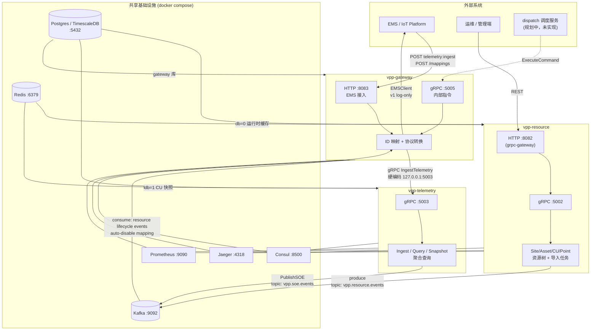
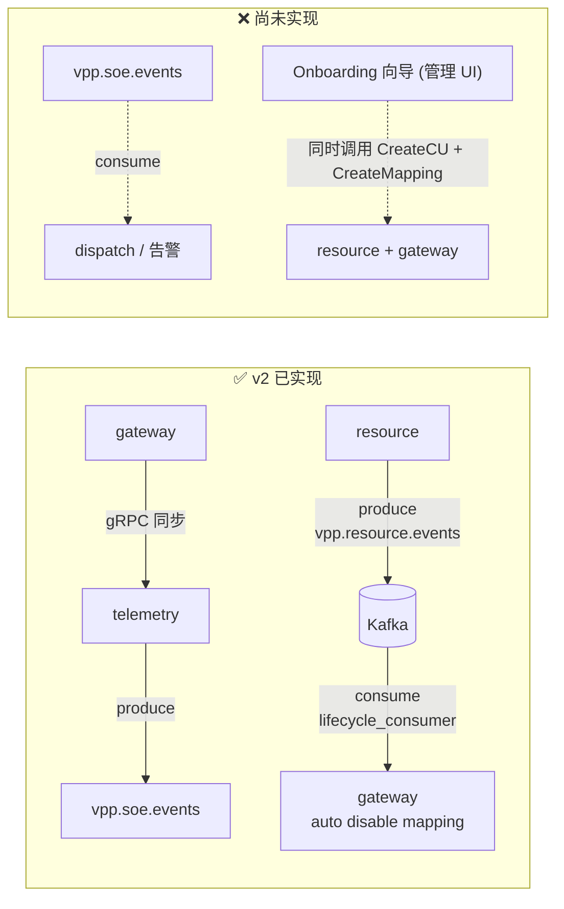

下面是目前 **v2 实际已打通** 的全局架构，以及仍在规划中的部分（虚线标注）。

## 一、当前全局架构（实线 = 已实现）




## 二、服务间调用矩阵（v2 当前）


| **调用方**   | **被调用方**                 | **协议**       | **状态**      | **说明**                                        |
| --------- | ------------------------ | ------------ | ----------- | --------------------------------------------- |
| EMS       | gateway                  | HTTP `:8083` | ✅ 已通        | 遥测上报、映射 CRUD                                  |
| gateway   | telemetry                | gRPC `:5003` | ✅ 已通        | `IngestTelemetry`，配置写死在 `gateway.yaml`        |
| dispatch  | gateway                  | gRPC `:5005` | ⚠️ 接口已有     | `ExecuteCommand`，dispatch 服务尚未实现              |
| gateway   | EMS                      | —            | ⚠️ log-only | `ems_log` 只打日志，无真实下发                          |
| 管理端       | resource                 | HTTP `:8082` | ✅ 已通        | grpc-gateway 转 gRPC                           |
| **任意**    | **resource**             | —            | ❌ 无         | gateway **不调用** resource（通过 Kafka 解耦）         |
| **任意**    | **telemetry → resource** | —            | ❌ 无         | telemetry 不查 resource，只认 `(TenantID, CUCode)` |
| telemetry | Kafka                    | 生产           | ✅ 已通        | 离散量 SOE → `vpp.soe.events`                    |
| resource  | Kafka                    | 生产           | ✅ **v2 已通** | CU/资源生命周期事件 → `vpp.resource.events`          |
| gateway   | Kafka                    | 消费           | ✅ **v2 已通** | 订阅 resource 事件，自动 disable mapping             |
| **任意**    | Kafka SOE                | 消费           | ❌ 未实现       | 三个服务里都没有 SOE consumer                         |





## 三、关键架构约定

### 3.1 CUCode = Resource CU UUID（必须遵守）

`gateway.DeviceMapping.CUCode` **必须填写 resource 服务分配的 CU UUID (UUID v7)**。  
这是整个 lifecycle sync 能工作的前提：`lifecycle_consumer` 收到 `resource.deleted` 事件后，用 `ResourceID`（= CU UUID）作为 `CUCode` 查 mapping。  

违反这个约定将导致 `DisableMappingByCUCode` 查不到 mapping（no-op，不报错），mapping 不会被清理。

> **Onboarding 时的约束：** 在管理后台创建 CU 后，调用 `Gateway.CreateMapping` 时 `CUCode` 字段填入 resource 返回的 CU ID。

### 3.2 Kafka 的非对称角色（cleanup-only）

```
CU 删除 / 禁用  → Kafka 事件 → gateway 自动 Disable Mapping    ✅ 已实现
CU 创建        → 不触发 gateway 自动创建 Mapping               ✅ 有意设计
```

**理由：** 创建 Mapping 需要 `ExternalSystem` 和 `ExternalID`，这些信息在 `resource.cu.created` 时未知（不同外部系统可能在 CU 创建后很久才接入）。  
**正确流程：** 管理端的 Onboarding 向导同时调用 `resource.CreateCU` 和 `gateway.CreateMapping`，两个服务互不知情。  

这保持了服务的自治性：resource 只管"VPP 里有什么资源"，gateway 只管"这些资源如何与外部系统建立连接"。

### 3.3 ConnStatus 数据归属

| 存储位置 | 内容 | 说明 |
|---|---|---|
| Redis `CURuntime` (db=0) | `ConnStatus`, `LastSeenAt`, `LatencyMS`, … | ✅ 运行时动态状态，高频更新 |
| Postgres `cus.conn_status` | （已废弃，不再写入）| ⚠️ 列保留但不写，下次 migration 可删 |

`CU` domain model 不再有 `ConnStatus` 字段。  
连接状态由 gateway / IoT 平台通过 `CURuntimeReader.PatchCURuntime` 写入 Redis，通过 `CURuntimeReader.GetCURuntime` 读取展示。  
`UpdateCURequest` 不再接受 `ConnStatus` 参数（proto field 12 已 reserved）。

### 3.4 CU.ExternalID / CU.Provider 的处置

当前状态：保留字段，但降级为**展示性备注**，不参与任何业务逻辑。  
路由的 Source of Truth 是 `gateway.DeviceMapping`。

proto 注释：
> `ExternalID` / `Provider` are informational only.  
> The authoritative integration configuration lives in `gateway.DeviceMapping`.  
> Do not use these fields for routing or dispatch.

**移除时机：** 待 Onboarding 向导上线且管理 UI 能从 gateway 查询映射关系后，做 proto reserved + DB migration 删除列。

### 3.5 服务边界

| 服务 | 职责 | 不负责 |
|---|---|---|
| resource | VPP 内部资产层级 (Site/Asset/CU/Point)，资产配置，生命周期 | 外部系统接入，设备协议，连接状态 |
| gateway | 外部系统适配，设备 ID 映射 (ExternalSystem/ExternalID → CUCode)，协议转换，连接状态下发 | 资产业务属性 |
| telemetry | 时序数据存储，快照，SOE | 资产业务语义，设备路由 |

---

## 四、各服务数据边界

```

┌─────────────────────────────────────────────────────────────┐

│                    Postgres (单实例)                          │

│  ┌──────────────┐  ┌──────────────┐  ┌──────────────┐       │

│  │ resource 库   │  │ telemetry 库  │  │ gateway 库    │       │

│  │ 资源树/节点    │  │ 时序超表      │  │ device_mappings│       │

│  └──────────────┘  └──────────────┘  └──────────────┘       │

└─────────────────────────────────────────────────────────────┘

┌─────────────────────────────────────────────────────────────┐

│                    Redis (单实例，分 db)                       │

│  db=0: resource 运行时状态 (Asset/CU/Point Runtime)            │

│  db=1: telemetry CU 实时快照 (GetSnapshot)                    │

└─────────────────────────────────────────────────────────────┘

```

**关键设计点：** gateway 的 `CUCode` 与 resource 的 CU UUID **必须一致**（CUCode = Resource CU UUID 约定）；gateway 的 `lifecycle_consumer` 订阅 `vpp.resource.events`，在 CU 删除或禁用时自动 disable 对应 mapping，实现异步清理解耦。

## 五、典型数据流（v2）

**遥测上报（已跑通）：**

```

EMS ──HTTP──▶ gateway ──查 mapping(DB)──▶ gRPC IngestTelemetry ──▶ telemetry

                                                      ├──▶ TimescaleDB

                                                      ├──▶ Redis 快照

                                                      └──▶ Kafka SOE (离散量变位)

```

**控制下发（接口有，EMS 未真连）：**

```

dispatch ──gRPC ExecuteCommand──▶ gateway ──反查 mapping──▶ ems_log (仅日志)

```

**资源管理（独立链路）：**

```

管理端 ──HTTP──▶ resource ──▶ Postgres + Redis(db=0)
                   │
                   └──▶ Kafka: vpp.resource.events ──▶ gateway lifecycle_consumer
                                                            └──▶ Disable DeviceMapping

```

**Onboarding 工作流（管理端协调，无后端服务耦合）：**

```

管理端 ──① CreateCU──▶ resource   (返回 CU UUID)
        ──② CreateMapping──▶ gateway  (CUCode = CU UUID, ExternalSystem, ExternalID)

两步由管理端显式调用，resource 和 gateway 互不感知。

```

---

**总结（v2）：** resource → Kafka 生产已实现；gateway Kafka 消费（lifecycle_consumer）已实现，CU 删除/禁用可自动 disable mapping。ConnStatus 已从 resource Postgres 模型中移除，连接状态归 Redis CURuntime。Onboarding 创建流程为非对称设计，由管理端显式协调。
