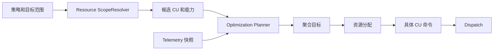
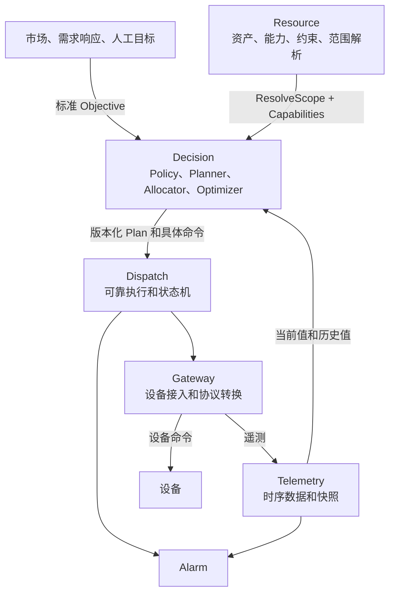

你的担忧是合理的，但当前架构并没有“根本性错误”。真正缺少的不是合并服务，而是几个位于 Resource 和 Optimization 之间的核心抽象：

1. 目标范围 `TargetScope`
2. 设备能力 `Capability`
3. 决策计划 `Plan`
4. 资源展开与分配 `Resolve + Allocate`

补上这些抽象后，Optimization 就不需要绑定死 CU，也不需要理解 Resource 的内部树结构。

## 1. 不建议合并 Resource 和 Optimization

二者关注的是完全不同的问题：

- Resource 回答：平台里有什么、属于谁、设备具备什么能力、约束是什么。
- Optimization 回答：为了某个目标，应该在什么时间控制哪些资源、控制多少。

Optimization 查询 Resource 是正常的领域依赖，不等于边界错误。真正不合理的耦合是：

- Optimization 直接理解 Resource 数据库结构。
- 策略存储具体 PointKey。
- 每次 Evaluate 都实时遍历 Resource 树。
- Resource 承担策略计算或实时决策。
- Optimization 自己维护一套设备台账。

因此保持服务分离，但通过稳定的“资源能力查询契约”沟通。

## 2. 策略不应直接绑定 CU，而应绑定 TargetScope

当前一条 SOC 策略绑定一个 CU，只适合作为最小实现。长期策略目标应该是一个通用范围：

```text
TargetScope
├── CU
├── Asset
├── Site
├── ResourceGroup
└── Portfolio
```

例如：

```json
{
  "scope_type": "asset",
  "scope_id": "asset-123"
}
```

策略启用或者开始计算时：

```text
Asset 策略
  → Resource.ResolveScope(asset-123)
  → 得到该范围内所有 CU
  → 查询每个 CU 的能力和约束
  → 排除不可用设备
  → Optimization 计算总目标
  → Allocator 把总目标分配给多个 CU
  → Dispatch 接收具体 CU 命令
```



Dispatch 永远不需要理解 Asset 或 Site，只执行已经展开的具体命令。

## 3. Resource 的四级树还不够表达未来业务

`Site → Asset → CU → Point` 适合描述物理归属关系，但虚拟电厂还会存在业务上的动态组合：

- 同一批设备参与需求响应资源池。
- 一部分设备参与调频。
- 同一设备同时属于某个站点和某个市场组合。
- 组合成员会随合同、时间和可用性变化。

这些关系往往不是严格的树，而是多对多关系。因此不要把所有聚合都塞进 `Asset`。

建议未来增加逻辑概念：

```text
ResourceGroup / Portfolio
- group_id
- type
- members 或 selector
- effective_time
- version
```

物理树负责“设备属于哪里”，Portfolio 负责“设备参与什么业务组合”。

策略可以面向 Site、Asset、CU 或 Portfolio，但最后都通过同一个 `ResolveScope` 展开。

## 4. 当前 Optimization 实际上不是“优化服务”

当前实现更准确的名字是：

- Automation
- Decision Engine
- Policy Engine

因为它现在做的是：

```text
定时器 → 读状态 → 阈值判断 → 下发
```

真正的 Optimization 通常意味着：

- 输入目标、预测和约束。
- 求解多设备功率分配。
- 生成未来一段时间的调度计划。
- 在成本、收益、安全、寿命之间优化。

建议把这个领域抽象为“Decision/Planning”，内部再分成几个模块：

```text
PolicyEngine
    负责条件规则和自动化触发

Planner
    把业务目标转换成资源计划

Allocator
    把聚合目标分配到具体 CU

Optimizer
    可选的数学求解器

PlanExecutor
    把计划逐步提交给 Dispatch
```

不需要现在全部实现，但应避免把所有未来功能都堆进 `Evaluator`。

## 5. 如何屏蔽需求响应、电力市场等复杂性

无法完全消除这些业务复杂性，但可以把它们隔离在上层适配器，不让基础设施都理解市场规则。

各种上层业务最终统一生成一个 `Objective`：

```text
需求响应事件 ─┐
电力市场计划 ─┼─→ Objective → Planner → Plan → Dispatch
辅助服务指令 ─┤
人工调度目标 ─┘
```

一个通用 Objective 可以包含：

```text
- 目标范围
- 生效时间窗口
- 目标类型
- 目标功率或能量
- 优先级
- 允许偏差
- 来源
- 约束引用
```

例如：

```json
{
  "scope": {
    "type": "portfolio",
    "id": "portfolio-1"
  },
  "objective_type": "active_power",
  "target_kw": -500,
  "start_at": "...",
  "end_at": "...",
  "source": "demand_response"
}
```

Optimization 不需要知道需求响应合同细节，只需要处理标准化后的目标。市场结算、竞价、基线计算可以留在将来的独立业务模块中。

## 6. 人工控制与自动策略要分开理解

未来通常会同时存在三种操作：

### 人工即时命令

运维人员直接指定设备和目标值：

```text
管理端 → Dispatch → Gateway → 设备
```

这不是策略，也不应该经过 Optimization。

### 人工创建的自动策略

人配置一条规则，系统持续自动执行：

```text
人工创建 Policy → PolicyEngine 自动评估
```

“人工”描述创建来源，“自动”描述执行方式，两者不冲突。

### 计划审批后执行

Optimization 先产生计划，但需要人工批准：

```text
Optimization → ProposedPlan
             → 人工审批
             → ApprovedPlan
             → Dispatch
```

因此建议区分：

- `created_by`
- `source`
- `trigger_type`
- `approval_mode`
- `execution_mode`

不要只使用一个 `manual/automatic` 字段表达所有含义。

## 7. 服务是不是拆得太散

从逻辑边界看，以下五个核心服务是合理的：

- Resource：资产、拓扑、能力和约束。
- Telemetry：时序数据和当前快照。
- Gateway：外部设备协议和地址转换。
- Dispatch：可靠执行、重试、状态机和审计。
- Decision/Optimization：策略、计划和资源分配。

但当前项目作为学习实验，部署粒度确实可以简化：

- Forecast 可以先作为 Decision/Optimization 内部模块或 worker，不一定独立部署。
- Optimization、Forecast 可以统一成为 Decision 服务中的不同模块。
- Alarm 是否独立部署取决于是否想练习事件驱动；逻辑上独立是合理的。
- 不建议把 Resource 与 Optimization 合并。
- Telemetry、Gateway、Dispatch 最值得保持独立，因为它们的数据特征、故障模型和扩缩容方式明显不同。

重点是：

> 逻辑模块边界和物理微服务部署不必一一对应。

你可以先保持清晰模块，部署成较少的进程；等确实出现独立扩容、团队边界或故障隔离需求，再拆成服务。

## 8. 跨服务一致性不应依靠分布式事务

控制系统更适合使用版本和不可变计划：

```text
PolicyVersion
ResourceRevision
BindingRevision
PlanVersion
CommandID
```

一次计划应记录：

- 使用了哪个策略版本。
- 基于哪个资源范围版本。
- 当时解析出了哪些 CU。
- 使用了哪些指标绑定和约束版本。
- 最终生成了哪些命令。

执行时 Gateway 再做最后校验。绑定已经变化、设备不可写或命令越界，就拒绝执行。

安全方面逐步增加：

- 服务间 mTLS 或工作负载身份。
- TenantID 和调用身份透传。
- Dispatch 提交权限控制。
- 幂等键。
- Outbox 事件。
- 最终执行端的安全校验。
- 完整的计划到命令审计链。

不需要为了“强一致”把所有服务合并到同一个事务中。

## 9. 推荐的宏观架构



因此，我对当前项目的总体判断是：

- 服务边界整体方向没错。
- Resource 和 Optimization 不应该合并。
- 当前缺少的核心抽象是 `TargetScope → ResolveScope → Plan → Allocate`。
- 物理资源树之外，需要 Portfolio/ResourceGroup。
- 当前 Optimization 更像规则自动化，应逐步演进为 Decision/Planning。
- Forecast 独立服务可能偏早，可以先并入 Decision 的模块边界。
- 上层 VPP 业务通过统一 Objective 接入，不应该直接侵入 Telemetry、Gateway 和 Dispatch。