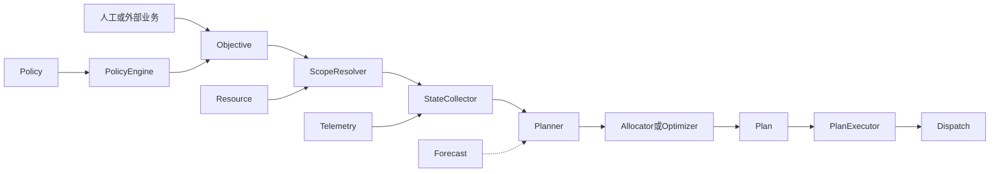

补充说明后，我会修正上一轮判断：

- `Asset` 已经承担聚合 CU 的业务角色，因此当前不需要再增加 `ResourceGroup`。
- `TargetScope` 首期只需要支持 `SITE / ASSET / CU`。
- 只有未来出现“同一 CU 同时属于多个业务组合”时，才考虑额外的 `Portfolio`，不要现在预设。
- Forecast 保持独立服务是合理的，不必因为算法暂时简单而合并。

## Optimization 是否需要大改

结论是：

> 领域模型需要较大调整，但现有代码不需要推倒重来。

当前 Optimization 已经有一些正确的骨架：

- `DecisionLoop`：周期驱动
- `Evaluator`：状态判断
- `Allocate`：目标分配
- `RunDecisionCycle`：编排一轮决策
- Telemetry、Resource、Dispatch、Forecast Port
- 熔断、指标、服务生命周期

这些都可以保留。

真正需要替换的是当前过于具体的模型：

```text
TenantIDs
  → SOCThresholdRule
  → 固定 CU
  → ReadPointKey / WritePointKey
  → PointTarget
```

目标模型应该变成：

```text
Policy
  → TargetScope
  → Objective
  → ResolveScope
  → CollectState
  → Plan / Allocate
  → Dispatch
```

所以它属于“保留基础设施和六边形骨架，重构领域核心”。

## 是否应该改名

如果这个服务未来同时承担：

- 自动化规则
- 目标接收
- 资源范围解析
- 计划生成
- 资源分配
- 数学优化
- 计划执行

那么 `optimization` 的名字偏窄。

我更推荐改为：

```text
vpp-decision
```

内部包含 `optimization` 模块。

原因是“优化”通常特指数学求解过程，而当前 SOC 阈值判断不是优化。未来需求响应也不一定每次都需要优化器，可能只是规则或简单比例分配。

推荐概念关系：

```text
Decision Service
├── Policy Engine
├── Objective Manager
├── Planner
├── Allocator
├── Optimizer（可选）
└── Plan Executor
```

如果你希望尽量少改名字，也可以继续叫 `vpp-optimization`，但文档中将其定位为“决策与优化服务”。由于项目尚未生产，现在改名成本最低，我个人更倾向于现在改成 `decision`。

## Decision 服务内部模块

### 1. Policy Management

负责策略定义和 CRUD。

例如 SOC 策略：

```text
Policy
- PolicyID
- Type: soc_threshold
- TargetScope: Asset(asset-001)
- MinSOC: 20
- MaxSOC: 90
- ChargePowerKW: 100
- DischargePowerKW: -100
- Cooldown
- Enabled
- Version
```

它不保存：

- CU 列表
- PointKey
- 外部设备地址

这些信息分别由 Resource 和统一指标契约负责。

### 2. TargetScope

描述策略作用范围：

```go
type TargetScope struct {
    Type ScopeType // SITE / ASSET / CU
    ID   string
}
```

对于你当前的资源模型：

```text
SITE
  → 展开为 Site 下所有 Asset 的 CU

ASSET
  → 展开为 Asset 下所有 CU

CU
  → 直接得到一个 CU
```

Point 不建议作为普通 `TargetScope`。Point 是能力实现细节，例如“对这些 CU 设置有功功率”，具体写哪个指标由 canonical metric contract 决定。

### 3. Scope Resolver

负责调用 Resource 展开目标范围：

```text
TargetScope{ASSET, asset-1}
  → Resource.ResolveScope
  → CU-1、CU-2、CU-3
  → 每个 CU 的能力、容量、指标绑定和安全约束
```

该模块是 Decision 与 Resource 的主要边界。

Resource 负责正确展开树，Decision 不应该自己分别调用 `ListAssets`、`ListCUs` 拼接树结构。

返回结果最好是适合决策的资源快照：

```text
ResolvedResourceSet
- Scope
- ResourceRevision
- CUs[]
    - CUID
    - Capabilities
    - RatedPower
    - RatedEnergy
    - Constraints
    - MetricBindings
```

### 4. State Collector

根据展开后的 CU 清单，从 Telemetry 获取当前状态。

```text
CU-1、CU-2、CU-3
  → GetFleetSnapshot 或批量 GetSnapshot
  → battery.soc.v1
  → battery.active_power.v1
  → quality / freshness
```

它负责：

- 批量读取
- 去重
- 新鲜度检查
- 数据质量检查
- 缺失指标处理

Evaluator 不应该自己发大量 RPC。

### 5. Policy Engine / Evaluator

判断某条规则是否触发。

例如 Asset SOC 策略不能简单地对每台 CU 独立判断，需要先明确语义：

- 每台 CU 分别越限则分别控制。
- Asset 加权平均 SOC 越限则整体控制。
- Asset 内任意 CU 越限则触发保护。

如果是加权 SOC，通常应该根据储能容量计算：

```text
AssetSOC =
    Σ(CU_SOC × CU_UsableEnergy)
    ÷ Σ(CU_UsableEnergy)
```

这种计算属于 Decision，不属于 Resource。Resource 提供额定容量，Telemetry 提供 SOC，Decision 负责聚合语义。

Evaluator 最终产生的不是命令，而是 `Objective`：

```text
“让 asset-1 以 100kW 充电”
```

### 6. Objective

Objective 是上层业务和底层计划之间的统一语言。

来源可以是：

- 阈值策略
- 人工创建
- 需求响应事件
- 市场计划
- 辅助服务指令
- 外部调度系统

例如：

```text
Objective
- Scope: Asset(asset-1)
- Metric: battery.active_power_setpoint.v1
- Target: 100kW
- StartAt / EndAt
- Priority
- Source: policy / manual / market
- PolicyVersion
```

这样需求响应、电力市场的复杂性主要停留在“如何产生 Objective”，后续规划和下发链路可以复用。

### 7. Planner

把 Objective 转换成可执行计划：

```text
Objective
  → 确认资源范围
  → 获取当前状态
  → 应用设备能力和约束
  → 生成一个或多个时间点的 AggregateTarget
  → 形成 Plan
```

当前阶段可以非常简单，一个 Objective 生成一个立即执行的 Plan。

以后才增加：

- 时间序列计划
- 电价
- 天气
- 预测
- 爬坡约束
- SOC 终态约束
- 多目标权衡

### 8. Allocator

把 Asset/Site 级目标分配给 CU：

```text
Asset 充电 100kW
  → CU-1: 30kW
  → CU-2: 20kW
  → CU-3: 50kW
```

可插拔实现可以包括：

```text
equal
按额定功率比例
按可用容量比例
按 SOC 余量
按优先级
optimization solver
```

你现在已经有 `splitByCapacity`，它正是 Allocator 的雏形，不需要删除。

### 9. Optimizer

Optimizer 是可选模块，不应该成为所有决策的必经步骤。

简单场景：

```text
Objective → Allocator
```

复杂场景：

```text
Objective + Forecast + Constraints
  → Optimizer
  → 多时段资源计划
```

未来可以定义稳定接口：

```go
type Optimizer interface {
    Solve(ctx context.Context, input OptimizationProblem) (Solution, error)
}
```

具体实现可以是：

- 简单启发式算法
- 线性规划
- 混合整数规划
- 外部 Python 求解服务
- 第三方优化平台

Decision 服务只依赖接口。

### 10. Plan Repository 与 Plan Executor

计划不应直接生成后马上消失。建议最终保存：

```text
Plan
- PlanID
- ObjectiveID
- PolicyVersion
- ResourceRevision
- Status
- Commands
- CreatedAt
- ScheduledAt
```

状态可以逐步演进：

```text
proposed → approved → scheduled → executing → completed
                           ↘ failed / cancelled
```

Plan Executor 只负责在正确时间把具体 CU 命令提交给 Dispatch，并使用幂等键防止重复。

不过这部分可以后做。v1 仍然可以在一轮决策内直接提交 Dispatch。

## 推荐的内部数据流



## Forecast 应该怎么定位

你当前 Forecast 的方向其实没有明显问题：

- 定时拉历史数据
- Predictor 接口可替换
- 保存预测历史
- 对外提供预测结果
- Optimization/Decision 通过 Port 使用

预测和决策是两个不同问题：

- Forecast 回答：未来可能发生什么。
- Decision 回答：面对未来，应该做什么。

因此 Forecast 可以继续独立。

而且真实预测以后可能出现这些变化：

- 使用 Python 而不是 Go。
- 使用机器学习模型。
- 需要 GPU。
- 模型训练和推理分离。
- 使用天气、电价和节假日特征。
- 模型版本独立发布。
- 计算周期和 Decision 不同。

这些都支持它成为独立服务。

但建议调整两个地方。

第一，预测算法继续保持可插拔，但插件不一定必须在 Forecast 进程内：

```text
Forecast Orchestrator
├── Go 内置 Predictor
├── Python gRPC Predictor
├── 外部模型服务
└── 第三方预测 API
```

第二，未来 `ForecastTarget` 也不应该固定为 `CU + MetricName`，而应该逐步演进为：

```text
ForecastSubject
- TargetScope
- CanonicalMetricID
- Horizon
- Granularity
- Algorithm
```

这样可以预测：

- 单个光伏 CU 出力
- 整个 Asset 出力
- Site 总负荷
- 储能资源包可调能力

不过 Asset/Site 历史序列需要聚合，暂时不必实现。

## 建议的改造顺序

不要一次把所有模块都实现。

### 第一阶段：修正基础契约

```text
canonical metric
Policy CRUD
TargetScope
Resource.ResolveScope
```

保留当前：

```text
DecisionLoop → Evaluate → Allocate → Dispatch
```

只是把固定 CU 改成 Scope 展开结果。

### 第二阶段：支持 Asset/Site

增加：

```text
StateCollector
Asset 状态聚合
多 CU Allocation
资源版本记录
```

此时已经可以完成真正的聚合控制。

### 第三阶段：引入 Objective 和 Plan

增加：

```text
Objective API
Plan 持久化
人工审批
定时执行
幂等提交
```

这时可以接人工目标、需求响应和市场计划。

### 第四阶段：接入 Forecast 和 Optimizer

```text
ForecastPort → 真实 Forecast
Optimizer 插件
多时段计划
成本与约束
```

所以现在不需要实现一个完整的工业级 VPP 优化器。最重要的是先把扩展点放对：

> Policy 负责什么时候触发，TargetScope 负责控制谁，Objective 负责想达到什么，Planner 负责怎么做，Allocator/Optimizer 负责如何分配，Dispatch 负责可靠执行。