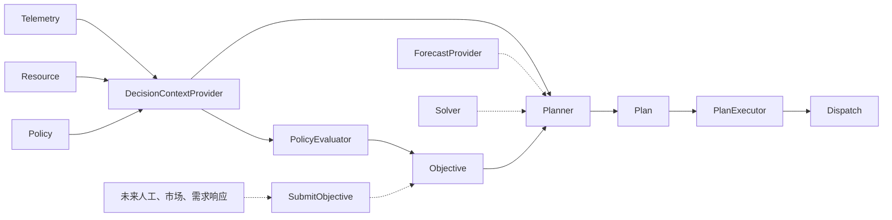

你的观察是对的。当前计划为了控制范围，把 `Objective → Planner → Plan → PlanExecutor` 压扁成了：

```text
Evaluator → Allocator → Dispatch
```

功能可以跑通，但结构上确实会导致以后接入人工目标、市场目标、审批和时序计划时再次改造主链路。建议在本轮补齐稳定的领域接口，但暂不实现尚不明确的业务行为。

## 当前计划明确暂不做的内容

### 1. Objective

当前计划让 SOC Evaluator 直接产生聚合功率目标，没有独立 `Objective`。

原理由是当前只有 SOC 策略一个来源，引入 Objective 看起来只是中间 DTO。

但这是不应该省略的结构。未来这些来源都需要汇入它：

- Policy 自动触发
- 人工目标
- 需求响应
- 市场计划
- 外部调度系统

建议本轮加入 `Objective` 模型和内部 `SubmitObjective` 应用接口，但不开放外部 API。

### 2. Planner

当前计划直接从 Evaluator 进入 Allocator。

原理由是当前只有“立即执行一次”的简单场景，没有真正的时序规划。

Planner 也应该保留，因为它是未来接入：

- Forecast
- 时间窗口
- 多时段计划
- Solver
- 电价和约束

的稳定位置。

本轮实现一个简单的 `ImmediatePlanner` 即可。

### 3. Plan 与 PlanExecutor

当前计划直接生成 Dispatch Task，没有独立 Plan。

原理由是暂不做审批、计划持久化和定时执行。

这里也应补上领域结构：

```text
Plan
- PlanID
- ObjectiveID
- PolicyVersion
- ResourceRevision
- Steps
- GeneratedAt
```

本轮 Plan 可以只存在内存中，并且只有一个立即执行的 Step：

```text
ImmediatePlanner → InMemory Plan → DispatchPlanExecutor
```

以后增加数据库、审批和定时器时，不需要改变 Policy、Evaluator、Planner 和 Allocator 的接口。

### 4. Optimizer/Solver

当前计划只有约束感知 Allocator，没有数学优化器接口。

暂不实现算法是合理的，因为现在还没有明确：

- 优化目标函数
- 时间尺度
- 约束集合
- 求解器输入输出
- 是否使用 Python 或第三方求解器

但可以保留可插拔边界：

```go
type Solver interface {
    Solve(ctx context.Context, problem Problem) (Solution, error)
}
```

当前 `ImmediatePlanner` 使用 `HeuristicAllocator`，不调用 Solver。未来 Planner 可以根据策略选择启发式分配或数学求解。

### 5. Forecast 接线

已有 `ForecastPort`，当前计划保留 stub，不调用真实 Forecast。

暂不接入的原因是 SOC 阈值规则不需要预测；强行调用只会制造无效依赖。

但接口应该移动到 Planner 侧，成为：

```text
Planner
├── ForecastProvider
├── Solver
└── Allocator
```

这样未来接入 Forecast 时不需要修改 PolicyEvaluator。

### 6. Objective/Plan 持久化、审批与定时执行

这些继续暂缓，原因是其业务语义还不稳定：

- 哪些计划需要审批？
- 审批后资源发生变化怎么办？
- 是否允许修改计划？
- 多步骤计划如何取消？
- 计划与 Dispatch Task 是一对一还是一对多？
- 定时调度的补偿和错过执行如何处理？

现在贸然设计状态机和数据库，很可能固化错误模型。

但本轮应让所有命令经过 `PlanExecutor`，为以后插入 Repository、Approval 和 Scheduler 留出位置。

### 7. Portfolio

暂不实现是合理的。

当前：

```text
Site → Asset → CU
```

已经能支持物理站点和业务资源聚合。只有出现同一个 CU 同时属于多个跨 Asset 组合时，才需要 Portfolio。未来给 `TargetScopeType` 增加一种类型即可，不需要改变 Decision 主链路。

### 8. 人工目标、需求响应和市场 API

本轮不开放这些入站接口，因为当前没有明确的业务字段和鉴权流程。

但可以保留内部应用接口：

```go
type SubmitObjectiveHandler interface {
    Handle(ctx context.Context, objective Objective) error
}
```

SOC PolicyEngine 调用它；未来 HTTP/gRPC、需求响应消费者和市场适配器也调用同一入口。

### 9. Redis 冷却、多副本与分布式锁

暂不实现的原因是当前固定单副本，没有并发决策所有权问题。

但冷却逻辑不应继续绑定内存 map，应抽象为：

```go
type CooldownStore interface {
    IsCoolingDown(...)
    MarkTriggered(...)
}
```

本轮使用 Memory 实现，未来换 Redis 不修改领域逻辑。

## 建议补齐后的完整结构



本轮实际运行实现：

```text
SOC Policy
  → DecisionContext
  → SOCPolicyEvaluator
  → PowerObjective
  → ImmediatePlanner
  → HeuristicAllocator
  → ImmediatePlan
  → DispatchPlanExecutor
  → Dispatch
```

## 建议现在就建立的模块

```text
decision/
├── policy/
│   ├── model
│   ├── repository
│   └── evaluator
├── objective/
│   ├── model
│   └── submit_handler
├── context/
│   ├── scope_resolver
│   └── state_collector
├── planning/
│   ├── planner
│   ├── immediate_planner
│   ├── forecast_provider
│   └── solver
├── allocation/
│   ├── allocator
│   └── heuristic_allocator
├── plan/
│   ├── model
│   └── executor
└── adapter/
    └── dispatch_plan_executor
```

## 应当避免的“空占位”

并不是所有未来设想都适合现在创建空接口。以下内容暂时只写进架构文档，不建代码：

- 电力市场专用 Objective 字段
- 需求响应协议
- 审批状态机
- Portfolio 数据库
- 数学优化 Problem 的完整字段
- Forecast 特征工程模型
- 多副本选主方案

因为这些抽象目前不稳定，空接口很可能成为错误约束。

比较稳妥的原则是：

> 现在补齐稳定的处理阶段和边界，未来业务特有的字段、状态机与算法等需求明确后再实现。

因此，当前计划应该调整：保留原定的 Metric、Capability、TargetScope、Policy、ResolveScope、StateCollector 和多 CU 分配，同时把 `Objective、Planner、Plan、PlanExecutor、ForecastProvider、Solver、CooldownStore` 纳入本轮结构；只提供最小实现或 stub，不增加 Plan 持久化、审批和真实 Forecast 调用。