核心变化不是端口号变了，而是**谁拥有 IP、以及怎么找到对方**。`config/resource.yaml` 里的 `127.0.0.1:8082` 仍然是本机 `go run` 的默认值；进 kind 之后，这些地址会被环境变量盖掉，服务之间改走集群 DNS，而不是写死本机 IP。操作手册见 [`docs/K8S_DEPLOYMENT.md`](../docs/K8S_DEPLOYMENT.md)。

当前是**混合拓扑**：6 个无状态业务服务在 kind 里；Postgres / Kafka / Redis / Casdoor / APISIX 仍在 Docker Compose。

---

## 迁移前：大家都在「本机回环」上碰面

以前每个服务都是 WSL 宿主机上的进程，YAML 里写死 `127.0.0.1`：


| 角色    | 地址从哪来                                 | 实际含义                           |
| ----- | ------------------------------------- | ------------------------------ |
| 自己监听  | `resource.http-addr: 127.0.0.1:8082`  | 绑在宿主机回环                        |
| 调别的服务 | `telemetry-grpc.addr: 127.0.0.1:5003` | 对方也在同一台机器上                     |
| 基础设施  | `database.host: 127.0.0.1`            | Compose 把 5432 映射到了宿主机         |
| 外部入口  | APISIX → `host.docker.internal:8082`  | APISIX 在 Docker 里，绕回宿主机打 Go 进程 |


这时「IP」几乎等于「这台电脑」。进程重启、端口不变，配置不用改。

---


## 迁移后：三层网络叠在一起

```mermaid
flowchart TB
  subgraph host["WSL / Windows 宿主机"]
    User["浏览器 / grpcurl"]
  end

  subgraph compose["Docker Compose（没进 K8s）"]
    APISIX["APISIX :9080 / :9081"]
    Casdoor["Casdoor :8000"]
    PG["Postgres :5432"]
    Kafka["Kafka :9092"]
    Redis["Redis :6379"]
    Jaeger["Jaeger :4318"]
  end

  subgraph kind["kind 节点（一个 Docker 容器）"]
    subgraph ns["namespace: vpp"]
      GW["gateway Pod<br/>POD_IP:8083 / :5005"]
      RES["resource Pod<br/>POD_IP:8082 / :5002"]
      TEL["telemetry Pod<br/>POD_IP:5003"]
      DIS["dispatch Pod<br/>POD_IP:5006"]
      SIM["simulator Pod<br/>:8084"]
      ALM["alarm Pod<br/>:8087"]

      svcGW["Service gateway<br/>ClusterIP"]
      svcRES["Service resource<br/>ClusterIP"]
      svcTEL["Service telemetry<br/>ClusterIP"]
      svcDIS["Service dispatch<br/>ClusterIP"]
      svcSIM["Service simulator<br/>ClusterIP"]
      svcALM["Service alarm<br/>ClusterIP"]
    end
      NP["NodePort<br/>30082 / 30083 / 30003 / 30006"]
    end

  User --> APISIX
  APISIX -->|"host.docker.internal:300xx"| NP
  NP -.-> svcGW
  NP -.-> svcRES
  NP -.-> svcTEL
  NP -.-> svcDIS

  GW --> svcTEL
  GW --> svcSIM
  DIS --> svcGW
  SIM --> svcRES
  SIM --> svcGW

  GW -->|"host.docker.internal"| PG
  RES -->|"host.docker.internal"| PG
  TEL -->|"host.docker.internal"| PG
  DIS -->|"host.docker.internal"| PG
  ALM -->|"host.docker.internal"| PG
  GW -->|"host.docker.internal"| Kafka
  RES -->|"host.docker.internal"| Kafka
  DIS -->|"host.docker.internal"| Kafka
  ALM -->|"host.docker.internal"| Kafka
  GW -->|"host.docker.internal"| Redis
  RES -->|"host.docker.internal"| Casdoor
  APISIX --> Casdoor
```




可以把地址分成三类，不要混在一起想：

1. **Pod IP**：每个容器一张临时网卡，重启就换。进程必须绑在这张网上，别人才能打进来。
2. **ClusterIP + DNS**：集群内的稳定名字，例如 `resource.vpp.svc.cluster.local:8082`。这才是服务之间该写的「地址」。
3. **宿主机上的 Compose**：对 Pod 来说是「集群外面」，必须走 `host.docker.internal`。

---


## 1. 监听地址：从 `127.0.0.1` 改成 Pod IP

镜像里仍然带着原来的 YAML（`COPY config/resource.yaml /etc/vpp/config.yaml`），所以默认还是 `127.0.0.1`。在 Pod 里，`127.0.0.1` 只是**这个容器自己**，kube-proxy / 探针打过来的是 Pod IP，绑回环等于对外不可达。

所以 Deployment 用 viper 的环境变量覆盖：

```44:47:deploy/k8s/base/resource/deployment.yaml
            - name: RESOURCE_HTTP_ADDR
              value: "$(POD_IP):8082"
            - name: RESOURCE_GRPC_ADDR
              value: "$(POD_IP):5002"
```

`POD_IP` 来自 `status.podIP`。kubelet 探针和 ClusterIP 流量打的是 Pod IP，绑 `127.0.0.1` 等于对外不可达。

端口号没变：resource 仍是 8082/5002，gateway 8083/5005，telemetry 5003，dispatch 5006，simulator 8084，alarm 8087。变的是前面的 IP。

simulator 绑 `0.0.0.0:8084`。alarm 人管面 HTTP `:8087`，仅 ClusterIP。

---


## 2. 服务互调：从写死 IP 改成 Service DNS

以前 gateway YAML 里是：

```yaml
telemetry-grpc:
  addr: 127.0.0.1:5003
simulator:
  addr: http://127.0.0.1:8084
```

进集群后，这些被 ConfigMap 盖成集群内域名：


| 调用方       | 被调方            | K8s 里写成                                       |
| --------- | -------------- | --------------------------------------------- |
| gateway   | telemetry gRPC | `telemetry.vpp.svc.cluster.local:5003`        |
| gateway   | simulator HTTP | `http://simulator.vpp.svc.cluster.local:8084` |
| dispatch  | gateway gRPC   | `gateway.vpp.svc.cluster.local:5005`          |
| simulator | resource gRPC  | `resource.vpp.svc.cluster.local:5002`         |
| simulator | gateway HTTP   | `http://gateway.vpp.svc.cluster.local:8083`   |


DNS 格式是 `<Service名>.<namespace>.svc.cluster.local`。Service 是 ClusterIP，selector 对上 Deployment 的 label，kube-proxy 把这个虚拟 IP 转到当前活着的 Pod。

这就是 K8s 网络模型里最重要的一句：**不要记 Pod IP，记 Service 名。** Pod 被杀掉重建后 IP 会变，Service 名不会变。

---


## 3. 基础设施：还在 Compose，从 Pod 里「往外打」

`vpp-infra` ConfigMap 把原来的 `127.0.0.1` 换成了 `host.docker.internal`：

```10:18:deploy/k8s/base/configmap-infra.yaml
  DATABASE_HOST: host.docker.internal
  DATABASE_PORT: "5432"
  ...
  REDIS_ADDR: host.docker.internal:6379
  KAFKA_BROKERS: host.docker.internal:9092
  TRACING_ENDPOINT: host.docker.internal:4318
```

Casdoor 同理。

这里有一个 kind + Docker Desktop 的坑：`host.docker.internal` 解析在 **kind 节点容器**里是通的，但 **Pod 用的是 CoreDNS**，默认看不见这个名字。所以所有 Deployment 都被打了 `hostAliases`，写死 `192.168.65.254` → `host.docker.internal`。

方向可以记成：

- **集群内互调**：`*.vpp.svc.cluster.local`
- **集群内 → Compose**：`host.docker.internal:<compose 映射到宿主机的端口>`

---


## 4. 外部入口：APISIX 还在外面，ClusterIP 它打不进

ClusterIP **只在集群内有效**。APISIX 跑在 Compose 网络里，解析不了 `resource.vpp.svc.cluster.local`。

所以南北向设计是：

1. 浏览器只打 APISIX `:9080` / `:9081`（这点和以前一样）
2. APISIX 再转到业务
3. 业务藏在 ClusterIP 后面，不直接暴露给 Windows/WSL

`kind-cluster.yaml` 的 extraPortMappings 和四个 Service 的 `nodePort` 已经对上：


| kind NodePort | 以前宿主机端口 | 服务             | APISIX upstream                         |
| ------------- | ------- | -------------- | --------------------------------------- |
| 30082         | 8082    | resource HTTP  | `host.docker.internal:30082`            |
| 30083         | 8083    | gateway HTTP   | `host.docker.internal:30083`            |
| 30003         | 5003    | telemetry gRPC | `host.docker.internal:30003`            |
| 30006         | 5006    | dispatch gRPC  | `host.docker.internal:30006`            |


simulator 与 alarm 故意不映射：simulator 只被集群内 gateway 调用；alarm 人管面 v1 用 `kubectl -n vpp port-forward svc/alarm 8087:8087`，不挂 APISIX。resource / gateway 的内部 gRPC 也各有一个未映射的 NodePort（30502 / 30505），只是为了避免 kube-proxy 抢走上面四个口；集群内互调仍走 ClusterIP。

APISIX 在 Docker 里，kind 节点也是 Docker 容器：请求 hairpin 到宿主机 `:30082`，再经 extraPortMappings 进节点上的 NodePort。`make apisix-init` 默认灌这四个地址。本机 `make run-*` 仍听 `:8082` 等，把 `GATEWAY_UPSTREAM` / `RESOURCE_UPSTREAM` / `DISPATCH_UPSTREAM` / `TELEMETRY_UPSTREAM` 改回旧端口再 init 即可。

---


## 5. 暴露面验收（ROADMAP：业务口离开 host）

对照：以前 `make run-*` 把 `:8082` / `:8083` / `:5002` / `:5003` / `:5005` / `:5006` / `:8084` 绑在 WSL 回环上，`trust-proxy-headers: false` 时直连整段鉴权旁路。

**已经成立：**

| 检查 | 结果 |
| ---- | ---- |
| 旧业务口不在 host 上听 | `:8082` `:8083` `:8084` `:5002` `:5003` `:5005` `:5006` 均 closed |
| 没有 `make run-*` 进程 / pidfile | 业务只在 kind Pod 里 |
| simulator | 仍是 ClusterIP，host `:8084` 不通 |
| alarm | 仍是 ClusterIP，host `:8087` 不通；联调 port-forward |
| 未映射的内部 gRPC NodePort | `:30502` `:30505` 没有 extraPortMappings，host 上 closed |
| 用户入口 | APISIX `:9080` / `:9081`；无 Bearer 打 `/resource` → 401 |
| 复检命令 | `make k8s-exposure-check` |

**还没拿掉的一层：** kind `extraPortMappings` 把 NodePort `:30082` / `:30083` / `:30003` / `:30006` 映到了 WSL。这是 APISIX 还在 Compose 时的 hairpin，不是 `go run`。从 host 直连 `:30082/healthz` 仍是 200，**绕过 APISIX 插件**。Pod 里默认 `trust-proxy-headers: false`，这条旁路和以前直连 `:8082` 同类，只是端口换成了 300xx。

这轮验收的句子因此是：

> 业务进程不再监听 host 的 808x/500x；外面只打 APISIX。为了让 Compose 里的 APISIX 够到集群，host 上仍留着 kind NodePort。真正「只有 APISIX 能打到 Pod」要等 APISIX 进集群、删掉 extraPortMappings。

---


## 和 YAML 的关系：文件还在，只是不再当「生产地址表」

机制在 `docs/CONFIG_ENV_OVERRIDE.md`：镜像内 YAML 是底稿，环境变量优先。对应关系例如：

- `resource.http-addr` → `RESOURCE_HTTP_ADDR`
- `database.host` → `DATABASE_HOST`
- `telemetry-grpc.addr`（gateway 侧）→ `TELEMETRY_GRPC_ADDR`

所以：

- **本机开发**：继续用 `config/*.yaml` 的 `127.0.0.1`
- **K8s**：同一份 YAML 进镜像，Deployment/ConfigMap 把地址改成 Pod IP / Service DNS / `host.docker.internal`

不需要为 K8s 再维护一套 YAML 文件。

---


## 心智模型对照


|           | 以前                       | 现在（kind 这一轮）                                                                  |
| --------- | ------------------------ | ----------------------------------------------------------------------------- |
| 「一台机器」    | WSL 宿主机                  | 每个 Pod 是一台小机器                                                                 |
| 自己监听      | `127.0.0.1:端口`           | `$(POD_IP):端口`                                                                |
| 找到别人      | YAML 里写死 IP              | `名字.vpp.svc.cluster.local:端口`                                                 |
| 地址稳定性     | 端口不变就行                   | Service DNS 稳定，Pod IP 会变                                                      |
| 数据库/Kafka | 本机 `127.0.0.1`           | 出集群打 `host.docker.internal`                                                   |
| 谁对用户暴露    | APISIX，或你直接 curl `:8082` | 只经 APISIX `:9080/:9081`；业务走 ClusterIP，北向经 NodePort 给 APISIX hairpin |
| Consul    | 注册 `127.0.0.1:5002`（只展示 UI，无人 Discover） | 运行时已去掉；发现走 Service DNS。封装仍在 `platform/discovery` |


以后若 APISIX 也进集群，北向会更干净：upstream 直接写成 `resource.vpp.svc.cluster.local:8082`，NodePort 这一层可以拿掉。那是下一轮的事；这一轮刻意把边缘留在 Compose，先练 Deployment + ClusterIP。


`host.docker.internal` **不会**去绑某个容器端口。端口映射是另一件事；这个名字只是容器里「去宿主机」的路牌`192.168.65.254` 也不是你 Windows 的 DHCP 地址，更不是 WSL 对外网卡。

---

## 先把三张网卡分开

你机器上同时存在至少三套完全不相干的 IP：

| 地址 | 属于谁 | 谁发的 | 会不会随家里 WiFi DHCP 变 |

|---|---|---|---|

| Windows 的 `192.168.1.x` 之类 | 电脑连路由器的那块网卡 | 家里 DHCP | 会 |

| WSL 的 `eth0`（常见 `172.x`） | Ubuntu 这条 WSL 发行版 | WSL 虚拟交换机 | 重启 WSL 可能变，和家里 DHCP 无关 |

| *`192.168.65.254`** | Docker Desktop 内部虚拟网 | Docker 自己 | **不会**随家里 DHCP 变 |

Docker 工程师在 [for-win#13463]([https://github.com/docker/for-win/issues/13463](https://github.com/docker/for-win/issues/13463)) 里说得很直白：宿主机有两块网卡——一块「真」的连 LAN（DHCP 那个），一块「假」的 `192.168.65.254` 专门连容器。**在容器里面找宿主机，用的就是这块假网卡。**

所以它既不是 WSL 对外地址，也不是 Windows 对内 DHCP 地址。它只在 Docker Desktop 自己的 `192.168.65.0/24` 里有意义，类似 VirtualBox 里固定的 `10.0.2.2`（访客系统看宿主机）。

---

## `host.docker.internal` 是什么

它是 Docker Desktop 注册的一个 **DNS 名字**，解析结果就是那块假网卡`192.168.65.254`。

含义只有一句：**从容器里看，「宿主机」叫这个名字。**

Compose 里的

```yaml

extra_hosts:

  - "host.docker.internal:host-gateway"

```

`host-gateway` 是 Docker 的特殊值，意思是「请填成宿主机在容器网络里的地址」。在 Docker Desktop 上，填出来通常就是 `192.168.65.254`。

kind 的 Pod 不用 Docker 的 DNS，而用 CoreDNS，所以看不见这个名字`host-aliases-patch.yaml` 才手工写死：

```yaml

hostAliases:

  - ip: "192.168.65.254"

    hostnames:

      - host.docker.internal

```

这个 `254` 是当时有人进 kind 节点跑 `getent hosts host.docker.internal` 读到的，不是从你的 WSL `ip addr` 抄来的。

---

## 端口是怎么「绑」上的（两步，别混）

**第一步：Compose 把容器端口公布到宿主机。** 例如 Postgres：

```yaml

ports:

  - "5432:5432"

```

这是 Docker 的 port publish：宿主机（对你来说就是 WSL）的 `5432` → Postgres 容器的 `5432`。到这一步，在 WSL 里 `127.0.0.1:5432` 就能连上库。**这一步和 `host.docker.internal` 无关。**

**第二步：kind 里的 Pod 要连这个库。** Pod 里的 `127.0.0.1` 是它自己，没有 Postgres。它也不在 Compose 网络里，所以用不了 `postgres:5432` 这种容器名。于是它走：

```

resource Pod

  → 解析 host.docker.internal = 192.168.65.254

  → 连 192.168.65.254:5432

  → Docker Desktop 把这当成「打到宿主机 :5432」

  → 宿主机 :5432 正是第一步公布出来的端口

  → 进入 Postgres 容器

```

这叫 **hairpin（绕一圈回宿主机再进另一个容器）**`host.docker.internal` 只负责第一跳「到宿主机」；真正进 Postgres 的是 `ports:` 映射。

仓库里 Kafka 把这拆成了两个口，更明显：

- `:9092` 广告成 `127.0.0.1:9092` → 给宿主机上的 `make run-*`

- `:29092` 广告成 `host.docker.internal:29092` → 给 kind Pod

同一套机制。

---

## `192.168.65.254` 会变吗？

| 场景 | 会不会变 |

|---|---|

| Windows 重新拿 DHCP、换 WiFi、换 IP | **不会** |

| 重启 WSL、重启电脑 | 一般 **不会**（Docker Desktop 内部网段是写死的） |

| 升级 Docker Desktop、改 Docker 网络设置、换 WSL2/Hyper-V | **可能变** |

所以 patch 里才写：Docker Desktop 升级后，进 `vpp-control-plane` 再跑一次：

```bash

docker exec vpp-control-plane getent hosts host.docker.internal

```

如果不再是 `192.168.65.254`，才需要改那一行。日常换家用网、DHCP 续租，不用管它。

---

一句话`host.docker.internal` 是容器里的「宿主机」这个名字`192.168.65.254` 是 Docker Desktop 给这块虚拟网卡写死的内部地址；容器端口能被连上，靠的是 Compose 的 `ports:` 映射到了这台宿主机，而不是这个名字自己去做绑定。


