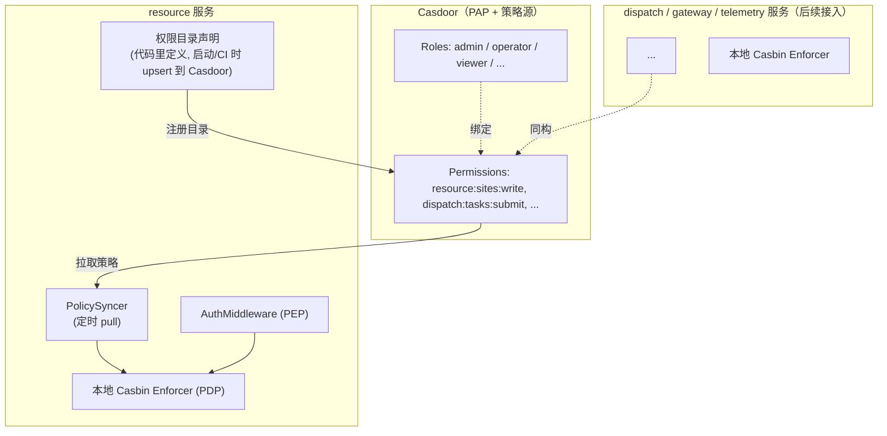
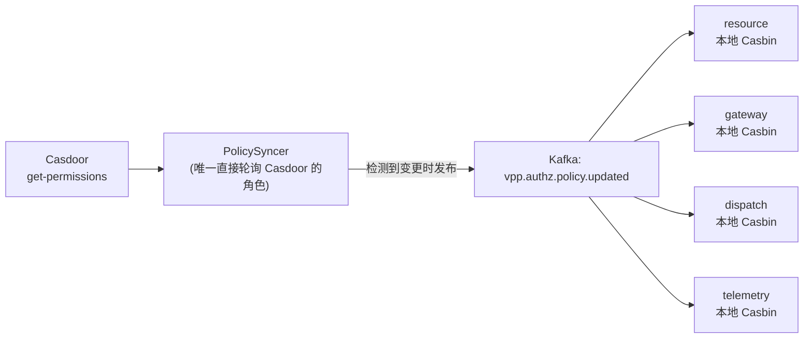

# 权限架构改造计划书：从服务内硬编码 RBAC 到 Casdoor 集中式权限管理

> **状态：** 🚧 实施中 — **C5–C9 已完成**；C10+ 未开始  
> **动机：** `[auth.go](../internal/resource/adapter/inbound/http/auth.go)` 的 `allowRBAC` 把"角色 → 权限"的绑定关系硬编码在 Go `switch` 里，且这套逻辑将随着服务数量增长（resource / gateway / dispatch / telemetry）在每个服务重复一份，用户中心（Casdoor）角色一旦变化，多处代码需要同步改动。
> **目标：** 让 Casdoor 承担 PAP（策略管理）+ PDP（策略决策），各服务只保留 PEP（策略执行点），且不因此让业务请求的关键路径同步依赖 Casdoor 的可用性。
>
> **关于角色示例的说明：** 本文档中出现的 `admin`/`operator`/`viewer` 均为**现状占位角色**（当前仅用于测试，VPP 真实业务的角色/权限模型尚未确定），不代表本方案对最终角色模型的假设或建议。本方案要解决的问题恰恰是"角色-权限绑定关系不应该硬编码"，因此不管最终业务角色模型如何设计，都不需要因此改动本文档描述的架构（`PermissionChecker` / `PolicySyncer` / Casbin Model 等），只需要在 Casdoor 里配置对应的 Role/Permission 数据。

---


## 一、术语表


| 缩写      | 全称                          | 中文含义  | 职责                          |
| ------- | --------------------------- | ----- | --------------------------- |
| **PEP** | Policy Enforcement Point    | 策略执行点 | **拦截请求**，问“能不能做”，并根据答案放行或拒绝 |
| **PDP** | Policy Decision Point       | 策略决策点 | **真正做判断**的地方，根据策略计算出允许/拒绝   |
| **PAP** | Policy Administration Point | 策略管理点 | **管理和维护策略**的地方（增删改查权限规则）    |


---


## 二、现状问题

```88:108:internal/resource/adapter/inbound/http/auth.go
func allowRBAC(id middleware.Identity, method, path string) bool {
	if id.HasRole("admin") {
		return true
	}
	destructive := method == http.MethodDelete || isChangeLifecycle(path)
	switch method {
	case http.MethodGet, http.MethodHead:
		return id.HasRole("viewer") || id.HasRole("operator")
	...
```


| 问题                       | 影响                                                                              |
| ------------------------ | ------------------------------------------------------------------------------- |
| 角色-权限绑定关系硬编码在 `switch` 里 | 新增/调整权限需要改代码 + 重新编译 + 发版，跨服务无法统一变更                                              |
| 每个服务各写一份 RBAC 判断         | resource / gateway / dispatch / telemetry 未来各自维护一套矩阵，容易出现语义漂移（同一角色在不同服务权限定义不一致） |
| 用户中心（Casdoor）角色变化会牵连所有服务 | 例如新增角色 `finance-viewer`，需要挨个改每个服务的 `allowRBAC`                                  |
| 权限粒度受限于 HTTP method      | 无法表达"operator 能创建 site 但不能创建 CU"这类接口级差异，只能按 method 一刀切                          |
| 审计困难                     | "谁能做什么"分散在代码里，无法在一个地方审计全局权限矩阵                                                   |


---


## 三、目标架构




**关键设计取舍：Casdoor 只做 PAP + 策略数据源，不做在线 PDP。**

各服务本地跑 Casbin Enforcer，策略定期从 Casdoor 同步到本地缓存；请求进来时在**本地**做决策，不对每个业务请求同步调用 Casdoor 的 `/api/enforce`。

原因：VPP 是虚拟电厂后端，`dispatch`/`gateway` 链路最终会驱动物理设备动作，授权判断绝不能让"Casdoor 一次网络抖动"变成"控制指令鉴权卡死或被动放行"。集中管理策略 ≠ 集中执行决策。

---


## 四、Casdoor 能力评估（结论：支持，无需自建）

Casdoor 底层基于 Casbin，暴露了完整的策略管理 + 决策模型：


| 能力     | Casdoor 概念                                                                                  | 用途                                         |
| ------ | ------------------------------------------------------------------------------------------- | ------------------------------------------ |
| 策略数据模型 | `Permission { Owner, Name, Model, Roles, Users, ResourceType, Resources, Actions, Effect }` | 一条 Permission = "这些角色/用户对这些资源能做这些动作"       |
| 匹配规则   | `Model`（Casbin model，内置 `keyMatch`/`keyMatch2`/`regexMatch` 等函数）                            | 可以直接表达 `method + 带 {id} 的路径` 这类通配匹配        |
| 角色继承   | Casdoor Role 支持嵌套/继承，权限可挂在角色上而不是逐用户                                                         | 不管最终业务角色模型长什么样，都能挂在角色上管理，不需要逐用户配置          |
| 管理 API | `add-permission` / `update-permission` / `get-permissions`                                  | 服务可以把自己的权限目录注册进去（增量 upsert）                |
| 决策 API | `POST /api/enforce`、`POST /api/batch-enforce`（支持 `enforcerId` 指定策略集合）                       | 需要"实时在线判断"场景可用，但本方案**不**用它做请求热路径           |
| 组织隔离   | Casdoor `Owner`（= VPP `TenantID`）                                                           | 权限目录、角色绑定天然按租户隔离，与现状 `owner→TenantID` 映射一致 |


> 参考来源：Casdoor 官方文档 Permission Overview、Casbin Enforce API OpenAPI 定义（`/api/enforce`、`/api/batch-enforce`、`/api/get-permissions`）。

---


## 五、方案选型：模式 A vs 模式 B


|              | 模式 A：同步远程 `/api/enforce`    | 模式 B：Casdoor 做 PAP，本地 Casbin 做 PDP（**选定**）      |
| ------------ | --------------------------- | ----------------------------------------------- |
| 请求热路径依赖      | 每次请求都打一次 Casdoor            | 零网络往返，纯内存判断                                     |
| Casdoor 不可用时 | 所有下游服务鉴权全挂                  | 服务用本地缓存策略继续工作（见 §六 fail 模式）                     |
| 延迟           | +1 次跨网络 RTT                 | 本地判断，微秒级                                        |
| 策略生效延迟       | 实时                          | 同步周期决定（可配置，见 §七）                                |
| 实现复杂度        | 低（直接调 API）                  | 中（需要本地 Enforcer + 同步器 + 缓存/降级策略）                |
| 与现有防腐层原则一致性  | 差（业务请求路径直接耦合 Casdoor 网络可用性） | 好（延续 `docs/CASDOOR.md` §7.6 已确立的"IdP 可替换"防腐层思路） |


**结论：采用模式 B。** VPP 服务数量会持续增长，且 `dispatch` 最终驱动物理设备，不能接受"鉴权判断"和"Casdoor 可用性"绑死。

---


## 六、Fail 模式设计（重点：VPP 场景要求比通用 SaaS 更严格）

> 用户在讨论中特别提出："作为虚拟电厂的服务，fail 模式是不是应该严格一点"。这是对的——判断依据：**授权判断出错的代价，在能源/电力场景里不是"数据泄露"这么简单，dispatch 链路的误放行可能直接作用于物理设备。** 因此本方案的默认原则是 **fail-closed（默认拒绝）**，且按操作风险分级，而不是所有服务/接口用同一套宽松度。


### 6.1 分级降级模型

策略同步状态分三档：


| 档位        | 判定条件                                     | 行为                                                                                   |
| --------- | ---------------------------------------- | ------------------------------------------------------------------------------------ |
| **健康**    | 最近一次同步成功，`staleness < 健康阈值`（如 5 min，可配置） | 正常使用本地缓存策略判断                                                                         |
| **过期但可用** | `健康阈值 ≤ staleness < 硬阈值`（如 30 min）       | 继续用**旧缓存**判断，但打点 `authz_policy_stale_seconds` 并触发告警（policy 可能已经变了，例如某用户权限被收回但还没同步下来） |
| **失效**    | `staleness ≥ 硬阈值`，或服务冷启动后从未同步成功          | 进入降级模式，见 6.2（**不是"默认放行"**）                                                           |


### 6.2 降级模式下的行为——按操作风险分级，而非一刀切

这是本次讨论中最容易一刀切错的地方：如果笼统写"降级时全部拒绝"，会导致 Casdoor 一次网络故障就让整个北向 API 瘫痪，可用性太差；但如果笼统写"降级时全部放行"，则是能源系统不可接受的安全漏洞。因此按操作类型分级：


| 操作类型                                | 举例                            | 降级模式行为                                                                           | 理由                                                     |
| ----------------------------------- | ----------------------------- | -------------------------------------------------------------------------------- | ------------------------------------------------------ |
| 只读查询                                | `GET /api/tenants/{id}/sites` | 可配置为"继续放行给已知角色"（默认仍建议 fail-closed，视业务连续性需求由运维决定）                                 | 只读风险相对低，但仍需运维显式选择，不做静默默认放行                             |
| 写操作（非破坏性）                           | `POST/PUT/PATCH` 资产配置         | **fail-closed**：拒绝，返回 503/403 并提示"授权服务暂不可用"                                      | 写错的资产配置可能间接影响后续调度                                      |
| 破坏性 / 生命周期变更                        | `DELETE`、`:changeLifecycle`   | **fail-closed**，无例外                                                              | 不可逆操作                                                  |
| **控制指令下发**（`dispatch.SubmitTask` 等） | 下发控制命令到物理设备                   | **fail-closed，且比其他服务更严格**：即使有陈旧缓存命中允许，也要求"最近一次同步成功时间"更短的健康阈值（例如 1 min 而不是 5 min） | 这是唯一会真实驱动电力设备动作的链路，误放行的物理后果最严重，须比 resource 这类纯配置服务收紧一档 |


> **结论建议**：默认给"控制类服务"（dispatch/gateway 的命令下发路径）配置比"管理类服务"（resource 的 CRUD）更短的健康阈值和更严格的降级策略；是否允许只读接口在降级模式下继续放行，作为可配置项由运维/安全侧显式决定，不设默认值为"放行"。


### 6.3 冷启动特例

服务重启后、尚未完成过一次成功同步时，本地没有任何策略缓存。此时：

- **禁止**因为"还没同步完成"而默认放行任意角色。
- 建议内置一份**极小的静态安全网策略**（例如仅最高权限角色全部放行，其余全部拒绝），作为冷启动兜底，并在日志/指标里显著标记"当前处于冷启动安全网模式"，触发告警，提示运维尽快确认同步链路健康。
- 安全网策略与 §二 中被淘汰的硬编码矩阵性质不同：它只在"Casdoor 完全不可达"这种异常态生效，不是长期承载业务判断的主逻辑，且范围应比原硬编码矩阵更收紧（不包含次高权限角色的写权限）。
- `PolicySyncer` **的缓存应落盘，而不是只存在内存里**：如果只在内存缓存最近一次同步结果，"服务重启"和"策略彻底失联"会被混为一谈——哪怕 Casdoor 只是滚动升级抖动了几十秒，服务刚好这时候重启，也会被迫从零进入冷启动安全网，造成不必要的可用性损失。建议 `PolicySyncer` 把最近一次成功同步的策略快照连同同步时间戳一起落盘（本地文件或轻量 KV，如 bbolt/sqlite），进程重启后先加载磁盘快照并按其时间戳正常走 6.1 的分级降级判断，只有磁盘上也没有任何快照（真正的首次启动）才落到冷启动安全网。


### 6.4 需要的可观测性


| 指标/日志                                      | 用途                  |
| ------------------------------------------ | ------------------- |
| `authz_policy_sync_last_success_timestamp` | 计算 staleness，驱动分级降级 |
| `authz_policy_sync_failures_total`         | 同步失败次数，触发告警         |
| `authz_decision_total{result="allow        | deny                |
| 降级模式切换时打 ERROR 级日志（含服务名、上次同步时间、当前档位）       | 快速定位问题              |


### 6.5 待决策问题（需要产品/运维共同确认，本文档先列出选项）

1. 只读接口在"失效"档位是否允许继续放行？（默认建议：否，除非运维明确为特定服务打开开关）
2. 各服务的健康阈值/硬阈值具体取值（建议 dispatch 类 ≤ resource 类）？
3. Casdoor 单点故障的 HA 方案是否需要在本计划范围内一并解决？——见 §6·补 的分级建议。

---


## 六·补、Casdoor 自身单点故障（SPOF）与 HA 分级建议

> 6.5 第 3 点延伸讨论。**结论先行：本方案 §6 的分级降级设计，与 Casdoor 是否做 HA 是互补关系，不是二选一** —— 即使 Casdoor 做了完善的 HA，广域网分区、APISIX/网络故障仍可能让某个服务暂时联系不上 Casdoor，§6 的降级模式依然必要；反过来，Casdoor HA 能降低触发降级模式的**频率和时长**，两者要一起做才是真正的纵深防御。


### 6·补.1 要区分两条不同的依赖路径


| 依赖路径                                  | 谁依赖                 | Casdoor 不可用时的影响                                    | 是否本方案新增         |
| ------------------------------------- | ------------------- | -------------------------------------------------- | --------------- |
| **认证路径**：OIDC discovery + JWKS 验签     | APISIX              | APISIX 缓存 JWKS，短暂中断影响有限；缓存过期后新 token 校验失败 → 全网 401 | 已有依赖（C2 阶段起就存在） |
| **授权路径**：策略同步（Permission → 本地 Casbin） | 各服务的 `PolicySyncer` | 按 §6 分级降级，不会立刻失效                                   | 本方案新增           |


Casdoor 已经是现有架构里的 SPOF，这不是本方案带来的新风险，而是接入 IdP 时就存在的既有决策；本方案只是新增了第二条依赖路径，且这条新路径本身自带降级设计，风险可控。

### 6·补.2 Casdoor 应用层做多实例的前提条件

Casdoor（Go + Beego）应用层基本无状态，但有三处状态必须共享，否则多实例会出问题：


| 状态                 | 默认存储          | 多实例要求                                                                                                                                            |
| ------------------ | ------------- | ------------------------------------------------------------------------------------------------------------------------------------------------ |
| Session（登录态）       | 本地文件（`./tmp`） | 必须配置 `redisEndpoint` 切到共享 Redis，否则请求路由到另一实例会掉线                                                                                                   |
| Casbin policy 内存缓存 | 每实例各自缓存       | 官方在 2026-02 才通过 Redis pub/sub 修复"多 pod 策略不同步"问题（[casdoor#5048](https://github.com/casdoor/casdoor/issues/5048)），必须用足够新的版本 + 配置 Redis 才能保证多实例策略一致 |
| Captcha / 验证码      | 类似地依赖共享缓存     | 同上，否则验证码在实例 A 生成、实例 B 校验会失败                                                                                                                      |


另外，多实例同时对空库做 schema 初始化会因唯一约束冲突崩溃（[casdoor#3425](https://github.com/casdoor/casdoor/issues/3425)），扩容顺序必须是"先 1 个实例完成建表 → 再滚动扩容到 N"，不能让 N 个实例同时对空库启动。

### 6·补.3 更关键的问题：Casdoor 的 SPOF 本质是共享 Postgres/Redis 的 SPOF

当前架构（见 `architecture.md` §四）里，Casdoor 的库和 resource/telemetry/gateway/dispatch 共用**同一个单实例 Postgres**，Redis 也是单实例按 db 分隔。这意味着：

**只把 Casdoor 应用层做成多副本，解决的只是"Casdoor 进程 crash / 滚动更新时的短暂不可用"；真正量级更大的 SPOF 是这个共享 Postgres/Redis 实例——它一旦挂了，不只是 Casdoor，resource/telemetry/gateway/dispatch 会同时不可用。** 因此优先级上，评估"要不要给 Casdoor 做 HA"之前，应该先确认"共享 Postgres/Redis 的可用性目标"这个更基础的问题，否则只扩 Casdoor 副本、底层数据库仍是单点，等于没解决根本问题。

### 6·补.4 分阶段建议（不建议一步到位上全套 HA）


| 阶段                | 适用场景                     | 建议                                                                                                         |
| ----------------- | ------------------------ | ---------------------------------------------------------------------------------------------------------- |
| **本地开发 / 当前阶段**   | 单机 docker-compose，无高可用诉求 | 维持现状单实例；把精力放在 §6 的消费端降级模式（不管 Casdoor 部署形态如何都需要）                                                            |
| **预生产 / 小规模上线**   | 有真实用户，尚无严格 SLA           | Casdoor ≥2 副本 + 共享 Redis（解决滚动升级/单进程 crash 的可用性）；Postgres 仍可单实例，但要有热备/定期快照 + 明确 RTO/RPO 目标                  |
| **生产 / 有 SLA 承诺** | 需要认真的可用性数字               | Postgres 上 HA（如 Patroni / 云托管自动故障切换），Redis 上 Sentinel/Cluster，Casdoor N 副本 + LB；这时候"Casdoor 应用层 HA"才算真正有意义 |


### 6·补.5 消费端可以做的额外一步：把"N 个服务各自轮询"收拢成"集中同步 + 内部广播"

如果 resource/gateway/dispatch/telemetry 每个服务都各自起一个 `PolicySyncer` 定时轮询 Casdoor 的 `get-permissions`，服务数量越多，打到 Casdoor 的请求量越大，这些轮询请求还会和 Casdoor 处理真实登录/token 签发的请求抢资源——这本身就是在给 Casdoor 制造额外压力，等于自己造了一个新的负载型 SPOF 风险点。具体方案见 §7.2 的 B1′。

---


## 七、策略同步机制


### 7.1 权限目录注册（PAP 写入方向：服务 → Casdoor）

各服务在代码里显式声明自己的权限目录（哪些 resource + action 存在）。

**命名规范（C5 定稿）：**


| 层              | 格式                              | 例                                                | 用途                                                       |
| -------------- | ------------------------------- | ------------------------------------------------ | -------------------------------------------------------- |
| Casbin `obj`   | `{service}:{resource}`          | `resource:sites`                                 | Permission.Resources / `PermissionChecker` 的 resource 参数 |
| Casbin `act`   | `{action}`                      | `read` / `write` / `delete` / `change-lifecycle` | Permission.Actions / `PermissionChecker` 的 action 参数     |
| 完整权限 ID（文档/审计） | `{service}:{resource}:{action}` | `resource:sites:read`                            | 人读与审计；**不是** Casbin 三元组里的单独一列                            |


```
# 完整权限 ID 示例
resource:sites:read
resource:sites:write
resource:sites:delete
resource:import-jobs:write
dispatch:tasks:submit
dispatch:tasks:cancel
```

**标准 action 词汇表（跨服务共用）：**


| action             | 语义                    | HTTP 默认映射（PEP `actionOf`）            |
| ------------------ | --------------------- | ------------------------------------ |
| `read`             | 只读                    | `GET` / `HEAD`                       |
| `write`            | 非破坏性写                 | `POST` / `PUT` / `PATCH`（不含特殊生命周期动作） |
| `delete`           | 删除                    | `DELETE`                             |
| `change-lifecycle` | 生命周期变更                | 路径含 `:changeLifecycle`（覆盖 method）    |
| 服务自定义              | 如 `submit` / `cancel` | 由该服务 `actionOf` 显式映射                 |


**resource 服务目录（C5，供 C7** `resourceOf` **使用）：**


| catalog obj            | 覆盖的 HTTP 路径语义                                                               |
| ---------------------- | --------------------------------------------------------------------------- |
| `resource:sites`       | `/api/tenants/{tid}/sites...`                                               |
| `resource:assets`      | `/api/tenants/{tid}/sites/{sid}/resources`、`/resources/{id}` 资产 CRUD        |
| `resource:cus`         | `/cus...`、`/resources/{pid}/cus`                                            |
| `resource:points`      | `/points...`、`/cus/{id}/points`                                             |
| `resource:tree`        | 树操作：detail / children / breadcrumb / exportTree / move / rename / batchMove |
| `resource:import-jobs` | `/api/import-jobs...`                                                       |
| `resource:*`           | Casdoor 种子里的通配（对齐当前 C3「按 method 一刀切」）；可在 Casdoor UI 拆成上表细项而不改 Model         |


服务启动时（或 CI/CD，**C9 ✅**）以 upsert 方式调用 Casdoor `add-permission` / `update-permission`，把目录同步过去；**绑定哪个角色能用哪个权限**完全在 Casdoor 侧管理，不需要改服务代码。C5 阶段目录与角色绑定通过 `[deploy/casdoor/conf/init_data.json](../deploy/casdoor/conf/init_data.json)` 种子手工落库（见 §九 C5）；C9 另注册细粒度 `catalog-*` 条目（空 Roles，供 UI 绑定），不覆盖种子里的 `vpp-resource-*` 角色绑定。

### 7.2 策略拉取（PDP 读取方向：Casdoor → 服务本地 Casbin）


| 方案                                     | 做法                                                                                                                                      | 优点                                                                                                                                                            | 缺点                                                                                       |
| -------------------------------------- | --------------------------------------------------------------------------------------------------------------------------------------- | ------------------------------------------------------------------------------------------------------------------------------------------------------------- | ---------------------------------------------------------------------------------------- |
| **B1：HTTP 轮询（MVP 起点）**                 | 各服务各自定时调用 Casdoor `get-permissions`（或按 enforcerId 拉取 policy），diff 后刷新本地 Casbin policy                                                   | 实现简单，服务与 Casdoor 只有明确的 HTTP 边界，符合现有"业务不引入 casdoor-sdk-go 到 usecase 层"的防腐层原则（此同步器作为独立 adapter，不侵入 domain/application）                                          | 服务数量越多，打到 Casdoor 的轮询请求越多（N × 轮询频率），与登录/签发 token 的请求抢资源；存在同步周期内的策略生效延迟（§6.1 的 staleness） |
| **B1′：集中同步 + Kafka 广播（推荐，B1 之后的自然演进）** | 只有**一个**独立的 `PolicySyncer` 组件直接轮询 Casdoor；检测到策略变更后，发布事件到 Kafka topic（如 `vpp.authz.policy.updated`），各服务的本地 Casbin Enforcer 订阅该 topic 并刷新 | 对 Casdoor 的请求量从"N × 轮询频率"降到"1 × 轮询频率"，显著降低 Casdoor 侧负载（见 §6·补.5）；事件驱动比"各自轮询间隔"生效更快；复用现有 `platform/event` + Kafka 基础设施（对齐 `vpp.resource.events` 等既有模式），不需要新造轮子 | 多引入一个独立组件；该组件本身要考虑可用性（见下）                                                                |
| B2：共享 Casbin 存储适配器                     | 服务的 Casbin Enforcer 直接指向 Casdoor 用来存策略的同一张表，配合 Watcher（Postgres LISTEN/NOTIFY 或 Redis pub/sub）实现近实时生效                                   | 生效延迟最低                                                                                                                                                        | 直接耦合 Casdoor 内部 schema，Casdoor 升级可能破坏；违背"服务不应依赖 IdP 内部实现细节"的既定原则                         |


**建议：B1 起步做 PoC（C7 阶段，单服务验证可行性），验证通过后演进到 B1′（C9/C10 阶段，服务数量增多后再收拢为集中同步）。** B1′ 里的 `PolicySyncer` 本身不需要做成严格单例：可以允许多个实例都直接轮询 Casdoor 并各自发布事件，下游按 policy 内容做 diff/去重（例如带版本号或内容 hash，重复事件被消费方忽略即可），这样既避免"N 个业务服务各自轮询"的负载放大，又不会让这一个同步组件本身变成新的严格单点。如果未来 staleness 窗口仍是问题，再评估 B2 或给 Casdoor 侧加 webhook 主动推送。




### 7.3 匹配规则（Casbin Model，C5 定稿）

> **设计抉择：** 初稿曾写「`r.obj`=HTTP 路径 + `r.act`=method」，与 §7.1 目录命名、§8.1 `PermissionChecker(resource, action)` 不一致。C5 **统一为逻辑目录匹配**：PEP 本地把 `(method, path)` 译成 `(obj, act)`，Casbin **不**直接吃原始 URL。这样权限矩阵与 URL 结构解耦，换路由不必改 Casdoor 策略。

权威文件：`[deploy/casdoor/conf/authz_model.conf](../deploy/casdoor/conf/authz_model.conf)`（同时写入 Casdoor Model `default/vpp-rbac`）。

```ini
[request_definition]
r = sub, obj, act

[policy_definition]
p = sub, obj, act

[role_definition]
g = _, _

[policy_effect]
e = some(where (p.eft == allow))

[matchers]
m = g(r.sub, p.sub) && keyMatch2(r.obj, p.obj) && r.act == p.act
```

- `r.sub`：`Identity.Roles` 中的**裸角色名**（`admin` / `operator` / `viewer`）；多角色时 PEP 逐个 enforce，任一 allow 即通过
- `r.obj`：目录 obj（如 `resource:sites`）；`keyMatch2` 支持策略侧通配 `resource:*`
- `r.act`：目录 action（如 `read` / `write` / `delete` / `change-lifecycle`）
- Casdoor Permission.Roles 存 `default/admin` 这种 `owner/name`；**C6 Syncer 写入本地 Enforcer 时去掉 owner 前缀**，与 `Identity.Roles` 对齐

---


## 八、代码落地设计（C6+ 目标形态；C5 仅种子与规范）


### 8.1 新增 Port：`PermissionChecker`

延续现有 `platform/middleware` 防腐层思路（`Identity` 是稳定契约，`casdoor_userinfo.go` 是可替换 ACL），授权判断同样应该走一个可替换的端口，而不是让 `auth.go` 直接依赖 Casbin/Casdoor 具体实现：

```go
// platform/authz/checker.go
package authz

type PermissionChecker interface {
    // Allow 返回 (allowed, degraded, err)。
    // degraded=true 表示本次判断基于降级模式（策略过期或冷启动安全网），
    // 供 PEP 决定是否需要额外记录审计日志 / 告警。
    Allow(ctx context.Context, id middleware.Identity, resource string, action string) (allowed bool, degraded bool, err error)
}
```


### 8.2 `auth.go` 改造后的形态（示意，非最终代码）

```go
func AuthMiddleware(cfg AuthConfig, checker authz.PermissionChecker) gin.HandlerFunc {
    return func(c *gin.Context) {
        ...
        allowed, degraded, err := checker.Allow(c.Request.Context(), id, resourceOf(c), actionOf(c))
        if err != nil || !allowed {
            c.AbortWithStatusJSON(http.StatusForbidden, gin.H{"error": "forbidden"})
            return
        }
        if degraded {
            logrus.WithFields(...).Warn("authz decision made in degraded mode")
        }
        ...
    }
}
```

`allowRBAC` 及其 `switch` 分支被移除；`resourceOf` / `actionOf` 只负责把 `(method, path)` 翻译成权限目录里的 `(resource, action)` 字符串，仍留在服务本地（因为只有服务自己知道自己的路由语义），但不再包含"谁能干什么"的判断逻辑。

### 8.3 `PolicySyncer`（新增组件，platform 层或每服务各一份轻量实例）

```go
// platform/authz/casdoor_syncer.go
type CasdoorSyncer struct {
    client       *casdoorAdminClient // 仅此 adapter 依赖 Casdoor 管理 API，不泄漏到业务层
    enforcer     *casbin.Enforcer
    interval     time.Duration
    healthyAfter time.Duration // §6.1 健康阈值
    staleAfter   time.Duration // §6.1 硬阈值
    lastSyncAt   atomic.Value  // time.Time
}

func (s *CasdoorSyncer) Run(ctx context.Context) error   // 定时 pull + 刷新 enforcer policy
func (s *CasdoorSyncer) Staleness() time.Duration
func (s *CasdoorSyncer) Degraded() bool                  // staleness >= staleAfter
```


### 8.4 不变的部分

- `middleware.Identity` / `ParseXUserinfo`：身份解析链路完全不受影响，本方案只动"角色确定之后如何判断权限"这一段。
- 租户路径校验（`pathTenant != id.TenantID`）：继续留在服务本地，不进 Casbin 策略表（资源实例级校验依赖请求数据，不适合做成静态策略）。

---


## 九、落地阶段建议（比照 `docs/CASDOOR.md` 的 C0–C4 编号，接续为 C5+）


| 阶段      | 内容                                                                                             | 依赖                       | 状态  |
| ------- | ---------------------------------------------------------------------------------------------- | ------------------------ | --- |
| **C5**  | 定义权限目录命名规范 + Casbin Model；在 Casdoor 建好对应 Model/Permission 结构（先种子/手工，不急着自动化注册）                  | 无                        | ✅   |
| **C6**  | `platform/authz` 新增 `PermissionChecker` 接口 + 本地 Casbin 实现 + `CasdoorSyncer`（B1 轮询）             | C5                       | ✅   |
| **C7**  | resource 服务作为首个 PoC：`allowRBAC` 替换为 `PermissionChecker`；补充降级模式的单测（模拟 Casdoor 不可达、策略过期、冷启动三种场景） | C6                       | ✅   |
| **C8**  | 观测性落地：`authz_policy_sync_`* 指标 + 告警规则；明确写进 runbook（同步失败时运维该做什么）                                | C7                       | ✅   |
| **C9**  | 权限目录自动化注册（服务启动/CI upsert 到 Casdoor），替代手工维护                                                     | C7                       | ✅   |
| **C10** | 推广到 gateway / dispatch / telemetry；dispatch 侧按 §6.2 收紧健康阈值                                     | C7-C9 完成后逐服务接入           | 未开始 |
| **C11** | 服务数量/轮询负载成为问题时，把 B1 演进为 B1′（集中 `PolicySyncer` + Kafka `vpp.authz.policy.updated` 广播）           | C10（视实际负载情况决定是否需要，非必须阶段） | 未开始 |


> 阶段编号只是排期占位，具体是否需要拆得这么细、能否合并，视排期决定；**建议先做 C5-C7 的 PoC 验证可行性，再决定要不要推广到其他服务**。


### C5 交付物


| 产物                              | 路径                                                                                    |
| ------------------------------- | ------------------------------------------------------------------------------------- |
| Casbin Model 文本                 | `[deploy/casdoor/conf/authz_model.conf](../deploy/casdoor/conf/authz_model.conf)`     |
| 种子生成器（含 Model + 3 条 Permission） | `[deploy/casdoor/init/build_init_data.py](../deploy/casdoor/init/build_init_data.py)` |
| 空库首次导入的种子                       | `[deploy/casdoor/conf/init_data.json](../deploy/casdoor/conf/init_data.json)`         |
| 本计划 §7.1 / §7.3 定稿              | 上文                                                                                    |


种子 Permission（对齐现行 C3 矩阵，角色仍为占位）：


| Permission                   | Roles                   | Resources    | Actions                      |
| ---------------------------- | ----------------------- | ------------ | ---------------------------- |
| `default/vpp-resource-read`  | viewer, operator, admin | `resource:*` | `read`                       |
| `default/vpp-resource-write` | operator, admin         | `resource:*` | `write`                      |
| `default/vpp-resource-admin` | admin                   | `resource:*` | `delete`, `change-lifecycle` |


Model 引用字段为 `default/vpp-rbac`（Casdoor 要求 `owner/name`）。

**使种子生效（**`initDataNewOnly=true`**，已有库不会自动重灌）：**

```bash
make casdoor-down
docker exec vpp-backend-postgres-1 \
  psql -U postgres -c 'DROP DATABASE IF EXISTS casdoor WITH (FORCE);'
docker exec vpp-backend-postgres-1 \
  psql -U postgres -c 'CREATE DATABASE casdoor;'
make casdoor-up && make casdoor-init
# UI：http://127.0.0.1:8000 → Models 可见 vpp-rbac；Permissions 可见上述三条
```

也可在 Casdoor UI 手工改绑定验证「改权限不改代码」；C6/C7 再接本地 Enforcer。

### C6 交付物


| 产物                                   | 路径                                                                                                                                    |
| ------------------------------------ | ------------------------------------------------------------------------------------------------------------------------------------- |
| `PermissionChecker` 端口               | `[internal/platform/authz/checker.go](../internal/platform/authz/checker.go)`                                                         |
| 本地 Casbin PDP + 分级降级 / 冷启动安全网        | `[internal/platform/authz/casbin_checker.go](../internal/platform/authz/casbin_checker.go)`                                           |
| Casdoor B1 拉取客户端                     | `[internal/platform/authz/casdoor.go](../internal/platform/authz/casdoor.go)`                                                         |
| `Syncer`（定时 pull + 落盘快照）             | `[internal/platform/authz/syncer.go](../internal/platform/authz/syncer.go)` / `[snapshot.go](../internal/platform/authz/snapshot.go)` |
| 嵌入 Model（与 C5 `authz_model.conf` 对齐） | `[internal/platform/authz/model.conf](../internal/platform/authz/model.conf)`                                                         |


行为摘要（单测覆盖）：

- **健康 / 过期但可用**：用本地 Casbin 策略；`degraded=true` 仅在 stale/invalid
- **失效 + 有缓存**：默认 fail-closed；`AllowReadWhenInvalid` 可放行 `read`
- **冷启动无缓存**：仅 `SafetyNetRole`（默认 `admin`）放行，其余拒绝
- **快照**：`SnapshotPath` 非空时成功同步后落盘，重启优先加载快照再按时间戳分档

C6 **未**改 resource `auth.go`（接入属 C7）。

### C7 交付物


| 产物                                        | 路径                                                                                                                                                                        |
| ----------------------------------------- | ------------------------------------------------------------------------------------------------------------------------------------------------------------------------- |
| PEP 改用 `PermissionChecker`；移除 `allowRBAC` | `[internal/resource/adapter/inbound/http/auth.go](../internal/resource/adapter/inbound/http/auth.go)`                                                                     |
| `(method, path)` → 目录映射                   | `[catalog.go](../internal/resource/adapter/inbound/http/catalog.go)`                                                                                                      |
| 启动接线 Checker + Syncer                     | `[internal/resource/server.go](../internal/resource/server.go)` `wireAuthz`                                                                                               |
| 配置                                        | `[config/resource.yaml](../config/resource.yaml)` `auth.authz.*`；`[options](../internal/resource/options/options.go)` / `[config](../internal/resource/config/config.go)` |
| 单测                                        | `auth_test.go`（C3 等价矩阵 + 冷启动安全网 + 失效 fail-closed）；`catalog_test.go`                                                                                                       |


行为：`trust-proxy-headers: true` 时启用本地 PDP 并启动 Casdoor B1 同步；`false` 时仍旁路鉴权（本地直连调试）。

联调步骤与验收清单：`[docs/AUTHZ_TEST.md](AUTHZ_TEST.md)`。

### C8 交付物

| 产物 | 路径 |
| --- | --- |
| Prometheus 指标（sync / tier / decision） | [`internal/platform/authz/metrics.go`](../internal/platform/authz/metrics.go) |
| Syncer/Checker 打点 + 档位降级 ERROR 日志 | `syncer.go` / `casbin_checker.go` |
| resource 注册到 `/metrics` | [`server.go`](../internal/resource/server.go) `wireAuthz` |
| 告警规则 | [`config/prometheus-authz-alerts.yaml`](../config/prometheus-authz-alerts.yaml) |
| Prometheus 加载规则 | [`config/prometheus.yaml`](../config/prometheus.yaml) `rule_files` + [`compose.yaml`](../compose.yaml) volume |
| 运维 Runbook | [`docs/AUTHZ_RUNBOOK.md`](AUTHZ_RUNBOOK.md) |

自检：`curl -s http://127.0.0.1:9102/metrics \| grep authz_`（需 `trust-proxy-headers: true` 且 authz 已启用）。

### C9 交付物

| 产物 | 路径 |
| --- | --- |
| Catalog 类型 + upsert（保留 Roles） | [`internal/platform/authz/catalog.go`](../internal/platform/authz/catalog.go) |
| Casdoor `add-permission` / `update-permission` | [`casdoor.go`](../internal/platform/authz/casdoor.go) |
| resource 目录声明 | [`authz_catalog.go`](../internal/resource/adapter/inbound/http/authz_catalog.go) |
| 启动时先 register 再 sync | [`server.go`](../internal/resource/server.go) `Run` |
| 配置开关 | `auth.authz.disable-register-catalog`（默认注册） |

行为约定：

- Permission 名：`catalog-{obj-with-dashes}-{act}`（如 `catalog-resource-sites-read`）
- 新建时 **Roles 为空**；更新时只改 Resources/Actions/Model/文案，**不覆盖** Roles/Users/Groups
- 角色绑定仍由种子 `vpp-resource-*` 或 Casdoor UI 管理；空 Roles 的 catalog 条目不进入本地 Casbin p-rule

---

## 十、风险与开放问题


| 风险/问题                    | 说明                                                                        | 建议处理方式                                                                |
| ------------------------ | ------------------------------------------------------------------------- | --------------------------------------------------------------------- |
| 细粒度资源级权限不适合塞进 Casbin 静态表 | 例如"operator 只能改自己创建的站点"依赖请求时的数据，不是静态角色-资源映射                               | 继续留在服务本地业务逻辑，不纳入集中策略                                                  |
| Casdoor 自身单点故障           | 本方案的本地缓存只是缓解冲击，不是消除依赖；且 Casdoor 的真实 SPOF 底层其实是共享 Postgres/Redis（见 §6·补.3） | 按 §6·补.4 分阶段评估 Casdoor 应用层 HA + 共享 Postgres/Redis 的可用性目标，这属于独立的基础设施决策 |
| N 个服务各自轮询 Casdoor 造成负载放大 | 服务数量增多后，轮询请求会和登录/token 签发请求抢资源                                            | 演进到 §7.2 的 B1′（集中同步 + Kafka 广播），把直接轮询 Casdoor 的角色收拢为一个组件              |
| 策略生效延迟                   | 轮询周期决定了"权限变更多久后各服务感知到"                                                    | 先定一个可接受的周期（如 30s-1min）；B1′ 下事件驱动可比纯轮询更快感知到变更                          |
| 权限目录治理                   | 服务多了之后 Permission 条目会膨胀，需要命名规范 + 自动化 upsert，不能靠人工在 Casdoor UI 里维护         | C9 阶段做自动化注册                                                           |
| §6.5 中的降级策略取值            | 目前只给出建议方向，未定最终数值                                                          | 需要和运维/安全侧一起拍板，建议作为独立的评审事项                                             |


---


## 十一、验收标准（PoC 阶段，对应 C7）

- [x] resource 服务的 `allowRBAC` 硬编码 `switch` 被移除，改为调用 `PermissionChecker`
- [ ] Casdoor 侧新增至少一条通过 UI/API 配置的权限绑定，能在不改 resource 代码的情况下影响判断结果（验证"集中管理"确实生效）— 需联调确认
- [x] 单测覆盖：健康态 / 过期态 / 失效态(降级) / 冷启动安全网 四种场景下的判断行为（platform/authz + resource PEP）
- [x] `authz_policy_sync_last_success_timestamp` 等指标可在 `/metrics` 观察到 — **C8**
- [x] 同步失败 / 档位降级有告警规则与 runbook — [`AUTHZ_RUNBOOK.md`](AUTHZ_RUNBOOK.md)、[`prometheus-authz-alerts.yaml`](../config/prometheus-authz-alerts.yaml)
- [ ] 断开 Casdoor 网络后，dispatch 类接口（如后续接入）表现为 fail-closed，不出现"网络故障导致误放行"的情况 — **C10**；resource 侧冷启动/失效 fail-closed 已由单测覆盖

---


## 十二、参考资料

- `[docs/CASDOOR.md](CASDOOR.md)` §6.1、§7.6 — 现有 RBAC 矩阵与身份契约分层原则
- `[docs/AUTHZ_TEST.md](AUTHZ_TEST.md)` — Casdoor ↔ Resource 联调测试指南（C5–C7）
- `[docs/AUTHZ_RUNBOOK.md](AUTHZ_RUNBOOK.md)` — 策略同步失败 / 降级运维手册（C8）
- `[internal/platform/middleware/identity.go](../internal/platform/middleware/identity.go)` — `Identity` 稳定契约
- `[internal/platform/middleware/casdoor_userinfo.go](../internal/platform/middleware/casdoor_userinfo.go)` — Casdoor claim → `Identity` 防腐层范例（本方案 `PermissionChecker` 延续同一思路）
- `[internal/resource/adapter/inbound/http/auth.go](../internal/resource/adapter/inbound/http/auth.go)` — PEP（C7 已接 PermissionChecker）
- `[internal/resource/docs/DECISIONS.md](../internal/resource/docs/DECISIONS.md)` — ADR 记录风格参考
- Casdoor 官方文档：Permission Overview（Model / Policy / Adapter / Exposed Casbin APIs）
- Casdoor Casbin API：`POST /api/enforce`、`POST /api/batch-enforce`、`GET /api/get-permissions`（本方案不在请求热路径使用，仅同步器/PoC 验证时参考）
- [casdoor#5048](https://github.com/casdoor/casdoor/issues/5048) — 多 pod 部署下 Casbin policy 不同步问题，2026-02 通过 Redis pub/sub 修复，关系到 §6·补.2 的版本要求
- [casdoor#3425](https://github.com/casdoor/casdoor/issues/3425) — 多实例同时对空库初始化导致的启动崩溃，关系到 §6·补.2 的扩容顺序建议
- `[architecture.md](../architecture.md)` §四 — 各服务数据边界，说明 Casdoor 库与其他服务共享同一 Postgres 实例（§6·补.3 的依据）

