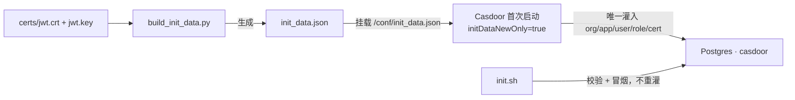

# Casdoor 部署与配置指南

> 本地 IdP（Identity Provider），为 APISIX Phase 2 保护 `/resource/*` 提供 OIDC。  
> 当前阶段：**C0–C4 已完成**（compose → token → APISIX OIDC → Resource RBAC → 文档闭环）。  
> 凭据清单：[`deploy/casdoor/conf/credentials.yaml`](../deploy/casdoor/conf/credentials.yaml)。

---

## 1. 在整体架构里的位置

| 层次 | 组件 | 职责 |
|------|------|------|
| IdP | **Casdoor** | 用户 / 组织 / 角色；登录；JWT **签发** |
| PEP | **APISIX**（C2） | 校验 Bearer；注入 `X-Userinfo` |
| 细粒度授权 | **Resource**（C3） | 解析身份；租户校验；RBAC |
| EMS 机机 | APISIX `key-auth` | **不经 Casdoor**（Phase 1 已完成） |

```
管理端 / curl
    │  1. Password Grant / 登录拿 token
    ▼
Casdoor :8000
    │  2. Authorization: Bearer <JWT>
    ▼
APISIX :9080 /resource/*   ← C2 openid-connect
    │  X-Userinfo
    ▼
Resource :8082             ← C3 middleware
```

业务代码 **不引入** `casdoor-sdk-go`。换 IdP 时：改 APISIX `discovery` + 重写 claim→`Identity` 映射（见 §7.6）；**不要**让 usecase 依赖 Casdoor 字段名。

---

## 2. 快速启动

```bash
make infra-up          # Postgres 等
make casdoor-up        # 确保 casdoor 库 + 起容器
make casdoor-init      # 等待就绪 + 校验种子 + Password Grant 冒烟
make apisix-up && make apisix-init   # Phase 2：/resource/* OIDC
# 经 APISIX 联调前：config/resource.yaml → auth.trust-proxy-headers: true
make run-resource      # 或 make run-all
```

完整验收步骤见 **§11 端到端联调清单**。

| 项 | 值 |
|----|-----|
| UI | http://127.0.0.1:8000 |
| OIDC discovery | http://127.0.0.1:8000/.well-known/openid-configuration |
| JWKS | http://127.0.0.1:8000/.well-known/jwks |
| Application | `vpp-resource` |
| Client ID / Secret | `vpp-resource-dev-client` / `vpp-resource-dev-secret` |
| Organization（= tenant） | `default` |
| 控制台（built-in） | `admin` / `123` |
| 业务用户 | `admin` / `operator` / `viewer`（密码见 credentials.yaml） |

Makefile：`casdoor-up` / `casdoor-down` / `casdoor-init` / `casdoor-status` / `casdoor-logs` / `casdoor-db`。

---

## 3. 目录与文件职责

```
deploy/casdoor/
  docker-compose.casdoor.yaml   # 容器编排
  conf/
    app.conf                    # Casdoor 运行时配置（DSN、initData*）
    init_data.json              # 空库首次启动时导入的种子
    authz_model.conf            # C5：共享 Casbin Model（嵌入 init_data）
    credentials.yaml            # 给人看的凭据说明（不驱动运行）
    certs/jwt.{crt,key}         # 固定 DEV RSA（写入 init_data）
  init.sh                       # make casdoor-init：建库检查 + 校验 + 冒烟
  init/build_init_data.py       # 从 certs + authz_model 重新生成 init_data.json
  README.md                     # 短入口，细节以本文为准

migrations/initdb/60-casdoor-db.sh   # 全新 Postgres volume 时 CREATE DATABASE
```

| 文件 | 写 DB？ | 作用 |
|------|---------|------|
| `build_init_data.py` | 否 | 生成 / 重写 `init_data.json`（换证或改种子结构时用；含 C5 authz Model/Permission） |
| `init_data.json` | 间接 | 被 Casdoor **空库首次启动**读入并写入 Postgres |
| `authz_model.conf` | 否 | C5 Casbin Model 源文件；由 `build_init_data.py` 嵌入 Model 种子 |
| `init.sh` | 仅可能 `CREATE DATABASE` | **不灌业务种子**；等就绪、SQL/API 校验、Password Grant 冒烟 |
| `app.conf` | 否 | 告诉 Casdoor 连哪、种子文件在哪、`initDataNewOnly` |
| `credentials.yaml` | 否 | 文档用凭据清单 |

---

## 4. 种子数据链路（三者关系）



要点：

1. **真正往表里写 org/user/app 的只有 Casdoor 进程**（读 `init_data.json`）。
2. `initDataNewOnly = true`：库非空则**不再**导入；改种子后要生效 → drop 库再启（见 §7）。
3. `init.sh` 用 built-in `admin/123` 登控制台 API，并核对 `default` / `vpp-resource` / Password Grant。

种子内容摘要：

- Organization `default`（= VPP `tenant_id`）
- Application `vpp-resource`：`grantTypes` **必须含** `password`（否则 C1 `casdoor-token` 报 `unsupported_grant_type`）
- Cert `cert-vpp`：固定 PEM，避免每次重启 JWKS 漂移
- Roles：`admin` / `operator` / `viewer`；用户同名绑定

---

## 5. 镜像版本

| 项 | 说明 |
|----|------|
| **当前 pin** | `casbin/casdoor:3.125.0` |
| 曾用 | `v1.804.0`（1.x 旧线，方案占位未对齐 Hub） |
| Hub 主线 | **3.x**（tag **无** `v` 前缀，如 `3.125.0`） |
| 为何不盯 `latest` | 发版极频；pin 具体小版本便于复现 |

**选型理由（本地 dev）：**

- `v1.804.0` 偏旧，与官网 / Hub 主线脱节，不推荐继续用。
- Casdoor 3.x 小版本几乎日更；本地无生产 SLA，直接跟 **Hub 当前最新 patch**（撰写时为 `3.125.0`）即可兼顾新功能与可拉取性。
- 跨大版本（1→3）schema 可能变：本地约定 **drop `casdoor` 库 → 重建 → 再 `casdoor-up` / `casdoor-init`**，用 `init_data.json` 重灌。

升级步骤见 §7。

---

## 6. Header 信任边界（C3）

经 APISIX 的 `/resource/*` 才是受保护入口。  
**直连** `http://127.0.0.1:8082` 在 `auth.trust-proxy-headers: false`（默认）时**整段鉴权旁路**，便于本地调试业务。

| `resource.auth.trust-proxy-headers` | 行为 |
|-------------------------------------|------|
| `false`（默认，直连调试） | **不读**客户端伪造的 `X-Userinfo`；鉴权全关 |
| `true`（经 APISIX 推荐） | **强制**合法 `X-Userinfo`；缺/非法 → 401；再做租户 + RBAC |

禁止第三种：`false` 时仍信任伪造 header（等于开后门）。

经 APISIX 联调时请在 [`config/resource.yaml`](../config/resource.yaml) 设 `trust-proxy-headers: true` 并重启 Resource。

K8s 后 Resource 仅 ClusterIP 时，伪造面自然缩小。

---

## 6.1 Resource 应用层（C3）

| 组件 | 路径 |
|------|------|
| VPP 身份契约 `Identity` | [`internal/platform/middleware/identity.go`](../internal/platform/middleware/identity.go) |
| Casdoor claim → `Identity`（ACL） | [`internal/platform/middleware/casdoor_userinfo.go`](../internal/platform/middleware/casdoor_userinfo.go) |
| Gin 中间件（租户 + PermissionChecker） | [`internal/resource/adapter/inbound/http/auth.go`](../internal/resource/adapter/inbound/http/auth.go) |
| 目录映射 `resourceOf` / `actionOf` | [`catalog.go`](../internal/resource/adapter/inbound/http/catalog.go) |
| 本地 PDP + 策略同步 | [`internal/platform/authz/`](../internal/platform/authz/) |
| 挂载 | [`internal/resource/server.go`](../internal/resource/server.go)（`NewGinEngine` 之后） |

授权矩阵（现状占位角色；**策略在 Casdoor**，种子对齐下表）：

| 角色 | GET | POST/PUT/PATCH | DELETE / `:changeLifecycle` |
|------|-----|----------------|------------------------------|
| viewer | 允许 | 拒绝 | 拒绝 |
| operator | 允许 | 允许 | 拒绝 |
| admin | 允许 | 允许 | 允许 |

路径含 `/api/tenants/{id}/...` 时：`id` 必须等于 `Identity.TenantID`，否则 **403**。  
`/api/import-jobs...` 无 path tenant：只要求身份有效（本期不做 body 租户深校验）。

经 APISIX 联调前：`auth.trust-proxy-headers: true`（同时启用 Casdoor 策略同步，见 `auth.authz.*`）。

单元测试：`go test ./middleware/ ./authz/`（platform）、`go test ./adapter/inbound/http/`（resource）。

---

## 7. 运维操作

### 7.1 日常

```bash
make casdoor-up && make casdoor-init
make casdoor-status
make casdoor-logs
make casdoor-down
```

### 7.2 升级镜像 / 换大版本后重灌（本地）

```bash
make casdoor-down

# 改 deploy/casdoor/docker-compose.casdoor.yaml 中 image tag 后：
docker exec vpp-backend-postgres-1 \
  psql -U postgres -c 'DROP DATABASE IF EXISTS casdoor WITH (FORCE);'
docker exec vpp-backend-postgres-1 \
  psql -U postgres -c 'CREATE DATABASE casdoor;'

make casdoor-up
make casdoor-init
```

### 7.3 轮换 DEV JWT 证书

```bash
openssl genrsa -out deploy/casdoor/conf/certs/jwt.key 2048
openssl req -new -x509 -key deploy/casdoor/conf/certs/jwt.key \
  -out deploy/casdoor/conf/certs/jwt.crt -days 3650 -subj '/CN=vpp-casdoor-dev'
python3 deploy/casdoor/init/build_init_data.py
# 再按 §7.2 drop 库重灌；若 APISIX 已接 OIDC，重启 APISIX 清 JWKS 缓存
```

### 7.4 拿 token（C1）

```bash
# 仅输出 access_token（可嵌进 curl）
make -s casdoor-token
make -s casdoor-token USER=operator

# 解码 JWT：打印 header/payload + C3 字段映射
make -s casdoor-token USER=admin DECODE=1

curl --noproxy '*' -s \
  -H "Authorization: Bearer $(make -s casdoor-token USER=admin)" \
  http://127.0.0.1:9080/resource/api/tenants/default/sites
```

实现：[`deploy/casdoor/token.sh`](../deploy/casdoor/token.sh)（Password Grant）。  
注意：脚本用 `CASDOOR_USER`，避免与 shell 的 `USER`（系统登录名）冲突；Makefile 的 `USER=admin|operator|viewer` 会转成 `CASDOOR_USER`。

---

## 7.5 JWT claim 实测格式（C1 门禁 · Casdoor 3.125.0）

实测 Password Grant 签发的 access_token（`alg=RS256`, `kid=cert-vpp`）。  
**`casdoor_userinfo.go` 必须按此结构解析，不要假设 `roles` 是 `string[]`。**

### Casdoor wire → VPP `Identity`

| `Identity`（稳定契约） | Casdoor claim（可替换面） | 实测类型 | 示例 |
|------------------------|---------------------------|----------|------|
| `UserID` | `sub`（缺省时 `id`） | string (UUID) | `cd4686dc-129b-…` |
| `TenantID` | `owner` | string | `default` |
| `Username` | `name` | string | `admin` |
| `Roles` | `roles[].name` | **对象数组** | 见下 |
| `IsAdmin` | `isAdmin` | bool | 仅提示；RBAC 看 `Roles` |

### `roles` 原始形态（节选）

```json
"roles": [
  {
    "owner": "default",
    "name": "admin",
    "createdTime": "2026-07-29T10:39:28Z",
    "displayName": "Admin",
    "description": "Full Resource API access",
    "users": null,
    "groups": [],
    "roles": [],
    "domains": null,
    "isEnabled": true
  }
]
```

operator / viewer 同结构，仅 `name` 为 `operator` / `viewer`。

### 其它常用标准字段

| Claim | 值 |
|-------|-----|
| `iss` | `http://host.docker.internal:8000`（与 `app.conf` origin 一致） |
| `aud` | `["vpp-resource-dev-client"]` |
| `azp` | `vpp-resource-dev-client` |
| `tokenType` | `access-token` |
| JWT `kid` | `cert-vpp` |

### 对 C2 / C3 的约定

- **C2**：APISIX `openid-connect` + `set_userinfo_header: true` → 转发 **`X-Userinfo`**（整包）；不在网关拆 `X-Roles`。
- **C3**：`ParseXUserinfo` 按上表映射后，用 `Identity.TenantID` / `Roles` 做 path 租户与 RBAC。

复现：`make -s casdoor-token USER=admin DECODE=1`。

---

## 7.6 身份契约分层（显式 ACL，暂不多实现）

| 层 | 内容 | 替换 IdP 时 |
|----|------|-------------|
| **稳定** | `Identity` + Resource RBAC（`admin`/`operator`/`viewer`） | 尽量不动 |
| **Casdoor ACL** | [`casdoor_userinfo.go`](../internal/platform/middleware/casdoor_userinfo.go) + 本节 claim 表 | **重写映射**；更新 §7.5 实测样例 |
| **运维** | APISIX `discovery` / client_id / secret | 改 IdP 端点与凭证 |

不做 `ports.UserinfoMapper` 多实现：当前只有 Casdoor。文件名与注释标明「这是 Casdoor 形状」，避免把 `owner` 误当成行业标准 OIDC。

---

## 8. 故障排查

| 现象 | 可能原因 | 处理 |
|------|---------|------|
| `make casdoor-up` 连不上库 | Postgres 未起 / 无 `casdoor` 库 | `make infra-up`；`make casdoor-db` |
| 种子校验失败（无 org/app） | 库非空且从未导入；或 init_data 未挂载 | §7.2 drop 重灌；检查 compose volume |
| `unsupported_grant_type` | Application 未开 Password Grant | 确认 `init_data` 的 `grantTypes` 含 `password` 后重灌 |
| `make casdoor-token` 空 / unknown user | OS 的 `USER` 被当成 Casdoor 用户 | 用 `make casdoor-token USER=admin`；脚本读 `CASDOOR_USER` |
| OIDC / token 全 401（接 APISIX 后） | JWKS 缓存旧钥；或 DB 被 wipe 后钥变了 | 固定 cert + 重启 APISIX；`make apisix-init` |
| 有效 token 仍 401 | discovery/JWKS 不可达 | Casdoor `origin` 必须是 `host.docker.internal:8000` |
| 经 APISIX 200 但直连像没鉴权 | `trust-proxy-headers: false` | 预期（§6）；联调请改为 `true` |
| 403 tenant mismatch | path tenant ≠ JWT `owner` | 用 `default` path，或换对应 org 用户 |
| 403 role cannot perform | viewer 写 / operator 删 | 换 `USER=admin` 或按 §6.1 矩阵 |
| Admin API Basic 认证怪错 | Casdoor 把 Basic 当 client_id | 用 session 登录（`init.sh` 已如此） |
| 直连 :8082 像没鉴权 | `trust-proxy-headers: false` | 预期，见 §6 |

---

## 9. 阶段状态

| 阶段 | 内容 | 状态 |
|------|------|------|
| **C0** | compose、种子、init 校验、镜像 pin | ✅ |
| **C1** | `make casdoor-token`；JWT decode 记录 claim 格式 | ✅ |
| **C2** | APISIX `/resource/*`：`openid-connect` + `set_userinfo_header` | ✅ |
| **C3** | Resource 解析 `X-Userinfo` + 租户 + RBAC（按 §7.5 映射） | ✅ |
| **C4** | 联调清单 + 与 APISIX.md / architecture 文档闭环 | ✅ |
| **C5+** | 集中式授权（Casdoor PAP + 本地 Casbin PDP） | 见 [`AUTHZ_CENTRALIZATION_PLAN.md`](AUTHZ_CENTRALIZATION_PLAN.md)；**C5–C9 已完成** |

相关：[`docs/APISIX.md`](APISIX.md) §11.6；[`architecture.md`](../architecture.md) 北向入口；[`docs/AUTHZ_CENTRALIZATION_PLAN.md`](AUTHZ_CENTRALIZATION_PLAN.md)；联调 [`docs/AUTHZ_TEST.md`](AUTHZ_TEST.md)；运维 [`docs/AUTHZ_RUNBOOK.md`](AUTHZ_RUNBOOK.md)。

---

## 10. 相关路径

- [`deploy/casdoor/`](../deploy/casdoor/)
- [`deploy/casdoor/token.sh`](../deploy/casdoor/token.sh)（C1）
- [`migrations/initdb/60-casdoor-db.sh`](../migrations/initdb/60-casdoor-db.sh)
- [`deploy/apisix/`](../deploy/apisix/)（C2）
- [`internal/platform/middleware/identity.go`](../internal/platform/middleware/identity.go)（C3 · VPP `Identity`）
- [`internal/platform/middleware/casdoor_userinfo.go`](../internal/platform/middleware/casdoor_userinfo.go)（C3 · Casdoor ACL）
- [`internal/platform/authz/`](../internal/platform/authz/)（C6 · PermissionChecker / Casbin / Syncer）
- [`internal/resource/adapter/inbound/http/auth.go`](../internal/resource/adapter/inbound/http/auth.go)（C7 · PEP）
- [`config/resource.yaml`](../config/resource.yaml) — `auth.trust-proxy-headers` / `auth.authz.*`
- [`docs/AUTHZ_TEST.md`](AUTHZ_TEST.md)（C5–C7 联调测试）

---

## 11. 端到端联调清单（C4）

> C5–C7 授权同步与「改 Casdoor 权限是否生效」见 **[`AUTHZ_TEST.md`](AUTHZ_TEST.md)**（含 Syncer、降级、最小验收清单）。  
> 下文保留 C4 认证门卫冒烟；与 `AUTHZ_TEST.md` §4 可对照执行。

前提：Postgres / Casdoor / APISIX 已起；[`config/resource.yaml`](../config/resource.yaml) 中 **`auth.trust-proxy-headers: true`**；Resource 已 `make run-resource`（或 `run-all`）。

```bash
make casdoor-init
make apisix-init

# ① APISIX 门卫：无 token → 401
curl --noproxy '*' -s -o /dev/null -w '%{http_code}\n' \
  http://127.0.0.1:9080/resource/api/tenants/default/sites

# ② 有效 admin token → 200（或业务空列表 JSON，非 401/403）
curl --noproxy '*' -s -o /dev/null -w '%{http_code}\n' \
  -H "Authorization: Bearer $(make -s casdoor-token USER=admin)" \
  http://127.0.0.1:9080/resource/api/tenants/default/sites

# ③ 跨租户 path → 403（token owner=default）
curl --noproxy '*' -s -o /dev/null -w '%{http_code}\n' \
  -H "Authorization: Bearer $(make -s casdoor-token USER=admin)" \
  http://127.0.0.1:9080/resource/api/tenants/other/sites

# ④ viewer 写操作 → 403
curl --noproxy '*' -s -o /dev/null -w '%{http_code}\n' \
  -H "Authorization: Bearer $(make -s casdoor-token USER=viewer)" \
  -H 'Content-Type: application/json' \
  -d '{"name":"x"}' \
  http://127.0.0.1:9080/resource/api/tenants/default/sites

# ⑤ EMS 线不受影响：gateway 仍要 X-API-KEY
curl --noproxy '*' -s -o /dev/null -w '%{http_code}\n' \
  http://127.0.0.1:9080/gateway/api/v1/tenants/default/mappings
# → 401；带 Key 则按 Gateway 是否在跑返回 200/502
```

直连调试（跳过鉴权）：保持 `trust-proxy-headers: false`，访问 `http://127.0.0.1:8082/api/tenants/...`（**不要**伪造 `X-Userinfo` 当正式鉴权）。

Claim 自检：`make -s casdoor-token USER=admin DECODE=1` → 看 `mapping_for_c3`。
