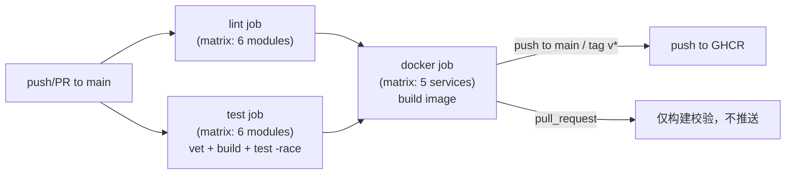

# CI/CD 升级改造方案


## 背景与范围依据

`discussion/2026-08-10.md` 和 [ROADMAP.md](ROADMAP.md) 已经收敛了结论：Phase A 剩余项里 **CI/CD 排最前**，因为它是复利型投入；且明确"docker build 作为容器化的第一步产出"。本方案只做这一件事——不涉及集成测试（testcontainers，仍是独立待办）、不涉及 K8s 部署、不改业务代码。

## 现状盘点（决定了方案怎么设计）

- **Go multi-module monorepo**，无根 `go.mod`：`internal/{platform,resource,telemetry,gateway,dispatch,simulator}` 各自独立 module，靠 `replace` 互相指向（例：[internal/gateway/go.mod](internal/gateway/go.mod) replace 了 `platform`、`api/gateway/proto/gen`、`api/telemetry/proto/gen`）。这意味着 CI 的 test/lint 必须按模块分别跑，docker build 的 context 必须是仓库根目录（不能只 COPY 单个服务目录）。
- Go 版本不统一：`platform` 声明 `go 1.24.0`，其余 5 个模块声明 `1.26.x`。本机 `go1.26.5` 均兼容，CI 统一装 `1.26.x` 工具链即可，顺手把 `platform/go.mod` 的 `go 1.24.0` 提到 `1.26.0` 消除这个不一致（低风险小改动）。
- [Makefile](Makefile) 已有 `build-all` / `tidy` / `fmt`，但**没有** `test`**、**`vet` **target**，且 `lint` target 指向的 `scripts/lint.sh` **文件不存在**（调用即报错）——这次要顺手修。
- 仓库里**没有任何 Dockerfile、**`.github/workflows`**、**`.golangci.yml`。中间件靠 [compose.yaml](compose.yaml)（Postgres/Redis/Kafka/可观测性栈）+ `deploy/apisix`、`deploy/casdoor` 两个独立 compose，这些是基础设施栈，不是业务镜像，不在本次改造范围。
- Kafka 客户端用的是纯 Go 的 `segmentio/kafka-go`（[internal/resource/go.mod](internal/resource/go.mod)），没有 CGO 依赖 → 可以用 `CGO_ENABLED=0` 静态编译，最终镜像能用 `distroless/static`，体积小、攻击面小。
- Git 远端是 `git@github.com:mushroomyuan/vpp-backend.git`，默认分支 `main` → 用 GitHub Actions，镜像推 GHCR（`ghcr.io`），零额外配置（复用仓库自带的 `GITHUB_TOKEN`）。


## 决策确认（已与你对齐）

- 镜像仓库：**GHCR**（`ghcr.io/mushroomyuan/vpp-backend/<service>`），不用 Docker Hub，省去额外 Secrets 配置。
- 本轮顺带引入 **golangci-lint**，修复现在损坏的 `make lint`。


## 整体流水线设计




单一工作流文件 `.github/workflows/ci.yml`，三个 job：`lint`、`test`、`docker`（`needs: [lint, test]`）。PR 上跑全部三个 job 做校验（docker 只 build 不 push）；push 到 `main` 或打 `v*` tag 时额外推送镜像。

## 具体改造项


### 1. 补齐 Makefile：`test` / `vet`，修复 `lint`

在 [Makefile](Makefile) 里新增循环 6 个模块的 `test`、`vet` target（和现有 `tidy` target 的写法一致），本地和 CI 用同一套逻辑，避免"本地过了、CI 挂了"。

### 2. 新建 `.golangci.yml` + `scripts/lint.sh`

- 根目录 `.golangci.yml`：启用 `govet`、`staticcheck`、`errcheck`、`unused`、`ineffassign`、`gofmt`/`goimports` 等常规规则，先不开过于严格的风格类规则。
- `scripts/lint.sh`：循环 6 个模块目录执行 `golangci-lint run --timeout=5m ./...`，让 `make lint` 重新可用。

**风险提示**：这是代码库第一次接入 lint，本地跑一次可能会暴露一批历史遗留问题。为避免"一接入 CI 就全红"，CI 里 PR 场景用 `golangci-lint-action` 的 `only-new-issues: true`（只挡新增代码的问题，不追溯历史债务），push 到 `main` 时才跑全量（历史问题先记录、不阻塞，后续单独清）。

### 3. GitHub Actions：`.github/workflows/ci.yml`

`lint` 和 `test` 都用 `strategy.matrix.module: [platform, resource, telemetry, gateway, dispatch, simulator]`，`working-directory` 切到 `internal/${{ matrix.module }}`：

```yaml
test:
  strategy:
    matrix:
      module: [platform, resource, telemetry, gateway, dispatch, simulator]
  steps:
    - uses: actions/checkout@v4
    - uses: actions/setup-go@v5
      with: { go-version: "1.26.x", cache-dependency-path: internal/${{ matrix.module }}/go.sum }
    - run: go vet ./...
      working-directory: internal/${{ matrix.module }}
    - run: go build ./...
      working-directory: internal/${{ matrix.module }}
    - run: go test ./... -race -count=1 -coverprofile=coverage.out
      working-directory: internal/${{ matrix.module }}
```

矩阵天然给出"哪个服务挂了"的清晰状态，而不是一坨日志里找问题。

### 4. 参数化 Dockerfile（一份模板服务 5 个服务）

新建 `deploy/docker/Dockerfile`，用 `ARG SERVICE` 参数化，避免写 5 份几乎相同的 Dockerfile：

```dockerfile
ARG GO_VERSION=1.26
FROM golang:${GO_VERSION}-bookworm AS builder
ARG SERVICE
WORKDIR /src
COPY . .
WORKDIR /src/internal/${SERVICE}
RUN CGO_ENABLED=0 GOOS=linux go build -trimpath -ldflags="-s -w" -o /out/app ./cmd

FROM gcr.io/distroless/static-debian12:nonroot
ARG SERVICE
COPY --from=builder /out/app /app
COPY config/${SERVICE}.yaml /etc/vpp/config.yaml
USER nonroot:nonroot
ENTRYPOINT ["/app", "-c", "/etc/vpp/config.yaml"]
```

配套新增 `.dockerignore`（排除 `.git`、`bin/`、`data/`、`docs/`、`discussion/`、`deploy/apisix`、`deploy/casdoor`、`migrations/` 等非构建必需内容，缩小构建上下文）。

Build context 必须是仓库根目录（因为 multi-module 的 `replace` 依赖分散在 `internal/platform` 和 `api/*`）。

**明确不做的事**（避免本轮越界）：不改配置加载方式（仍是 `-c` 指定 YAML 文件，不引入环境变量覆盖）、不加健康检查探针、不处理容器内如何连接 Postgres/Kafka/Casdoor 的网络寻址问题——这些是 K8s 部署阶段的事，本轮只验证"镜像能构建成功、能跑起来"。

### 5. GitHub Actions：docker job 推送 GHCR

```yaml
docker:
  needs: [lint, test]
  permissions:
    contents: read
    packages: write
  strategy:
    matrix:
      service: [resource, telemetry, gateway, dispatch, simulator]
  steps:
    - uses: actions/checkout@v4
    - uses: docker/setup-buildx-action@v3
    - uses: docker/login-action@v3
      if: github.event_name != 'pull_request'
      with: { registry: ghcr.io, username: ${{ github.actor }}, password: ${{ secrets.GITHUB_TOKEN }} }
    - uses: docker/metadata-action@v5
      id: meta
      with:
        images: ghcr.io/mushroomyuan/vpp-backend/${{ matrix.service }}
        tags: |
          type=raw,value=latest,enable={{is_default_branch}}
          type=sha,prefix=sha-
          type=semver,pattern={{version}}
    - uses: docker/build-push-action@v6
      with:
        context: .
        file: deploy/docker/Dockerfile
        build-args: SERVICE=${{ matrix.service }}
        push: ${{ github.event_name != 'pull_request' }}
        tags: ${{ steps.meta.outputs.tags }}
        cache-from: type=gha,scope=${{ matrix.service }}
        cache-to: type=gha,mode=max,scope=${{ matrix.service }}
```

用 `docker/metadata-action` 生成 tag（`latest` 只在默认分支、`sha-<短hash>` 始终打、`v*` tag 触发时打语义化版本号），比手写 tag 字符串更规范。`cache-from/to: type=gha` 用 GitHub Actions 自带缓存加速重复构建的 Go 依赖层。

### 6. Makefile 加一个本地对齐用的 target（可选但建议）

```makefile
docker-build:
	docker build -f deploy/docker/Dockerfile --build-arg SERVICE=$(SERVICE) -t vpp-$(SERVICE):local .
```

方便本地 `make docker-build SERVICE=resource` 复现 CI 的构建步骤，排障不用等 CI。

### 7. 更新 [ROADMAP.md](http://ROADMAP.md)

把 Phase A 里的 `[ ] CI/CD（GitHub Actions：build + vet + test；docker build 作为容器化的第一步产出）` 勾选为完成，并在「已知限制 / 待处理」里补一条：镜像已构建推送到 GHCR，但容器内配置/网络寻址/健康探针留给 K8s 阶段处理，避免造成"已经容器化部署"的误解。

## 本轮不做的事（明确边界）

- 集成测试（testcontainers）——ROADMAP 里是独立待办，接入 CI 时机由它自己的完成状态决定，不是本次前置条件。
- K8s manifests / 部署——依赖本次产出的镜像，但部署本身是下一阶段。
- 给容器内服务加健康检查探针、配置外部化（env var 覆盖 YAML）——留到 K8s 阶段一起做更有意义（K8s liveness/readiness probe 才用得上）。
- GitHub 仓库的 branch protection（要求 CI 通过才能合并 main）——这是 GitHub 仓库设置，不是代码改动，建议 CI 跑通并稳定几天后手动在仓库设置里勾选 "Require status checks to pass"，把 `lint`、`test` 设为必需检查项。


## 验收标准

- 6 个模块的 `go vet` + `go build` + `go test -race` 全部在 CI 矩阵里独立可见、全绿。
- `make lint` 本地可运行不报"文件不存在"，CI 里 lint job 对 PR 新增代码生效。
- 5 个服务的 Docker 镜像能在 CI 里成功构建；push 到 `main` 后能在 GHCR（`ghcr.io/mushroomyuan/vpp-backend/<service>`）看到对应 tag 的镜像。
- `ROADMAP.md` 的 CI/CD 待办项更新为已完成状态，且注明范围边界。

