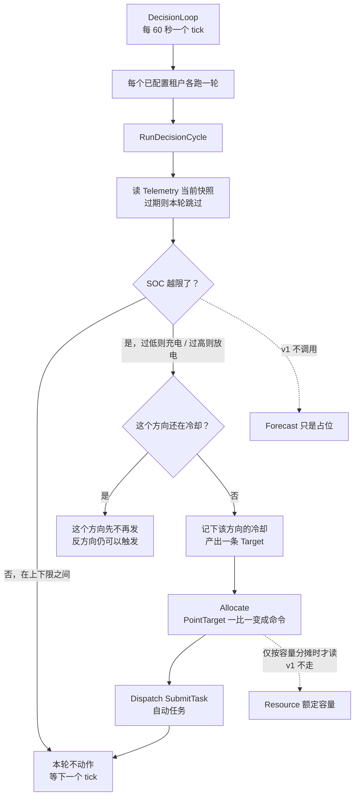

# Optimization 一轮决策（已退役）

这张图描述已经删除的 optimization 循环，只作历史对照。当前决策主链见 [`internal/decision/OVERVIEW.md`](../../../internal/decision/OVERVIEW.md)。图和 [`03-optimization.excalidraw`](./03-optimization.excalidraw) 仍是同一张旧图。

