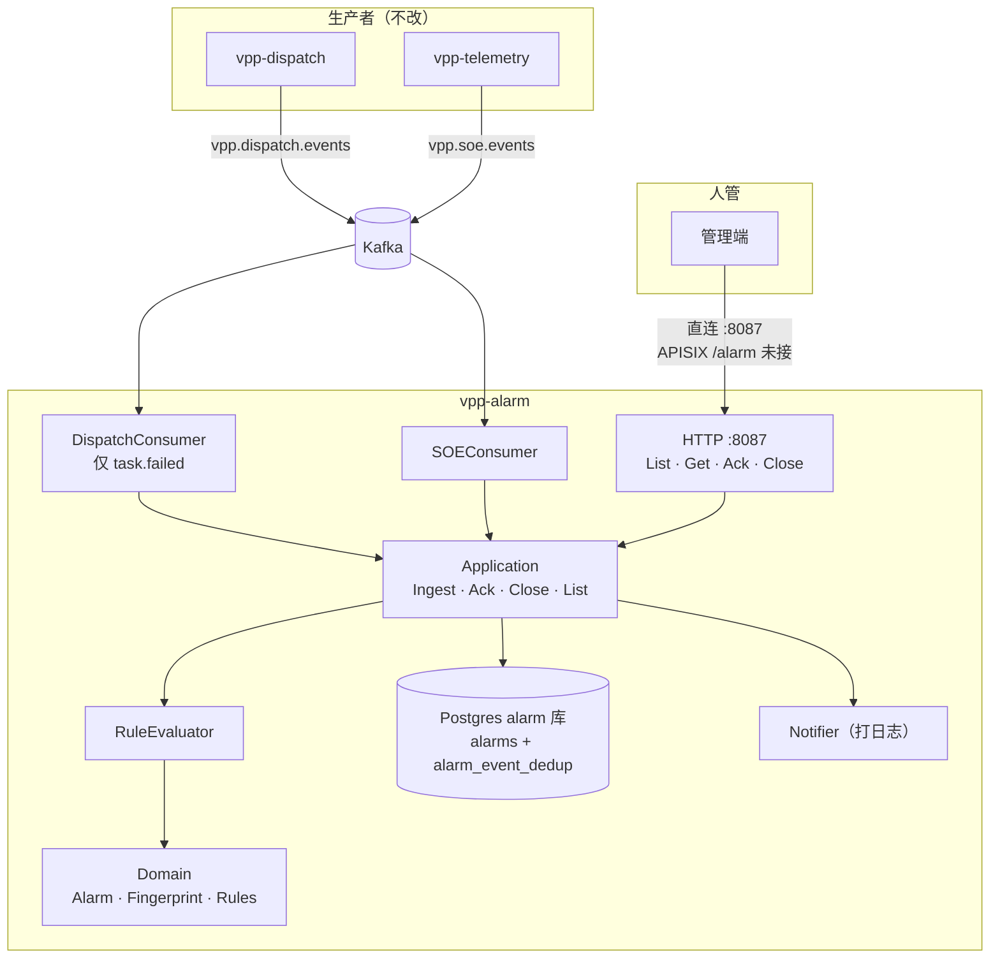
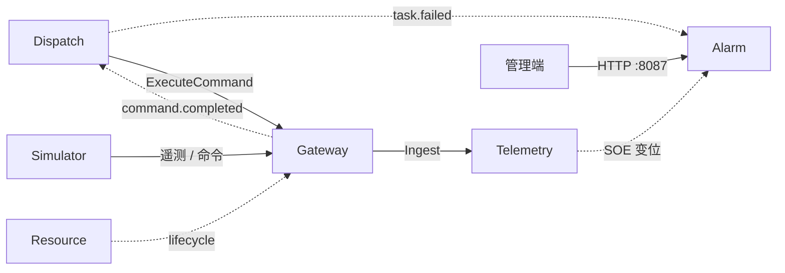

# vpp-alarm

> 能力与架构简介。Fingerprint / 去重契约、指标与技术债见 [README.md](./README.md)。

## 服务定位

Alarm 是运行告警中心：消费已有 Kafka 事件，按规则开单 / 合单，提供租户内查询、确认、关闭。

告警是**充血聚合**，不是事件副本。同一故障在打开期间只有一条。不改 dispatch / telemetry 生产者，也不做全量审计。

## 功能特点

### 1. 两条入站、两种合单粒度

| 来源 | Topic | 吃什么 | 合单 |
|------|-------|--------|------|
| Dispatch | `vpp.dispatch.events` | 仅 `task.failed` | 一次失败一张单 |
| Telemetry | `vpp.soe.events` | 全部离散量变位 | 同一测点在 **open** 期间合并，`count` 累加 |

`task.started` / `task.completed`、`vpp.command.events`、`vpp.resource.events` 都不吃：命令失败已被 FailFast 收成 `task.failed`；资源生命周期不是运行告警。

### 2. Fingerprint 管合单，dedup 表管精确一次

这是两件事：

```
Kafka at-least-once 重投  ──▶  alarm_event_dedup (tenant_id, event_id)
同一测点连跳 / 开单       ──▶  fingerprint + 部分唯一索引（仅 status <> closed）
```

- **Fingerprint**：决定和哪条 **open** 告警聚合。SOE 不含时间 / 数值；dispatch 含 `event_id`（所以两次失败不会并成一条）。
- **`alarm_event_dedup`**：任意历史 event_id 重投都算已处理。`LastEventID` 只是展示字段。

哈希输入用 `\x1f` 拼接后 sha256，前缀 `v1:`。粒度一旦落库不可默默改，详见 README。

### 3. 原子 ingest，人管面纯 HTTP

```
Kafka 消息 → 规则 → 一条 SQL（dedup INSERT 先于 alarms upsert）→ commit
```

隔离级别是 Postgres 默认 READ COMMITTED。唯一冲突按约束名分流：dedup 命中是成功；open fingerprint 撞车是完整性 poison。

人管面只有 List / Get / Ack / Close（**无** `POST /alarms`）。Ack / Close 走乐观锁，冲突 409。Actor 来自 PEP，不从 body 取。无 gRPC / proto。

## 架构概览



进程内 errgroup：HTTP、两个 consumer、authz Syncer、metrics `:9107`。brokers 为空时 consumer no-op，进程仍能起来。

主路径：

```
task.failed / SOE
    → 规则（未命中则 dropped，不写 dedup）
    → 原子 upsert
    → 新开 / 合单 / dedup_hit
    → 管理端 List → Ack → Close
```

## 与其它服务的关系



Alarm **不直连** Gateway / Resource / Simulator。失败告警来自 Dispatch 的 `task.failed`；测点告警来自 Telemetry 的 SOE。Simulator 注入 `command_reject` 会先变成 Dispatch FailFast，再变成一条 dispatch 告警。

| 服务 | 关系 |
|------|------|
| **Dispatch** | 只消费 `task.failed`；不调 `GetTask`，不拼失败原因 |
| **Telemetry** | 只消费 SOE；不写时序、不查快照 |
| **Gateway / Resource / Simulator** | 不直连；身份仍是共享的 `CUCode` / `tenant_id` |
| **管理端** | 直连 HTTP `:8087`；v1 不挂 APISIX `/alarm/*` |
| **Casdoor / Casbin** | Path C PEP 已写好；`trust-proxy-headers` 默认 false（本机直连调试） |

## 当前阶段

**v1 已具备：** 双 consumer、原子去重 / 合单、HTTP 人管、authz catalog、Prometheus 指标、kind ClusterIP、CI 镜像。

**刻意未做：** APISIX 北向、closed / dedup 表 retention、SOE 自动恢复、webhook、多副本、规则 DSL。这些不影响「今天就能吃到任务失败和测点变位」。
