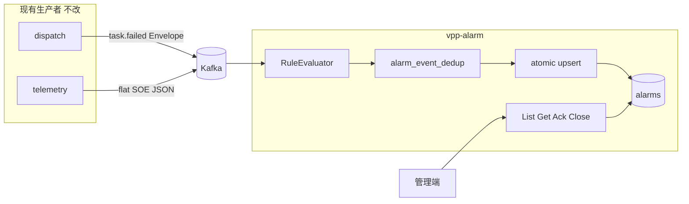

# 告警中心设计方案（v1）

> **实现状态：** v1 已落地。人管约定、fingerprint 契约与技术债以 [`README.md`](./README.md) 为准；下文是设计底稿（含 SQL CTE）。

告警中心是 **Phase A 最后一个缺口服务**（设计时 topic 已在生产、尚无消费者）。它不是审计仓库，也不是预测/优化。不改 dispatch / telemetry 生产者。查询面已定为 **纯 HTTP（Gin）**，不引入 proto / gRPC。

实现前必须把「精确一次」和「并发」写死：独立去重表、原子 upsert、错误分类。不要查出来改再写回，也不要把去重压进会被 `Touch` 覆盖的字段。

## 1. 定位与边界

**负责**

- 消费 `vpp.dispatch.events`（仅 `task.failed`）和 `vpp.soe.events`（全部离散量变位）
- 按规则生成/更新告警，落 Postgres
- 租户内查询、确认（ack）、关闭（close）
- 通知口先打日志（`Notifier` port），不接邮件/短信

**不负责**

- 全量事件归档（那是 Phase C 审计；按 CommandID/TaskID 查生命周期不在这里）
- 消费 `vpp.command.events` / `vpp.resource.events`（命令失败已被 FailFast 收成 `task.failed`；资源生命周期不是运行告警）
- `task.started` / `task.completed`（噪声）
- 消费时调 `GetTask` 拼「已完成 Action / 失败原因」（事件载荷没有 reason；热路径不去耦合 dispatch）
- 规则引擎 DSL、告警抑制风暴、自动恢复（SOE 值回到旧值自动 close）
- 真实 EMS、多副本消费者（`replicas: 1`）
- closed 告警的定期归档 job（v1 只记技术债，见 §10）




## 2. 领域模型

告警是充血聚合，**不是事件副本**。同一故障在打开期间只有一条。

**实体** `Alarm`

- `ID`：UUID v7
- `TenantID`
- `Status`：`open` → `acknowledged` → `closed`（也可从 `open` 直接 `closed`）
- `Severity`：`critical` | `warning` | `info`
- `Source`：`dispatch` | `soe`
- `Fingerprint`：**只负责「和哪条 open 告警聚合」**，不负责 Kafka 去重（见 §2.1）
- `RuleID`
- `Title` / `Summary`
- `SourceRef`：dispatch 为 `task_id`；SOE 为 `{cu_code}/{metric_name}`（展示用，不进唯一索引）
- `Attributes`：JSONB 事件快照。Go 侧类型是 `model.AttributesPayload` 接口，每个 `RuleID`
  拥有自己的具体类型（`DispatchAttributes` / `SOEAttributes`），按 `rule_id` 解码，字段不跨业务
  堆叠。`AttributesSchema`（int，当前固定写 1）先作为惰性戳记落库；上线前尚无需要兼容的历史行，
  真正发生破坏性 shape 变更时再引入按 schema 分流的解码逻辑
- `Count`：同一 fingerprint 在 **当前这条 open 单** 上被命中的次数（新 event_id 才 +1）
- `FirstOccurredAt` / `LastOccurredAt`
- `AcknowledgedAt` / `AcknowledgedBy`
- `ClosedAt` / `ClosedBy`
- `LastEventID`：**展示字段**，最近一次真正更新了本行的 event_id；**不是去重键**
- `Version`：乐观锁，ack/close 用

状态迁移：`Acknowledge(actor)`、`Close(actor)` 带期望 `version`。ingest 侧 **不要** 先 load 再 `Touch()` 写回；SOE 聚合走 SQL 原子 upsert（§3.2）。

### 2.1 Fingerprint 与去重是两件事

- **Fingerprint + 部分唯一索引** `UNIQUE (tenant_id, fingerprint) WHERE status <> 'closed'`：只负责开单/合单（同一测点最多一条 **open**）。不负责 Kafka 重投。
- `alarm_event_dedup`，`PRIMARY KEY (tenant_id, event_id)`，只追加：精确一次，任意历史 event_id 重投都算已处理。不负责决定和哪条 open 告警合并。

**Dispatch：** 一次 `task.failed` 一张单。Fingerprint 含 `event_id`，因此每条失败事件的 fingerprint 都不同，部分唯一索引 **不会** 把两次失败合成一条——它在这条分支上只保证「这一张单自己 open」。去重 **完全** 交给 `alarm_event_dedup`。`LastEventID` 等于该单唯一的 event_id，不要据此以为「靠 last_event_id 唯一约束就能去重」。

**SOE：** 同一测点在 open 期间合并。Fingerprint **不含** 单次变位的时间/新旧值。同一断路器连跳：dedup 未命中则 count+1 并可能刷新 last_*；dedup 命中则整笔 ingest 成功返回、不 bump count。关闭后再变位：部分唯一索引不再命中已 closed 行，INSERT 新开一条。

### 2.2 Fingerprint 是 v1 稳定契约

不要用 `\|` 裸拼接（`cu_code` / `metric_name` / `task_id` 可能含分隔符，且会撞唯一索引）。

```
fingerprint = "v1:" + hex(sha256(canonical UTF-8))
```

canonical 字段顺序固定、字段之间用 `\x1f`（unit separator）：

- dispatch：`dispatch` + tenant_id + task_id + event_id
- soe：`soe` + tenant_id + cu_code + metric_name

前缀 `v1:` 标 schema。**聚合粒度一旦落库即持久化契约**：以后若改成「整 CU 一条告警」，必须新 fingerprint 版本 + 迁移，不能默默改哈希输入。README 写死这一点。

### 2.3 Event ID

哈希输入与 fingerprint **同一套规范**：字段之间用 `\x1f`，禁止裸拼接。否则 `cu="AB", metric="C"` 与 `cu="A", metric="BC"` 会得到同一个 event_id，去重表会把第二次真实变位吞掉且无错误日志。

- dispatch：envelope `event_id`（已有）
- SOE：`event_id = "soe:v1:" + hex(sha256(canonical))`，canonical 顺序固定：

```
tenant_id \x1f cu_code \x1f metric_name \x1f RFC3339Nano(occurred_at) \x1f FormatFloat(old) \x1f FormatFloat(new)
```

`FormatFloat` 必须 round-trip 稳定：Go 用 `strconv.FormatFloat(x, 'g', 17, 64)`（或等价），写进领域函数并单测边界串门用例。同一次变位重投 → 同一 id；时间或值不同 → 不同 id。

## 3. 入站事件、规则、写入语义

### 3.1 生产者分区（已存在，v1 不改生产者）

已核对，**不改 telemetry / dispatch**：

- SOE：`Key = "{tenant_id}:{cu_code}"`，`kafka.Hash`（见 internal/telemetry/adapter/outbound/kafka/event_publisher.go）。同一 CU 的测点变位同分区、有序。Fingerprint 是 cu+metric，比 key 更细，但同 CU 仍串行到达。
- dispatch：`Key = "{tenant_id}:{task_id}"`。单任务生命周期有序；v1 只吃 `task.failed`，同一 task 通常只有一条失败事件。

`replicas: 1` 时整个 group 一个进程。仍可能因 rebalance、进程崩溃重放而 **at-least-once 重投**（含非最新的历史消息）。分区有序 **不能** 替代去重表，也 **不能** 替代 upsert：rebalance 窗口里短暂双消费同一分区是 Kafka 常态。

消费侧约定：每个 topic 单线程/单 reader 顺序 `handle → commit`，禁止把同一条消息丢进无界 worker 池并行写同一 fingerprint。

### 3.2 Ingest：一条 SQL，dedup 必须先于写 alarms

**禁止**「先 upsert alarms 再插 dedup」。若 upsert 已成功、事务未提交就崩溃，重放会再 upsert 一次 → 双计数。`alarm_id` 在 SOE 合单前未知，也不要用两句 Go 里的 INSERT+UPDATE 靠约定顺序；整段锁进 **同一条语句**。应用层只看返回：`dedup_inserted = 0` → 幂等命中，不再写库。

`$candidate_id` 是应用预生成的 UUID。SOE 合到已有 open 行时，RETURNING 的 `id` 会是旧行，CTE 末尾把 dedup.alarm_id 回填成它。

**SOE（合单）：**

```sql
WITH ins_dedup AS (
  INSERT INTO alarm_event_dedup (tenant_id, event_id, alarm_id, ingested_at)
  VALUES ($tenant, $event_id, $candidate_id, now())
  ON CONFLICT (tenant_id, event_id) DO NOTHING
  RETURNING tenant_id, event_id
),
upsert_alarm AS (
  INSERT INTO alarms (
    id, tenant_id, fingerprint, source, status, severity, rule_id,
    title, summary, source_ref, attributes, attributes_schema,
    count, first_occurred_at, last_occurred_at, last_event_id, version
  )
  SELECT
    $candidate_id, $tenant, $fp, 'soe', 'open', $severity, $rule_id,
    $title, $summary, $source_ref, $attrs, 1,
    1, $occurred, $occurred, $event_id, 1
  FROM ins_dedup
  ON CONFLICT (tenant_id, fingerprint) WHERE status <> 'closed'
  DO UPDATE SET
    count            = alarms.count + 1,
    last_event_id    = EXCLUDED.last_event_id,
    title            = EXCLUDED.title,
    summary          = EXCLUDED.summary,
    attributes       = CASE WHEN EXCLUDED.last_occurred_at >= alarms.last_occurred_at
                            THEN EXCLUDED.attributes ELSE alarms.attributes END,
    last_occurred_at = GREATEST(alarms.last_occurred_at, EXCLUDED.last_occurred_at),
    version          = alarms.version + 1
  RETURNING id
),
backfill AS (
  UPDATE alarm_event_dedup d
  SET alarm_id = u.id
  FROM upsert_alarm u
  JOIN ins_dedup i ON TRUE
  WHERE d.tenant_id = i.tenant_id
    AND d.event_id  = i.event_id
    AND d.alarm_id IS DISTINCT FROM u.id
  RETURNING d.event_id
)
SELECT
  (SELECT COUNT(*) FROM ins_dedup)::int AS dedup_inserted,
  (SELECT id FROM upsert_alarm)         AS alarm_id;
```

`ins_dedup` 为空时后面的 `INSERT...SELECT FROM ins_dedup` 插入 0 行，**不会** bump count。乱序：count 仍 +1（新 event_id），`last_occurred_at` / `attributes` 不回退。Postgres 部分唯一索引要用 **同名** `ON CONFLICT (tenant_id, fingerprint) WHERE status <> 'closed'`，索引名见 §5。

**dispatch（只开新单，无合单）：** 同样先 `ins_dedup`，再 `INSERT INTO alarms SELECT ... FROM ins_dedup`（不要 `ON CONFLICT DO UPDATE`）。fingerprint 含 event_id，正常不应打到 `alarms_open_fingerprint_uidx`；一旦打到，整句失败，按 §3.4 当 poison。

整句成功后再 commit Kafka offset。

### 3.3 解析与规则

**Dispatch（有 Envelope）** — internal/platform/event/envelope.go、internal/platform/event/dispatch/events.go：

- 先 `Envelope[json.RawMessage]`，只处理 `task.failed`；其它 type **commit 跳过**（不是失败）
- 再解 `TaskLifecyclePayload`：`task_id`, `tenant_id`, `name`, `status`

**SOE（无 Envelope）** — 对齐现有 `soePayload`。v1 **不改 telemetry**。wire 结构抽到 `internal/platform/event/telemetry`，JSON 字段一致。

**规则 v1：YAML，不是引擎**（config/alarm.yaml）：

- `dispatch-task-failed`：`event_type=task.failed` → `critical`，标题 `调度任务失败: {name}`
- `soe-discrete-change`：可选 `metric_names` 白名单，空 = 全部 SOE → `warning`

`Evaluate(incoming) (Decision, error)`：丢弃 / severity / title / fingerprint / event_id。丢弃（规则未命中）**commit**，不写 dedup（同一消息以后改规则仍能再处理；接受「改规则不回溯已跳过的 offset」。若希望改规则可重放，才对「已跳过」也写 dedup，v1 不写。）

**载荷缺口：** `TaskLifecyclePayload` 无 `reason`。正文只用 name/status/task_id。完整失败链仍走 dispatch `GetTask`。

### 3.4 错误分类（commit vs 重试）

主路径 **不要靠 23505 判断去重**：CTE 用 `ON CONFLICT DO NOTHING`，看 `dedup_inserted`。`0` → 幂等成功；`1` 且 `alarm_id` 非空 → ok。

指标只打 **一个** Counter：`alarm_ingest_total{source,result,reason}`（定义见 §7）。下面只写 `result` / `reason`，不要再发明 `alarm_ingest_poison_total` 这类第二套名字。

`23505`（`unique_violation`）在 Postgres 里对应**多种约束**，只认 SQLSTATE 会把「dedup 命中」和「dispatch 撞上 open fingerprint」合成一个 `if`。必须 `errors.As(*pgconn.PgError)` 之后再看 `ConstraintName`：

- `alarm_event_dedup_pkey`：`result=dedup_hit`（备用路径；主路径 CTE 不应抛这个）
- `alarms_open_fingerprint_uidx`：`result=poison, reason=fingerprint_collision`，commit 跳过。能走到这里说明 **dedup 已放行**（新 event_id）却撞上已有 open fingerprint：dispatch 复用了 event_id，或极小概率 SHA256 碰撞。这是上游完整性信号，Prometheus 规则应单独告警，不要和 JSON 毒消息平均在一起。
- 其它 23505：`result=poison, reason=unique`（label 带 ConstraintName 到日志，不必做成无限 cardinality 的 metric label）
- JSON / 缺必填：commit 跳过，`result=poison, reason=decode`
- 规则丢弃：commit，`result=dropped, reason=rule`
- 瞬时 DB / 网络（连接断开、`57P01` 等）：**不 commit**，`result=retry, reason=transient`
- CHECK / 非预期 NOT NULL：commit 跳过，`result=poison, reason=db`

v1 **不设 SERIALIZABLE**，与其它服务一样用 Postgres 默认 **READ COMMITTED**。`40001`（serialization_failure）在这条 `INSERT ... ON CONFLICT` 上基本不会出现；代码里若映射到 `retry` 仅作防御，**不要按它会常态触发来设告警阈值**。一致性靠 dedup 表 + CTE，不靠可串行化隔离。

约束名写死在 migration 里（§5），Go 里用常量对比，禁止只判断 `23505`。

## 4. 查询契约：纯 HTTP（Gin）

人管面是列表/详情/ack/close，v1 没有机机调用方，**不引入** `api/alarm/proto`**，不挂 gRPC**。入站对齐 gateway 的 Gin REST（internal/gateway/adapter/inbound/http/router.go），鉴权对齐 resource 的 HTTP PEP（internal/resource/adapter/inbound/http/auth.go）。领域与 application 仍不依赖 Gin。

这是有意偏离「gRPC + Protobuf 为主」：告警的北向是人管，不是 dispatch 那种算法/控制面 RPC。以后若真有服务要查告警，再补 proto，而不是现在为空接口付生成代码的税。

路由（`tenant_id` 在路径里，与 gateway 相同）：

- `GET /api/v1/tenants/:tenant_id/alarms` — 查询参数：`status` / `severity` / `source` / `offset` / `limit`
- `GET /api/v1/tenants/:tenant_id/alarms/:id`
- `POST /api/v1/tenants/:tenant_id/alarms/:id/ack` — body 可选 `{"version": N}`；缺省用当前读到的 version（仍在 UPDATE 里带 WHERE version）
- `POST /api/v1/tenants/:tenant_id/alarms/:id/close`

JSON 用 snake_case。ack/close 的操作者从 PEP 注入的 `Principal` 取，不信客户端 body。

**没有** `POST /alarms`**。** 告警只从 Kafka 进。

租户绑定与 resource 相同：路径 `tenant_id` 必须等于 `X-Userinfo` 的 owner。`catalog.go` 映射到 `alarm:alerts` + `read` / `ack` / `close`。占位角色：viewer=`read`，operator=`read+ack+close`，admin=全部。`trust-proxy-headers` 默认 `false`。

### 4.1 Ack / Close 并发

`UPDATE alarms SET status=..., acknowledged_by=$actor, version=version+1 WHERE id=$id AND tenant_id=$t AND version=$v AND status IN (...)`。

影响行数为 0：区分不存在 / 已是终态 / version 冲突。冲突返回 **409**，body 带当前 `version`，不静默覆盖 `AcknowledgedBy`。v1 不引入完整事件溯源，乐观锁足够（人管 QPS 低）。ingest upsert 也会 `version+1`，与 ack 撞车时 ack 409 后客户端重试即可。

## 5. 存储

独立库 `alarm`：

- migrations/initdb/：`CREATE DATABASE alarm` + 初始 schema
- migrations/alarm/000001_init.up.sql

`alarms`

- 上文字段 + `attributes_schema SMALLINT NOT NULL DEFAULT 1` + `version INT NOT NULL DEFAULT 1`
- 索引 `(tenant_id, status, last_occurred_at DESC)`、`(tenant_id, fingerprint)`
- **部分唯一索引必须具名**，供 §3.4 按 ConstraintName 分流：

```sql
CREATE UNIQUE INDEX alarms_open_fingerprint_uidx
  ON alarms (tenant_id, fingerprint)
  WHERE status <> 'closed';
```

- **不要** 在 `alarms.last_event_id` 上建 UNIQUE

`alarm_event_dedup`**（必选，只追加）**

- `tenant_id TEXT NOT NULL`
- `event_id TEXT NOT NULL`
- `alarm_id UUID NOT NULL`（先写 `$candidate_id`，CTE `backfill` 改成 upsert 返回的真实 id）
- `ingested_at TIMESTAMPTZ NOT NULL`
- `PRIMARY KEY (tenant_id, event_id)` → 约束名即 `alarm_event_dedup_pkey`
- **v1 就建** `CREATE INDEX alarm_event_dedup_ingested_at_idx ON alarm_event_dedup (ingested_at);` 给以后按时间 retention 用。等表到千万行再加索引会长时间锁表。按月分区留到 retention 真正上线，不在 v1 做。

该表比 `alarms` 涨得快。v1 不清理（§10）。

不出站调其它业务库。Redis 不需要。

## 6. 服务骨架与接线

新模块 `internal/alarm/`，独立 `go.mod`，只 `replace platform`。分层跟 **dispatch 的六边形**，入站 HTTP 跟 **gateway**，不跟 simulator 的扁平 `api/`：

- `cmd` → `app.go` / `run.go` / `server.go`
- `application/command`：`IngestEvent`、`Acknowledge`、`Close`
- `application/query`：`ListAlarms`、`GetAlarm`
- `adapter/inbound/kafka`：两个 consumer（group `vpp-alarm-dispatch-events`、`vpp-alarm-soe-events`），模式复制 internal/dispatch/adapter/inbound/kafka/command_result_consumer.go，加上 §3.4 错误分类
- `adapter/inbound/http`：Gin 路由、handler、auth middleware、catalog
- `adapter/outbound/postgres`（dedup + upsert 同一事务）、`adapter/outbound/notify`（log）
- Kafka brokers 空则 consumer no-op

`server.go` 用 errgroup 拉起：HTTP、两个 consumer、authz Syncer、metrics。健康检查只用 `GET /healthz`。不启 gRPC。K8s 探针 `httpGet /healthz`。

端口：HTTP `:8087`，metrics `:9107`。

## 7. 可观测性

接现有 internal/platform/metrics。ingest **只有这一条** Counter，禁止再拆 `alarm_ingest_poison_total` / `dropped_total` / `retry_total`：

- `alarm_ingest_total{source,result,reason}`
  - `source`：`dispatch` | `soe`
  - `result`：`ok` | `dedup_hit` | `dropped` | `poison` | `retry`
  - `reason`：`none`（ok/dedup_hit）| `rule` | `decode` | `db` | `unique` | `fingerprint_collision` | `transient`
- `alarm_ingest_duration_seconds{source}`
- `alarm_open_alarms`：gauge，先全局 + `source` label。v1 用进程内增减（ingest 新开 +1，close -1；合单不改）。不要周期性 `SELECT COUNT(*) FROM alarms WHERE status <> 'closed'` 当热路径：closed 堆积后即使用了 `(tenant_id, status)` 索引也会越来越慢。启动时可扫一次校准；README 写明「校准查询不是每 scrape 都跑」。
- `alarm_ack_conflict_total` / `alarm_close_conflict_total`
- Kafka：每个 reader 暴露 `alarm_consumer_lag`（`kafka-go` 的 `ReadLag` 或周期 `GetOffset` 差）；没有 lag 就先用 `alarm_consumer_messages_total` + `alarm_consumer_handler_errors_total`，README 注明 lag 是下一刀

面板 / 告警规则示例：毒消息看 `result="poison"`；**数据完整性**单独看 `reason="fingerprint_collision"`，不要和 `reason="decode"` 绑在同一条阈值上。

告警进程自己挂了或消费停了，靠现有 Prometheus 抓 `:9107` + 以后的规则；v1 不做「告警的告警」闭环。

## 8. 运行时与北向（刻意做薄）

Kind 里加 ClusterIP Deployment，Kafka/DB 仍走 `host.docker.internal`。deploy/k8s/base/configmap-infra.yaml。**v1 不新增 kind extraPortMappings**。联调：`kubectl -n vpp port-forward svc/alarm 8087:8087`。

APISIX `/alarm/*` OIDC（复制 `put_resource_route`，纯 HTTP）放到消费稳定之后。代码侧 HTTP PEP 先按 Path C 写好。

CI / Makefile / docker 矩阵加上 `alarm`。

## 9. 文档

实现时同步改：

- [ROADMAP.md](ROADMAP.md)：勾 Phase A Alarm
- [architecture.md](architecture.md)：SOE / dispatch.events 消费者改为 alarm
- `internal/alarm/README.md`：规则、fingerprint v1 契约、dedup vs 聚合、约束名、**单一 ingest metric**、READ COMMITTED、open gauge 进程内计数、§10 技术债

## 10. 已知技术债（v1 故意不做）

- **closed 行与** `alarm_event_dedup` **无限堆积**。正确性不受影响。dedup 已有 `ingested_at` 索引，retention 按时间删时不必全表扫。`alarm_open_alarms` 用进程内计数，避免对全表 COUNT。
- SOE 无 Envelope；合成 event_id 依赖 occurred_at 精度。
- 单副本消费者；水平扩展要靠分区 + 去重表（表已经为扩展预留），不要靠「再加 replicas 碰运气」。
- 无 closed 自动恢复、无 webhook、无 APISIX 北向。

## 11. 验收

- simulator 导致 dispatch `task.failed` → 一条 `source=dispatch` `severity=critical`
- 同一 SOE 连发两次（同 cu+metric、仍 open）→ 一条，`count=2`
- 关闭后再发 SOE → 新开一条
- **重投「非最后一次」的旧 SOE event_id** → dedup 命中，count 不变，`last_occurred_at` 不变
- 乱序：较新的 SOE 先写、较旧的后到（不同 event_id）→ count+1，但 last_* 不回退
- ack 带过期 version → 409，`AcknowledgedBy` 不是后写覆盖
- `ListAlarms` 按 tenant 过滤；viewer 不能 ack
- 毒 JSON 不卡消费组；`dedup_inserted=0` → `result=dedup_hit`；`alarms_open_fingerprint_uidx` → `result=poison, reason=fingerprint_collision`
- SOE event_id：`cu="AB",metric="C"` 与 `cu="A",metric="BC"` 哈希不同
- brokers 为空时进程仍能起来

后续（非 v1）：dispatch 事件补 error 字段、SOE 改 Envelope、APISIX `/alarm/*`、webhook、retention、consumer lag 完善。