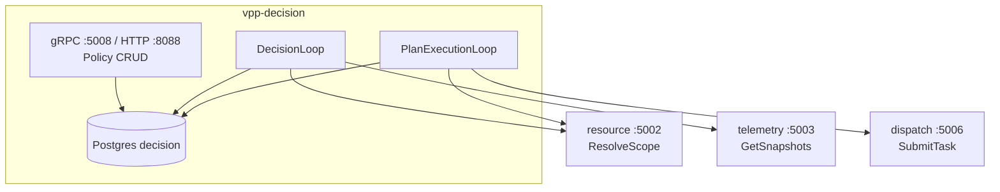

# vpp-decision

> 能力与架构简介。策略 API、决策循环和执行循环的装配见 `server.go` 与 [`config/decision.yaml`](../../config/decision.yaml)。

## 服务定位

Decision 负责“为了目标应如何控制”。Resource 回答有哪些资源、能力和约束；Telemetry 是运行值的权威源；Dispatch 执行具体命令，不理解 Site、Asset 或策略。

一条自动策略必须经过 Policy → Objective → Plan → PlanExecutionLoop。SOC 评估不直接生成 Dispatch 命令。人工即时命令仍直连 Dispatch。

gRPC `:5008` 提供 Policy CRUD、Enable、Disable。HTTP `:8088` 提供 `/healthz` 和同一套 RPC 的 grpc-gateway。不经 APISIX。metrics `:9108`。

## 功能特点

### 1. 范围来自 Resource，不拼目录

`ScopeResolver` 调用 `ResolveScope`。CU 返回自身，Asset 返回其 CU，Site 按 node path 展开嵌套 CU。SOC 策略只选择带 `energy.storage.v1` 的 CU；光伏等其它设备记为排除，不参与控制。启用时缺 spec、SOC 读绑定或有功设定写绑定，预检失败。

成功结果有短 TTL 缓存。Resource 暂时失败时，未超过最大年龄的副本可以沿用；过期则跳过该策略。执行命令前再次调用 Resource，不使用这份缓存授权下发。

### 2. 状态按批采集，质量不合格则整条跳过

`StateCollector` 对一个租户里参与聚合的 CU 调用一次 `GetSnapshots`。任一关键 metric 缺失、陈旧或质量不是 GOOD，整条 Policy 跳过，不做部分猜测。Asset 和 Site 的 SOC 按 `usable_energy_kwh` 加权，不用 Asset 的额定功率代替能量容量。

### 3. Objective、Plan、一次 Task 多条命令

命中阈值产生 scope 级 `PowerObjective`。`ImmediatePlanner` 只生成 `execute_at=now` 的一步，分配器把功率夹在能力与安全边界内，命令 metric 为 `electrical.active_power_setpoint.v1`。可行功率不足时计划为 `PARTIALLY_FEASIBLE`；可行功率为 0 则拒绝计划。

Objective、Plan、Step、Command 和 outbox 在同一事务写入。未落库的计划不能执行。`PlanExecutionLoop` 用数据库 claim/lease 领取到期步骤，复校 `resource_revision`，再向 Dispatch 提交一个包含 N 条并行命令的 Task。幂等键是 plan step。结果不确定时用同一键重试。

冷却键是 `(tenant_id, policy_id, direction)`，存在 Postgres。内存实现只留给单测。当前部署 `replicas: 1`，没有 leader election。

`ForecastProvider`、`Solver`、`ApprovalPolicy` 保留为端口。当前 SOC 路径不调用它们。

## 架构概览

## 与其它服务的关系

| 服务 | 关系 |
|------|------|
| **Resource** | 只调用 `ResolveScope`。不读 Resource 库，不调用 `GetAsset` |
| **Telemetry** | 批量 `GetSnapshots`。不使用 Resource Runtime 缓存 |
| **Dispatch** | 一个到期步骤一个 Task，`TriggerType=automatic`，带租户幂等键 |
| **Gateway** | 不直连。Simulator 的 canonical MetricID 由 Gateway 原样透传；厂商点名翻译不在本服务 |
| **Forecast** | 独立服务。`ForecastProvider` 本轮不接 |
| **Alarm** | 不直连。自动任务失败仍经 Dispatch `task.failed` 进入告警属性 |

Gateway 外部地址翻译和 Alarm canonical 规则记在 [`docs/DECISION_FOLLOWUPS.md`](../../docs/DECISION_FOLLOWUPS.md)。

## 当前阶段

本机 `make run-decision`。kind 为 ClusterIP（`replicas: 1`）。策略写在 `decision` 库，不写在 YAML。
