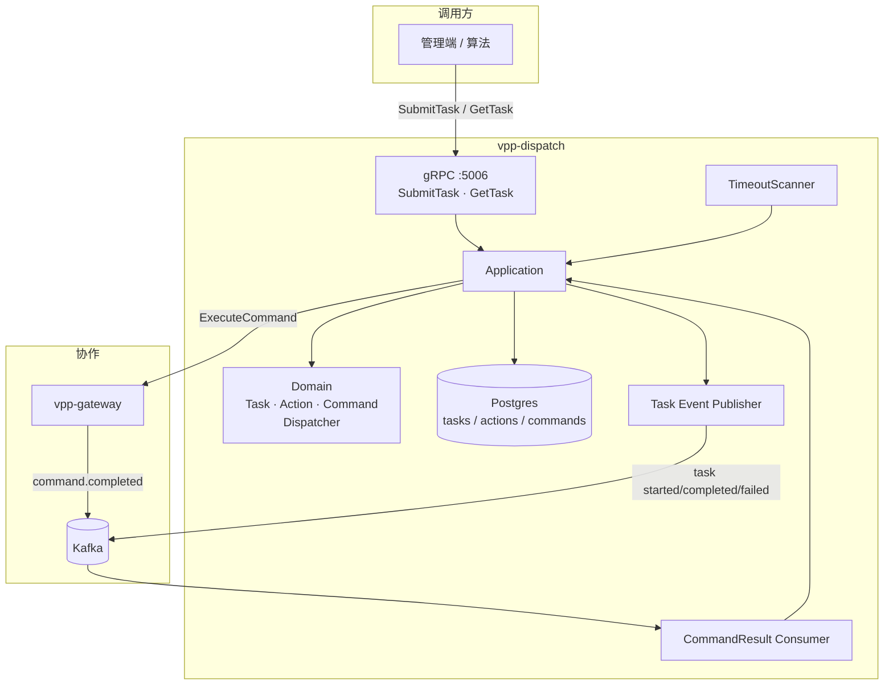
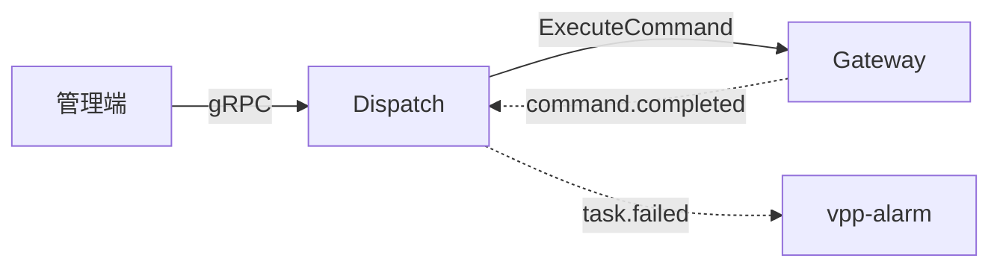

# vpp-dispatch

> 能力与架构简介。接口与联调见 [README.md](./README.md)。

## 服务定位

Dispatch 是控制任务的编排与执行引擎：把上层控制意图拆成可推进的状态机，经 Gateway 下发到设备侧，再根据命令结果继续下一步。

只认内部 `CUCode` + `PointKey`，不碰外部身份与协议。

## 功能特点

### 1. 三级聚合与状态机

```
DispatchTask
  └── DispatchAction（按 Sequence 串行）
        └── ControlCommand（Action 内按 ExecutionPolicy）
```

| 层级 | 关键状态 |
|------|----------|
| Task | pending → running → completed / failed / cancelled |
| Action | pending → running → completed / failed / cancelled |
| Command | pending → sending → succeeded / failed；timeout 可重试；熔断时 cancelled |

领域服务 `Dispatcher` 纯内存推进状态；Application 按变更结果精确写库（Task / Action / Command 三表分层）。

### 2. 顺控与并发

- **Action 之间**：严格按 `Sequence`，前一个完成后再启动下一个  
- **Action 之内**：
  - `sequential`：一条 Command 终态后才发下一条  
  - `parallel`：Pending 命令一次性进入下发队列，可同时处于 `Sending`，全部终态后 Action 完成  

### 3. 与 Gateway：同步受理 + 异步终态

```
Dispatch ──gRPC ExecuteCommand──▶ Gateway
                                      │
Dispatch ◀── Kafka command.completed ─┘
```

| 同步结果 | Dispatch 行为 |
|----------|----------------|
| `GatewayAccepted` | Command → `Sending`，等 Kafka 终态 |
| `GatewayRejected` / 传输错误 | 同步记失败，可触发熔断 |
| `GatewayCompleted` | 预留（同步已知成败）；当前客户端未用 |

`SubmitTask` 在第一批命令受理后即可返回 `running`；后续续发由 Kafka 回调或超时扫描驱动。关联键：`CommandID`。

### 4. 超时重试与 FailFast

- **TimeoutScanner**：扫描已过 `deadline` 的 `Sending` 命令  
  - 未超 `MaxRetries` → 回 `Pending` 再下发  
  - 耗尽 → 按失败处理  
- **FailFast**（v1 固定）：任一命令失败 → 取消剩余 Pending → Task `Failed`  
  - 不做自动反向补偿  

Kafka 回调对已终态命令幂等忽略（适配 at-least-once）。

## 架构概览



主路径：

```
SubmitTask → 持久化 → 下发首批命令
       → GatewayAccepted（Sending）
       → command.completed → 推进 / 续发
       → Task Completed | Failed
```

## 与其它服务的关系



| 服务 | 关系 |
|------|------|
| **Gateway** | 唯一出站控制通道；受理走 gRPC，成功终态走 Kafka |
| **Resource / Telemetry / Simulator** | 不直连；设备与映射由 Gateway 侧消化 |
| **Alarm** | 消费 `task.failed` 开单；不消费 started / completed |
