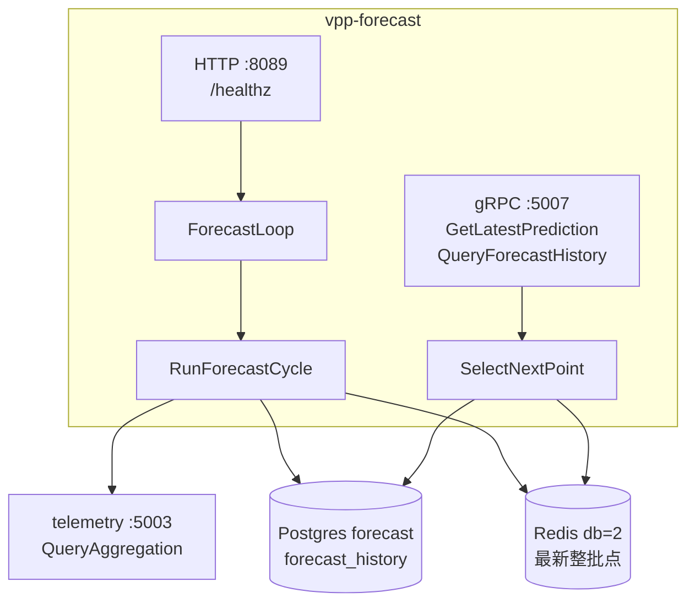
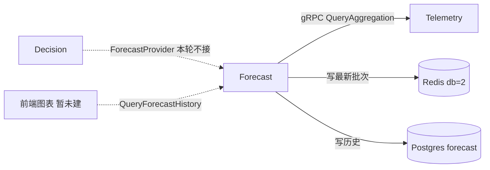

# vpp-forecast

> 能力与架构简介。批算循环、选点、指标与启动见 [README.md](./README.md)。

## 服务定位

Forecast 是内部批算服务：主动拉 Telemetry 历史，用朴素算法预测资产出力/负荷，写入 Redis（最新一批）和 Postgres（权威历史），再用只读 gRPC 对外提供"下一步预测"和"预测历史"。

v1 **没有真实调用方**（Decision 的 `ForecastProvider` 仍是 stub，前端对比图也还没有）。产出是把预测能力和数据形状先做对。不经 APISIX；gRPC `:5007` 原生暴露，HTTP `:8089` 仅 `/healthz`。

## 功能特点

### 1. 批算循环，不是请求驱动写入

```
ticker（默认 15m，对齐 Telemetry 15 分钟视图）
    → QueryAggregation
    → Predictor.Predict
    → Postgres SaveBatch
    → Redis SetLatestBatch（整批 horizon 点）
```

失败记日志、不中断循环。`targets` 为空时 loop 空转，进程仍能起来。没有写 RPC：唯一的预测产出者是自己的循环。

### 2. GetLatestPrediction 现算"下一步"

缓存的是整批点，不是写入时刻的第一个点。读取时 Redis 命中和 Postgres 回退都跑 `SelectNextPoint`：`target_timestamp >= now` 的最小一条。整批已过期或从未算过 → `NOT_FOUND`。

### 3. Predictor 是可替换边界

v1 注册 `moving_average` / `same_period_prior`。Phase D 用真实小模型替换时，不改 gRPC、不改 `forecast_history` 形状。

## 架构概览



进程内 errgroup：gRPC、ForecastLoop、HTTP `/healthz`、metrics `:9109`。

## 与其它服务的关系



| 服务 | 关系 |
|------|------|
| **Telemetry** | 直连 `QueryAggregation`（AVG + LAST）。只认 `(TenantID, CUCode, MetricName)`，不查 Resource |
| **Resource / Dispatch / Gateway** | 不调用 |
| **Decision** | **本轮不接**。那边 `ForecastProvider` 仍是 stub；接线是独立后续工作 |
| **管理端 / APISIX** | v1 不挂北向。联调 `kubectl -n vpp port-forward svc/forecast 5007:5007` |

## 当前阶段

**v1 已具备：** ForecastLoop、两种朴素算法、Redis 整批缓存 + Postgres 历史、只读 gRPC、Prometheus 指标、kind ClusterIP（`replicas: 1`）、CI 镜像。

**刻意未做：** 接 Decision、电价/天气预测、写 RPC、APISIX、retention、多副本。本机 `make run-forecast` / `make run-all`。默认 `targets` 为空，填上才会真正批算。
