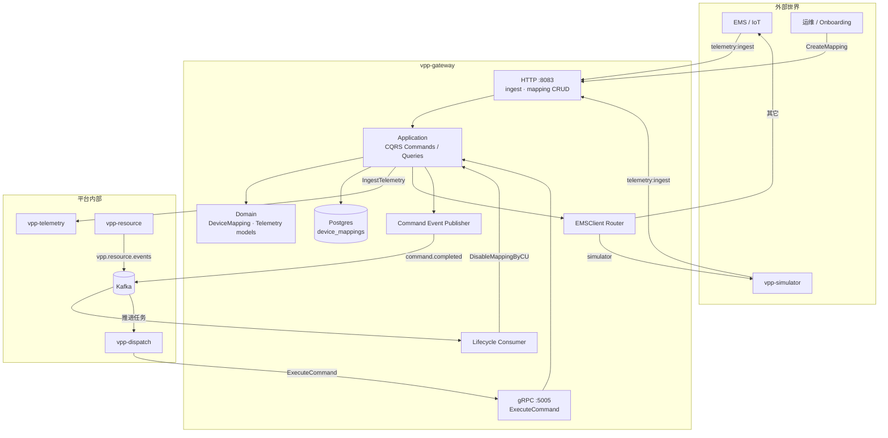
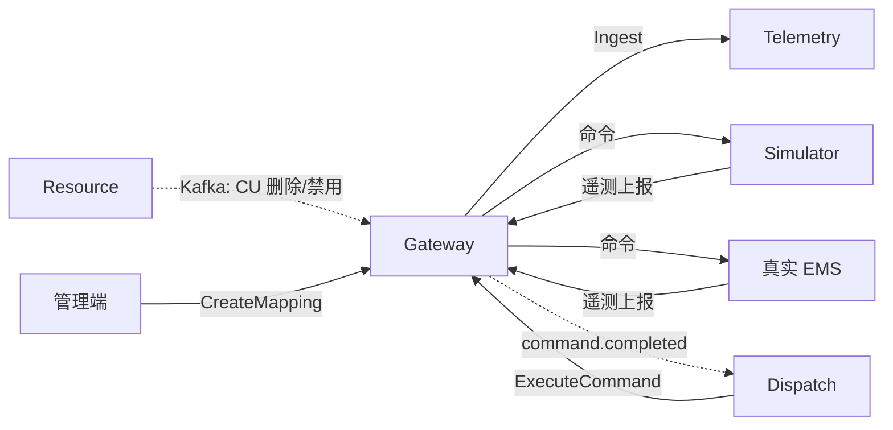

## 服务定位

gateway 是一个协议集成网关，作为对外的出入口，屏蔽外部系统细节，保持内部业务系统不被外部污染，实现**入站归一，出站适配**。

核心价值：**让平台内部保持干净的领域模型，把外部系统的多样性收敛到一处。**

## 功能特点

1. 设备映射
  通过 DeviceMapping将外部系统资源映射到内部资源服务维护的资产。
  ```
   ┌─────────────────────────────────────────────────────────────┐
   │  Inbound Adapters（把外部世界变成 ExternalTelemetry / Command）│
   │  · HTTP push（已有）                                         │
   │  · MQTT subscriber（未来）                                   │
   │  · Poller / 主动拉取（未来）                                  │
   │  · IEC104 / Modbus 会话进程（未来，或旁路 agent）              │
   └──────────────────────────┬──────────────────────────────────┘
                              │ 调用 Application
   ┌──────────────────────────▼──────────────────────────────────┐
   │  Application（稳定）                                         │
   │  ReceiveTelemetry / ExecuteCommand / Mapping CRUD            │
   └──────────────────────────┬──────────────────────────────────┘
                              │ 调用 Port
   ┌──────────────────────────▼──────────────────────────────────┐
   │  Outbound Adapters（实现 Port）                               │
   │  · TelemetryClient（已有 gRPC）                               │
   │  · EMSClient：simulator / ems_log / 未来 ems_xxx（命令出站）   │
   │  · CommandEventPublisher（已有 Kafka）                        │
   └─────────────────────────────────────────────────────────────┘
  ```
2. 双向通道
  ```
  部系统 / Simulator                内部服务
  ────────────────                  ────────
  TTP telemetry:ingest  ──▶ Gateway ──gRPC──▶ Telemetry
                               ▲
  ispatch ──gRPC ExecuteCommand─┘
                               │
                               └── HTTP/适配器 ──▶ 外部系统 / Simulator
                               └── Kafka command.completed ──▶ Dispatch
  ```

- **入站遥测进入（南向→北向）**：外部格式 → 查映射 → `StandardTelemetry` → Telemetry  
- **出站下发控制（北向→南向）**：内部控制 → 反查映射 → `EMSClient.SendCommand` → 外部

1. 可插拔适配器
  协议差异消解在 Adapter；业务边界消解在 Application/Domain。
2. 与 Dispatch 的「同步受理 + 异步终态」
  为了防止命令下发被阻塞，gateway 到dispatch 服务的部分结果返回被设计为异步返回：  
   GatewayAccepted   // 网关已受理，终态走 Kafka
   GatewayCompleted  // 同步就知道成败（预留，当前 gRPC client 几乎不用）
   GatewayRejected   // 网关当场拒绝，同步失败，不依赖 Kafka
   如果命令下发执行时间较长，gateway 立即返回GatewayAccepted，不会阻碍dispatch 服务，等待外部执行完毕将结果发送到kafka
3. 生命周期解耦：显示创建，自动删除
  与 Resource 的关系刻意做成**非对称**：


| 事件         | Gateway 行为                                                 |
| ---------- | ---------------------------------------------------------- |
| CU 删除 / 禁用 | 消费 `vpp.resource.events` → 按 CUCode **自动 disable** mapping |
| CU 创建      | **不**自动建 mapping                                           |


   原因：创建 Mapping 需要 `ExternalSystem` / `ExternalID`，这些在 CU 创建当下往往还不知道。Onboarding 由管理端显式 `CreateCU` + `CreateMapping`；Resource 与 Gateway **互不调用、互不知情**。 

## 架构概览




## 与其它服务的关系




