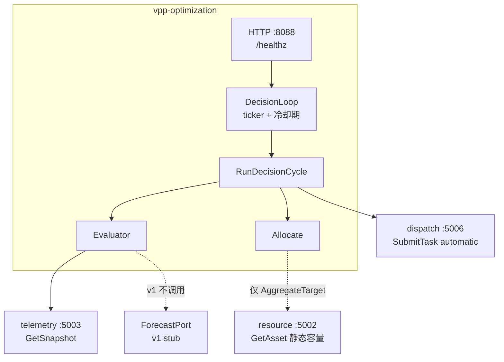
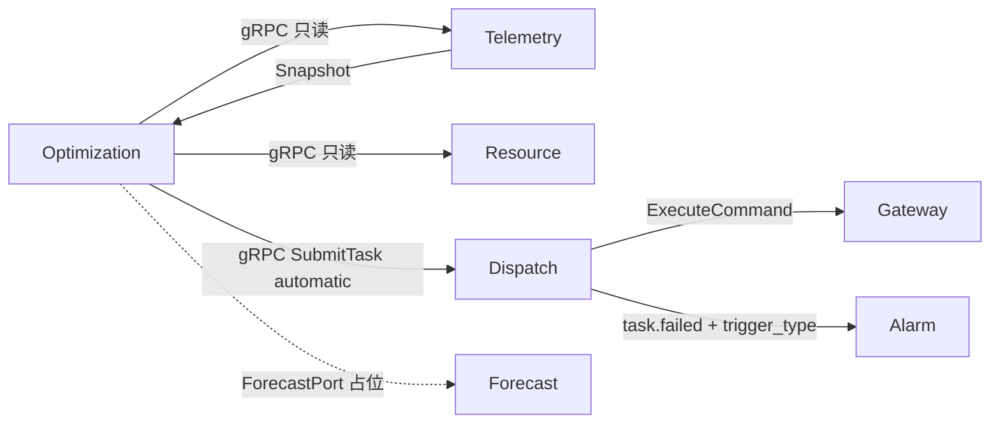

# vpp-optimization

> 能力与架构简介。规则、冷却期、指标与启动见 [README.md](./README.md)。

## 服务定位

Optimization 是内部闭环决策服务：按固定周期读当前状态，用阈值规则决定要不要动、动多少，再经 Dispatch 下发。

v1 **没有入站业务 API**（无人/服务主动调用它）。进程只暴露 `GET /healthz` 和 `/metrics`。三条依赖全部是 Optimization 主动发起的内部直连 gRPC，不经 APISIX。

## 功能特点

### 1. 决策循环，不是请求驱动

```
ticker（默认 60s，必须 > Telemetry 采集周期 30s）
    → Evaluate（Telemetry GetSnapshot + 阈值规则 + 冷却期）
    → Allocate（PointTarget 1:1；AggregateTarget 按额定容量分摊）
    → Dispatch SubmitTask（TriggerType=automatic）
```

失败记日志、不中断循环。租户列表或规则为空时 loop 空转，进程仍能起来。

### 2. Target / Allocate 把"要什么"和"怎么下发"拆开

| 类型 | 谁产出 | Allocate |
|------|--------|----------|
| `PointTarget` | v1 规则引擎（已算好 CU / Point / 值） | 1:1 `CommandSpec` |
| `AggregateTarget` | 外部粗粒度目标（Market / 需求响应，尚未存在） | `splitByCapacity` 按 `RatedCapacityKW` 比例分摊 |

v1 产线只走 `PointTarget`。`AggregateTarget` 已实现并单测，不接真实调用方。

### 3. Forecast 只占位

`ForecastPort.GetLatestPrediction` 的唯一实现是 `forecast_stub`，恒返回 `ErrNotImplemented`。v1 规则**不调用**它。指标序列已种上，等 Forecast 服务落地再接线。

## 架构概览



进程内 errgroup：decision loop、HTTP `/healthz`、metrics `:9108`。

## 与其它服务的关系



| 服务 | 关系 |
|------|------|
| **Telemetry** | 直连 `GetSnapshot`。**绕开** Resource 三级 Runtime 缓存（写路径为空，且决策不能忍受轮询滞后） |
| **Resource** | 直连静态配置（`RatedCapacityKW`）。v1 规则不用；`splitByCapacity` 才读 |
| **Dispatch** | `SubmitTask`，`TriggerType=automatic`；一条 Target 一个 Task，Action `parallel` |
| **Alarm** | 不直连。失败任务经 `vpp.dispatch.events` 的 `trigger_type` 进入工单属性，fingerprint 不变 |
| **Gateway / Simulator** | 不直连；执行仍走 Dispatch → Gateway |
| **Forecast** | 接口 + stub，无真实算法 |
| **管理端** | 不调 Optimization；人工任务仍直连 Dispatch |

## 当前阶段

**v1 已具备：** DecisionLoop、SOC 阈值规则（YAML）、冷却期、三条 outbound gRPC + 熔断默认开、Dispatch `SubmitTask` 限流、Prometheus 指标、`TriggerType` 透传到 alarm 属性、kind ClusterIP、CI 镜像。

**刻意未做：** 真实 Forecast、`AggregateTarget` 产线调用方、多级任务分解、入站业务 API、Redis 冷却态。本机 `make run-optimization` / `make run-all`；kind 为 ClusterIP（`replicas: 1`）。默认 `tenant-ids` / `soc-thresholds` 为空，填上才会真正决策。
