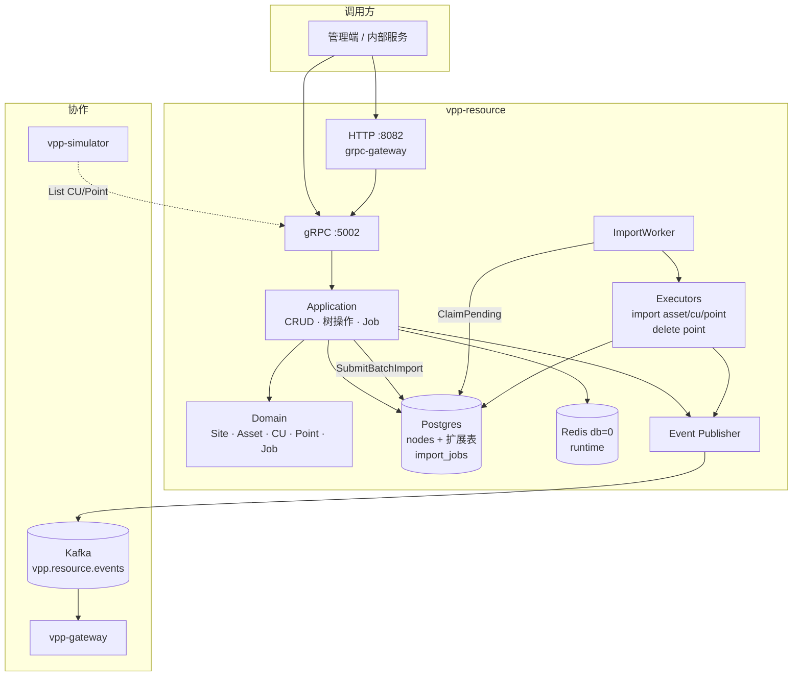
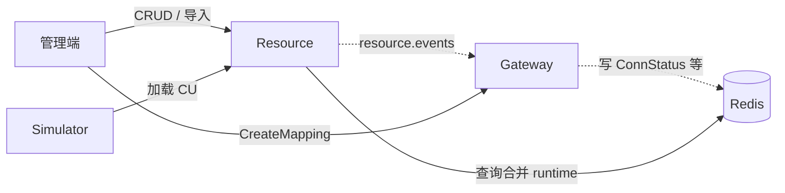

# vpp-resource

> 能力与架构简介。接口与联调见 [README.md](./README.md)。

## 服务定位

Resource 是 VPP 内部资产树的权威：维护 Site → Asset → CU → Point，提供 CRUD / 树操作 / 生命周期，并通过异步任务支持大批量导入。

`CU` 的 UUID 即全平台 `CUCode`（Gateway Mapping、Dispatch 下发、Simulator 加载均对齐此约定）。

## 功能特点

### 1. 四级资源树

```
Site
 └── Asset
      └── CU
           └── Point
```

- 公共树结构落在 `nodes`（路径、深度、生命周期、软删）；各类型扩展表以 `node_id` 关联  
- 支持创建 / 更新 / 删除 / 移动 / 重命名 / 面包屑 / 子树导出  
- 生命周期：`active` / `inactive` / `decommissioned`；变更可发 Kafka 事件  

### 2. 运行时状态外置

连接状态、功率、点值等**不进资源主库**：Gateway / Telemetry 写入 Redis（db=0），Resource 查询时合并返回。配置与运行时分离。

### 3. 异步批量导入（重点）

单条 CRUD 同步完成；大批量 Asset / CU / Point 走 **提交即返回 + 后台 Worker 执行**，避免阻塞 API。

#### 总体流程

```
客户端                Resource API              import_jobs              ImportWorker
  │  SubmitBatchImport      │                       │                         │
  │────────────────────────▶│ 校验条目               │                         │
  │                         │ 写 Job(pending)       │                         │
  │◀──── JobID ─────────────│──────────────────────▶│                         │
  │                         │                       │  轮询 ClaimPending       │
  │  GetJob（查进度）        │◀──────────────────────│◀── FOR UPDATE SKIP LOCKED
  │────────────────────────▶│                       │     running + 执行       │
  │                         │                       │     分片写入 / 更新进度   │
  │                         │                       │     success / failed     │
```

#### 提交阶段（同步）

`SubmitBatchImport` 一次只提交一种目标（Asset / CU / Point，proto oneof）：

1. **逐条校验** payload；不合法条目进入 `FailedItems`  
2. 若有校验失败 → **不建 Job**，同步返回错误与失败明细  
3. 全部合法 → 落库 `import_jobs`（`pending`），返回 `JobID`  

请求里的 `BatchSize` 写入 payload，控制执行期每批写入条数（默认约 100）。

#### 执行阶段（异步）

进程内 **ImportWorker**（单 goroutine，默认约 5s 轮询）：

1. `ClaimPending`：原子认领一条可执行任务（`SELECT … FOR UPDATE SKIP LOCKED`）  
   - 多副本下同一 Job 只会被一个实例抢走，无需 Redis 分布式锁  
   - 可认领：`pending` 且 `next_retry_at` 已到（或为空）；或长时间卡住的 `running`（崩溃回收）  
2. 按 `JobKind(operation, target)` 从 **ExecutorRegistry** 取执行器  
3. Executor：反序列化 payload → **按 BatchSize 分片写库** → 每片后 `UpdateProgress` 落库（`GetJob` 可见中间进度）  
4. 成功 → `Complete`（`result_json` 含创建 ID 等）；失败 → 对已写入分片做 **补偿删除** 后 `Fail`（错误信息入库），现有 `RetryJob` 可安全重跑，无需新接口  

当前已注册：

| Operation | Target | Executor |
|-----------|--------|----------|
| `import` | `asset` / `cu` / `point` | 批量创建 |
| `delete` | `point` | 批量软删 |

导入完成会尽力发 `import.completed` 类资源事件（失败不阻断 Job 成功落库）。

#### 状态与重试

```
pending → running → success
                  ↘ failed
```

| 项 | 行为 |
|----|------|
| 进度字段 | `total` / `succeeded` / `failed_count`；执行中可更新 |
| `MaxAttempts` | 默认 3；认领时 `attempts++` |
| 失败后 | 状态 `failed`；`RetryJob` 将任务 `ResetForRetry` → `pending`，由 Worker 再次认领 |
| 卡住任务 | `running` 超时未结束可被其他/本实例重新认领 |

客户端侧：提交后轮询 `GetJob`，或依赖后续事件；失败时调 `RetryJob`（在未超次数时）。

#### 设计取舍（为何这样）

- **API 与重活解耦**：大批量不拖垮 gRPC/HTTP 超时  
- **单 Worker + 行锁**：MVP 规模够用，多节点安全，避免进程内并发池复杂度  
- **分片写入**：控制单次事务/内存；进度可观测  
- **校验前置**：明显脏数据不同步进队列  

### 4. 生命周期事件（对 Gateway）

向 `vpp.resource.events` 发布资源变更。与 Gateway 约定为**非对称**：

| 事件 | Gateway |
|------|---------|
| CU 删除 / 禁用等 | 可自动 disable mapping |
| CU 创建 | **不**自动建 mapping（需管理端显式 `CreateMapping`） |

## 架构概览



## 与其它服务的关系



| 服务 | 关系 |
|------|------|
| **Gateway** | 消费生命周期事件清理 mapping；Onboarding 与 Resource 分步、互不 RPC |
| **Simulator** | 只读拉取 `provider=simulator` 的 CU/Point 作为虚拟设备配置 |
| **Telemetry / Dispatch** | 不直连 Resource；通过 CUCode 间接对齐资产身份 |
| **Redis** | 运行时热数据；Resource 读、Gateway 等写 |
