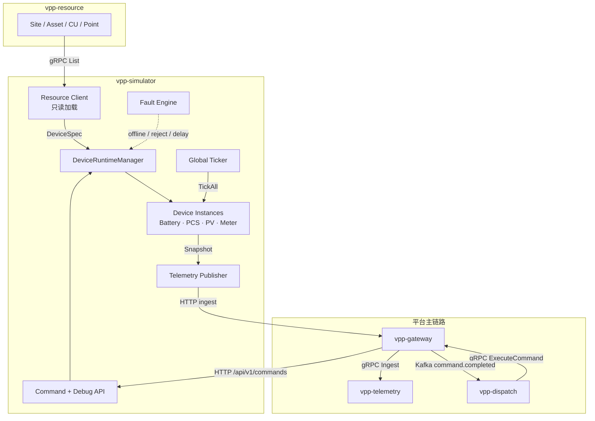
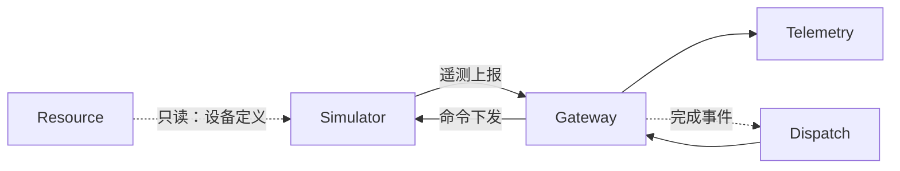

# vpp-simulator：虚拟设备运行时

> 面向团队的能力与架构介绍（非运维手册）。  
> 细节联调见 [TESTING.md](./TESTING.md)，接口与配置见 [README.md](./README.md)。

---

## 一句话定位

**Simulator 是长期运行的「虚拟设备运行时」**——在没有真实 EMS / 现场设备时，为 VPP 平台提供可重复、可观测、可注入故障的闭环环境。

它扮演 Gateway 侧的外部系统（`ExternalSystem = "simulator"`），持续产生自然演化的遥测，并真实响应控制命令。  
不是 Mock API，也不是一次性脚本，而是一组**有内部状态机的活设备**。

---

## 解决什么问题

| 没有 Simulator 时 | 有了 Simulator 之后 |
|------------------|---------------------|
| 依赖真实 EMS / 硬件才能联调 | 本地即可跑通完整业务闭环 |
| 遥测与控制难以复现 | 状态可重置、场景可重复 |
| 异常路径难构造 | 故障可按设备注入 |
| Dispatch / Gateway / Telemetry 割裂验证 | 一条链路从「下发」到「反馈」打通 |

核心价值：**让 Resource → Gateway → Telemetry → Dispatch 在真实协议路径上闭环运转**，而不是各服务各自 Mock。

---

## 功能亮点

### 1. 状态驱动的设备运行时

设备是内存中的活跃对象，而非数据库行。每个 CU 实现统一契约：

- `Tick(delta)` — 随时间自然演化（SOC 变化、功率波动、日出力曲线等）
- `Execute(pointKey, value)` — 响应控制点写入
- `Snapshot()` — 按 Resource 声明的 Point 输出遥测

内置类型：`Battery` / `PCS` / `PV` / `Meter`；未知类型走 `Passthrough`，仍可读写与轻量扰动。

### 2. Resource 为配置权威

Simulator **不自建设备目录**。启动（或 reload）时从 Resource 只读拉取 Site → Asset → CU → Point，按 `Provider == simulator`（可配置）过滤后实例化。

好处：资源模型改一处，模拟侧跟着变，避免「平台有一套 CU、模拟器另有一套」的配置漂移。

### 3. 完整业务闭环（非旁路）

遥测走 Gateway 的 ingest，控制走 Gateway 的 ExecuteCommand → 出站适配器，与真实 EMS 路径同构：

```
Resource ──List──▶ Simulator ──telemetry:ingest──▶ Gateway ──▶ Telemetry
                         ▲                            │
                         │                     Kafka command.completed
                         │                            ▼
                   命令 HTTP � Kafka command.completed
                         │                            ▼
                   命令 HTTP ◀── Gateway ◀── Dispatch
```

Dispatch **无需感知** Simulator 的存在——它只和 Gateway 对话；是否打到模拟设备，由 Gateway 的 `DeviceMapping.ExternalSystem` 决定。

### 4. 故障注入：把异常变成一等公民

Debug API 可按设备注入：

| 故障 | 效果 |
|------|------|
| `offline` | 设备离线，停 Tick / 拒命令 / 不上报 |
| `command_reject` | 命令被拒绝（验证 Dispatch / Gateway 失败路径） |
| `telemetry_delay` | 上报人为延迟（验证超时与时序） |
| `clear` | 清除该设备故障 |

适合演示「链路正常」与「设备侧异常」两套故事，而无需改生产代码或拔线。

### 5. 可观测与可干预

- **Debug API**：查看全部/单设备实时状态、本地注入命令、reset / reload
- **Prometheus metrics** + **OpenTelemetry tracing**：与其它微服务同一套可观测体系
- **可选关闭上报**（只 Tick、不写 Telemetry），方便纯运行时调试

### 6. 协议中立的「外部系统」角色

命名刻意使用 `simulator` 而非 `ems_*`：它模拟的是 Gateway 对面的任意外部系统 / CU，不假定对方一定是 EMS。Gateway 侧用 `Router` 按 `ExternalSystem` 分流——`simulator` 走 HTTP 适配器，其它仍走 `ems_log`（或后续真实适配器）。

---

## 架构概览



### 内部层次（职责清晰）

| 层次 | 职责 |
|------|------|
| **Runtime Manager** | 持有全部 Device，统一 Tick / Execute / 摘要查询 |
| **Device** | 类型相关物理/业务行为（储能 SOC、光伏日曲线等） |
| **Telemetry Publisher** | 快照 → Gateway ingest（尊重 offline / delay） |
| **Fault Engine** | 横切故障状态，不污染设备模型本身 |
| **HTTP API** | Gateway 命令入站 + 运维/调试面 |

**刻意不做的事**：资源 CRUD、协议/ID 映射、时序存储、任务编排——这些分别属于 Resource / Gateway / Telemetry / Dispatch。

---

## 与其它服务的关系



### Resource — 配置源（只读）

- Simulator 启动时遍历资源树，过滤可模拟 CU，用 Point 作为遥测/控制模板。
- `Snapshot()` **只输出 Resource 已声明的 PointKey**，保证模拟数据与平台点表一致。
- Onboarding 约定：Resource 创建 `provider=simulator` 的 CU → Gateway 建 `external_system=simulator` 的 Mapping → Simulator 加载后自动 Tick。

### Gateway — 唯一双向对接面

- **入站（对 Simulator）**：Gateway 将控制命令 HTTP POST 到 Simulator `/api/v1/commands`。
- **出站（对 Gateway）**：Simulator 调用 Gateway 的 telemetry ingest，由 Gateway 再写入 Telemetry。
- ID 映射、租户、协议边界都在 Gateway；Simulator 只认 `external_id` + `point_key`。

### Telemetry — 间接消费方

- Simulator **不直连** Telemetry 写库。
- 时序是否落库、查询与聚合，对 Simulator 透明；联调时可通过 Telemetry 查询验证「模拟设备是否真的在产生数据」。

### Dispatch — 完全透明

- Dispatch 编排任务、下发 Action/Command、消费 `command.completed`。
- 只要 Mapping 指向 `simulator`，同一套任务引擎就能驱动虚拟设备并收到结果——**无需为模拟环境改 Dispatch 代码**。

### 在平台中的位置（一句话）

> **Resource 定义「有什么设备」；Simulator 定义「设备此刻怎么跑」；Gateway 负责「内外身份与通道」；Telemetry 负责「记下来」；Dispatch 负责「让它去做」。**

---

## 设计原则（为什么这样建）

1. **Runtime 第一** — 设备是状态机，不是 CRUD 记录。
2. **配置外置到 Resource** — 单一真相源，消灭双份台账。
3. **自然行为 + 可控干预** — 默认像真设备；需要时 Debug / Fault 介入。
4. **最小化持久化** — Phase 1 以内存为主；重启可 reload，演示场景可 reset。
5. **服务自治** — 只回答「设备正在如何运行」，不越权到资源/映射/调度/存储。
6. **与真实路径同构** — 模拟走 Gateway，保证测到的是真链路，不是测试替身。

---

## 当前阶段与边界

**Phase 1（已具备）**

- 从 Resource 加载 → Tick 演化 → Gateway 上报 → 命令回写 → Debug / 故障注入
- Gateway `adapter/outbound/simulator` 路由

**刻意未做（Phase 2 方向）**

- Scenario Engine（脚本化场景编排）
- 经 Kafka 动态增删设备
- 多协议出站（如 MQTT）作为模拟侧能力

这些不影响「今天就能用 Simulator 做闭环演示与回归」——Phase 1 已经覆盖主路径与主要异常路径。

---

## 适合用来讲的故事（演示角度）

1. **幸福路径**：seed 资源与 mapping → Simulator Tick → Telemetry 能查到功率/SOC → Dispatch 下发功率设定 → 下一拍遥测反映设定。
2. **异常路径**：对某 CU 注入 `offline` 或 `command_reject` → 展示 Gateway / Dispatch 的失败与超时行为。
3. **模型一致性**：在 Resource 增删 Point / 改 CU → Simulator reload → 上报点表随之变化。

---

## 小结

Simulator 让团队在**没有现场设备**的前提下，仍能：

- 用**真实服务边界**验证闭环；
- 用**有物理语义的状态机**产生可信遥测；
- 用**故障注入**覆盖异常故事；
- 让 Dispatch / Gateway / Telemetry / Resource 的协作可被反复演示与回归。

它是开发沙箱、联调底座，也是对外演示「虚拟电厂在软件侧如何跑起来」的活标本。
