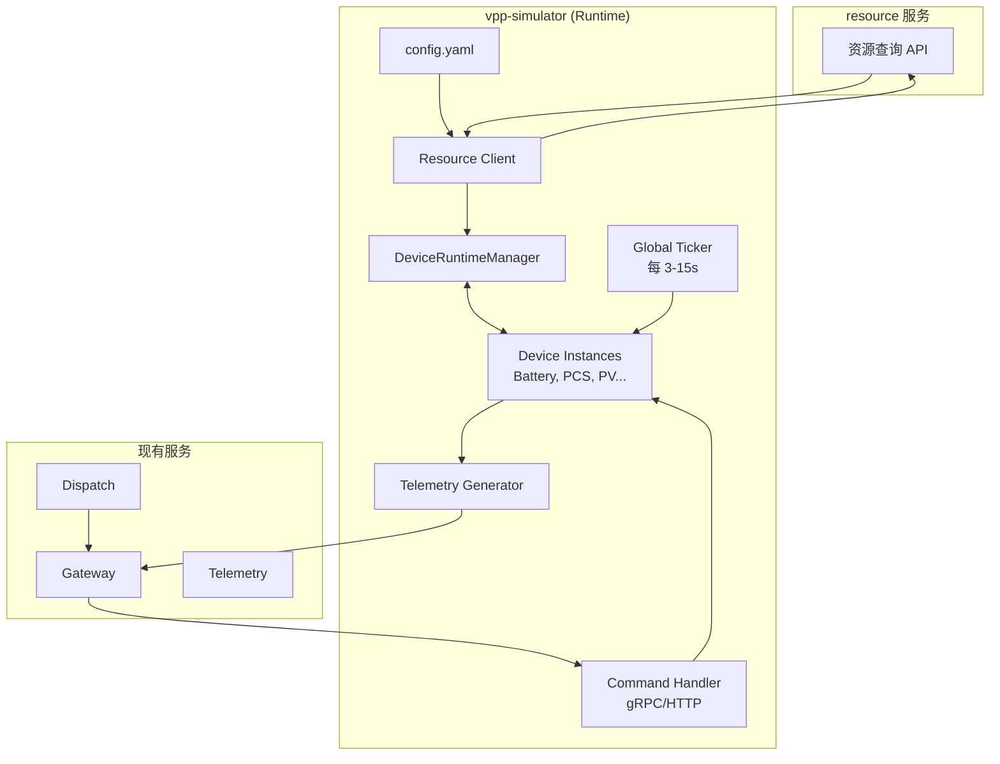

**vpp-simulator 服务项目方案**

### **1. 项目定位与目的**

**vpp-simulator** 是一个**长期运行的虚拟电站运行时（Virtual Power Plant Runtime）**，用于在没有真实设备和外部 EMS 的情况下，为整个 VPP 平台提供**真实可信的闭环测试与演示环境**。

其核心价值是：

- 实现 **Simulator → Gateway → Telemetry → Dispatch → Gateway → Simulator** 的完整业务闭环。
- 为单人原型开发提供稳定、可重复的测试沙箱。
- 作为“活的”设备实例，持续产生自然变化的遥测数据，并真实响应控制命令。
- 长期作为开发、调试、演示和回归测试的核心依赖。

**Simulator 不是**：Mock API、设备数据库、一次性测试工具。  
**Simulator 是**：一个持续运行的、具有内部状态机的虚拟设备运行时。

---

### **2. 核心设计原则**

1. **Runtime 第一，状态驱动**  
   设备是内存中的活跃 Go 对象（struct），拥有自己的 `Tick()` 生命周期，而非数据库记录。

2. **Resource 是配置权威**  
   Simulator 自身不维护设备定义（CUCode、类型、基础属性）。启动时从 Resource 服务查询可模拟设备，实例化对应的 Runtime 对象。避免配置漂移。

3. **自然行为 + 可控性**  
   设备状态随时间自然演化（SOC 缓慢变化、功率波动、随机事件），同时支持手动注入命令和参数调整。

4. **最小化持久化**  
   第一版以内存为主，可选 Redis 做快照/恢复。数据库不是核心。

5. **协议中立**  
   内部使用统一命令/遥测模型，对外模拟多种协议（优先 HTTP + gRPC，后续支持 MQTT 等）。

6. **可观测 & 可调试**  
   所有设备状态实时可见，支持手动干预，完整接入 OpenTelemetry。

7. **服务自治**  
   符合现有架构：Simulator 只负责“设备正在如何运行”，不承担资源管理、协议转换、任务调度等职责。

---

### **3. 整体架构**



---

### **4. 关键组件详解**

#### **4.1 Device Runtime（设备运行时）**

- 核心抽象：`Device` 接口
  - `Tick(delta time.Duration)`
  - `HandleCommand(cmd *proto.ControlCommand) *CommandResult`
  - `GetTelemetry() *proto.TelemetryData`
  - `GetState() DeviceState`
- 具体实现：`Battery`、`PCS`、`PV`、`Load`、`Meter`、`Breaker` 等。
- 每个实例持有独立状态（SOC、Power、Voltage 等），并在 Tick 中自主演化。

#### **4.2 DeviceRuntimeManager（运行时管理器）**

- 维护 `map[string]Device`（key = CUCode）。
- 负责全局 Tick 循环。
- 设备注册、注销、状态快照。
- 支持动态添加/移除设备（后续）。

#### **4.3 Telemetry Generator**

- 从各 Device 获取当前状态，组装成符合 telemetry 服务要求的遥测数据。
- 支持周期上报 + 事件驱动（SOE 变位）。
- 上报路径：优先通过 Gateway 的 Ingest 接口。

#### **4.4 Command Handler**

- 实现 Gateway 期望的 `ExecuteCommand` 接口（gRPC 推荐）。
- 根据 CUCode 路由到对应 Device 执行。
- 支持模拟执行延迟、成功/失败场景、部分执行等。

#### **4.5 配置与初始化**

- `config.yaml`：模拟参数（tick 间隔、波动幅度、默认设备列表等）。
- 启动时：
  1. 加载配置。
  2. 调用 Resource 查询 simulatable 的 CU。
  3. 实例化对应 Device 对象并注册到 Manager。
  4. 启动 Ticker 和 Command Server。

---

### **5. 数据流**

**启动同步流**：
Resource → Simulator（查询 CU） → 创建 Device Runtime 对象

**运行时主循环**：
Ticker → Device.Tick() → 更新内存状态 → Telemetry Generator → Gateway/Telemetry

**控制流**：
Dispatch → Gateway → Simulator.CommandHandler → Device.HandleCommand() → 更新状态 → 后续遥测反馈

**查询流**：
管理端 / 测试工具 → Simulator HTTP API → 查询设备实时状态

---

### **6. 与现有服务集成**

- **Resource**：启动时只读查询（ListCU / GetCU with filter）。
- **Gateway**：双向集成
  - Simulator 作为一种 ExternalSystem（`simulator`）。
  - 实现 `ExecuteCommand`。
  - 主动调用 `IngestTelemetry`。
- **Telemetry**：间接通过 Gateway，或直接生产 SOE 事件。
- **Dispatch**：完全透明，无需感知 Simulator 存在。
- **Consul / Prometheus / Jaeger**：与其他服务一致接入。

---

### **7. 技术栈与项目结构**

**技术栈**：

- Go（与现有服务保持一致）
- gRPC + HTTP（grpc-gateway）
- Viper（配置）
- OpenTelemetry + Prometheus
- Docker + docker-compose
- 可选：Redis（状态快照）、MQTT 库

**推荐目录结构**：

```
vpp-simulator/
├── cmd/simulator/main.go
├── internal/
│   ├── config/
│   ├── runtime/
│   ├── device/          # 各设备具体实现
│   ├── telemetry/
│   ├── command/
```