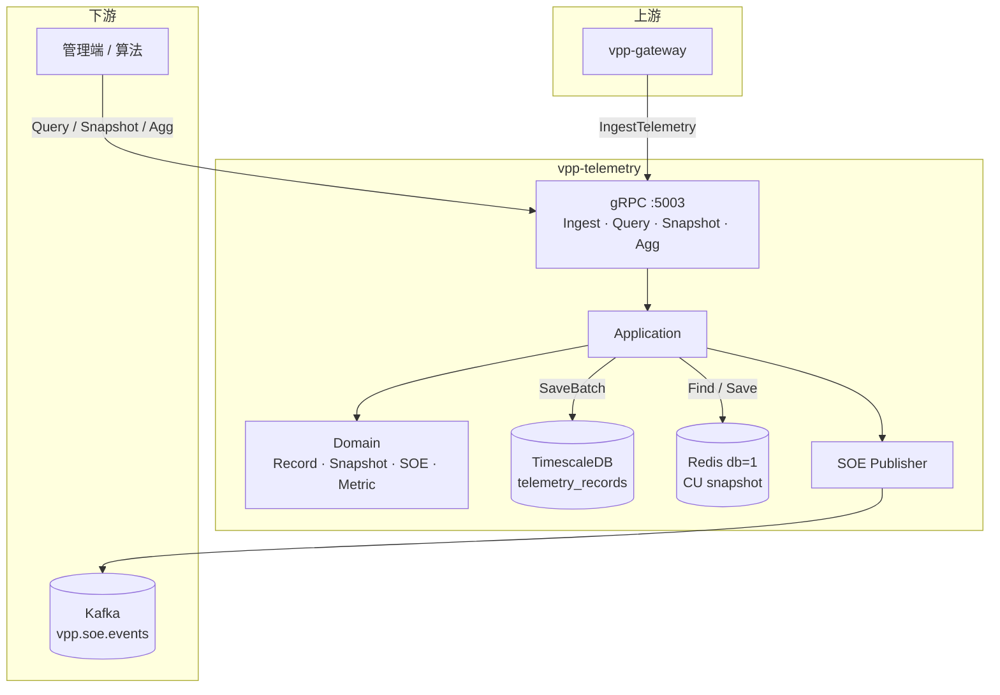
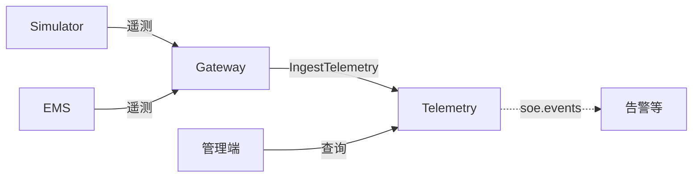

# vpp-telemetry

> 能力与架构简介。接口与联调见 [README.md](./README.md)。

## 服务定位

Telemetry 是时序遥测服务：接收已归一到内部身份的量测数据，写入时序库，维护 CU 实时快照，并在离散量变位时发出 SOE 事件。

只认 `(TenantID, CUCode)`，不查 Resource、不做外部 ID 映射（由 Gateway 完成后再调用本服务）。

## 功能特点

### 1. 写入：时序 + 快照 + SOE

一次 `IngestTelemetry` = 一台 CU、一个时间戳、一组指标。

```
Ingest
  → TimescaleDB 持久化（硬门槛：失败则整次失败，调用方可重试）
  → Redis 快照 Apply（读失败则空基线；写失败只告警，不回滚时序）
  → 离散量变位 → SOE（best-effort 发 Kafka，失败不回滚）
```

| 存储 | 角色 |
|------|------|
| **TimescaleDB** | 历史原始样本（窄表：一行一指标）；权威持久化 |
| **Redis db=1** | 每 CU 最新好质量测点快照；仪表盘 / 实时态 O(1) 读 |
| **Kafka `vpp.soe.events`** | 离散量跳变事件；未配 brokers 时降级丢弃 |

快照规则：仅 `QualityGood` 覆盖旧值；`DISCRETE` 值变化才产 SOE，`ANALOG` 只更新数值。

### 2. 查询

| 能力 | 说明 |
|------|------|
| **原始查询** | 按租户 / CU / 指标 / 时间窗查历史（窗口上限约 30 天） |
| **单 CU 快照** | Redis 当前态 |
| **舰队快照** | 租户下多 CU 当前态 |
| **聚合查询** | 降采样（AVG/MAX/MIN/SUM/COUNT/LAST 等），bucket 步长由调用方指定 |

库内另有 15 分钟连续聚合视图作加速；接口侧聚合步长参数化，不绑死该视图。

### 3. 对外边界

- **写入入口**：通常只有 Gateway（Simulator / EMS → Gateway ingest → 本服务）  
- **读方**：管理端、算法、其它内部服务直接 gRPC  
- **不负责**：资产树、设备映射、控制下发  

## 架构概览



主路径：

```
Gateway Ingest → 校验 Record
             → 写 Timescale
             → 更新 Snapshot（并检测 SOE）
             → 发布 SOE（尽力）
```

## 与其它服务的关系



| 服务 | 关系 |
|------|------|
| **Gateway** | 唯一常规写入方；完成外部→`CUCode` 后再 Ingest |
| **Resource** | 不直连；身份约定共享 `CUCode` |
| **Dispatch / Simulator** | 不写本服务；控制闭环靠 Telemetry 数据间接体现 |
| **告警等** | 可消费 `vpp.soe.events`（平台侧消费者可按需接入） |
