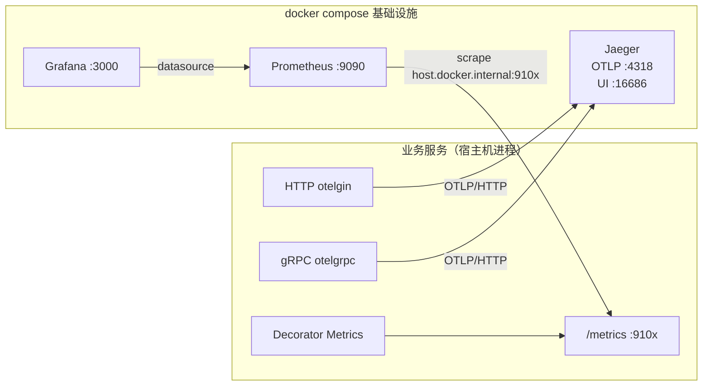
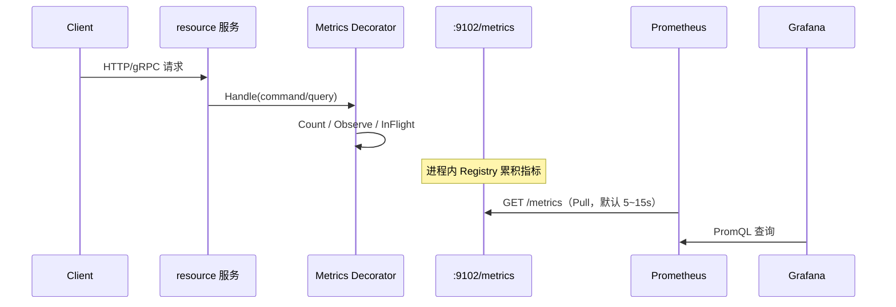

# VPP Backend 可观测链路架构

本文说明项目中 **OpenTelemetry → Jaeger**（链路）与 **Prometheus → Grafana**（指标）的采集、汇聚与查看方式，并以 **resource 服务** 为完整示例。

---

## 一、总览

可观测性分两条独立链路，共享同一套 `docker compose` 基础设施：

| 信号 | 采集位置 | 传输协议 | 后端 | 查看入口 |
|------|----------|----------|------|----------|
| **Traces（链路）** | 进程内 OTel SDK + HTTP/gRPC 中间件 | OTLP/HTTP → `:4318` | Jaeger all-in-one | **http://localhost:16686** |
| **Metrics（指标）** | 进程内 Prometheus Client，暴露 `/metrics` | Prometheus Pull | Prometheus | **http://localhost:9090** |
| **可视化（可选）** | Grafana 查询 Prometheus | — | Grafana | **http://localhost:3000** |
| **Logs（日志）** | logrus + TraceID Hook | 标准输出 | 本地 / 日志系统 | 日志中的 `trace` 字段可回查 Jaeger |



启动基础设施：

```bash
make infra-up   # 等价于 docker compose up -d
```

会拉起 Consul、Jaeger、Prometheus、Grafana、Postgres、Redis、Kafka 等。

---

## 二、前端页面在哪看

| 组件 | URL | 默认账号 | 用途 |
|------|-----|----------|------|
| **Jaeger UI** | http://localhost:16686 | 无 | 按 Service / Operation 查 Trace，看跨服务调用链 |
| **Prometheus UI** | http://localhost:9090 | 无 | 即席 PromQL、Targets 健康检查、原始时序 |
| **Grafana** | http://localhost:3000 | `admin` / `admin`（首次登录会要求改密） | 仪表盘可视化（需手动加 Prometheus 数据源） |
| **Consul UI** | http://localhost:8500 | 无 | 服务注册（非观测核心，但同属 infra） |

### Jaeger 快速用法

1. 打开 http://localhost:16686
2. Service 下拉选 `resource`（或其它服务名，来自配置 `service-name`）
3. Find Traces → 点开某条 Trace 看 Span 树

### Grafana 首次配置

仓库 **未预置** Grafana datasource / dashboard（`compose.yaml` 只挂了空 Grafana）。首次使用：

1. 打开 http://localhost:3000，登录
2. **Connections → Data sources → Add → Prometheus**
3. URL 填 `http://prometheus:9090`（Grafana 与 Prometheus 同属 compose 网络）或 `http://host.docker.internal:9090`
4. Save & Test → 再建 Dashboard，查询如 `app_requests_total`、`app_request_duration_seconds`

### Prometheus Targets

打开 http://localhost:9090/targets ，确认 scrape 目标为 `UP`。当前 [`config/prometheus.yaml`](config/prometheus.yaml) 已配置：

| Job | Target | 对应服务 |
|-----|--------|----------|
| `vpp-resource` | `host.docker.internal:9102` | resource |
| `vpp-simulator` | `host.docker.internal:9106` | simulator |

> 五个服务的 metrics 端口均已写入 `config/prometheus.yaml`。

---

## 三、端口与配置约定

### 基础设施端口（compose）

| 服务 | 端口 | 说明 |
|------|------|------|
| Jaeger OTLP HTTP | **4318** | 各服务 `tracing.endpoint` 指向这里 |
| Jaeger OTLP gRPC | 4317 | 备用 |
| Jaeger UI | **16686** | 链路查询前端 |
| Jaeger thrift（兼容） | 6831 / 14268 | 旧协议，当前 Go 服务走 OTLP |
| Prometheus | **9090** | 指标存储 + UI |
| Grafana | **3000** | 可视化前端 |

### 各业务服务 metrics 端口

| 服务 | metrics 地址 | tracing endpoint | 配置文件 |
|------|--------------|------------------|----------|
| resource | `127.0.0.1:9102` | `127.0.0.1:4318` | `config/resource.yaml` |
| telemetry | `127.0.0.1:9103` | `127.0.0.1:4318` | `config/telemetry.yaml` |
| gateway | `127.0.0.1:9104` | `127.0.0.1:4318` | `config/gateway.yaml` |
| dispatch | `127.0.0.1:9105` | `127.0.0.1:4318` | `config/dispatch.yaml` |
| simulator | `127.0.0.1:9106` | `127.0.0.1:4318` | `config/simulator.yaml` |

服务跑在 **宿主机**，观测组件跑在 **Docker**；Prometheus 通过 `host.docker.internal` 回刮宿主机 `/metrics`。

---

## 四、采集发生在哪里

### 4.1 Tracing：谁产生 Span、谁导出

**初始化（进程级，一次）**

以 resource 为例，`internal/resource/run.go`：

- 若配置了 `tracing.endpoint` → 调用 `platform/telemetry.InitTracing`
- 创建 OTLP/HTTP Exporter，指向 Jaeger `:4318`
- 注册全局 `TracerProvider` + W3C TraceContext / Baggage / B3 传播器
- 未配置则 tracing 关闭，服务仍可正常跑

核心实现：`internal/platform/telemetry/tracing.go`（后端无关，Jaeger / Tempo / Collector 只要收 OTLP 即可）。

**自动埋点（传输层）**

| 入口 | 位置 | 机制 |
|------|------|------|
| HTTP 入站 | `platform/server/http.go` → `otelgin.Middleware(serviceName)` | 每个 HTTP 请求一个 Server Span |
| gRPC 入站 | `platform/server/grpc.go` → `otelgrpc.NewServerHandler()` | 每个 RPC 一个 Server Span |
| gRPC 出站 | `platform/server/grpc_client.go` → `DialGRPC` + `otelgrpc.NewClientHandler()` | 每个出站 RPC 一个 Client Span，并传播 TraceContext |

出站客户端（gateway→telemetry、dispatch→gateway、simulator→resource）均通过 `DialGRPC` 接入，跨服务链路可在 Jaeger 中串联。

**应用层**

CQRS Handler 经 `decorator.Apply*Decorators` 包装，外→内为 **Logging → Metrics → Tracing → Handler**（Middleware / `Chain` 组装，见 `platform/decorator`）：

- Metrics：`app_requests_*` 计数/耗时/in-flight
- Tracing：自动创建 `command.<Type>` / `query.<Type>` 应用层 Span（含 `cqrs.kind` / `cqrs.action`），失败时 `RecordError` + Error status
- gateway / dispatch / resource / telemetry 凡走 `Apply*Decorators` 的 Handler **无需再手写** `telemetry.Start`

**异步边界**

| 边界 | 位置 | 行为 |
|------|------|------|
| Kafka **生产** | resource → `vpp.resource.events`；gateway → `vpp.command.events` | Producer Span（`<topic> publish`），并把 W3C/B3 写入 Kafka **Headers** |
| Kafka **消费** | gateway `lifecycle_consumer`；dispatch `command.completed` | 从 Headers **Extract** 父上下文（无则新建根），Consumer Span（`<topic> process`），属性含 `messaging.*`（system/destination/operation、partition/offset/group、message.type） |
| Simulator Tick / Publish | `simulator/tick` | 短 Span：`simulator.tick` →（可选）`simulator.publish`；默认每 N 次 Tick 采样一次（`runtime.trace-sample-every`，默认 6），避免周期任务刷爆 Jaeger |

辅助 API：`platform/telemetry` 的 `Inject` / `Extract` / `StartKafkaProducer` / `StartKafkaConsumer` / `EndSpan`。

链路 Span 还来自传输层中间件（HTTP/gRPC server + 出站 `DialGRPC`）；日志通过 `platform/logging` 的 `traceHook` 自动写入 `trace` 字段，便于用 TraceID 在 Jaeger 反查。

### 4.2 Metrics：谁打点、谁暴露、谁拉取



**打点位置（应用层）**

- `platform/decorator/metrics.go`：每个 Command/Query 记录
  - `app_requests_total{kind,action,status}`
  - `app_request_duration_seconds{kind,action}`
  - `app_requests_in_flight{kind,action}`

**暴露位置（独立 HTTP Server）**

- `platform/metrics/prometheus.go`：在 `metrics-addr` 上单独起 `/metrics`（与业务 HTTP 端口分离）
- resource 额外注册 `DBCollector`（连接池：open / in-use / idle / wait 等）
- 可选 Go runtime / process collector（`EnableGoMetrics: true`）

**拉取位置（基础设施）**

- Prometheus 按 `config/prometheus.yaml` 定时 scrape
- **不是** 服务主动推指标；服务只负责暴露，Prometheus 负责采集与存储

### 4.3 以 resource 为例的完整请求路径

```
客户端
  → HTTP :8082（grpc-gateway）或 gRPC :5002
      ├─ otelgin / otelgrpc  → 创建 Span
      ├─ 结构化日志（带 trace id）
      └─ Application Handler
            └─ Decorator：metrics 计数/耗时 + logging
  → OTLP 批量导出 → Jaeger :4318 → UI :16686
  → /metrics :9102 ← Prometheus scrape → :9090 → Grafana :3000
```

对应配置片段（`config/resource.yaml`）：

```yaml
tracing:
  endpoint: 127.0.0.1:4318
  insecure: true

resource:
  service-name: resource
  http-addr: 127.0.0.1:8082
  grpc-addr: 127.0.0.1:5002
  metrics-addr: 127.0.0.1:9102
```

本地验证：

```bash
# 指标是否暴露
curl -s http://127.0.0.1:9102/metrics | grep app_

# 发几个请求后，到 Jaeger UI 选 Service=resource 查 Trace
# Prometheus UI 执行：rate(app_requests_total[1m])
```

---

## 五、两条链路对比（记忆用）

| | Tracing | Metrics |
|--|---------|---------|
| **标准** | OpenTelemetry | Prometheus exposition |
| **采集方式** | 进程内 SDK **Push**（OTLP） | Prometheus **Pull** scrape |
| **采集点** | HTTP/gRPC 中间件（入口） | CQRS Decorator + `/metrics` 端点 |
| **后端** | Jaeger | Prometheus |
| **看哪里** | :16686 | :9090（原始）/ :3000（Grafana 看板） |
| **回答的问题** | 这次请求慢在哪一跳？ | QPS、延迟分布、错误率、连接池是否打满？ |

---

## 六、代码索引

| 职责 | 路径 |
|------|------|
| OTel 初始化 / OTLP Exporter | `internal/platform/telemetry/tracing.go` |
| HTTP 自动埋点 | `internal/platform/server/http.go` |
| gRPC 自动埋点 | `internal/platform/server/grpc.go` |
| 应用层 Metrics 装饰器 | `internal/platform/decorator/metrics.go` |
| `/metrics` HTTP Server | `internal/platform/metrics/prometheus.go` |
| DB 连接池指标 | `internal/platform/metrics/db.go` |
| 日志关联 TraceID | `internal/platform/logging/logrus.go`（`traceHook`） |
| resource 启动 wiring | `internal/resource/run.go`、`server.go` |
| Compose 定义 | `compose.yaml` |
| Prometheus scrape 配置 | `config/prometheus.yaml` |

---

## 七、已知缺口 / 注意点

1. **Grafana 无开箱看板**：需手动配置 Prometheus 数据源与 Dashboard。
2. **Prometheus scrape 未覆盖全服务**：目前仅 resource、simulator；telemetry/gateway/dispatch 可按同模式补 job。
3. **README 中 “Decorator 含 tracing”**：传输层已有 OTel；应用层 Decorator 当前实现是 metrics + logging，业务 Handler 内如需细粒度 Span 可再调 `telemetry.Start`。
4. **resource README 默认 metrics `:9091`** 与仓库实际配置 `:9102` 不一致，以 `config/resource.yaml` / `architecture.md` 端口表为准。
