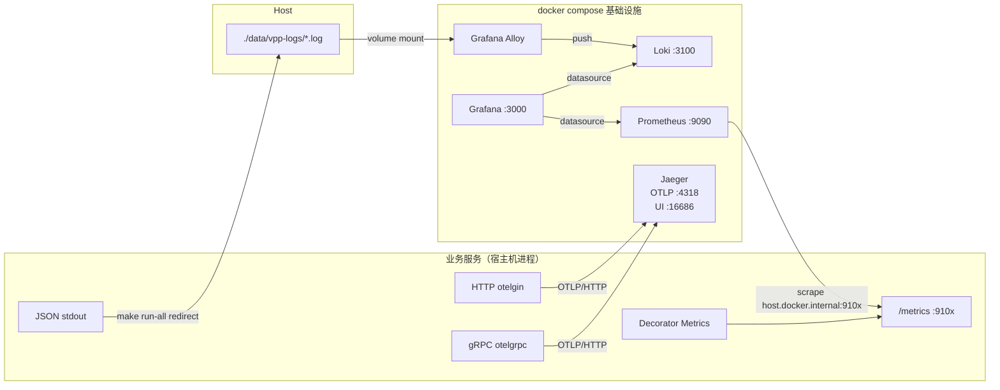
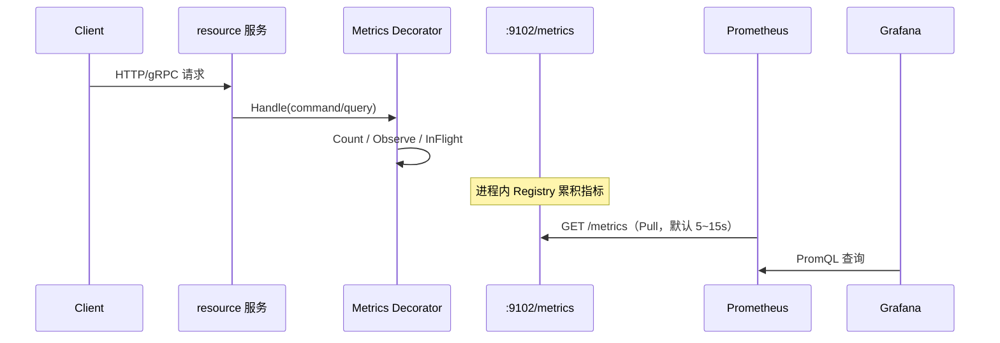
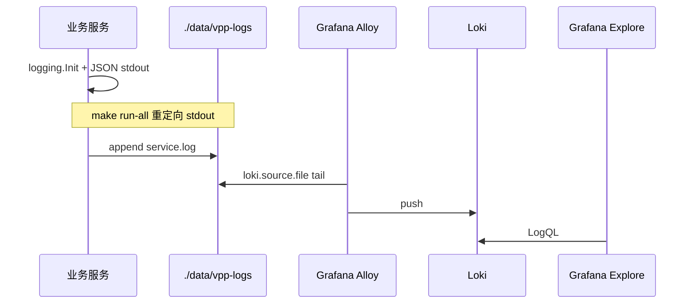

# VPP Backend 可观测链路架构

本文说明项目中 **OpenTelemetry → Jaeger**（链路）、**Prometheus → Grafana**（指标）与 **stdout → Alloy → Loki → Grafana**（日志）的采集、汇聚与查看方式。

---

## 一、总览

可观测性分三条链路，共享同一套 `docker compose` 基础设施：

| 信号 | 采集位置 | 传输协议 | 后端 | 查看入口 |
|------|----------|----------|------|----------|
| **Traces（链路）** | 进程内 OTel SDK + HTTP/gRPC 中间件 | OTLP/HTTP → `:4318` | Jaeger all-in-one | **http://localhost:16686** |
| **Metrics（指标）** | 进程内 Prometheus Client，暴露 `/metrics` | Prometheus Pull | Prometheus | **http://localhost:9090** / Grafana |
| **Logs（日志）** | logrus JSON → stdout → `./data/vpp-logs` | Alloy `loki.source.file` Push | Loki | **Grafana Explore（Loki）** |
| **可视化** | Grafana 查询 Prometheus / Loki | — | Grafana | **http://localhost:3000** |



启动基础设施：

```bash
make infra-up   # 等价于 docker compose up -d
mkdir -p ./data/vpp-logs   # Alloy 只读挂载该目录；run-all 也会创建
make run-all             # 业务日志落到 ./data/vpp-logs/<service>.log
```

会拉起 Consul、Jaeger、Prometheus、**Loki**、**Alloy**、Grafana、Postgres、Redis、Kafka 等。

> **采集器说明**：Promtail 已于 2026-03-02 EOL，本仓库使用 **Grafana Alloy**。应用只保证「JSON 行写 stdout」；换 Vector 等采集器时只需改 compose/配置，不必改业务代码。

---

## 二、前端页面在哪看

| 组件 | URL | 默认账号 | 用途 |
|------|-----|----------|------|
| **Jaeger UI** | http://localhost:16686 | 无 | 按 Service / Operation 查 Trace，看跨服务调用链 |
| **Prometheus UI** | http://localhost:9090 | 无 | 即席 PromQL、Targets 健康检查、原始时序 |
| **Loki** | http://localhost:3100 | 无 | 日志存储 API（一般用 Grafana Explore） |
| **Alloy UI** | http://localhost:12345 | 无 | 采集组件调试 / livedebugging |
| **Grafana** | http://localhost:3000 | `admin` / `admin`（首次登录会要求改密） | 指标看板 + 日志 Explore |
| **Consul UI** | http://localhost:8500 | 无 | 服务注册（非观测核心，但同属 infra） |

### Jaeger 快速用法

1. 打开 http://localhost:16686
2. Service 下拉选 `resource`（或其它服务名，来自配置 `service-name`）
3. Find Traces → 点开某条 Trace 看 Span 树

### Grafana 数据源（已预置）

[`config/grafana/provisioning/datasources/datasources.yaml`](config/grafana/provisioning/datasources/datasources.yaml) 会自动注册：

| 名称 | URL（compose 网络内） |
|------|------------------------|
| Prometheus | `http://prometheus:9090` |
| Jaeger | `http://jaeger:16686` |
| Loki | `http://loki:3100` |

### Grafana 看板（已预置，可版本管理）

[`config/grafana/provisioning/dashboards/`](config/grafana/provisioning/dashboards/) 会在启动时自动加载到 **VPP** 文件夹；UI 里改的看板也会写入 `./data/grafana`（容器重建后保留）。

| 看板 | 数据源 | 内容 |
|------|--------|------|
| **VPP Metrics Overview** | Prometheus | QPS / 错误率 / P95 延迟 / In-Flight（按 `job` 分服务），Targets 健康，Handler 维度 QPS |
| **VPP Logs Overview** | Loki | 日志量、error/warn 速率、带 `trace_id` 的日志流（可点 TraceID 跳 Jaeger） |
| **VPP Traces Overview** | Jaeger + Loki + Prometheus | 最近 Trace 列表、错误日志带 TraceID、与指标对照 |

打开 http://localhost:3000 → **Dashboards** → 文件夹 **VPP**。

改完 provisioning 后重建 Grafana：`docker compose up -d --force-recreate grafana`。

> **权限**：Grafana 容器以 UID **472** 运行；`./data/grafana` 若被 root 创建会导致无法写入。`make infra-up` 会自动执行 `make grafana-fix-perms`（用 Alpine 容器 `chown 472:472`）。手动修复：`make grafana-fix-perms`。

打开 http://localhost:3000 → **Explore**：

- 选 **Prometheus**：`sum by (job) (rate(app_requests_total[1m]))`
- 选 **Loki**：
  - `{service="gateway"}`
  - `{service="resource"} |= "error"`
  - `{job="vpp"} | json | trace_id != ""`

### Prometheus Targets

打开 http://localhost:9090/targets ，确认 scrape 目标为 `UP`。当前 [`config/prometheus.yaml`](config/prometheus.yaml) 已配置五个服务的 metrics job。

---

## 三、端口与配置约定

### 基础设施端口（compose）

| 服务 | 端口 | 说明 |
|------|------|------|
| Jaeger OTLP HTTP | **4318** | 各服务 `tracing.endpoint` 指向这里 |
| Jaeger OTLP gRPC | 4317 | 备用 |
| Jaeger UI | **16686** | 链路查询前端 |
| Jaeger thrift（兼容） | 6831 / 14268 | 旧协议，当前 Go 服务走 OTLP |
| Prometheus | **9090** | 指标存储 + UI |
| Loki | **3100** | 日志存储 |
| Alloy UI | **12345** | 采集调试 |
| Grafana | **3000** | 可视化前端 |

### 各业务服务 metrics 端口

| 服务 | metrics 地址 | tracing endpoint | 配置文件 |
|------|--------------|------------------|----------|
| resource | `127.0.0.1:9102` | `127.0.0.1:4318` | `config/resource.yaml` |
| telemetry | `127.0.0.1:9103` | `127.0.0.1:4318` | `config/telemetry.yaml` |
| gateway | `127.0.0.1:9104` | `127.0.0.1:4318` | `config/gateway.yaml` |
| dispatch | `127.0.0.1:9105` | `127.0.0.1:4318` | `config/dispatch.yaml` |
| simulator | `127.0.0.1:9106` | `127.0.0.1:4318` | `config/simulator.yaml` |

服务跑在 **宿主机**，观测组件跑在 **Docker**；Prometheus 通过 `host.docker.internal` 回刮宿主机 `/metrics`；Alloy 通过挂载 `./data/vpp-logs` 采日志。

---

## 四、采集发生在哪里

### 4.1 Tracing：谁产生 Span、谁导出

**初始化（进程级，一次）**

以 resource 为例，`internal/resource/run.go`：

- 先调用 `platform/logging.Init`（JSON stdout + `service` / `trace_id` hooks）
- 若配置了 `tracing.endpoint` → 调用 `platform/telemetry.InitTracing`
- 创建 OTLP/HTTP Exporter，指向 Jaeger `:4318`
- 注册全局 `TracerProvider` + W3C TraceContext / Baggage / B3 传播器
- 未配置则 tracing 关闭，服务仍可正常跑

核心实现：`internal/platform/telemetry/tracing.go`（后端无关，Jaeger / Tempo / Collector 只要收 OTLP 即可）。

**自动埋点（传输层）**

| 入口 | 位置 | 机制 |
|------|------|------|
| HTTP 入站 | `platform/server/http.go` → `otelgin.Middleware(serviceName)` | 每个 HTTP 请求一个 Server Span |
| gRPC 入站 | `platform/server/grpc.go` → `otelgrpc.NewServerHandler()` | 每个 RPC 一个 Server Span |
| gRPC 出站 | `platform/server/grpc_client.go` → `DialGRPC` + `otelgrpc.NewClientHandler()` | 每个出站 RPC 一个 Client Span，并传播 TraceContext |

出站客户端（gateway→telemetry、dispatch→gateway、simulator→resource）均通过 `DialGRPC` 接入，跨服务链路可在 Jaeger 中串联。

**应用层**

CQRS Handler 经 `decorator.Apply*Decorators` 包装，外→内为 **Logging → Metrics → Tracing → Handler**（Middleware / `Chain` 组装，见 `platform/decorator`）：

- Metrics：`app_requests_*` 计数/耗时/in-flight
- Tracing：自动创建 `command.<Type>` / `query.<Type>` 应用层 Span（含 `cqrs.kind` / `cqrs.action`），失败时 `RecordError` + Error status
- gateway / dispatch / resource / telemetry 凡走 `Apply*Decorators` 的 Handler **无需再手写** `telemetry.Start`

**异步边界**

| 边界 | 位置 | 行为 |
|------|------|------|
| Kafka **生产** | resource → `vpp.resource.events`；gateway → `vpp.command.events` | Producer Span（`<topic> publish`），并把 W3C/B3 写入 Kafka **Headers** |
| Kafka **消费** | gateway `lifecycle_consumer`；dispatch `command.completed` | 从 Headers **Extract** 父上下文（无则新建根），Consumer Span（`<topic> process`），属性含 `messaging.*`（system/destination/operation、partition/offset/group、message.type） |
| Simulator Tick / Publish | `simulator/tick` | 短 Span：`simulator.tick` →（可选）`simulator.publish`；默认每 N 次 Tick 采样一次（`runtime.trace-sample-every`，默认 6），避免周期任务刷爆 Jaeger |

辅助 API：`platform/telemetry` 的 `Inject` / `Extract` / `StartKafkaProducer` / `StartKafkaConsumer` / `EndSpan`。

链路 Span 还来自传输层中间件（HTTP/gRPC server + 出站 `DialGRPC`）；日志通过 `platform/logging` 的 `traceHook` 在有效 Span 时写入 **`trace_id` / `span_id`**，便于用 TraceID 在 Jaeger 反查。

### 4.2 Metrics：谁打点、谁暴露、谁拉取



**打点位置（应用层）**

- `platform/decorator/metrics.go`：每个 Command/Query 记录
  - `app_requests_total{kind,action,status}`
  - `app_request_duration_seconds{kind,action}`
  - `app_requests_in_flight{kind,action}`

**暴露位置（独立 HTTP Server）**

- `platform/metrics/prometheus.go`：在 `metrics-addr` 上单独起 `/metrics`（与业务 HTTP 端口分离）
- resource 额外注册 `DBCollector`（连接池：open / in-use / idle / wait 等）
- 可选 Go runtime / process collector（`EnableGoMetrics: true`）

**拉取位置（基础设施）**

- Prometheus 按 `config/prometheus.yaml` 定时 scrape
- **不是** 服务主动推指标；服务只负责暴露，Prometheus 负责采集与存储

### 4.3 Logs：谁写日志、谁采集、谁查询



**应用契约（可替换采集器的边界）**

| 约定 | 说明 |
|------|------|
| 输出 | **stdout only**（禁止应用内 rolling `app.log`） |
| 格式 | 默认 **JSON**（`LOCAL_ENV=true` 时为彩色文本，仅适合前台 `make run-<svc>`） |
| 必有字段 | `time` / `level` / `message` / `service` |
| 有 Span 时 | `trace_id` / `span_id` |
| 级别 | `LOG_LEVEL` 或 `logging.Init` 的 `Level`，默认 `info` |
| 落盘 | `make run-all` → `./data/vpp-logs/<service>.log`（`Makefile` 的 `LOG_DIR`） |

**采集**

- [`config/alloy/config.alloy`](config/alloy/config.alloy)：按服务文件打 `service` / `job=vpp` / `environment=local` label
- `loki.process` 解析 JSON，仅把低基数 `level` 提升为 label
- **禁止**把 `trace_id`、`tenant`、`device_id` 等做成 Loki label

**存储 / 查看**

- Loki：[`config/loki.yaml`](config/loki.yaml)，本地保留约 7 天
- Grafana Explore → Loki 数据源

本地验证：

```bash
# 确认落盘为 JSON
tail -n 3 ./data/vpp-logs/resource.log

# Alloy / Loki 起来后，在 Grafana Explore 执行：
# {service="resource"}
# {job="vpp"} | json | level="error"
```

### 4.4 以 resource 为例的完整请求路径

```
客户端
  → HTTP :8082（grpc-gateway）或 gRPC :5002
      ├─ otelgin / otelgrpc  → 创建 Span
      ├─ 结构化日志（带 service / trace_id）→ stdout → ./data/vpp-logs
      └─ Application Handler
            └─ Decorator：metrics 计数/耗时 + logging
  → OTLP 批量导出 → Jaeger :4318 → UI :16686
  → /metrics :9102 ← Prometheus scrape → :9090 → Grafana :3000
  → ./data/vpp-logs ← Alloy → Loki :3100 → Grafana Explore
```

对应配置片段（`config/resource.yaml`）：

```yaml
tracing:
  endpoint: 127.0.0.1:4318
  insecure: true

resource:
  service-name: resource
  http-addr: 127.0.0.1:8082
  grpc-addr: 127.0.0.1:5002
  metrics-addr: 127.0.0.1:9102
```

本地验证：

```bash
# 指标是否暴露
curl -s http://127.0.0.1:9102/metrics | grep app_

# 发几个请求后，到 Jaeger UI 选 Service=resource 查 Trace
# Prometheus UI 执行：rate(app_requests_total[1m])
# Grafana Explore (Loki)：{service="resource"}
```

---

## 五、三条链路对比（记忆用）

| | Tracing | Metrics | Logs |
|--|---------|---------|------|
| **标准** | OpenTelemetry | Prometheus exposition | JSON + Loki |
| **采集方式** | 进程内 SDK **Push**（OTLP） | Prometheus **Pull** scrape | Alloy **tail file** → Push |
| **采集点** | HTTP/gRPC 中间件（入口） | CQRS Decorator + `/metrics` | stdout / `./data/vpp-logs` |
| **后端** | Jaeger | Prometheus | Loki |
| **看哪里** | :16686 | :9090 / Grafana | Grafana Explore |
| **回答的问题** | 这次请求慢在哪一跳？ | QPS、延迟、错误率、连接池？ | 发生了什么？哪条错误？关联哪个 Trace？ |

---

## 六、代码与配置索引

| 职责 | 路径 |
|------|------|
| OTel 初始化 / OTLP Exporter | `internal/platform/telemetry/tracing.go` |
| HTTP 自动埋点 | `internal/platform/server/http.go` |
| gRPC 自动埋点 | `internal/platform/server/grpc.go` |
| 应用层 Metrics 装饰器 | `internal/platform/decorator/metrics.go` |
| `/metrics` HTTP Server | `internal/platform/metrics/prometheus.go` |
| DB 连接池指标 | `internal/platform/metrics/db.go` |
| 日志 Init / Hook（service、trace_id） | `internal/platform/logging/logrus.go` |
| resource 启动 wiring | `internal/resource/run.go`、`server.go` |
| Compose 定义 | `compose.yaml` |
| Prometheus scrape 配置 | `config/prometheus.yaml` |
| Loki 配置 | `config/loki.yaml` |
| Alloy 采集配置 | `config/alloy/config.alloy` |
| Grafana 数据源预置 | `config/grafana/provisioning/datasources/datasources.yaml` |
| Grafana 看板预置 | `config/grafana/provisioning/dashboards/` |

---

## 八、日志业务字段约定与迁移样例

### 8.1 推荐字段名（写入 JSON，勿做 Loki label）

| 字段 | 用途 |
|------|------|
| `tenant` / `tenant_id` | 租户 |
| `cu_id` / `cu_code` | 可控单元 |
| `command_id` | 控制指令 |
| `task_id` | 调度任务 |
| `topic` / `partition` / `offset` | Kafka 消息定位 |
| `component` | 模块名（如 `TimeoutScanner`、`tick`） |
| `error` | 错误字符串（失败日志） |
| `duration_ms` | 耗时（Decorator 已打） |
| `kind` / `action` | CQRS 类型（Decorator 已打） |

Loki **label** 仅保留低基数：`service` / `job` / `environment` / `level`。

### 8.2 替换 `logrus` 样例（按此模式手改即可）

**Before**

```go
logrus.WithError(err).WithFields(logrus.Fields{
    "command_id": id,
}).Error("timeout handling failed")
```

**After**

```go
logging.Errorf(ctx, logrus.Fields{
    "component":  "TimeoutScanner",
    "command_id": id,
    "error":      err.Error(),
}, "timeout handling failed")
```

要点：传入 `ctx`（才能挂 `trace_id`）；业务字段放 `logrus.Fields`；不要打完整 Body / Secret。

仓库内已改的样例文件：

- [`gateway/.../execute_command.go`](internal/gateway/application/command/execute_command.go) — Kafka publish 失败
- [`dispatch/.../scan_timeouts.go`](internal/dispatch/application/command/scan_timeouts.go) — 超时扫描错误
- [`simulator/tick/engine.go`](internal/simulator/tick/engine.go) — tick 启停

启动期无业务 ctx 的日志可继续用裸 `logrus.Infof`（如 listen 地址）。

### 8.3 Logs ↔ Traces

Grafana 已预置：

- **Loki → Jaeger**：日志详情里点 `TraceID`（解析 JSON `trace_id`）
- **Jaeger → Loki**：Trace 视图 → Logs（LogQL：`{job="vpp"} \| json \| trace_id="<id>"`）

改完 provisioning 后需重建 Grafana：`docker compose up -d --force-recreate grafana`。

---

## 七、已知缺口 / 注意点

1. **前台 `make run-<svc>`**：日志只打终端，Alloy 采不到；要用 Loki 请 `make run-all`（或自行 tee 到 `./data/vpp-logs`）。
2. **`LOCAL_ENV=true`**：输出为彩色文本而非 JSON，不适合进 Loki；`run-all` 不要设该变量。
3. **Prometheus scrape**：五个服务 metrics job 已在 `config/prometheus.yaml`；以 Targets 页面为准。
4. **resource README 默认 metrics `:9091`** 与仓库实际配置 `:9102` 不一致，以 `config/resource.yaml` / `architecture.md` 端口表为准。
5. **全仓 `logrus` 迁移**：未强制完成；按 §8.2 样例渐进替换即可。
