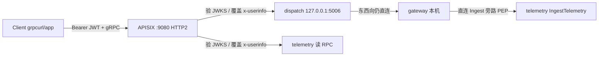

# 不依赖 K8s 的 gRPC 北向安全改造

## 目标与边界

**要解决的**：讨论第 1 点——打开 `trust-proxy-headers` 后，任何能连上 `:5006/:5003` 的人都能自签 `x-userinfo`。

**不做的**：东西向 mTLS（dispatch→gateway、gateway→telemetry）；Service Mesh；完整业务服务 Docker 化（可作为后续加强项）。

**安全模型（改造后）**：



远端只能打 APISIX；业务 gRPC 继续绑 `127.0.0.1`（现状已是），同机直连仅作调试/机机，生产联调路径以 APISIX 为准。

## 选定技术路线

复用 Resource 已验证的 **Path C**：APISIX `openid-connect`（`bearer_only` + `use_jwks` + `set_userinfo_header`），上游 `scheme: grpc`。gRPC metadata 走 HTTP/2 header，`X-Userinfo` / `x-userinfo` 可被后端 [`grpcauth`](internal/platform/middleware/grpcauth/auth.go) 读到。

**Gate 0（先做可行性验证，再改默认配置）**：用现有 Casdoor token + `grpcurl -plaintext` 经 APISIX 调一个 dispatch 方法，确认 OIDC 插件在 `application/grpc` 上能拒无 token、放行合法 token，并把 `x-userinfo` 传到 upstream；**另外用一段 `grpc-go` 客户端代码**（不只是 `grpcurl`）测无 token 场景，确认拒绝时返回的错误对生产级客户端代码是可用的（`grpcurl` 对非标准 gRPC 错误帧的容错性比真实 SDK 客户端更好，两者都要测）。若 OIDC 在 gRPC 路径上不可用，再改用 `serverless-pre-function` 做 JWKS 验签并 `ngx.req.set_header("X-Userinfo", ...)`——但默认按 OIDC 路径实施。

**架构一致性说明（复审后新增）**：本方案的信任模型与 HTTP 侧（Resource 经 `/resource/*`）完全一致——都是「APISIX 验签后注入可信 `X-Userinfo`，后端信任该 header」，不引入服务自验签 JWT 的零信任模型。这是有意选择：如果 gRPC 单独换成自验签而 HTTP 不变，会造成两条协议对"后端信任什么"给出不同答案，是比"gRPC 暂缺鉴权"更差的架构状态。是否要把 HTTP + gRPC 一起升级为服务自验签，留作未来独立的架构决策，不在本方案范围内。

## 实施步骤

### 1. APISIX 开启明文 HTTP/2（gRPC 入口）

改 [`deploy/apisix/conf/config.yaml`](deploy/apisix/conf/config.yaml)：

- `node_listen` 改为带 `enable_http2: true`（可继续用 `9080`，或单独加 `9081` 专给 gRPC，避免和纯 HTTP 调试互相干扰；推荐 **9081 专口**，与官方 plaintext gRPC 示例一致）。
- compose 映射增加对应端口（[`deploy/apisix/docker-compose.apisix.yaml`](deploy/apisix/docker-compose.apisix.yaml)）。

### 2. 增加 gRPC upstream + 路由

扩展 [`deploy/apisix/init.sh`](deploy/apisix/init.sh)，并加参考 YAML（如 `deploy/apisix/routes/dispatch-grpc.yaml`、`telemetry-grpc.yaml`）：

| 资源 | 配置要点 |
|------|----------|
| Upstream `dispatch-grpc` | `scheme: grpc`，节点 `host.docker.internal:5006` |
| Upstream `telemetry-grpc` | `scheme: grpc`，节点 `host.docker.internal:5003` |
| Route(s) dispatch | URI 覆盖 `/dispatchpb.DispatchService/*`（或三条：`SubmitTask`/`GetTask`/`CancelTask`） |
| Route(s) telemetry 读 | 仅用户读 RPC：`QueryTelemetry` / `GetSnapshot` / `GetFleetSnapshot` / `QueryAggregation` |
| **不要** 给 `IngestTelemetry` 配用户 OIDC 路由 | 继续 gateway → `127.0.0.1:5003` 机机旁路（见 [`auth_bypass.go`](internal/telemetry/adapter/inbound/grpc/auth_bypass.go)） |

每条用户路由插件组合（与 Resource 对齐）：

1. **`openid-connect`**：与 [`resource.yaml`](deploy/apisix/routes/resource.yaml) 相同的 Casdoor discovery / client / `bearer_only` / `set_userinfo_header`
2. 可选 `limit-req`（控制面可更严）

**不要**再额外加一步 `proxy-rewrite.headers.remove` 去"先删客户端伪造的 `x-userinfo`"——`openid-connect` 和 `proxy-rewrite` 在 APISIX 里同属 `rewrite` 阶段，且 `openid-connect` 优先级（2599）高于 `proxy-rewrite`（1008），同阶段内优先级高的先跑，也就是 `openid-connect` 会先注入可信 `X-Userinfo`，`proxy-rewrite` 的删除动作反而会跑在它后面，把刚注入的可信值一起删掉，导致合法请求也被判定为"missing x-userinfo"而拒绝。安全性依赖 `openid-connect` 自身 `set_userinfo_header` 的覆盖语义（与现有 `/resource/*` 路由的实际工作方式一致，未显式删除也是安全的），Gate 0 里"伪造 `x-userinfo` 应被覆盖"这条用例就是用来验证这一点，不需要额外的删除步骤。

客户端调用形态变为：

```bash
grpcurl -plaintext \
  -H "authorization: Bearer <casdoor_access_token>" \
  -d '{...}' \
  127.0.0.1:9081 dispatchpb.DispatchService/SubmitTask
```

**不再**由客户端传可信 `x-userinfo`；该 header 仅由 APISIX 注入。

### 3. 打开后端 PEP（与可信入口同步）

在确认 Gate 0 通过后：

- [`config/dispatch.yaml`](config/dispatch.yaml)、[`config/telemetry.yaml`](config/telemetry.yaml)：`auth.trust-proxy-headers: true`（或新增 `config/*-secure.yaml` / 环境覆盖，避免打断「直连旁路调试」；推荐 **默认 false 保留本地旁路，文档/Makefile 提供 `AUTH_TRUST_PROXY=1` 或 `make run-*-secured` 覆盖为 true**，联调安全模式时打开）。
- 保持 `grpc-addr: 127.0.0.1:...`，不改为 `0.0.0.0`。

业务代码（[`grpcauth`](internal/platform/middleware/grpcauth/auth.go)、catalog、Casbin）**无需改契约**；改的是「谁有资格写入 x-userinfo」。

### 4. 文档与验收

更新：

- [`docs/APISIX.md`](docs/APISIX.md)：gRPC 端口、路由、调用示例
- [`docs/AUTHZ_TEST.md`](docs/AUTHZ_TEST.md)：经 APISIX 的 grpcurl 用例（合法 token / 无 token / 伪造 x-userinfo 应被覆盖）
- [`docs/AUTHZ_RUNBOOK.md`](docs/AUTHZ_RUNBOOK.md)：启用 `trust-proxy-headers` 的前置清单（APISIX gRPC 路由已灌入、业务口仅本机、Ingest 不走用户 OIDC）
- [`ROADMAP.md`](ROADMAP.md)：将该已知限制标为「非 K8s 路径已用 APISIX gRPC 解决」

验收清单：

- 无 Bearer → APISIX 拒绝
- 合法 Bearer + viewer 调 SubmitTask → 后端 403（Casbin）
- 合法 Bearer + operator/admin → 按现有矩阵放行
- 合法 Bearer + 客户端伪造 admin `x-userinfo` → 仍以 APISIX 注入身份为准（角色不被抬升）
- 直连 `127.0.0.1:5006` 在 secured 模式下无合法 metadata → Unauthenticated；调试模式 `trust-proxy-headers:false` 仍可旁路

### 5. 明确仍接受的残余风险

| 残余 | 说明 |
|------|------|
| 同机进程可直连本机端口 | host 进程模式下无法做到 ClusterIP 级隔离；依赖「只信 APISIX 联调路径」+ 本机信任 |
| 东西向无 mTLS | 同讨论第 4 点；同机内网可信假设不变 |
| 9081 是明文 HTTP/2（h2c） | Bearer token 在 client↔APISIX 之间明文传输；仅限 localhost 使用，若需跨机联调必须先配 TLS（复用已预留的 `:9443`），不能明文暴露到局域网 |
| 若要更强隔离 | 后续把业务服务放进与 APISIX 同一 compose 内网、宿主机只暴露 9080/9081（需 Dockerfile，单独立项） |

## 关键改动文件

- [`deploy/apisix/conf/config.yaml`](deploy/apisix/conf/config.yaml) — HTTP/2 listen
- [`deploy/apisix/docker-compose.apisix.yaml`](deploy/apisix/docker-compose.apisix.yaml) — 端口映射
- [`deploy/apisix/init.sh`](deploy/apisix/init.sh) — gRPC upstream/routes + OIDC
- 新建 `deploy/apisix/routes/*-grpc.yaml` 参考文档
- 配置/Makefile：secured 模式打开 `trust-proxy-headers`
- 上述 docs + ROADMAP

## 建议实施顺序

1. Gate 0 探针（最小路由 + OIDC）
2. 完整 init 路由 + 文档中的 grpcurl 用例
3. secured 启动方式 + 伪造 header 覆盖实测
4. 更新 ROADMAP / RUNBOOK 护栏
