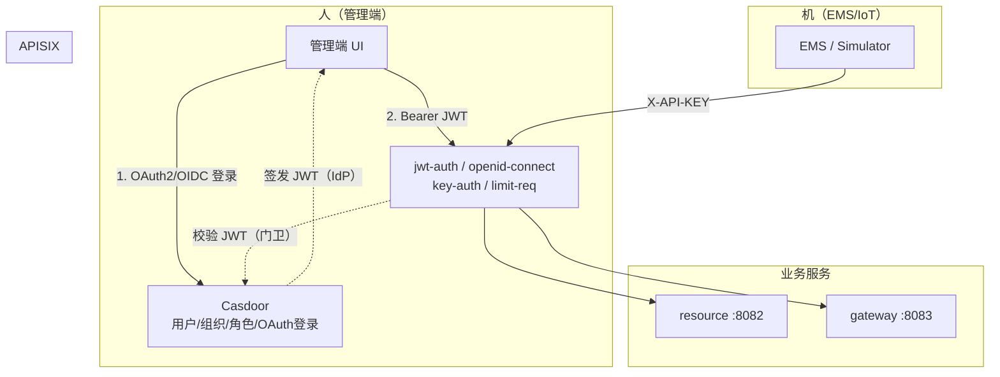
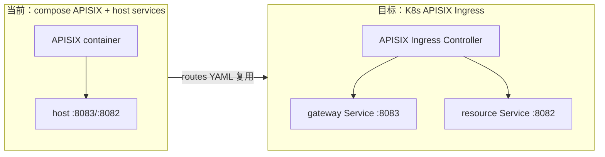

# APISIX 北向基础设施网关接入方案

## FAQ：方案评审常见问题

### Q1. 为何 APISIX 配置要和其他基础设施分开存放？

**原方案理由（独立 `deploy/apisix/` + 可选独立 compose 文件）：**

| 考量 | 说明 |
|------|------|
| 生命周期不同 | Postgres/Kafka/Consul 是业务服务**强依赖**；APISIX 是**北向入口**，本地开发时可不启（直连 :8083 调试 gateway） |
| 启动顺序 | APISIX 依赖业务服务已跑在 host 上（`host.docker.internal:8083`），与 infra 层"先起中间件、再起业务"顺序相反 |
| 配置形态 | APISIX 用 Admin API / etcd / routes YAML，与现有 [`compose.yaml`](compose.yaml) 里的 Prometheus/Loki 等**配置风格完全不同** |
| 学习/debug 隔离 | APISIX 调试频繁改 routes，独立目录便于 `git diff` 和 rollback，不污染根 compose |

**但这并非唯一做法。** 若更倾向"一个 compose 管全部"，推荐折中：

- `compose.yaml` — 现有 infra（postgres/kafka/consul/...）
- `compose.apisix.yaml` — APISIX + etcd（同级存放，Makefile 组合调用）
- 或使用 Compose **`profiles: ["edge"]`** 把 APISIX 放进同一文件，只有 `make edge-up` 时才起

**结论：** 分开存放是**工程组织选择**，不是 APISIX 技术要求。核心原则是 APISIX 专属配置（routes/consumers/plugins）与业务 yaml 分离；compose 合并还是拆分按运维习惯定。**计划调整为：`deploy/apisix/` 放 APISIX 配置，compose 文件可与根目录 infra compose 同级。**

---

### Q2. 接入 APISIX 是不是主要是部署和调试，几乎不改代码？

**基本正确，但要精确表述：**

| 工作类型 | 占比 | 具体内容 |
|----------|------|---------|
| **部署 + APISIX 配置** | ~70% | compose 起 APISIX/etcd、写 routes/consumers、调 key-auth/jwt-auth/limit-req、排查 502/401 |
| **文档 + 运维脚本** | ~15% | Makefile、`docs/APISIX.md`、prometheus scrape、测试 curl 示例 |
| **少量配置/代码配合** | ~15% | simulator 改 APISIX 入口 + 带 API Key；可选 trusted-proxy middleware |

**Phase 0（透明反代）零业务代码改动**，纯部署验证。

**Phase 1 起有少量配合**，因为 Simulator 模拟"外部 EMS"，启用 key-auth 后必须走 APISIX 并携带 Key，否则 E2E 回归会断。Gateway ** intentionally 不在应用内做 API Key 校验**（README 已约定交给 APISIX）。

**APISIX 接入 ≠ 安全闭环完成。** 以下属于后续「用户中心 / Casdoor」：
- 管理端登录页 / OAuth 流程
- 用户/角色/租户 CRUD
- 应用层 RBAC（"operator 能不能 DeleteMapping"）
- 内部 gRPC `AuthUnaryInterceptor`

**一句话：APISIX 是"把门和限速器装好"；用户中心是"发工牌、定权限"。**

---

### Q3. APISIX 认证 vs 用户中心 vs Casdoor —— 边界在哪？会冲突吗？

**不冲突，是上下游协作关系。** 身份体系拆成两条线：



#### 职责边界

| 能力 | APISIX | Casdoor / 用户中心 | Gateway / Resource 应用 |
|------|--------|-------------------|------------------------|
| 用户注册/登录 UI | ❌ | ✅ Casdoor 自带 | ❌ |
| OAuth2/OIDC 授权码流程 | ❌ | ✅ Casdoor | ❌ |
| JWT **签发** | ❌ | ✅ Casdoor | ❌ |
| JWT **校验**（签名/过期） | ✅ `jwt-auth` 或 `openid-connect` | ❌ | 可选二次校验 |
| API Key 管理（EMS） | ✅ Consumer + key-auth | ❌ 不适合 | ❌ |
| 限流 / IP 白名单 / TLS | ✅ | ❌ | ❌ |
| RBAC 细粒度授权 | ❌ 只知道 roles claim | ✅ 角色定义 | ✅ 按 role 拦截 API |
| 租户隔离 | 粗粒度（Key 绑定 tenant） | tenant/org 模型 | ✅ path tenant 校验 |
| 内部 gRPC 鉴权 | ❌ 不经过 APISIX | 可选 service account | ✅ `AuthUnaryInterceptor` |

#### Casdoor 与 APISIX 的标准配合

**Casdoor 做 IdP，APISIX 做 PEP（Policy Enforcement Point）：**

1. 管理端通过 Casdoor 登录，拿到 Casdoor 签发的 JWT
2. 请求 `/resource/*` 带 `Authorization: Bearer <token>`
3. APISIX 启用 **`openid-connect` 插件**（或 `jwt-auth` + Casdoor 公钥）校验 token
4. APISIX 注入 header：`X-User-ID`、`X-Tenant-ID`、`X-Roles`
5. Resource 应用层读 header 做 RBAC

Casdoor 与 APISIX 有官方 OIDC 集成示例，是常见组合，**不存在"二选一"冲突**。

#### EMS 线为什么不用 Casdoor？

EMS / IoT 是 **machine-to-machine**，没有用户登录场景，用 APISIX **API Key**（或 mTLS）即可，不需要 Casdoor。

#### 若选 Casdoor，还要自研用户中心吗？

| 方案 | 做法 | 建议 |
|------|------|------|
| **A（推荐）** | Casdoor 作独立 IdP（compose 起一个），不写 `internal/auth/` | 快速落地、可讲 OIDC 集成 |
| **B** | 自研轻量 `internal/auth/` 签发 JWT | 想展示 Go 鉴权代码 |
| **C** | Casdoor + 自研 auth 并存 | ❌ 不推荐，两套 IdP 维护成本高 |

#### 推荐实施顺序

```
1. APISIX Phase 0-1（EMS API Key）        ← 不依赖 Casdoor
2. Casdoor compose + OAuth app 配置        ← 与用户中心规划合并
3. APISIX Phase 2 改用 openid-connect 接 Casdoor  ← 替换静态 JWT
4. Resource 加 RBAC interceptor            ← 读 APISIX 注入 header
5. 内部 gRPC AuthUnaryInterceptor          ← 不经 APISIX，可用 internal JWT
```

---

## 1. 背景：为什么需要两层网关

当前系统已有 **业务网关** [`internal/gateway`](internal/gateway/)，职责是协议转换、设备 ID 映射、Dispatch 指令转发——这些属于**领域逻辑**，不应放进 APISIX。

APISIX 是 **基础设施网关（Northbound Edge）**，负责南北向 HTTP 流量的通用治理能力：

| 能力 | APISIX（基础设施层） | vpp-gateway（业务层） |
|------|---------------------|----------------------|
| TLS 终止 | ✅ | ❌ |
| API Key / JWT / mTLS 认证 | ✅ | ❌（文档已明确由 APISIX 承担） |
| 限流 / IP 白名单 | ✅ | ❌ |
| 统一入口 / 路由 | ✅ | ❌ |
| 设备 ID 映射 | ❌ | ✅ |
| 遥测格式转换 | ❌ | ✅ |
| ExecuteCommand 编排 | ❌ | ✅ |

**目标架构（compose 本地版）：**

```mermaid
flowchart TB
    subgraph External["外部客户端"]
        EMS["EMS / IoT 平台"]
        Admin["管理端 / Onboarding"]
    end

    subgraph Edge["APISIX :9080 / :9443"]
        APISIX["key-auth / jwt-auth<br/>limit-req / ip-restriction<br/>prometheus / opentelemetry"]
    end

    subgraph Business["业务服务（host 或后续 container）"]
        GW["vpp-gateway HTTP :8083"]
        RES["vpp-resource HTTP :8082"]
    end

    subgraph Internal["内部 gRPC（不经过 APISIX）"]
        DIS["dispatch :5006"]
        TEL["telemetry :5003"]
    end

    EMS -->|"API Key + tenant path"| APISIX
    Admin -->|"JWT Bearer"| APISIX
    APISIX -->|"/gateway/* → :8083"| GW
    APISIX -->|"/resource/* → :8082"| RES
    DIS -->|"ExecuteCommand gRPC"| GW
    GW -->|"IngestTelemetry gRPC"| TEL
```



**关键原则：**
- APISIX 只代理 **北向 HTTP**；`dispatch → gateway gRPC :5005`、`gateway → telemetry gRPC :5003` 等东西向流量保持直连（后续 K8s 阶段再考虑 mTLS / Service Mesh）。
- **不改** [`internal/gateway/adapter/inbound/http/router.go`](internal/gateway/adapter/inbound/http/router.go) 的路由语义；APISIX 做 path 前缀剥离或 host 分流，业务 URL 保持不变。
- 认证在 APISIX 完成；业务服务可选做 **二次租户校验**（APISIX 注入的 header 与 path `:tenant_id` 一致性），作为纵深防御。

---

## 2. APISIX 快速认知（面向零基础）

APISIX 核心概念与 VPP 项目的对应关系：

| APISIX 概念 | 作用 | 本项目用法 |
|-------------|------|-----------|
| **Route** | 匹配 URI/Host/Method，转发到 Upstream | `/gateway/api/v1/*` → gateway:8083 |
| **Upstream** | 后端服务节点 | `host.docker.internal:8083`（compose 访问宿主机服务） |
| **Consumer** | 调用方身份（API Key 持有者） | 每个 EMS 厂商 / tenant 一个 consumer |
| **Plugin** | 横切能力 | `key-auth`、`jwt-auth`、`limit-req`、`prometheus` |
| **Admin API** | 动态配置 `:9180` | 开发用；生产建议 etcd + GitOps |
| **Dashboard** | 可视化管理（可选） | 本地调试 |

APISIX 与 nginx 的关系：底层基于 OpenResty/nginx，但路由/插件通过 Admin API 或 YAML 声明式配置，无需手写 nginx.conf。

---

## 3. 当前缺口与接入范围

**已有（无需 APISIX 重复实现）：**
- Gateway HTTP 5 个端点（[`router.go`](internal/gateway/adapter/inbound/http/router.go)）
- Resource grpc-gateway HTTP（`:8082`）
- OTel / Prometheus 应用侧埋点（各服务 `:910x`）

**缺口（APISIX 补齐）：**
- [`internal/gateway/README.md`](internal/gateway/README.md) 明确："无 HTTP 鉴权，生产建议经 APISIX"
- [`internal/telemetry/README.md`](internal/telemetry/README.md)："gRPC 无 mTLS/token"
- 无 Dockerfile / K8s manifests（首期 compose 先行，与现有 `make run-*` 模式兼容）

**不在首期范围：**
- gRPC 代理（APISIX 支持但复杂度高；dispatch→gateway 保持直连）
- 真实 EMS mTLS 双向认证（可 Phase 2 用 `mutual-tls` 插件）
- 完整 IAM / RBAC（JWT 签发由轻量 auth 模块或 mock 承担，RBAC 在应用层渐进）

---

## 4. 分阶段实施计划

### Phase 0 — APISIX 骨架（1-2 天，零业务代码改动）

**目标：** APISIX 跑起来，透明反代 gateway/resource，验证链路不断。

**新增目录结构：**

```
deploy/
  apisix/
    docker-compose.apisix.yaml   # APISIX + etcd（独立 compose profile，避免污染现有 infra）
    config.yaml                  # APISIX 静态引导配置
    routes/
      gateway.yaml               # EMS 路由
      resource.yaml              # 管理端路由
    plugins/                     # 自定义插件（如有）
    init.sh                      # Admin API 初始化 routes/consumers
docs/
  APISIX.md                      # 分层说明 + 本地调试手册
```

**compose 关键设计：**
- APISIX 监听 `:9080`（HTTP）、`:9443`（HTTPS，自签 cert）
- 使用 `extra_hosts: host.docker.internal:host-gateway` 访问宿主机上的 `make run-gateway` / `make run-resource`
- etcd 作为 APISIX 配置存储（官方推荐，便于后续 K8s 迁移）

**路由映射（建议 path 前缀分流，避免改业务 URL）：**

| APISIX 对外路径 | 转发目标 | 说明 |
|----------------|---------|------|
| `POST/GET /gateway/api/v1/tenants/{tid}/*` | `http://host.docker.internal:8083/api/v1/tenants/{tid}/*` | 剥离 `/gateway` 前缀 |
| `GET/POST /resource/api/tenants/{tid}/*` | `http://host.docker.internal:8082/api/tenants/{tid}/*` | grpc-gateway 路径 |

**Makefile 扩展：**
- `make apisix-up` / `make apisix-down`
- `make apisix-init`（curl Admin API 灌入 routes）

**验收：**
```bash
make infra-up && make run-all && make apisix-up && make apisix-init
# 经 APISIX 调用应与直连 :8083/:8082 行为一致
curl http://127.0.0.1:9080/gateway/api/v1/tenants/default/mappings
curl http://127.0.0.1:9080/resource/api/tenants/default/sites
```

---

### Phase 1 — EMS 线：Gateway API Key 认证（2-3 天）

**目标：** 外部 EMS / Simulator 只能通过 APISIX + API Key 访问 gateway HTTP。

**APISIX 配置：**

1. **Consumer 模型**：按 `(tenant_id, external_system)` 创建 consumer
   - `username`: `tenant-default-ems-acme`
   - `plugins.key-auth.key`: 随机生成，交付给 EMS 方

2. **Route 插件链**（`/gateway/*`）：
   - `key-auth` — 校验 `X-API-KEY` header
   - `limit-req` — 按 consumer 限流（遥测高频：`rate=100, burst=200` 起步）
   - `ip-restriction` — 可选，EMS 出口 IP 白名单
   - `serverless-pre-function` 或 `proxy-rewrite` — 注入 header：
     - `X-Tenant-ID: {consumer 绑定的 tenant}`
     - `X-External-System: acme`
   - `opentelemetry` — 链路接入现有 Jaeger（`:4318`）
   - `prometheus` — APISIX 自身 metrics（`:9091`）

3. **Simulator 适配**：
   - [`config/simulator.yaml`](config/simulator.yaml) 中 `gateway.http-addr` 从 `http://127.0.0.1:8083` 改为 `http://127.0.0.1:9080/gateway`
   - Simulator HTTP client [`internal/simulator/client/gateway/client.go`](internal/simulator/client/gateway/client.go) 增加 `X-API-KEY` header 支持（**唯一必要的 Go 代码改动之一**）

4. **Gateway 可选加固**（小改动，推荐）：
   - 在 [`internal/platform/middleware/`](internal/platform/middleware/) 新增 `TrustedProxyMiddleware`：
     - 仅当请求来自 APISIX 内网 IP 且携带 `X-Tenant-ID` 时，校验与 path `:tenant_id` 一致
     - 直连 `:8083` 在 dev 模式可保留（`gateway.trust-proxy: false` 配置开关）

**不做的：** Gateway 内不实现 API Key 校验（避免与 APISIX 重复；符合 README 设计意图）。

---

### Phase 2 — 管理端线：Resource JWT 认证（2-3 天）

**目标：** 管理端 REST 经 APISIX JWT 保护，与 Casdoor 用户中心对接。

**分两步走（避免被 Casdoor 阻塞 APISIX 进度）：**

- **2a（开发期占位）：** APISIX `jwt-auth` + 静态 secret，手动签发 test token，验证 `/resource/*` 路由
- **2b（与 Casdoor 联调）：** 切换为 `openid-connect` 插件，对接 Casdoor OIDC（issuer、client_id、client_secret）

**Casdoor 侧（与用户中心规划合并，非 APISIX 工作）：**
- compose 起 Casdoor，配置 OAuth Application
- 定义 Organization / User / Role（admin、operator）
- JWT claims 包含 `tenant_id`、`roles`

**APISIX 配置（`/resource/*`）：**
- `openid-connect`（生产）或 `jwt-auth`（开发占位）
- `limit-req` — 管理 API 低频：`rate=30, burst=50`
- `cors` — 若前端跨域
- `proxy-rewrite` — 剥离 `/resource` 前缀
- 校验通过后注入 `X-User-ID` / `X-Tenant-ID` / `X-Roles` header

**JWT Claims 建议（由 Casdoor 签发）：**
```json
{
  "sub": "user-uuid",
  "tenant_id": "default",
  "roles": ["admin", "operator"]
}
```

**Resource 侧（Phase A 认证任务协同，非 APISIX 工作）：**
- gRPC interceptor 读取 APISIX 转发的 header
- RBAC 在 application 层校验（APISIX 只验证"已登录 + token 有效"）

---

### Phase 3 — 可观测与文档闭环（1 天）

**目标：** APISIX 纳入现有 observability 栈。

| 项 | 做法 |
|----|------|
| Metrics | APISIX `:9091` → [`config/prometheus.yaml`](config/prometheus.yaml) 新增 scrape job |
| Tracing | APISIX `opentelemetry` 插件 → Jaeger `:4318` |
| Access Log | APISIX → Loki（HTTP log 或 Alloy pipeline） |
| 架构文档 | 更新 [`architecture.md`](architecture.md) 增加 APISIX 层；Gateway README 标记"鉴权已由 APISIX 承担" |

**Simulator E2E 测试更新：**
- [`internal/simulator/TESTING.md`](internal/simulator/TESTING.md) curl 示例改为经 APISIX 入口

---

### Phase 4 — K8s 迁移预留（后续，不在 compose 首期）

当 Phase A K8s 部署启动时，APISIX 迁移路径：



- 将 `deploy/apisix/routes/*.yaml` 转为 APISIX Ingress Controller CRD 或 Helm values
- Upstream 从 `host.docker.internal` 改为 K8s Service DNS
- TLS 从自签 cert 换 cert-manager
- **etcd 配置可导出/import**，routes 逻辑不变

---

## 5. 路由与插件详细设计

### 5.1 Gateway EMS 路由示例（Admin API 伪代码）

```yaml
# deploy/apisix/routes/gateway.yaml（概念示意）
routes:
  - uri: /gateway/api/v1/tenants/*
    methods: [GET, POST, PATCH, DELETE]
    upstream:
      nodes:
        "host.docker.internal:8083": 1
      type: roundrobin
    plugins:
      proxy-rewrite:
        regex_uri: ["^/gateway/(.*)", "/$1"]
      key-auth: {}
      limit-req:
        rate: 100
        burst: 200
        key: remote_addr
      opentelemetry:
        endpoint: "http://jaeger:4318/v1/traces"
```

### 5.2 多租户 API Key 绑定策略

| 场景 | Consumer 命名 | Key 绑定 | 限流策略 |
|------|--------------|---------|---------|
| 开发 Simulator | `simulator-default` | 固定 dev key | 宽松 |
| EMS 厂商 A | `tenant-{tid}-ems-{vendor}` | 每厂商独立 key | 按 ingest QPS |
| Onboarding 管理 | 不走 key-auth | — | 走 JWT 线 |

**tenant_id 与 API Key 的关系：** 一个 consumer 绑定一个 tenant；path 中的 `:tenant_id` 必须与 consumer 绑定一致（通过 `serverless-pre-function` Lua 脚本校验，防止 cross-tenant 越权）。

### 5.3 安全边界

```
Internet → APISIX (:9443 TLS) → 内网 → gateway (:8083 仅 bind 127.0.0.1)
```

- 改造后 gateway/resource HTTP **只监听 localhost**，外部不可直连（[`config/gateway.yaml`](config/gateway.yaml) 已是 `127.0.0.1:8083`，无需改）
- APISIX 是唯一北向入口

---

## 6. 与 Casdoor / 用户中心（Phase A）的协同

[`discussion.md`](discussion.md) 中 Phase A 包含"JWT + 租户内 RBAC"。引入 Casdoor 后分工如下：

| 层次 | 组件 | 职责 |
|------|------|------|
| 边缘门卫 | APISIX | EMS API Key 校验；管理端 JWT/OIDC token 校验；限流；TLS |
| 身份源（IdP） | **Casdoor** | 用户/组织/角色管理；OAuth2/OIDC 登录；JWT **签发** |
| 策略执行（PEP） | APISIX | token 无效直接 401，不转发到后端 |
| 细粒度授权 | Gateway / Resource 应用层 | 读 APISIX 注入 header，RBAC（"能不能删 Mapping"） |
| 东西向 gRPC | `AuthUnaryInterceptor` | dispatch→gateway 等内部流量，**不经 APISIX** |

**Casdoor 与 APISIX 不冲突：** Casdoor 管"谁是谁、发什么 token"；APISIX 管"token 能不能进、进之后转发给谁"。

**并行开发顺序：**
1. APISIX Phase 0-1（EMS Key）— 立即开始，与 Casdoor 无关
2. Casdoor compose 部署 + OAuth Application 配置 — 与用户中心规划合并
3. APISIX Phase 2 接 Casdoor OIDC — 替换开发期静态 JWT
4. Resource RBAC interceptor — Casdoor 就绪后叠加
5. 内部 gRPC AuthUnaryInterceptor — 独立进行，可用 Casdoor service account 或 internal JWT

---

## 7. 需要改动的代码与配置清单

| 文件 | 改动 | 阶段 |
|------|------|------|
| `deploy/apisix/*` | **新增** APISIX compose + routes + init 脚本 | Phase 0 |
| `Makefile` | 新增 `apisix-up/down/init` | Phase 0 |
| `docs/APISIX.md` | **新增** 分层架构 + 调试手册 | Phase 0 |
| `config/simulator.yaml` | gateway 地址改为 APISIX 入口 | Phase 1 |
| `internal/simulator/client/gateway/client.go` | 支持 `X-API-KEY` header | Phase 1 |
| `internal/platform/middleware/trusted_proxy.go` | 可选 tenant header 校验 | Phase 1 |
| `config/gateway.yaml` | 新增 `trust-proxy` 开关 | Phase 1 |
| `config/prometheus.yaml` | 新增 APISIX scrape | Phase 3 |
| `architecture.md` | 架构图增加 APISIX 层 | Phase 3 |
| `internal/gateway/README.md` | 更新鉴权状态说明 | Phase 3 |

**明确不改：**
- Gateway 业务逻辑 / CQRS / 映射逻辑
- gRPC proto 与 dispatch 调用链
- Kafka 事件流

---

## 8. 测试与验收标准

| 测试项 | 方法 | 通过标准 |
|--------|------|---------|
| 透明代理 | 对比直连 vs APISIX 响应 | body/status 一致 |
| API Key 拒绝 | 无 Key 访问 `/gateway/*` | 401 |
| API Key 通过 | Simulator ingest 经 APISIX | telemetry 快照更新 |
| 限流 | ab/wrk 超阈值 | 429 |
| tenant 越权 | Key 绑定 tenant-A，访问 tenant-B path | 403 |
| JWT 管理端 | Bearer token 访问 `/resource/*` | 200；无 token 401 |
| 链路追踪 | Jaeger UI | APISIX → gateway → telemetry span 连贯 |
| 回归 E2E | `make run-all` + simulator tick | dispatch 闭环不受影响 |

---

## 9. 风险与规避

| 风险 | 影响 | 规避 |
|------|------|------|
| WSL2 `host.docker.internal` 不稳定 | APISIX 连不上 gateway | compose 已有先例（prometheus）；失败时改 `network_mode: host` |
| 双重认证逻辑 | 维护成本 | APISIX 做认证，应用层只做 tenant 校验 |
| Simulator/测试脚本硬编码 :8083 | E2E 失败 | Phase 1 统一改 APISIX 入口 + 文档 |
| APISIX 学习曲线 | 配置错误导致 502 | Phase 0 先透明代理，再逐插件启用 |
| grpc 不走 APISIX | 面试被问"为什么" | 文档明确：gRPC 东西向走 service mesh 是 K8s 阶段决策 |

---

## 10. 预期成果（面试叙事）

完成后可清晰讲述：

> "我们有两层网关：APISIX 做北向基础设施治理（TLS、API Key/JWT、限流），gateway 做业务协议转换和 ID 映射。外部 EMS 永远摸不到 gateway 端口；dispatch 到 gateway 的 gRPC 走内网。APISIX 配置与业务代码解耦，从 compose 到 K8s Ingress 路由 YAML 可复用。"

这与 [`discussion.md`](discussion.md) 中"两个网关不冲突、APISIX 主要是配置工作"的判断一致，且补齐了文档标注的**真实安全缺口**。
