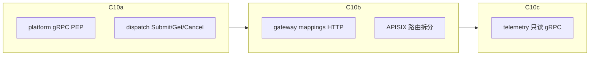

# C10 多服务授权推广执行计划

> **默认范围：** 分波覆盖 gateway / dispatch / telemetry（`AUTHZ_CENTRALIZATION_PLAN` C10），每波可单独合入与验收。  
> **不在本计划：** C11（B1′ 集中 Syncer + Kafka）；gateway `ExecuteCommand`、EMS ingest、Kafka 消费者的用户 RBAC。

---

## 关键决策（已拍板）

| 决策点 | 选择 |
|--------|------|
| 推进方式 | **C10a → C10b → C10c** 串行；每波自带单测 + 文档状态更新 |
| dispatch 身份契约 | gRPC metadata 键 **`x-userinfo`**，载荷与 resource 的 APISIX `X-Userinfo` 相同（JSON / Base64 JSON）；复用 [`ParseXUserinfo`](internal/platform/middleware/casdoor_userinfo.go) |
| dispatch 信任开关 | 配置项对齐 resource：`auth.trust-proxy-headers`（false=本地旁路；true=强制身份 + PermissionChecker） |
| APISIX 对 dispatch | C10a **先不建**生产级 gRPC 路由；联调用 `grpcurl` / 管理端直连并带 metadata。北向统一入口列为 C10a 收尾「可选加固」文档项，不阻塞合入 |
| gateway | **仅 mappings** 进人管 OIDC；`telemetry:ingest` 继续 key-auth；`ExecuteCommand` 不加用户 RBAC |
| telemetry | **仅只读 RPC** 做用户 PEP；`IngestTelemetry` 视为机机（gateway→telemetry），C10c 用「内网调用跳过用户 PEP」或保持无用户鉴权 |
| 阈值 | dispatch：`healthy-after` 默认 **1m**，`stale-after` **5m**，`allow-read-when-invalid: false`（相对 resource 的 5m/30m 收紧） |

---

## C10a — 平台 gRPC PEP + dispatch（最高优先）

**目标：** 控制指令入口受 Casdoor 策略约束，且策略失联时 fail-closed（对齐计划 §6.2 / 验收项）。

### A1. 平台：可复用的 gRPC PEP

在 [`internal/platform/middleware/`](internal/platform/middleware/)（或 `authz` 旁）新增：

- `AuthUnaryInterceptor(cfg, checker, mapMethod)`：
  - `trust=false` → 直接放行
  - 从 metadata 读 `x-userinfo` → `ParseXUserinfo`
  - 租户：与 request 中 `TenantID` 字段比对（dispatch proto 均含 `TenantID`）；可用小型 interface / 反射辅助，优先显式 per-service mapper 更稳
  - `checker.Allow(ctx, id, obj, act)`；拒绝 → `PermissionDenied` / 降级文案对齐 resource
- 方法映射接口由各服务提供：`FullMethod → (obj, act)`（例如 `/dispatchpb.DispatchService/SubmitTask` → `dispatch:tasks` + `submit`）

不改动 [`NewGRPCServer`](internal/platform/server/grpc.go) 全局默认栈（避免强加给未接入服务）；由 **dispatch `createServer` 自行 `grpc.ChainUnaryInterceptor` 追加**，或提供 `NewGRPCServerWithAuth(...)` 可选构造。

### A2. dispatch：目录 + 接线

| 产物 | 说明 |
|------|------|
| `adapter/inbound/grpc/catalog.go` | method → `(dispatch:tasks, submit\|read\|cancel)` |
| `adapter/inbound/grpc/authz_catalog.go` | C9 风格 `AuthzCatalog`：`dispatch:tasks` × `{submit,read,cancel}` |
| `options` / `config` / `config/dispatch.yaml` | `auth.*` + `auth.authz.*`；控制类默认阈值如上 |
| [`server.go`](internal/dispatch/server.go) | 复用 resource `wireAuthz` 模式：Checker、Syncer、RegisterCatalog、metrics；interceptor 挂上 |
| Casdoor 种子（可选加固） | `build_init_data.py` 增加粗粒度 `vpp-dispatch-*` 角色绑定（与 resource 占位角色一致），避免仅靠空 Roles 的 `catalog-*` 条目导致冷启动后无人能 submit |

### A3. 验收（C10a）

- 单测：trust 旁路、缺 userinfo、租户不一致、viewer 不能 submit、admin 可 submit、冷启动安全网、invalid fail-closed、**stale 超过 1m 健康阈值时控制写拒绝**（若 Checker 已支持按配置；必要时仅用更短 HealthyAfter 覆盖现有档位逻辑）
- 文档：更新 [`AUTHZ_CENTRALIZATION_PLAN.md`](docs/AUTHZ_CENTRALIZATION_PLAN.md) C10 子状态；[`AUTHZ_TEST.md`](docs/AUTHZ_TEST.md) 增加 grpcurl + `x-userinfo` 示例
- 合入标准：`go test` platform middleware/authz + dispatch inbound；计划验收句「dispatch fail-closed」可勾选

---

## C10b — gateway mappings（人管）+ APISIX 拆分

**目标：** 管理端用 Casdoor 管 ID 映射；EMS 机机路径不变。

### B1. APISIX

拆分现有 [`deploy/apisix/routes/gateway.yaml`](deploy/apisix/routes/gateway.yaml)：

- `/gateway/.../telemetry:ingest`（及仅 ingest 所需前缀）→ 继续 **key-auth**
- `/gateway/.../mappings*` → **openid-connect** + `X-Userinfo`（对齐 resource 路由写法）

### B2. gateway 服务

- 在 [`adapter/inbound/http`](internal/gateway/adapter/inbound/http/) 增加与 resource 同构的 `AuthMiddleware`（可抽共享 Gin 中间件到 `platform/middleware` 以减复制；若抽公共，本波一并做，避免三份拷贝）
- `resourceOf`/`actionOf`：`gateway:mappings` × `read|write|delete`（PATCH disable → `write`）
- `AuthzCatalog` + `wireAuthz` + `config/gateway.yaml`
- **不对** `IngestTelemetry` HTTP handler 强制用户 RBAC（该路由仍走 key-auth；若误打到服务，可用「无 userinfo 且路径为 ingest → 放行」或路由级不挂用户中间件）

### B3. 验收（C10b）

- mappings：无 JWT → 401；viewer 只读；写/删需 operator/admin（种子或 catalog 绑定）
- ingest：仍仅 API Key，行为回归
- 文档：[`CASDOOR.md`](docs/CASDOOR.md) / [`APISIX.md`](docs/APISIX.md) 补充双插件路由

---

## C10c — telemetry 只读查询

**目标：** 管理端/内部带用户身份的查询受策略约束；ingest 保持机机。

### C1. 服务侧

- 复用 C10a gRPC interceptor
- 映射：
  - `QueryTelemetry` / `QueryAggregation` → `telemetry:telemetry` / `telemetry:aggregation` + `read`
  - `GetSnapshot` / `GetFleetSnapshot` → `telemetry:snapshots` + `read`
  - `IngestTelemetry` → **跳过用户 PEP**（或单独 `trust-service` 短路）
- Catalog 注册只含只读条目；阈值用 resource 级（管理只读），不必用 dispatch 的 1m
- 配置 + `server` 组装同前

### C2. 北向

- 本期同样以 metadata `x-userinfo` + trust 开关验收；不强制先做 APISIX gRPC
- 若尚无真实管理端查询入口，本波以单测 + 本地 grpcurl 为完成定义

### C3. 验收（C10c）

- 只读允许/拒绝矩阵；Ingest 在无用户头时仍可被内部调用（单测覆盖）
- 计划 C10 整行标 ✅；开放问题里「N 服务轮询」指向 C11 评估

---

## 共享与文档（贯穿三波）

每波结束更新：

- [`docs/AUTHZ_CENTRALIZATION_PLAN.md`](docs/AUTHZ_CENTRALIZATION_PLAN.md)：C10 拆成 C10a/b/c 状态表 + 交付物路径
- [`docs/AUTHZ_TEST.md`](docs/AUTHZ_TEST.md) / [`docs/AUTHZ_RUNBOOK.md`](docs/AUTHZ_RUNBOOK.md)：dispatch 更严阈值的运维说明
- Casdoor 种子：优先 **C10a 补 dispatch 角色绑定**；gateway/telemetry 绑定可在对应波次增量

**刻意不做：**

- 用 Casdoor 管 `gateway.ExecuteCommand` / EMS ingest
- 在 usecase 层引入 casdoor-sdk
- 本计划内落地 B1′（C11）

---

## 建议排期与风险

| 波次 | 相对工期 | 主要风险 |
|------|----------|----------|
| C10a | 最大（新 interceptor + 租户从 proto 取值 + 严阈值） | 管理端未传 `x-userinfo` 会全拒；需同步改造调用方或临时 trust=false |
| C10b | 中（APISIX 路由拆分易踩路径正则） | ingest/mappings 前缀重叠导致鉴权插件绑错 |
| C10c | 小（复用 A1） | Ingest 误加用户 PEP 会打断 gateway→telemetry |

**推荐开工顺序：** 先合入 **C10a**，确认控制面契约后再开 C10b。
