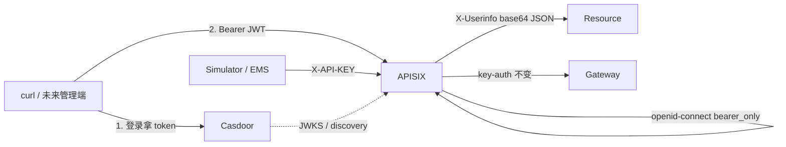
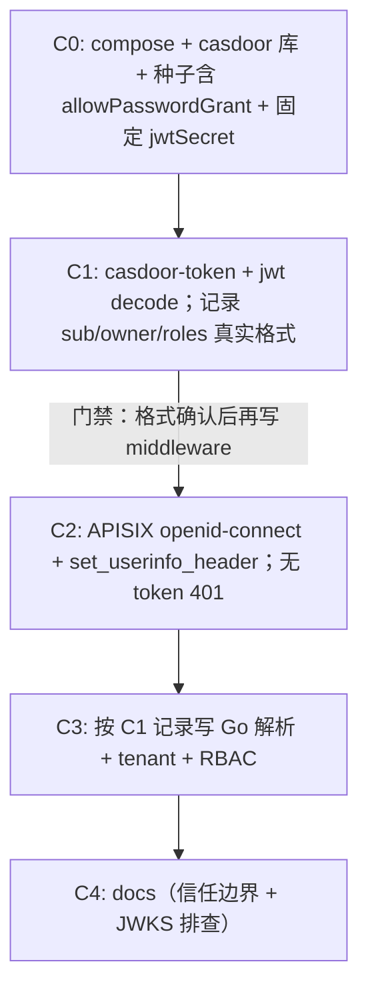

# Casdoor 用户中心接入方案

## 1. 定位与边界（沿用 APISIX 计划结论）

| 层次 | 组件 | 职责 |
|------|------|------|
| IdP | **Casdoor** | 用户/组织/角色；登录；JWT **签发** |
| PEP | **APISIX** | 校验 Bearer token；限流；注入 **`X-Userinfo`**（整包 userinfo） |
| 细粒度授权 | **Resource** | 解析 `X-Userinfo` → 身份；校验 path `TenantID`；按角色拦 API |
| EMS 机机 | APISIX `key-auth` | **不接 Casdoor**（Phase 1 已完成） |

不自研 `internal/auth/`，不引入 `casdoor-sdk-go`。业务只依赖 APISIX 注入的 header，与具体 IdP 解耦——换 Keycloak/Authing 时改 APISIX `discovery` 即可。

内部 gRPC `AuthUnaryInterceptor` **不在本期**。



**架构风险判断：** 标准 OIDC + 无 SDK 侵入，IdP 可替换，整体风险低。真正需要警惕的是下一节的 **header 信任边界**，而不是 Casdoor 本身。

## 2. 已定实现选型

- **部署形态**：独立 [`deploy/casdoor/`](deploy/casdoor/)，与 [`deploy/apisix/`](deploy/apisix/) 同级；不并入根 [`compose.yaml`](compose.yaml)。
- **数据库**：复用现有 Timescale/Postgres，新建库 `casdoor`（不新建第二套 Postgres）。
- **APISIX 插件**：`openid-connect`，**`bearer_only: true`**；**`set_userinfo_header: true`**。
- **Header 注入路径（锁定路径 C）**：APISIX **只**转发 `X-Userinfo`（插件自带，整包 base64 JSON）。**不写** `serverless-pre-function` Lua，**不在** APISIX 拆 `X-User-ID` / `X-Tenant-ID` / `X-Roles`。字段提取全部在 Resource Go middleware，可测、单一收口。
- **Discovery**：`http://host.docker.internal:8000/.well-known/openid-configuration`；Casdoor `:8000`。
- **租户模型**：Casdoor Organization 名 = VPP `tenant_id`；JWT `owner` = Organization name；首期 Organization `default`。
- **角色**：`admin` / `operator` / `viewer`。Casdoor JWT 里 `roles` 通常是**对象数组**（含 `name`/`owner`），不是 `string[]`——以 **C1 实测 decode 为准**，middleware 从对象取 `name`。
- **密钥**：Casdoor `app.conf` 配置**固定** `jwtSecret`，避免 compose 重启后签名钥变化导致 APISIX JWKS 缓存打脸 401。

## 3. Header 信任边界（必须写进文档，不可埋开关里）

**事实：** Resource 若信任代理 header，则任何人直连 `http://127.0.0.1:8082` 并伪造 `X-Userinfo`（或将来的身份 header）即可冒充任意租户/角色，**完全绕过 Casdoor 与 APISIX**。

| 环境 | 策略 |
|------|------|
| 经 APISIX `:9080/resource/*` | 唯一受保护入口；token 无效 → 401 |
| 直连 `:8082`（compose 本地） | **调试旁路**；等同「鉴权关闭」。`docs/CASDOOR.md` 用醒目章节写明 |
| 未来 K8s | Resource Service/Pod **不对外暴露**，仅 ClusterIP + APISIX Ingress，伪造面消失 |

**`auth.trust-proxy-headers` 语义（纠正原方案表述）：**

| 值 | 行为 |
|----|------|
| `true`（经 APISIX 的推荐配置） | **强制**要求有效 `X-Userinfo`；缺失/非法 → **401**；再做 tenant/RBAC |
| `false`（纯本地直连调试） | **不强制**身份 header；不跑 tenant/RBAC（整段鉴权旁路）。**不是**「跳过解析但仍信任伪造 header」 |

禁止第三种歧义行为：`false` 时若仍读取并信任客户端伪造的 header，等于打开后门。`false` = 鉴权全关；`true` = 必须带合法代理身份。

## 4. 目录与运维面

新增：

```
deploy/casdoor/
  docker-compose.casdoor.yaml
  conf/app.conf                 # 含固定 jwtSecret
  init/                         # 幂等种子：org / app / users / roles
  README.md
docs/CASDOOR.md                 # 边界 + 信任警示 + 联调 + 故障排查
```

改动：

- [`deploy/apisix/init.sh`](deploy/apisix/init.sh) — `put_resource_route`：`openid-connect` + `limit-req`（无 Lua）
- [`deploy/apisix/routes/resource.yaml`](deploy/apisix/routes/resource.yaml) — 文档对齐
- [`Makefile`](Makefile) — `casdoor-up/down/init/status/token`；可选 `edge-up`
- [`docs/APISIX.md`](docs/APISIX.md) — Phase 2 runbook → 链到 `docs/CASDOOR.md`

**镜像（拟定）**：`casbin/casdoor:v1.804.0`（或当时稳定 tag），`8000:8000`；`extra_hosts: host.docker.internal:host-gateway`。

## 5. Casdoor 侧配置（身份源）

| 项 | Dev 值 |
|----|--------|
| Organization | `default`（= tenant_id / JWT `owner`） |
| Application | `vpp-resource` |
| **Allow Password Grant** | **`true`（种子必须显式设置）** |
| Redirect URI | 预留给未来 SPA；bearer_only 联调不依赖 |
| Client ID / Secret | `deploy/casdoor/init` + APISIX 环境变量，**仅 dev** |
| jwtSecret | **固定值**（写入 `app.conf`，进 git 的仅限 dev secret） |
| 种子用户 | `admin@default`（admin）、`operator@default`（operator）、可选 `viewer@default` |

拿 token：Password Grant → `make casdoor-token USER=...`。未开 Password Grant 时 token endpoint 返回 `unsupported_grant_type`，易被误判为 URL/密钥问题——故 C0 种子强制打开。

## 6. APISIX Phase 2（`/resource/*`）

```yaml
plugins:
  proxy-rewrite:
    regex_uri: ["^/resource/(.*)", "/$1"]
  openid-connect:
    client_id: "..."
    client_secret: "..."
    discovery: "http://host.docker.internal:8000/.well-known/openid-configuration"
    bearer_only: true
    realm: "vpp"
    set_userinfo_header: true   # → X-Userinfo；Resource 侧解析
  limit-req:
    rate: 30
    burst: 50
    key: remote_addr
    rejected_code: 429
```

| 请求 | 结果 |
|------|------|
| 无 / 无效 Bearer | **401**，不进 Resource |
| 有效 token | 转发 `:8082`，带 `X-Userinfo` |
| EMS `/gateway/*` | **不变**（key-auth） |

## 7. Resource 应用侧（最小闭环）

新增 identity middleware（[`internal/platform/middleware/`](internal/platform/middleware/) 或 resource 专用）：

1. **`trust-proxy-headers: true`**  
   - Decode `X-Userinfo`（base64 JSON）  
   - 映射：`sub` → user；`owner` → tenant；`roles[].name` → 角色集合（**字段名以 C1 实测为准**）  
   - 缺失/非法 → **401**

2. **Tenant guard**  
   - path 含 `{TenantID}`：`owner`/tenant 必须等于 path，否则 **403**  
   - import-jobs 等：用身份 tenant 约束查询（细则写进 `docs/CASDOOR.md`）

3. **RBAC 矩阵**

| 角色 | 读（GET） | 写（POST/PUT） | 删 / changeLifecycle |
|------|-----------|----------------|----------------------|
| viewer | 允许 | 拒绝 | 拒绝 |
| operator | 允许 | 允许 | 拒绝 |
| admin | 允许 | 允许 | 允许 |

挂载：Gin 全局中间件；**不改 proto**；**无 Casdoor SDK**。

本期不做：用户 CRUD、Gateway JWT、gRPC 拦截器、管理端 SPA。

## 8. 实施顺序（含 claim 实测门禁）



**门禁：** C1 结束必须留下一份实测 claim 样例（可贴在 `docs/CASDOOR.md`），再开始写 C3。禁止先写死 `roles: []string` 再发现是对象数组。

验收：

```bash
# 401 — 无 token（经 APISIX）
curl --noproxy '*' -s -o /dev/null -w '%{http_code}\n' \
  http://127.0.0.1:9080/resource/api/tenants/default/sites

# 200 — Bearer
curl --noproxy '*' -s -o /dev/null -w '%{http_code}\n' \
  -H "Authorization: Bearer $(make -s casdoor-token USER=admin)" \
  http://127.0.0.1:9080/resource/api/tenants/default/sites

# 403 — 跨 tenant path / viewer DELETE
```

## 9. 文档必含故障排查（JWKS）

`docs/CASDOOR.md` 专节：

- Casdoor 重启后 token 全 401 → 多为 JWKS 缓存仍持旧钥；**固定 jwtSecret** 优先；仍异常则 `make apisix-down && make apisix-up && make apisix-init` 或重启 APISIX 清缓存。
- `unsupported_grant_type` → Application 未开 Password Grant，检查种子。
- 直连 `:8082` 能伪造身份 → 预期行为（信任边界），不是 bug。

## 10. 主要改动清单

| 路径 | 动作 |
|------|------|
| `deploy/casdoor/*` | compose、固定 jwtSecret、种子（Password Grant）、token 脚本 |
| `deploy/apisix/init.sh` + `routes/resource.yaml` | OIDC bearer_only + set_userinfo_header |
| `Makefile` | casdoor-* / casdoor-token / edge-* |
| `internal/platform/middleware/` + resource 挂载 | 解析 X-Userinfo + tenant + RBAC |
| `docs/CASDOOR.md`、`docs/APISIX.md` | 手册、信任边界、Phase 2 |
| `config/resource.yaml` | `auth.trust-proxy-headers` |

## 11. 明确不做

- 自研用户中心 / 双 IdP / Casdoor SDK 进业务
- APISIX Lua 拆自定义身份 header（路径 A/B 放弃）
- EMS / Simulator 改 OIDC
- 管理端 SPA
- 内部 gRPC mTLS / token
- K8s Ingress（APISIX Phase 4）

## 12. 评审结论保留（无需改动的决策）

- `bearer_only: true`、不自研 auth、EMS 保持 key-auth、Organization=`tenant_id`、复用 Postgres 建 `casdoor` 库——均维持。
