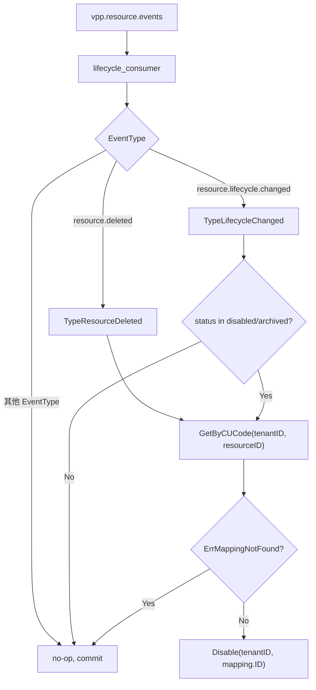

# CU 生命周期同步 v2 计划

## 架构决策背景（不改代码，只做约束）

本计划基于两轮讨论确立的以下架构原则：

**1. Kafka 的非对称角色**

```
CU 删除/禁用  → Kafka 事件 → Gateway 自动 Disable Mapping   ✅ 本计划实现
CU 创建       → 不触发 Gateway 自动创建 Mapping              ✅ 设计约束
```

创建流程由 **Onboarding 工作流**显式协调（管理 UI 同时调用 Resource.CreateCU + Gateway.CreateMapping），两个服务互不知情。后续在管理后台实现此向导，无需后端微服务级改动。

**2. CUCode = Resource CU UUID 约定**

Gateway `DeviceMapping.CUCode` 字段必须填写 resource 服务分配的 CU `ID`（UUID v7）。这是整个 lifecycle sync 能工作的前提，需要写入 `architecture.md` 和 Gateway 的 `CreateMapping` API 文档。

**3. 服务边界**
- Resource = "VPP 里有什么资源"
- Gateway = "这些资源如何与外部系统建立连接"（Mapping 是 Gateway 的接入配置，不是 Resource 的资产属性）

---

## Part A — Gateway Lifecycle Consumer（原计划）

实现 Kafka 消费侧，当 CU 被删除或生命周期变更为禁用/归档时自动 Disable DeviceMapping。

### 事件处理逻辑



**已知限制：** `delete_resource.go` 在 `IncludeDescendants=true` 时只发一条根节点事件，子树 CU 不会触发各自的 disable，作为后续改进项。

### 文件变更

```
internal/gateway/
├── options/options.go              ← 加 KafkaOptions（brokers/topic/group-id）
├── config/config.go                ← 加 KafkaConfig
├── application/command/
│   └── disable_mapping_by_cu.go   ← 新增：DisableMappingByCUCode 命令
├── adapter/inbound/kafka_sub/
│   └── lifecycle_consumer.go      ← 新增：Kafka consumer（segmentio/kafka-go Reader）
└── server.go                      ← 初始化 consumer，接入 errgroup + shutdown
```

**`disable_mapping_by_cu.go`** Handle 逻辑：
1. `repo.GetByCUCode(ctx, tenantID, cuCode)`
2. 若 `ErrMappingNotFound` → return nil（静默跳过，该资源不是 CU 或未建 mapping）
3. 否则 `repo.Disable(ctx, tenantID, mapping.ID)`

**`lifecycle_consumer.go`** 关键设计：
- `kafka.NewReader`，GroupID = `vpp-gateway-resource-events`（at-least-once）
- 反序列化为 `platEvent.Envelope[json.RawMessage]`，switch EventType
- Disable 失败：log + 不 commit（让 consumer group 重试）
- Brokers 为空时 consumer 不启动（no-op 降级）
- `go get github.com/segmentio/kafka-go@v0.4.51` 加入 `gateway/go.mod`

---

## Part B — Resource 模型清理：移除 ConnStatus 的 Postgres 持久化

**问题：** `CU.ConnStatus` 当前在 postgres CU 表和 redis `CURuntime` 中均存在，但两者语义重复：
- `model.CU.ConnStatus` 在 postgres 存储（随 CU CRUD 持久化）
- `model.CURuntime.ConnStatus` 在 redis 存储（通过 `PatchCURuntime` 高频更新）

连接状态是**运行时动态信息**，正确归宿是 redis runtime cache，不应写入 postgres 主表。且目前 proto 的 `UpdateCURequest.ConnStatus` 允许通过管理 API 直接写 ConnStatus，违反"连接状态由 gateway 链路决定"的原则。

### 文件变更

```
internal/resource/
├── domain/model/cu.go              ← 删除 ConnStatus ConnStatus 字段
├── application/command/update_cu.go ← 删除 cmd.ConnStatus 分支
├── infrastructure/persistent/postgres/
│   └── cu_repo.go (或 adapter)    ← 删除 ConnStatus 的读写
└── (DB migration)                  ← 不需要删除 postgres 列（可保留为废弃列），
                                       但不再写入

api/resource/proto/modules/cu.proto ← 删除 CU.ConnStatus 字段（field 10）
                                       和 UpdateCURequest.ConnStatus（field 12）
                                    ← 需要重新运行 genproto.sh 生成 Go 代码
```

**proto 字段删除策略：** 使用 proto3 `reserved` 声明保留字段号，防止未来复用：

```protobuf
message CU {
  reserved 10;  // was ConnStatus, now lives in CURuntime (Redis)
  ...
}
message UpdateCURequest {
  reserved 12;  // was ConnStatus
  ...
}
```

`ConnStatus` 类型定义和 `CURuntime` 模型**保持不变**，连接状态继续通过 `CURuntimeReader.GetCURuntime` 读取展示。

---

## Part C — CU.ExternalID 的处置

**问题：** `CU.ExternalID` 和 `CU.Provider` 在 resource 中存储外部设备标识，与 gateway `DeviceMapping.ExternalID + ExternalSystem` 语义重复，且 gateway 才是路由的 Source of Truth。

**当前建议（渐进式）：** 保留字段，但明确降级为"人工填写的展示性备注"，不参与任何业务逻辑。在 proto 注释和 API 文档中标注：

> ExternalID/Provider are informational only. The authoritative integration configuration lives in gateway DeviceMapping. Do not use these fields for routing.

**移除时机：** 当 Onboarding 向导上线且管理 UI 可从 gateway 查询映射关系展示后，再做 proto 字段删除 + DB 迁移。这样不会打断现有 API 消费方。

---

## Part D — architecture.md 更新

更新 [`architecture.md`](architecture.md) 补充：
1. CUCode = Resource CU UUID 约定（明确写明）
2. Kafka 非对称角色说明（cleanup only）
3. ConnStatus 数据归宿（redis CURuntime，非 postgres）
4. Onboarding 工作流描述（创建时的协调模式）
5. 更新"尚未打通"状态：resource → Kafka 已实现，gateway consumer 为本计划目标
