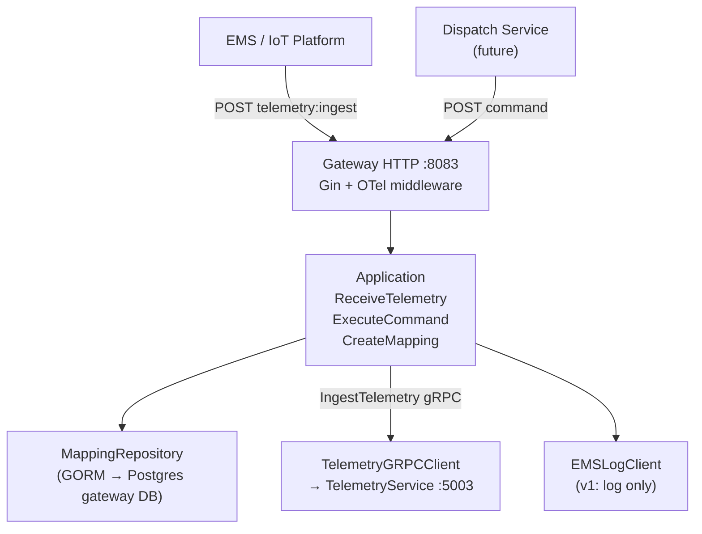

# Gateway 服务开发计划 (改进版)

## 与原方案的核心差异

原方案由 GPT 生成，存在以下与项目不符的地方，本方案逐一修正：

| 原方案 | 改进方案 | 原因 |
|---|---|---|
| `ResourceID string` | `CUCode string` | telemetry 服务用 `(TenantID, CUCode)` 寻址，不用 UUID |
| 无 `TenantID` | 所有模型带 `TenantID` | 项目全面多租户 |
| `Timestamp int64` | `Timestamp time.Time` | 与项目其他 domain model 一致 |
| 单指标 ExternalTelemetry | `Metrics []ExternalMetric` | 与 `IngestTelemetry` command 的 batch 结构对齐 |
| ResourcePort（v1 gRPC） | v1 无 ResourcePort | mapping 存本地 DB，不需要调 resource 服务 |
| 无文件结构说明 | 完整六边形结构，与 resource/telemetry 一致 | |
| 无 go.mod / config | 明确模块与配置约定 | |
| 无 DB migration | `migrations/gateway/000001_init.up.sql` | 与项目 migration 规范一致 |

---

## 1. 目录结构

与 resource、telemetry 服务完全对齐的六边形 + CQRS 布局：

```
internal/gateway/
├── cmd/main.go
├── app.go              # NewApp("vpp-gateway")
├── run.go              # runApp()，config loading
├── server.go           # createServer() 组合根
├── go.mod              # module github.com/mushroomyuan/vpp-backend/gateway
├── config/config.go    # Config struct
├── options/options.go  # Viper mapstructure options + defaults + Validate()
├── domain/
│   ├── model/
│   │   ├── device_mapping.go        # DeviceMapping
│   │   ├── external_telemetry.go    # ExternalTelemetry + ExternalMetric
│   │   └── standard_telemetry.go   # StandardTelemetry（对齐 IngestTelemetry command）
│   ├── port/
│   │   ├── mapping_repository.go   # 本地 DB 接口
│   │   ├── telemetry_client.go     # gRPC 出站接口
│   │   └── ems_client.go           # EMS 接口（v1: log-only）
│   └── errors.go
├── application/
│   ├── app.go
│   └── command/
│       ├── receive_telemetry.go
│       ├── execute_command.go
│       ├── create_mapping.go
│       └── delete_mapping.go
├── adapter/
│   ├── inbound/http/
│   │   ├── router.go
│   │   ├── telemetry_handler.go
│   │   ├── command_handler.go
│   │   └── mapping_handler.go
│   └── outbound/
│       ├── postgres/mapping_repository.go   # port.MappingRepository GORM 实现
│       ├── telemetry_grpc/client.go         # port.TelemetryClient gRPC 实现
│       └── ems_log/client.go                # port.EMSClient log-only 实现
└── infrastructure/persistent/postgres/
    ├── db.go           # GORM init（复用 resource 模式）
    ├── models.go       # DeviceMappingModel
    └── mapping_repository.go
```

新增配置和迁移文件：
- [`config/gateway.yaml`](config/gateway.yaml)
- `migrations/gateway/000001_init.up.sql`
- `migrations/initdb/40-gateway-schema.sql`

---

## 2. 领域模型

### DeviceMapping（改进：CUCode 替代 ResourceID，补全 TenantID）

```go
// domain/model/device_mapping.go
type DeviceMapping struct {
    ID             string    // UUID v7 (platform/idgen)
    TenantID       string
    ExternalSystem string    // e.g. "ems-sg"
    ExternalID     string    // EMS 侧设备 ID，如 "SG001"
    CUCode         string    // telemetry 服务的 CU 标识（原方案误用 ResourceID）
    CreatedAt      time.Time
    UpdatedAt      time.Time
}
```

### ExternalTelemetry（改进：多指标 + TenantID + time.Time）

```go
// domain/model/external_telemetry.go
type ExternalMetric struct {
    Name  string
    Value float64
}

type ExternalTelemetry struct {
    TenantID       string
    ExternalSystem string
    ExternalID     string
    Timestamp      time.Time
    Metrics        []ExternalMetric
}
```

### StandardTelemetry（与 telemetry 服务 IngestTelemetry command 对齐）

telemetry 服务的入站命令结构为：

```go
// 来自 internal/telemetry/application/command/ingest_telemetry.go
type IngestTelemetry struct {
    TenantID  string
    CUCode    string
    Timestamp time.Time
    Metrics   []MetricInput  // {Name, Value, Type model.MetricType, Quality model.QualityStatus}
}
```

因此 StandardTelemetry 对应为：

```go
// domain/model/standard_telemetry.go
type MetricValue struct {
    Name    string
    Value   float64
    Type    string  // "ANALOG" | "DISCRETE"，v1 默认 "ANALOG"
    Quality string  // "GOOD" | "BAD"，v1 默认 "GOOD"
}

type StandardTelemetry struct {
    TenantID  string
    CUCode    string
    Timestamp time.Time
    Metrics   []MetricValue
}
```

---

## 3. Ports（依赖接口）

```go
// domain/port/mapping_repository.go
type MappingRepository interface {
    Create(ctx context.Context, m *model.DeviceMapping) error
    Delete(ctx context.Context, tenantID, id string) error
    GetByExternalID(ctx context.Context, tenantID, externalSystem, externalID string) (*model.DeviceMapping, error)
    GetByCUCode(ctx context.Context, tenantID, cuCode string) (*model.DeviceMapping, error)
    List(ctx context.Context, tenantID string) ([]*model.DeviceMapping, error)
}

// domain/port/telemetry_client.go
type TelemetryClient interface {
    Ingest(ctx context.Context, t *model.StandardTelemetry) error
}

// domain/port/ems_client.go
type EMSClient interface {
    SendCommand(ctx context.Context, externalSystem, externalID, command string, value float64) error
}
```

v1 **无 ResourcePort**（mapping 存本地 DB，查询不需要调 resource gRPC）。

---

## 4. Application 层（CQRS，复用 platform/decorator）

所有 handler 使用 `decorator.ApplyCommandDecorators` 包装，与 telemetry 服务一致。

### ReceiveTelemetry

```
ExternalTelemetry (tenantID, externalSystem, externalID, metrics)
    → MappingRepository.GetByExternalID
    → 构建 StandardTelemetry（type=ANALOG, quality=GOOD）
    → TelemetryClient.Ingest
    → error: ErrMappingNotFound → HTTP 404
```

### ExecuteCommand

```
(tenantID, cuCode, command, value)
    → MappingRepository.GetByCUCode
    → EMSClient.SendCommand(externalSystem, externalID, command, value)
```

### CreateMapping / DeleteMapping

- `CreateMapping`：生成 UUID v7，调 `MappingRepository.Create`
- `DeleteMapping`：调 `MappingRepository.Delete`

---

## 5. 出站 Adapter：TelemetryClient gRPC

引用已有的 `api/telemetry/proto/gen`，通过 `go.mod` replace 指令：

```
replace (
    github.com/mushroomyuan/vpp-backend/api/telemetry/proto/gen => ../../api/telemetry/proto/gen
    github.com/mushroomyuan/vpp-backend/platform => ../platform
)
```

实现：

```go
// adapter/outbound/telemetry_grpc/client.go
func (c *telemetryGRPCClient) Ingest(ctx context.Context, t *model.StandardTelemetry) error {
    req := &telemetrypb.IngestTelemetryRequest{
        TenantID:  t.TenantID,
        CUCode:    t.CUCode,
        Timestamp: timestamppb.New(t.Timestamp),
        Metrics:   mapMetrics(t.Metrics),  // MetricValue → proto MetricValue
    }
    _, err := c.client.IngestTelemetry(ctx, req)
    return err
}
```

---

## 6. 入站 Adapter：纯 Gin HTTP

网关的外部 API 是纯 HTTP（EMS 不是 gRPC caller），**无需 grpc-gateway**。

路由（`adapter/inbound/http/router.go`）：

```
POST   /api/v1/tenants/:tenant_id/telemetry:ingest
POST   /api/v1/tenants/:tenant_id/command
POST   /api/v1/tenants/:tenant_id/mappings
DELETE /api/v1/tenants/:tenant_id/mappings/:id
GET    /api/v1/tenants/:tenant_id/mappings
```

Gin engine 使用 `platform/server.NewGinEngine`（OTel + 日志中间件，与 resource 服务一致）。

---

## 7. 数据库模型与迁移

### GORM Model（对齐 resource 服务 postgres/models.go 风格）

```go
// infrastructure/persistent/postgres/models.go
type DeviceMappingModel struct {
    ID             string    `gorm:"primaryKey;type:varchar(36)"`
    TenantID       string    `gorm:"not null;index:idx_tenant"`
    ExternalSystem string    `gorm:"not null"`
    ExternalID     string    `gorm:"not null"`
    CUCode         string    `gorm:"not null"`
    CreatedAt      time.Time
    UpdatedAt      time.Time
}
```

### 迁移文件（`migrations/gateway/000001_init.up.sql`）

```sql
CREATE TABLE IF NOT EXISTS device_mappings (
    id              VARCHAR(36)  PRIMARY KEY,
    tenant_id       VARCHAR(64)  NOT NULL,
    external_system VARCHAR(64)  NOT NULL,
    external_id     VARCHAR(128) NOT NULL,
    cu_code         VARCHAR(128) NOT NULL,
    created_at      TIMESTAMPTZ  NOT NULL DEFAULT NOW(),
    updated_at      TIMESTAMPTZ  NOT NULL DEFAULT NOW(),
    UNIQUE (tenant_id, external_system, external_id)
);
CREATE INDEX IF NOT EXISTS idx_device_mappings_cu
    ON device_mappings(tenant_id, cu_code);
```

---

## 8. 配置（`config/gateway.yaml`）

```yaml
tracing:
  endpoint: "127.0.0.1:4317"
  insecure: true

gateway:
  service-name: vpp-gateway
  http-addr: ":8083"
  metrics-addr: ":9104"
  consul-addr: "127.0.0.1:8500"

database:
  driver: postgres
  host: 127.0.0.1
  port: 5432
  user: postgres
  password: postgres
  dbname: gateway
  params:
    sslmode: disable
    TimeZone: Asia/Shanghai

telemetry-grpc:
  addr: "127.0.0.1:5003"
```

`options/options.go` 使用与 resource 相同的 Viper + mapstructure + `Validate()` 模式。

---

## 9. server.go 组合根（无 gRPC Server，无 Redis）

v1 gateway 服务器比 resource/telemetry 更轻量：

```
createServer():
  1. metrics.New(metricsAddr)
  2. postgres.NewPostgres(dbCfg)  →  DeviceMappingRepo
  3. grpc.NewClient(telemetryGRPCAddr)  →  TelemetryGRPCClient
  4. ems_log.NewClient()  →  EMSLogClient
  5. application.NewApplication(...)
  6. platform/server.NewGinEngine + http.Server
```

启动链与 resource/telemetry 一致：

```
cmd/main.go → NewApp() → Run() → runApp() → createServer() → PrepareRun().Run()
```

shutdown 顺序：HTTP Shutdown → metricsCancel（errgroup + signal，与 resource server.go 完全一致）。

---

## 10. Makefile 新增

```makefile
run-gateway:
    cd internal/gateway && go run ./cmd/main.go -c ../../config/gateway.yaml
```

---

## 数据流图



---

## v1 实现范围（与原方案一致，补全细节）

实现：
- `DeviceMapping` CRUD（Postgres，GORM）
- `ReceiveTelemetry`（HTTP → mapping 查询 → telemetry gRPC）
- `ExecuteCommand`（HTTP → mapping 查询 → log 输出）
- `TelemetryClient` gRPC 实现
- `EMSClient` log-only 实现
- 完整启动链、metrics、OTel tracing、Consul 注册

不实现：
- 多 EMS adapter（未来加 `adapter/outbound/ems_xxx/`）
- Resource 服务 gRPC client（v2 可加 CU 存在性校验）
- Kafka 消费（dispatch → gateway 的指令推送）
- 动态协议转换框架
