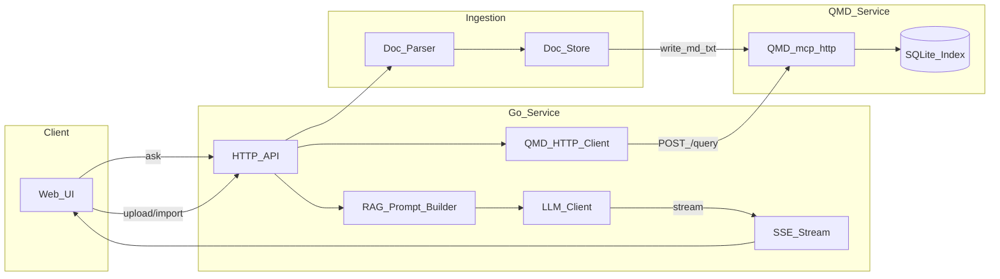

## 目标与范围
- **目标**：快速落地一个可用 MVP，支持“上传/导入资料 → 建索引 → 提问 → 返回带引用的总结答案（SSE 流式）”。
- **核心依赖**：
  - QMD：负责索引/检索（FTS+向量+可选重排），通过 `qmd mcp --http` 提供 HTTP。
  - Go：负责业务 API、鉴权（可选）、会话/日志、调用大模型（DeepSeek API 等）、SSE。
- **部署形态**：Docker Compose，**Go + QMD 两个服务**；QMD 仅监听 localhost（QMD 本身绑定 localhost），通过容器网络内访问。

## 总体架构

## 关键设计决策（MVP 友好）
- **检索接口**：优先走 QMD 的 REST `POST /query`（无需 MCP session），避免实现 MCP Streamable HTTP 会话管理。
  - QMD 实现可见：`src/mcp/server.ts` 中 `POST /query`（别名 `/search`）会把 `searches` 映射为结构化 `lex/vec/hyde` 查询并返回 `snippet/context/line` 等字段。
- **中文与混合格式**：由于资料格式混合（PDF/Word/HTML/MD），MVP 先做“预处理落地为 Markdown/纯文本”，再交给 QMD 索引。
- **答案必须可追溯**：LLM 输出要求**带引用**（至少文件路径 + 行号范围），降低幻觉风险。

## 目录结构（现代 Go 工程）
建议采用清晰分层：`cmd/` 入口、`internal/` 业务、`pkg/` 可复用客户端、`configs/` 配置。

- `cmd/server/main.go`
  - 读取配置、初始化 logger、HTTP router、依赖注入、启动服务。
- `internal/config/`
  - 环境变量与配置结构（支持 `.env`/Compose env）。
- `internal/http/`
  - 路由注册、handler、middleware（CORS、request-id、日志、限流可选）。
- `internal/rag/`
  - Prompt 模板、引用格式化、上下文拼接与裁剪策略。
- `internal/ingest/`
  - 文件上传、格式转换（PDF/Docx/HTML→md/txt）、入库路径规范。
- `internal/storage/`
  - 本地文件存储（MVP：挂载 volume）；后续可换 S3/MinIO。
- `pkg/qmd/`
  - QMD HTTP 客户端（封装 `POST /query`，超时、重试、错误解析）。
- `pkg/llm/`
  - 大模型客户端（DeepSeek/OpenAI 兼容接口），支持流式。
- `api/openapi.yaml`（可选）
  - API 文档定义（MVP 可以后补）。
- `deploy/compose.yaml`
  - Go + QMD 组合部署，挂载文档与 QMD 索引目录。

## 数据与索引组织（MVP）
- **统一落地目录**：Go 把导入的原始文件转成 `data/docs/<collection>/<yyyy-mm-dd>/<slug>.md`。
- **QMD collection**：建议 1 个集合起步，例如 `epidemic`，path 指向 `data/docs/epidemic`，pattern `**/*.{md,txt}`。
- **Context 设计**：按来源/学校/政策级别设置路径前缀 context，例如：
  - `/policies/`：高校政策
  - `/papers/`：论文与研究
  - `/notices/`：通知与公告

## API 规划（Go 对外）
### 1) 导入与管理
- `POST /v1/docs/upload`
  - 入参：multipart file + metadata（来源、类型、标签）。
  - 行为：落盘 → 转换为 md/txt（若需要）→ 返回 docId/path。
- `POST /v1/index/rebuild`（可选）
  - 行为：触发 qmd reindex/embed（MVP 可仅提供命令提示或后台任务）。

### 2) 检索
- `POST /v1/search`
  - 入参：`query`, `limit`, `minScore`, `collections?`, `filters?`
  - 行为：Go 调 QMD `POST /query`，返回 hits（snippet+context+引用信息）。

### 3) 问答（RAG + SSE）
- `POST /v1/qa`
  - 同步模式（返回完整答案 + 引用）。
- `GET /v1/qa/stream?query=...`
  - SSE 模式：
    - event: `retrieval`（先发检索结果摘要）
    - event: `token`（模型输出 token 流）
    - event: `final`（最终结构化结果：answer + citations）

## Go 调 QMD 的请求体（/query）
- 请求：
  - `searches`: `[{"type":"lex","query":...},{"type":"vec","query":...}]`（MVP 先用 1 lex + 1 vec）
  - `collections`: 默认 `epidemic`
  - `limit`: 5~10
  - `rerank`: true（有本地 reranker 模型时质量更稳）
- 响应：使用 QMD 返回的 `file/title/score/context/line/snippet` 作为证据块。

## Prompt 组装建议（langchaingo）
- System 指令（固定）：
  - 只能基于提供的 Evidence 回答。
  - 必须输出引用：`qmd://...:Lxx-Lyy`。
- Evidence 格式（每条）：
  - 标题、来源 context、片段（含行号）
- 生成策略：
  - 如果证据不足，明确说“不足以支持结论”，并建议检索词。

## 流式实现（SSE + Channel）
- Go handler 建立 `text/event-stream`。
- 后台 goroutine：
  - 先检索 QMD（超时 2~5s）
  - 再调用 LLM 流式接口，把 token 写入 channel
- 主 goroutine：从 channel 读并写 SSE，处理客户端断开与 context cancel。

## Docker Compose 规划
- `qmd` 服务：
  - 挂载：`./data/docs:/data/docs`、`./data/qmd-cache:/root/.cache/qmd`、`./data/qmd-config:/root/.config/qmd`
  - 启动：`qmd mcp --http --port 8181`（或由 compose 指定）
- `api` 服务：
  - 环境变量：`QMD_BASE_URL=http://qmd:8181`、`DEEPSEEK_API_KEY=...`

## 里程碑
- **M1（1-2 天）**：Go API + `/v1/search` + `/v1/qa/stream` 打通，手工准备 md/txt 文档。
- **M2**：接入上传与简单解析（先支持 HTML/纯文本；PDF/Docx 用外部转换工具）。
- **M3**：引用格式、错误处理、缓存与限流、观测（log/metrics）。
- **M4（可选）**：多租户/权限、外部向量库（Qdrant/PGVector）迁移评估。