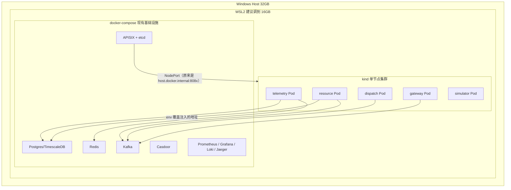

## 结论先说：本机部署，不用公司测试服务器

**推荐本机部署，用 `kind`（Kubernetes in Docker）起单节点集群。** 理由：

- **这是个人学习/作品向的项目**（partly for interview-signal），放到公司测试服务器上有权限归属、审计、"公司资源用于个人项目"的合规风险，没必要为了省一点本机资源去冒这个险
- **本机能自由重置**：kind 集群 `kind delete cluster` 一条命令销毁重建，公司服务器上你不一定有这种自由度（可能有别人共用、有变更审批流程），学 K8s 初期你会大量"搞砸重来"，这个自由度比什么都重要
- **网络最简单**：本机 kind 集群直接能连到你现有 `compose.yaml` 起的 Postgres/Kafka/Redis，不需要处理公司内网到测试服务器的连通性、防火墙、VPN 这些跟 K8s 学习本身无关的麻烦事
- 下面会用数据说明，资源完全够用，不是"可能有点紧张"

## 资源现实核查（不是拍脑袋，是我刚测的真实数据）

你说本机是 32GB 内存 / i7-14650HX，但我在你的 WSL2 环境里实测发现一个关键点：

```
$ cat /mnt/c/Users/*/.wslconfig
[wsl2]
memory=8GB
processors=8
```

**你的 WSL2 被手动限制成只有 8GB 内存 / 8 个处理器**，而不是物理机的 32GB / 16 核。`free -h` 显示当前已用 3.1GB、可用 4.5GB。`docker stats` 显示你现在常驻的 11 个容器（apisix+etcd、casdoor、consul、grafana、alloy、loki、prometheus、kafka、postgres、redis、jaeger）加起来大概只用了 **1.5GB 内存**，CPU 占用普遍在 1% 以下（都是空闲状态）。

结论：
- 当前 8GB 的 WSL2 配额，跑现有 compose 栈是够的，但如果再叠加一个 K8s 集群（kind 单节点控制面本身大概需要 1-2GB），可用余量会变紧张，遇到 Kafka/Postgres 偶尔的内存尖峰容易触发 OOM 或者卡顿
- 你有 32GB 物理内存，只分了 8GB 给 WSL2，**这是最值得先修的一步，零成本、零风险**：把 `.wslconfig` 的 `memory` 调到 16GB（给 Windows host 留 16GB 绰绰有余），`processors` 调到 12-16，然后 `wsl --shutdown` 重启一次 WSL2 生效
- 修完之后，kind 单节点集群 + 6 个 Go 服务 Pod（每个都是几十 MB 级别的小二进制，空闲时几乎不吃 CPU）叠加在现有 compose 栈上，资源完全宽裕，不需要担心

## 部署范围：不是把所有东西搬进 K8s

对照 `ROADMAP.md` 里这一项的原始措辞：

```
[ ] K8s 基础部署（现有 6 服务容器化 + 最小 manifests；依赖 CI 的 docker build 产出镜像；
    顺带用 ClusterIP 收紧端口暴露面、重新评估 Consul/配置中心的必要性）
```

这一阶段范围本来就是"6 个业务服务"，不包括把 Kafka/Postgres/Redis/APISIX/Casdoor/可观测性栈也迁进 K8s（那是数量级更大的工作——StatefulSet、PVC、Kafka 用 Strimzi operator 这类东西，属于以后可以单独立项的事，现在做属于范围膨胀）。

**这次要搬进 K8s 的：** `resource` / `telemetry` / `gateway` / `dispatch` / `simulator`（CI 里已经在构建镜像推到 GHCR 的那 5 个；`platform` 是共享库不是独立服务）。

**这次保留在 docker-compose、不动的：** Postgres/TimescaleDB、Kafka、Redis、APISIX、Casdoor、Consul、Prometheus/Grafana/Loki/Jaeger。K8s 里的 Pod 通过 kind 提供的 host 网络桥接（`extraPortMappings` / host-gateway）访问它们，配置注入方式复用你已有的 `docs/CONFIG_ENV_OVERRIDE.md` 那套环境变量覆盖机制，不需要改业务代码。

**顺带决定要不要退休 Consul：** K8s 自带的 Service + DNS 本来就是服务发现，等这次部署完，Consul 承担的那个角色基本被 K8s 原生能力取代，可以考虑退休它（不是这次必须做，但值得在验收时评估一次）。



## 工具选型：`kind`，不用 minikube

- **`kind`**（推荐）：本质就是把 K8s 节点跑成 Docker 容器，跟你现在 Docker-based 的工作流完全同构；起停一个集群 1 分钟内；最接近真实 kubeadm 集群的行为，学到的东西迁移到公司/生产 K8s 上最不打折扣；配置是一份 YAML，天然适合放进 git 仓库
- **`k3d`**（备选）：同样是容器化的 k3s，自带 Traefik ingress + LoadBalancer，上手更快，但和"原味" K8s 有些偏差（k3s 本身做了一些简化）
- **不用 `minikube`**：WSL2 上 minikube 常用的驱动要么是额外的 VM（比 kind 更重），要么也是 docker driver（那跟 kind 效果差不多，但 kind 的多节点配置和 CLI 更简单）

## 具体步骤

1. **修 WSL2 内存配额**：编辑 `.wslconfig`，`memory=8GB` → `16GB`，`processors=8` → `12`（或按你的 24 线程再往上给），`wsl --shutdown` 后重开 WSL2 验证 `free -h` 生效
2. **装工具**：`kubectl`（已经装好了）、`kind`、可选 `k9s`（终端可视化 K8s 面板，对刚学 K8s 的人体验很好）
3. **建集群**：`deploy/k8s/kind-cluster.yaml`（单节点，`extraPortMappings` 把控制面容器的若干端口映射回 host，用来承接 APISIX 转发过来的流量），`kind create cluster --config deploy/k8s/kind-cluster.yaml`
4. **验证网络连通性**（先验证这一步，再写全部 manifest，避免白做）：从 kind 节点容器内 `curl` host 上的 Postgres/Kafka 端口，确认能连通（Docker Desktop WSL2 集成下通常 `host.docker.internal` 直接可用；如果不行退回到 docker bridge 网关 IP 方案）
5. **写 manifest**：每个服务一份 `deploy/k8s/base/<service>/`，含 `Deployment`（复用已有的 `grpc.health.v1.Health` / `GET /healthz` 做 readiness+liveness probe）、`Service`（ClusterIP）、`ConfigMap`（环境变量覆盖，对应 `docs/CONFIG_ENV_OVERRIDE.md` 的命名规则）、`Secret`（数据库密码等敏感项）。用 `kubectl kustomize` 组织，不引入 Helm（当前只有一套环境，Helm 的模板化能力用不上，符合"按需引入工具"的原则）
6. **部署 + 验证**：`kubectl apply -k deploy/k8s/base`，确认 5 个 Pod Ready，确认每个服务能连上 compose 里的 DB/Kafka/Redis
7. **接 APISIX**：把 APISIX 的 upstream 从 `host.docker.internal:8082` 这种直连改成指向 kind 的 NodePort（通过第 3 步的 `extraPortMappings` 映射回 host），验证 EMS→APISIX→K8s 里的服务这条链路还能走通
8. **收紧暴露面（对应 ROADMAP 的验收项）**：确认业务端口不再监听在 host 网络上（不再靠 `make run-*` 在 host 跑），只能通过 APISIX 或 K8s Service 到达
9. **动手学几个核心概念**（顺带完成，不是额外工作量）：`kubectl rollout restart` 体验滚动重启、手动 `kubectl delete pod` 体验自愈、`kubectl scale --replicas=2` 体验多副本，这些是面试里"你实际用过 K8s 吗"最常被追问的具体操作
10. **补文档**：新增 `docs/K8S_DEPLOYMENT.md` 说明 manifest 结构和本机 kind 用法；勾掉 `ROADMAP.md` 里 K8s 基础部署那一项（同时记录 Consul 退休与否的结论）

## 明确不做的事（避免范围膨胀）

- 不把 Postgres/Kafka/Redis 迁进 K8s（StatefulSet/PVC/operator 级别的工作，留给以后单独评估）
- 不引入 Helm / Istio / service mesh（ROADMAP 里已经写明这些是更靠后阶段的事）
- 不碰公司任何基础设施
- 不做多节点集群（先把单节点跑通、把核心概念摸熟，多节点是后续想深入调度/亲和性话题时的自然升级，不是这次的必需项）