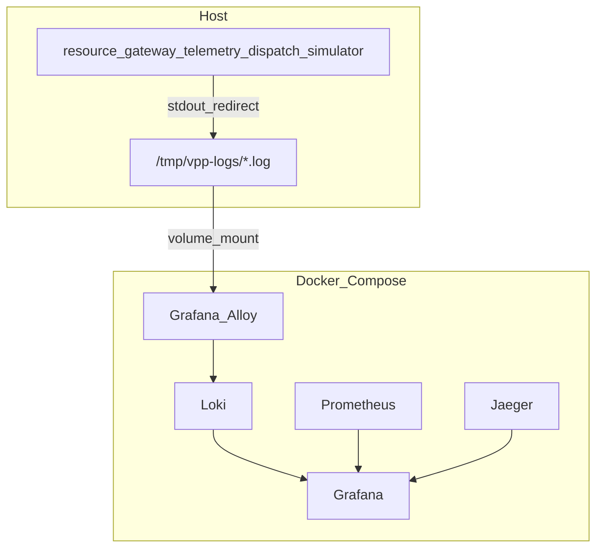

# 日志改造执行计划

## 已定决策

- **栈**：保留 Logrus；stdout JSON；**Loki + Grafana Alloy + Grafana**；不用 ELK；**不用 Promtail**。
- **采集器选型：Grafana Alloy**（见下节「采集器选型」）。
- **采集路径**：业务仍宿主机运行。已有 [`Makefile`](Makefile) 将 `run-all` 输出重定向到 `/tmp/vpp-logs/<service>.log`，Alloy 用 **`loki.source.file`** 静态采该目录（挂载进容器）；应用内 **不启用** `setOutput` 滚动文件。
- **可替换性**：靠 **应用侧日志契约**（见下），不靠 Go 代码里的「多采集器适配层」。
- **字段**：强制 `time` / `level` / `service` / `message`；有有效 Span 时写 `trace_id` / `span_id`。不强制每条都带 `component` / `caller` / `version`。
- **迁移**：不一次性禁止全仓库 `logrus.*`；平台 Hook 先覆盖直接 `logrus` 调用的 `service`（及有 ctx 时的 trace）；调用点按需渐进改。

### 采集器选型

| 选项 | 结论 |
|------|------|
| **Promtail** | **不采用**。官方已 EOL（2026-03-02），无后续安全/功能更新；文档明确后续能力在 Alloy。 |
| **Grafana Alloy** | **采用（本计划默认）**。Promtail 官方继任；与现有 Grafana / Loki 同源；本地用 `loki.source.file` 即可覆盖 `/tmp/vpp-logs`；后续 K8s 可换 `loki.source.kubernetes` / Docker，**无需改业务代码**。 |
| **Vector** | **不采用为本期默认**。能力强、厂商中立，但与当前 Grafana 栈耦合更弱；若将来运维统一用 Vector，只需替换 compose 采集侧，应用契约不变。 |

**不做「多采集器适配框架」**：在应用内抽象 Promtail/Alloy/Vector 没有收益。可替换边界是：

```text
应用只保证：JSON 行 → stdout（run-all 再落到 /tmp/vpp-logs/<service>.log）
采集器只负责：读文件 / 容器日志 → 推 Loki（低基数 label）
```

换 Alloy → Vector 时，只改 `compose.yaml` + 采集配置，**不动** `platform/logging` 与业务服务。



---

## Phase 1 — 平台日志基线（低侵入）

**目标**：统一 Init、级别、JSON、service / trace 字段。

### 1.1 改造 [`internal/platform/logging/logrus.go`](internal/platform/logging/logrus.go)

- 将 `Init()` 改为 `Init(cfg Config)`，至少包含：
  - `ServiceName`（必填）
  - `Level`（来自 env `LOG_LEVEL`，默认 `info`；开发可 `debug`）
  - `Environment`（可选，来自 `APP_ENV` / `ENVIRONMENT`，有则写入全局字段）
- **删除或永久注释** `setOutput` 启用路径；文档标明禁止应用内写 `app.log`。
- 默认 **JSONFormatter**（字段名与现有一致：`time` / `level` / `message`）。
- `LOCAL_ENV=true` 时仍可用彩色 Text（仅前台 `make run-<svc>` 看终端）；**`run-all` 落盘路径依赖 JSON**，不设 `LOCAL_ENV`。
- Hook：
  - **serviceHook**：每条日志注入 `service`
  - **traceHook**：扩展现有逻辑——有 ctx 且 Span 有效时写 `trace_id`、`span_id`（复用 [`platform/telemetry.TraceID` / `SpanID`](internal/platform/telemetry/tracing.go)）；无效/空则不写，避免全 `000…`
- 保留并鼓励 `Infof/Warnf/Errorf(ctx, fields, …)`；不在本阶段全仓替换。

可选小拆分（非必须）：`config.go` / `hook_trace.go`，避免过度文件化。

### 1.2 五个服务入口调用 Init

在各服务 [`run.go`](internal/resource/run.go)（resource / telemetry / gateway / dispatch / simulator）**最早**调用：

```go
logging.Init(logging.Config{ServiceName: appCfg.ServiceName, ...})
```

与现有 `InitTracing` 并列；级别解析失败则回退 `info`。

### 1.3 验证

- 前台跑一服务：日志含 `"service":"resource"`。
- 带请求后（Decorator 路径已有 ctx）：出现 `trace_id`。
- `make run-all` 后 `/tmp/vpp-logs/*.log` 为 JSON 行。

---

## Phase 2 — Loki / Alloy / Grafana（基础设施）

**目标**：集中检索；用 Alloy 采已有 Makefile 日志目录。

### 2.1 Compose

在 [`compose.yaml`](compose.yaml) 增加：

- **loki**（官方镜像，端口 3100）
- **alloy**（`grafana/alloy`）：挂载宿主机 `/tmp/vpp-logs` → 容器内只读路径（如 `/var/log/vpp`）；挂载 Alloy 配置
- **grafana**：增加 provisioning 卷（见 2.3）

不引入 Promtail 服务。

### 2.2 Alloy 配置（新建 [`config/alloy/config.alloy`](config/alloy/config.alloy)）

River 配置大致链路：

- `local.file_match` / `loki.source.file`：匹配 `/var/log/vpp/*.log`
- 从路径提取 `service` label（`resource` / `gateway` / …）
- 固定低基数 label：`job=vpp`、`environment=local`
- `loki.process`：JSON 解析；可将 `level` 提升为 label（低基数）
- `loki.write`：推到 `http://loki:3100/loki/api/v1/push`

**禁止**把 `trace_id` / `tenant` / `device_id` 做成 Loki label（仅作日志字段）。

新建 [`config/loki.yaml`](config/loki.yaml)（单进程本地默认 + 短保留，如 168h）。

文档中注明：契约稳定后若改用 Vector，仅替换本 Phase 的 compose/配置，应用与 Phase 1 不变。

### 2.3 Grafana 数据源

新建 provisioning，例如：

- [`config/grafana/provisioning/datasources/datasources.yaml`](config/grafana/provisioning/datasources/datasources.yaml)
  - Prometheus → `http://prometheus:9090`
  - Loki → `http://loki:3100`
  - Phase 2 至少配好 Loki + Prometheus；完整 Logs↔Traces 放到 Phase 4

### 2.4 文档

更新 [`observability.md`](observability.md)：

- Logs 链路：`make run-all` → `/tmp/vpp-logs` → **Alloy** → Loki → Grafana Explore
- 说明 Promtail 已 EOL、为何选 Alloy
- 说明应用日志契约（便于日后换 Vector）
- 示例查询：`{service="gateway"} |= "error"`、`{service="resource"} | json | trace_id="..."`

### 2.5 验证

- `make infra-up` 后 Loki / Alloy healthy
- `make run-all` 产生流量后，Grafana Explore（Loki）能按 `service` 搜到日志

---

## Phase 3 — Decorator 与关键路径收敛（中低侵入）

**目标**：降噪、可检索、少敏感信息。

### 3.1 改 [`internal/platform/decorator/logging.go`](internal/platform/decorator/logging.go)

- **去掉**整包 `command_body` / `query_body` JSON
- 成功/失败统一字段示例：`kind`、`action`、`duration_ms`；失败加 `error`
- 若入参能稳定取出 id（如有 `CommandID()` 或同名字段），再加 `command_id`；否则不硬编码反射刷屏

### 3.2 关键路径带 ctx（点状修改，不全仓）

优先保证已有 Kafka consumer / producer 错误日志使用 `logrus.WithContext(ctx)` 或 `logging.*(ctx, …)`，使 Hook 能打上 `trace_id`。

### 3.3 验证

- CQRS 日志不再含完整 Body
- Grafana 能按 `action` / `level` 过滤

---

## Phase 4 — 联动、规范与渐进迁移（可后续 PR）

- Grafana：**Logs ↔ Traces**（Loki `trace_id` → Jaeger；Jaeger → Loki 反查）
- 约定业务字段名：`tenant`、`cu_id`、`command_id`、`topic`、`offset` 等（写入 observability 附录或更新 `advices/log_advice.md` 选型段落，按触点逐步加）
- **渐进**替换高频模块的裸 `logrus` → `logging.*(ctx,…)`
- 脱敏清单作代码审查约定；必要时再加截断 helper
- 日志保留 / 采样：调 Loki 配置；告警仍以 Prometheus 为主

**明确不做（本计划范围外）**：引入 ELK；应用内 file-rotate；全仓库禁止 `logrus`；业务服务整体 dockerize；在应用代码中实现多采集器插件/适配层；本期默认上 Vector（契约已预留替换空间）。

---

## 侵入性与工作量（预期）

| 阶段 | 主要改动面 | 侵入性 |
|------|------------|--------|
| Phase 1 | `platform/logging` + 5×`run.go` | 低 |
| Phase 2 | `compose.yaml` + Alloy/Loki config + observability 文档 | 低（无业务逻辑） |
| Phase 3 | Decorator + 少量 Kafka 日志 | 低～中 |
| Phase 4 | 配置联动 + 点状替换 | 中（可拆多 PR） |

---

## 建议提交切分

1. PR1：Phase 1（logging Init + hooks + run.go）
2. PR2：Phase 2（Loki + Alloy + Grafana provisioning + 文档）
3. PR3：Phase 3（Decorator + 关键 ctx）
4. PR4+：Phase 4（联动与渐进迁移）
