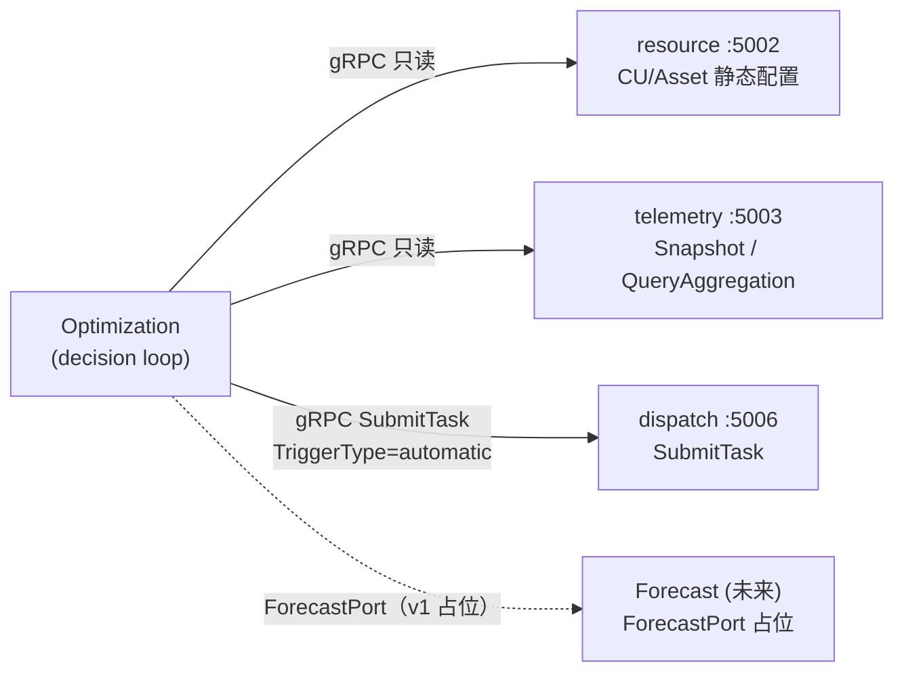

# Optimization 服务设计方案（基于 2026-09-04 讨论）

## 1. 范围与已锁定的前提

- 本文档只设计 **Optimization**（不重新设计 Forecast；Forecast 侧只定义 Optimization 需要的接口形状，真实实现留给专门会话，讨论备忘录 `discussion/2026-09-04.md` 已明确这一点）。
- 已用 `AskQuestion` 向用户确认：v1 采用**方案 A**——只定义 `ForecastPort` 接口 + 占位实现，v1 规则集**只用当前状态阈值，不依赖预测**；依赖预测的规则先把类型/接口搭好，不接真实算法。
- 承接讨论 §3.1/§3.3/§3.4/§3.5 已经拍定的结论：身份走内部直连（不经 APISIX）、绕开 Resource Runtime 缓存直连 Telemetry、`Target` 用 interface（`PointTarget`/`AggregateTarget`）、`Allocate(Target) -> []CommandSpec`。
- 限流/熔断基础设施（`internal/platform/decorator.WithRateLimit`、`internal/platform/resilience.NewBreaker` + gRPC 拦截器）已完成并在 dispatch 落地为**默认关闭、按需开启**的旁路开关（见 [`config/dispatch.yaml`](config/dispatch.yaml) 的注释"once Optimization starts calling SubmitTask at high frequency"）——本方案是第一次真正打开它。

## 2. 服务定位



- 三条依赖全部是 Optimization 主动发起的**内部直连 gRPC**（不经 APISIX），和 dispatch→gateway、gateway→telemetry 的信任模型一致（讨论 §3.1 已拍定）。
- Optimization **不**依赖 Resource 的三级 Runtime 缓存（`AssetRuntime`/`CURuntime`/`PointRuntime`）——`architecture.md` §3.3.1 已确认这层缓存写路径至今是空的（`MaxChargePowerKW`/`MaxDischargePowerKW` 永远是 nil），Optimization 改用 Resource 的**静态配置**读接口（`Asset.RatedCapacityKW`、`CU`/`Point` 列表）+ Telemetry 的实时值，不读这层悬空缓存。这是对讨论草案（"按 `MaxDischargePowerKW` 占比分摊"）的一处修正。

## 3. 包结构（照抄 dispatch/alarm 的六边形分层）

```
internal/optimization/
  cmd/main.go                       # 极薄入口，同 dispatch/cmd/main.go
  config/                           # Options -> Config（解析出 *rate.Limiter / *gobreaker.CircuitBreaker）
  options/                          # YAML 映射结构体
  domain/
    model/
      target.go                    # Target interface, PointTarget, AggregateTarget（讨论 §3.4/§3.5 已给出签名）
      command_spec.go               # Allocate 的输出，喂给 dispatch.SubmitTask
      rule.go                       # 规则值对象（阈值、CUCode/PointKey 绑定、冷却期）
    port/
      telemetry_port.go            # 只读：GetSnapshot / GetFleetSnapshot / QueryAggregation
      resource_port.go             # 只读：ListAssets / ListCUs（含 RatedCapacityKW 等静态配置）
      dispatch_port.go             # 写：SubmitTask
      forecast_port.go             # v1 占位：GetLatestPrediction，默认实现返回 ErrNotImplemented
    service/
      evaluator.go                 # 规则引擎，结构对齐 alarm 的 Evaluator（map[RuleID]ruleHandler 注册表）
      allocate.go                  # Allocate(Target) []CommandSpec，Aggregate 分支按 RatedCapacityKW 比例分摊
  application/
    command/
      run_decision_cycle.go        # 一次决策循环的用例：拉状态→评估规则→Allocate→SubmitTask
    port/                          # 如需要与 domain/port 区分，放输出型端口（可与 domain/port 合并，视实现时判断）
  adapter/
    outbound/
      telemetry_grpc/              # 仿 gatewaygrpc client：Dial + Timeout + Breaker 拦截器
      resource_grpc/
      dispatch_grpc/
      forecast_stub/                # ForecastPort 的占位实现
  decision_loop.go                  # 仿 dispatch 的 TimeoutScanner：独立 goroutine，ticker 驱动
  server.go / run.go                # composition root，errgroup 启动 decision loop + metrics + health
```

- `decision_loop.go` 直接照抄 [`internal/dispatch/application/command/scan_timeouts.go`](internal/dispatch/application/command/scan_timeouts.go) 的 `TimeoutScanner` 模式：独立 goroutine、`time.NewTicker`、`ctx.Done()` 退出、每 tick 记录失败但不中断循环。
- v1 **不需要**任何 inbound gRPC/HTTP 业务接口（没有人/服务主动调用 Optimization）；只保留 metrics（`:91xx`）和健康检查端口，和 alarm/dispatch 一致。

## 4. 决策周期与防抖

- **周期必须显式 > Telemetry 采集周期（Simulator 默认 30s）**——这是讨论 §一 风险表第 5 条的硬约束。v1 默认 `decision-interval: 60s`，YAML 可调，仿 `dispatch.yaml` 的 `timeout-scan-interval` 写法。
- **冷却期 / 防抖**：每次对某个 `(CUCode, RuleID)` 触发下发后，记一个内存态 `lastFiredAt`，冷却期内（默认等于 2× decision-interval）同一规则同一 CU 不重复下发，即使阈值仍处于触发区间——避免"同一份 stale/临界数据反复决策"造成震荡（讨论 §一 风险表第 5 条）。v1 用进程内 map 即可，不需要 Redis（单实例部署，重启丢失冷却状态可接受）。

## 5. `Target` / `Allocate`（照抄讨论 §3.4/§3.5 已定稿的签名）

```go
type Target interface {
    TenantID() string
    Source() string // "internal_rule"（v1 唯一来源）
}

type PointTarget struct {
    Tenant, Src      string
    CUCode, PointKey string
    Value            CommandValue
}

type AggregateTarget struct {
    Tenant, Src string
    Scope       []string
    Metric      string
    DeltaValue  float64
    Window      TimeWindow
}

func Allocate(ctx context.Context, t Target) ([]CommandSpec, error) {
    switch v := t.(type) {
    case PointTarget:
        return pointToCommands(v), nil
    case AggregateTarget:
        return splitByCapacity(ctx, v) // 查 ResourcePort.ListAssets 拿 RatedCapacityKW 做比例分摊
    default:
        return nil, fmt.Errorf("optimization: unsupported target type %T", t)
    }
}
```

- v1 规则引擎（阈值规则）产出的都是 `PointTarget`（已经算好具体 CU/Point/Value），`AggregateTarget` 分支**设计并实现，但 v1 没有真实调用方**（外部需求响应/市场分摊要等 Market 服务），先用单元测试覆盖 `splitByCapacity`，不接产线路径。这和讨论 §四"多级分解暂不纳入"是同一类"搭好骨架、暂不接调用方"的处理。

## 6. v1 规则内容（阈值策略，落地讨论 §二"调峰调频=纯内部闭环"场景）

- 规则配置**照抄 alarm 的先例**（[`internal/alarm/domain/service/rules.go`](internal/alarm/domain/service/rules.go)）：Go struct + `DefaultRules()`，代码里写死，注释标注"YAML 化留给以后"，不是过度设计。
- v1 示例规则（可调整，具体 PointKey 命名以实现时核对 resource 现有测试数据为准——`Point.PointKey` 是自由字符串，没有全局约定，见 [`internal/resource/domain/model/point.go`](internal/resource/domain/model/point.go)）：
  - `SOCThresholdRule`：显式绑定 `CUCode` + 读值 `PointKey`（如 SOC）+ 写值 `PointKey`（如功率设定点），`MinSOC`/`MaxSOC`/`ChargePowerKW`/`DischargePowerKW`。SOC 低于下限 → 下发充电目标值；高于上限 → 下发放电目标值。
  - 规则的"读值"来自 Telemetry 的 `GetSnapshot`（当前值），不查历史、不查 Forecast。
- 每条规则显式绑定 CU 和 PointKey（不是全局猜测"哪个 point 是 soc"），这是 v1 的有意简化，等 Resource 侧有更强的语义标注（如 point 角色/tag）后再考虑规则配置自动发现目标 point。

## 7. Forecast 依赖处理（按用户确认的方案 A）

```go
// domain/port/forecast_port.go
type ForecastPort interface {
    // GetLatestPrediction 返回某 CU/Metric 的最新一次预测。v1 唯一实现返回
    // ErrNotImplemented；v1 规则集不调用这个接口。
    GetLatestPrediction(ctx context.Context, tenantID, cuCode, metric string) (*Prediction, error)
}
```

- v1 提供一个 `forecast_stub` 占位适配器，构造时可选注入，默认返回 `ErrNotImplemented`。
- 依赖预测的规则类型（如"预测未来超容量提前调节"）在 `rule.go` 里预留类型位置，但 `DefaultRules()` 不启用，等 Forecast 服务真正落地（另一次会话）后再接线，不阻塞本次 Optimization 上线。

## 8. Dispatch 集成：来源标记

- **修正讨论草案**：不需要新增 proto 字段。`SubmitTaskRequest.TriggerType` 已存在且**已经端到端打通**——`grpc handler` → `submit_task.go` → `DispatchTask.TriggerType` → Postgres 落库（见 [`internal/dispatch/adapter/inbound/grpc/handler.go:28`](internal/dispatch/adapter/inbound/grpc/handler.go)、[`internal/dispatch/domain/model/enums.go`](internal/dispatch/domain/model/enums.go) 的 `TriggerAutomatic = "automatic"`）。Optimization 提交任务时填 `TriggerType: "automatic"` 即可复用现成字段，不是"现在没有这个字段"。
- **真正的缺口**：`vpp.dispatch.events` 的 `TaskLifecyclePayload`（[`internal/platform/event/dispatch/events.go`](internal/platform/event/dispatch/events.go)）和 alarm 的 `DispatchAttributes`（[`internal/alarm/domain/model/attributes.go`](internal/alarm/domain/model/attributes.go)）都**没有**携带 `TriggerType`，所以今天"人工下发失败"和"算法下发失败"在告警列表里长得一样。落地本方案时顺带补一个小改动（覆盖讨论 §六 checklist"算法误触发要不要区分展示"）：
  1. `TaskLifecyclePayload` 加 `TriggerType string` 字段（dispatch 生产侧）。
  2. `DispatchAttributes` 加 `TriggerType string` 字段（alarm 消费侧），`dispatch_task_failed.go` 的 handler 透传。
  3 者都是纯加字段，不改现有测试断言、不改 fingerprint（不参与哈希）。

## 9. 限流 / 熔断（基础设施已就位，本方案负责"打开开关"）

- Optimization 的三个 outbound client（`telemetry_grpc`/`resource_grpc`/`dispatch_grpc`）**照抄** [`internal/dispatch/adapter/outbound/gateway_grpc/client.go`](internal/dispatch/adapter/outbound/gateway_grpc/client.go) 的写法：`Config{Addr, Timeout, Breaker}` + `resilience.UnaryClientTimeoutInterceptor` + `resilience.UnaryClientBreakerInterceptor`。
- 同时**建议**把 dispatch 侧 `SubmitTask` 的 `rate-limit.submit-task.enabled` 从 `false` 翻成 `true`（[`config/dispatch.yaml`](config/dispatch.yaml) 注释原话就是等 Optimization 出现），初始给一个宽松值（如 `rps: 20, burst: 40`），避免一次规则误触发对 dispatch/gateway 造成突发压力（讨论风险表第 3 条）。
- Optimization 自己的 `config/optimization.yaml` 新增 `telemetry.circuit-breaker` / `resource.circuit-breaker` / `dispatch.circuit-breaker` 三段，默认 `enabled: true`（Optimization 是第一个高频轮询角色，不建议再默认关闭）。

## 10. 可观测性

- 仿 `internal/alarm/metrics/metrics.go` 建 `internal/optimization/metrics`：每次决策循环的耗时、触发规则数、`SubmitTask` 成功/失败计数、`ForecastPort` 调用次数（即使 v1 恒为 not-implemented，也先埋点）。
- 沿用 `platform/logging` 的结构化日志，`component: "DecisionLoop"`，字段包含 `rule_id`、`cu_code`、`cooldown_skipped`。

## 11. 明确不做（v1 边界）

- 不做 `RuntimeSyncWorker`（前端需求，与 Optimization 无关，见 `architecture.md` §3.3.1）。
- 不做多级任务分解（讨论 §四已推迟）。
- 不做 `BaselinePredictor` / 需求响应基线（依赖 Market 的历史事件日历，讨论 §3.6 已标记为后续依赖）。
- 不接真实 Forecast 算法，只留 `ForecastPort` 接口位置。
- `AggregateTarget`/`splitByCapacity` 设计并单测覆盖，但不接产线调用方（等 Market）。

## 12. 待实现清单

- 新建 `internal/optimization` 包结构（第 3 节）。
- `domain/model`：`Target`/`PointTarget`/`AggregateTarget`/`CommandSpec`/`Rule`。
- `domain/service`：`Evaluator`（规则引擎）、`Allocate`/`splitByCapacity`。
- `domain/port` + 三个 outbound gRPC client（telemetry/resource/dispatch）+ `forecast_stub`。
- `decision_loop.go`（ticker + 冷却期 map）+ `server.go`/`run.go`/`cmd/main.go` composition root。
- `config/optimization.yaml` + `options`/`config` 包（限流/熔断/decision-interval）。
- dispatch 小改动：`TaskLifecyclePayload` 加 `TriggerType`。
- alarm 小改动：`DispatchAttributes` 加 `TriggerType`，`dispatch_task_failed.go` 透传。
- dispatch 配置：打开 `rate-limit.submit-task.enabled: true`。
- `internal/optimization/metrics` + README/OVERVIEW 文档（照抄 alarm 的文档结构）。
- `ROADMAP.md` 勾掉 "Optimization v1"，`architecture.md` 补一节描述新服务的调用矩阵。
