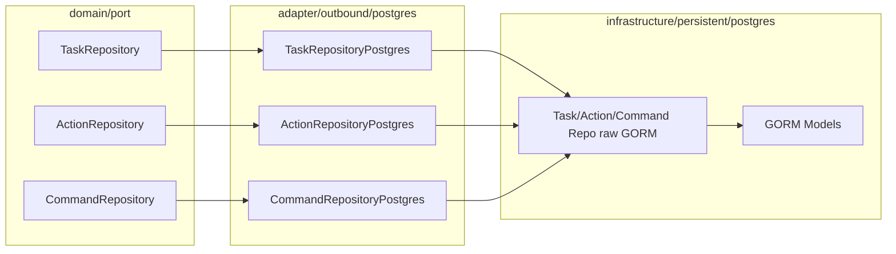

# Phase 3：Dispatch 持久化层

## 计划纰漏（需先对齐，再写代码）

对照已完成的 [domain ports](internal/dispatch/domain/port/)、[domain models](internal/dispatch/domain/model/)，以及 gateway 的分层（[infrastructure](internal/gateway/infrastructure/persistent/postgres/) vs [adapter](internal/gateway/adapter/outbound/postgres/)），`plan_v2.md` 有以下问题：

### P1 — 阻塞正确性

1. **`dispatch_tasks` 缺 `failure_policy` 列**  
   Domain 已有 `DispatchTask.FailurePolicy`（`fail_fast`），migration 草图（§十四）未建该列。必须补上，否则无法持久化。

2. **`control_commands` 缺稳定排序列**  
   Domain 约定 Sequential 依赖 Commands 的 slice 顺序，但表结构只有 `action_id`，无 `sequence`/`position`。`FindByID` / `FindByCommandID` 重载后顺序不确定，顺控会错。应增加 `sequence INT NOT NULL`，并在加载时 `ORDER BY sequence`。

3. **Phase 边界把 postgres adapter 写丢了**  
   - §三目录同时有 `infrastructure/persistent/postgres/` 与 `adapter/outbound/postgres/`  
   - Phase 3 只写 infrastructure；Phase 5 的 adapter 列表只有 gRPC/Kafka，**没有 postgres**  
   - adapter 注释仍写已废弃的 `DispatchTaskRepository`  
   **结论**：Phase 3 应一次做完「migration + infra raw GORM + adapter 实现三个 port」，否则 Phase 4 无法接线，且 Phase 5 也不会补上。

### P2 — 与现有约定不一致 / 易踩坑

4. **分层应对齐 gateway，而非把 domain 转换塞进 infrastructure**  
   - `infrastructure/`：GORM model + 按表的 raw CRUD（只认 `*Model`）  
   - `adapter/outbound/postgres/`：实现 `TaskRepository` / `ActionRepository` / `CommandRepository`，做 domain ↔ model 转换与 `gorm.ErrRecordNotFound` → `domain.ErrTaskNotFound` 等

5. **`Save` 必须事务**  
   计划写「一次性写入 Task 树」，未写事务。应对齐 `platform/postgres.StartTransaction`：task + actions + commands 同事务插入。

6. **`timeout_ms` ↔ `time.Duration`**  
   表用 `timeout_ms BIGINT`，domain 用 `Timeout time.Duration`。转换放在 adapter（`ms = Timeout / time.Millisecond`）。

7. **JSONB 形状未定义**  
   `value` / `result` 需约定稳定 JSON，例如：
   - value: `{"kind":"bool","bool":true}` / `int` / `float` / `string`
   - result: `{"success":true,"error_code":"","error_message":"","ack_at":"..."}`（`ack_at` RFC3339，可空）

8. **initdb 文件缺失**  
   计划只提 `migrations/dispatch/001_...`，应对齐 gateway：`migrations/initdb/50-dispatch-db.sh` + `51-dispatch-schema.sql`，以及 `migrations/dispatch/000001_init.up.sql` / `.down.sql`。

9. **§十八 端到端伪代码仍是旧的单 repo `repo.Update(task)`**  
   与 v2.1 三拆 Repository 矛盾；不阻塞 Phase 3，但文档应后续修订，避免 Phase 4 误读。

---

## 修正后的 Phase 3 范围

### 1. Migration（修正 schema）

新增：

- [migrations/dispatch/000001_init.up.sql](migrations/dispatch/000001_init.up.sql) / `.down.sql`
- [migrations/initdb/50-dispatch-db.sh](migrations/initdb/50-dispatch-db.sh)（建库 `dispatch`）
- [migrations/initdb/51-dispatch-schema.sql](migrations/initdb/51-dispatch-schema.sql)

相对计划草图的修正列：

| 表 | 修正 |
|---|---|
| `dispatch_tasks` | 增加 `failure_policy TEXT NOT NULL DEFAULT 'fail_fast'` |
| `control_commands` | 增加 `sequence INT NOT NULL`；保留 `timeout_ms`、`value`/`result` JSONB、timeout partial index |

其余索引保持：`(tenant_id, status)` on tasks、`task_id` on actions、`action_id` on commands、`(deadline_at) WHERE status='sending'`。

### 2. Infrastructure（对齐 gateway）

路径：`internal/dispatch/infrastructure/persistent/postgres/`

| 文件 | 职责 |
|---|---|
| `db.go` | 委托 `platform/postgres`（同 gateway） |
| `models.go` | `DispatchTaskModel` / `DispatchActionModel` / `ControlCommandModel` |
| `task_repo.go` | CreateTaskTree（事务）、UpdateTask、FindTaskByID、FindTaskByCommandID（join 加载完整树，actions/commands 按 sequence 排序） |
| `action_repo.go` | UpdateActionStatus |
| `command_repo.go` | UpdateCommandRuntime、FindExpiredSending |

约定：只操作 `*Model`；使用 `platform/logging.WhenDB`；不 import domain model。

### 3. Adapter（实现 domain port）

路径：`internal/dispatch/adapter/outbound/postgres/`

- `task_repository.go` → `port.TaskRepository`
- `action_repository.go` → `port.ActionRepository`
- `command_repository.go` → `port.CommandRepository`
- `converter.go` → domain ↔ model（含 JSONB、`timeout_ms`、枚举 string）

错误映射：`gorm.ErrRecordNotFound` → `domain.ErrTaskNotFound`（FindByID / FindByCommandID）。

### 4. go.mod

为 [internal/dispatch/go.mod](internal/dispatch/go.mod) 补上 Phase 3 所需依赖（对齐 gateway）：

- `replace` → `../platform`
- `gorm.io/gorm`、`gorm.io/driver/postgres`、`platform`、`jackc/pgx`（如 adapter 需识别唯一约束时可加）

不做 config/server/composition root（属后续 Phase）。

### 5. 文档小修（同批）

在 [plan_v2.md](internal/dispatch/plan_v2.md) 修正：

- §十四 migration 草图（`failure_policy`、`sequence`）
- §三 adapter 注释与 Phase 3/5 边界（postgres adapter 归 Phase 3）
- 不在本阶段大改 §十八 伪代码（可加一句「以 §6 / §7 三 Repository 为准」）

---

## 明确不做（留给后续 Phase）

- `application/`、`adapter/inbound/*`、`gateway_grpc`、Kafka publisher/consumer
- `TaskEventPublisher` 实现
- 单元/集成测试（除非你后续要求；gateway infra 本身也几乎无测）
- 修改已完成的 domain 层（除非发现 port 签名必须为持久化调整——当前不需要）
