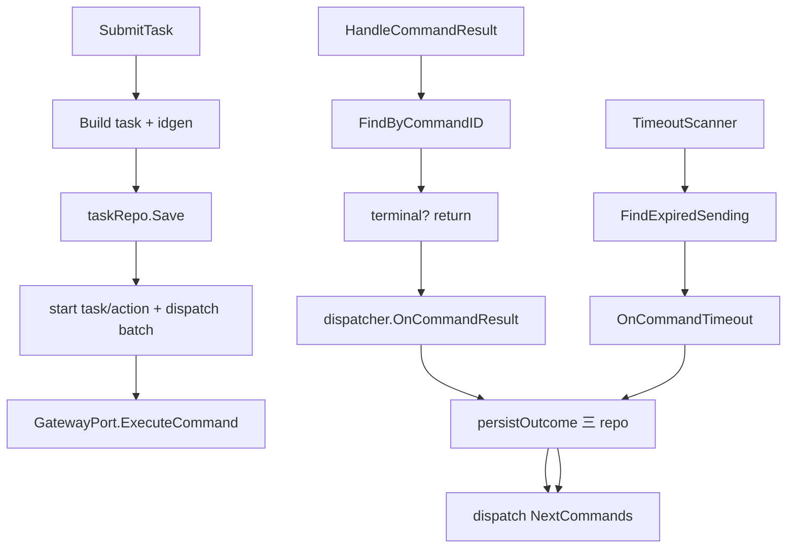

# Phase 4：Dispatch Application 层

## 前置缺口（实现时一并处理）

Domain 的 `Dispatcher` **没有**计划里的 `PrepareTask` / `CommandsToDispatch` 包装方法；已有 `task.Start()`、`action.Start()`、`action.CommandsToDispatch()`。Application 直接调用这些方法，**不改 domain**。

`GatewayCompleted` 时 domain 的 `MarkSucceeded` 要求当前为 `Sending`：同步完成路径先 `MarkSending`，再走 `OnCommandResult`。

## 目标结构

```
internal/dispatch/application/
├── app.go
├── port/
│   ├── gateway.go                 # GatewayPort + GatewayExecuteResult
│   └── noop_event_publisher.go    # 无 Kafka 时的 no-op（Phase 5 可换真实现）
├── command/
│   ├── submit_task.go
│   ├── handle_command_result.go
│   ├── scan_timeouts.go
│   └── dispatch_helper.go         # 共享：gateway 下发 + 持久化 + continuation
└── query/
    └── get_task.go
```

对齐 [gateway/application/app.go](internal/gateway/application/app.go)：`Application{Commands, Queries}` + `Dependencies` + `decorator.Apply*Decorators`。



## 1. `application/port/gateway.go`

按计划 §七：

- `GatewayAcceptanceStatus`：`Accepted` / `Completed` / `Rejected`
- `GatewayExecuteResult{Status, Success, Message}`
- `GatewayPort.ExecuteCommand(ctx, *model.ControlCommand) (*GatewayExecuteResult, error)`

`NoopTaskEventPublisher`：三方法均 return nil，供后续 composition root 在无 Kafka 时注入。

## 2. 共享 `dispatch_helper.go`（核心）

抽取三处共用逻辑，避免 Submit / HandleResult / TimeoutScanner 重复：

**`persistOutcome(ctx, task, outcome)`**  
按 `ChangedCommands` / `ChangedActions` / `TaskChanged` 调用三个 repo；若 `TaskFinished`，按 `task.Status` 调 `PublishTaskCompleted` 或 `PublishTaskFailed`。

**`dispatchCommands(ctx, task, cmds) error`**  
对每条命令：

| Gateway 结果 | 行为 |
|---|---|
| `Accepted` | `MarkSending(now)` → `commandRepo.Update` |
| `Completed` | `MarkSending` → `OnCommandResult` → `persistOutcome` → 递归/循环处理新的 `NextCommands` |
| `Rejected` | `OnCommandResult(failure)`（Pending 可 `MarkFailed`）→ `persistOutcome`；熔断后停止本批 |
| transport error | 视为 Rejected（构造 failure result）后走熔断 |

Submit 首次下发前：`task.Start()` → `NextPendingAction().Start()` → `CommandsToDispatch()`，并 `taskRepo.Update` + `actionRepo.Update`。

## 3. Handlers

### SubmitTask（`command/submit_task.go`）

- DTO 按计划 §9.1；构造时 `FailurePolicy=FailFast`，`idgen.Must()` 赋 Task/Action/Command ID
- `Timeout==0` / `MaxRetries==0` 用构造注入的 defaults（默认 30s / 3）
- `validator.ValidateTask` → `taskRepo.Save` → 启动并 `dispatchCommands` 第一批
- 返回 `TaskID`
- `decorator.CommandHandler[SubmitTask, *SubmitTaskResult]`

### HandleCommandResult（`command/handle_command_result.go`）

1. `FindByCommandID`
2. 命令已终态 → 幂等返回
3. `OnCommandResult` → `persistOutcome` → `dispatchCommands(NextCommands)`

### TimeoutScanner（`command/scan_timeouts.go`）

- 非 decorator handler；`Run(ctx)` + `scanOnce`
- `FindExpiredSending` → 逐条 `FindByCommandID` → `OnCommandTimeout` → `persistOutcome` → `dispatchCommands(NextCommands)`
- 单条失败只打日志，不中断扫描循环
- 挂在 `Application` 上（如 `TimeoutScanner *command.TimeoutScanner`），供 Phase 5/7 的 `server.go` `eg.Go` 启动

### GetTask（`query/get_task.go`）

- `FindByID`；`TenantID` 不匹配时返回 `domain.ErrTaskNotFound`（防越权）
- 返回完整 `*model.DispatchTask`

## 4. `application/app.go`

```go
type Dependencies struct {
    TaskRepo    port.TaskRepository
    ActionRepo  port.ActionRepository
    CommandRepo port.CommandRepository
    Gateway     appport.GatewayPort
    Publisher   port.TaskEventPublisher
    Metrics     decorator.MetricsClient

    TimeoutScanInterval   time.Duration // 默认 10s
    DefaultCommandTimeout time.Duration // 默认 30s
    DefaultMaxRetries     int           // 默认 3
}
```

组装 `SubmitTask` / `HandleCommandResult` / `GetTask` / `TimeoutScanner`；内部共享同一个 `Dispatcher` + `Validator`。

## 5. 明确不做

- 不写 `adapter/inbound`、`gateway_grpc`、Kafka consumer/producer（Phase 5）
- 不写 `server.go` / config（后续 composition）
- 不改 domain 状态机（除非编译发现必须的小缺口——当前不需要）

## 6. 验证

`cd internal/dispatch && go build ./...`
