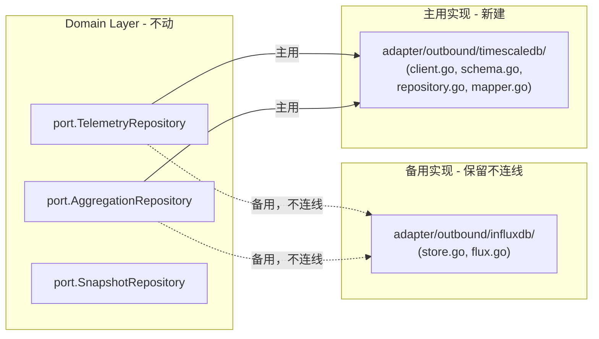

# 切换 Telemetry 存储层：InfluxDB 2.0 → TimescaleDB

## 概述

domain 层和 port 接口**不动**，只替换 `adapter/outbound/influxdb/` 目录。这正是六边形架构的价值所在。



## 数据模型

**窄表（narrow table）**：每行一个 metric 采样点。

```sql
CREATE TABLE telemetry_records (
    ts          TIMESTAMPTZ      NOT NULL,
    tenant_id   TEXT             NOT NULL,
    cu_code     TEXT             NOT NULL,
    metric_name TEXT             NOT NULL,
    metric_type TEXT             NOT NULL,
    value       DOUBLE PRECISION NOT NULL,
    PRIMARY KEY (ts, tenant_id, cu_code, metric_name)
);

-- 转换为 hypertable，按天分区
SELECT create_hypertable('telemetry_records', 'ts',
    chunk_time_interval => INTERVAL '1 day',
    if_not_exists => TRUE
);

-- 15 分钟连续聚合视图（自动增量维护，仪表板零计算）
CREATE MATERIALIZED VIEW telemetry_15m
WITH (timescaledb.continuous) AS
SELECT
    time_bucket('15 minutes', ts) AS bucket,
    tenant_id, cu_code, metric_name,
    AVG(value)           AS avg,
    MAX(value)           AS max,
    MIN(value)           AS min,
    SUM(value)           AS sum,
    COUNT(value)::bigint AS count,
    last(value, ts)      AS last
FROM telemetry_records
GROUP BY 1, 2, 3, 4
WITH NO DATA;
```

## 文件结构（采纳 GPT 建议）

```
adapter/outbound/timescaledb/   # package timescaledb
├── client.go      # Config 结构体 + NewPool() 连接池
├── schema.go      # ApplySchema() — hypertable + continuous aggregate DDL
├── repository.go  # TelemetryStore + AggregationStore（实现两个 port）
└── mapper.go      # domain ↔ SQL 行转换：metricToParams、rowsToRecords、aggRowToPoint
```

## 各文件职责

### `client.go`
- `Config{Host, Port, User, Password, DBName, SSLMode, MaxConns, MinConns}`（与 resource 的 `infrastructure/db/config.go` 同一风格）
- `NewPool(ctx, cfg) (*pgxpool.Pool, error)` — 返回连接池供两个 Store 共享

### `schema.go`
- `ApplySchema(ctx, pool) error` — 应用启动时幂等执行 DDL
- 内嵌所有 `CREATE TABLE IF NOT EXISTS` / `create_hypertable` / `CREATE MATERIALIZED VIEW IF NOT EXISTS` / `add_continuous_aggregate_policy` 语句

### `repository.go`
两个 struct 共享同一个 `*pgxpool.Pool`：

- **TelemetryStore**（实现 `port.TelemetryRepository`）
  - `SaveBatch`：使用 `pgx.Batch` 批量 INSERT，冲突时 `DO NOTHING`（幂等）
  - `Query`：参数化 SELECT，按 `(ts, cu_code)` 分组重建 TelemetryRecord 信封

- **AggregationStore**（实现 `port.AggregationRepository`）
  - `Query`：动态构建 SELECT 子句（只包含 `AggregationQuery.Functions` 里请求的聚合），使用 `time_bucket($1::interval, ts)` 下推到 TimescaleDB

### `mapper.go`
- `metricToParams(rec, m)` — Metric → INSERT 参数列表
- `rowsToRecords(rows) ([]*model.TelemetryRecord, error)` — SQL 行 → domain 对象（按 ts+cuCode 分组）
- `aggRowToPoint(row, requested) *model.AggregatedPoint` — 聚合行 → domain 对象

## go.mod 变更

- **保留**：`github.com/influxdata/influxdb-client-go/v2`（InfluxDB 备用实现仍需依赖）
- **添加**：`github.com/jackc/pgx/v5`（pgx/v5 已是 resource 模块的间接依赖，直接 `go get` 即可）

## 不变部分

- `domain/` 全部文件 — 零改动
- `adapter/outbound/redis/` — 零改动
- `adapter/outbound/kafka_pub/` — 零改动
- `adapter/inbound/grpc/` — 零改动
