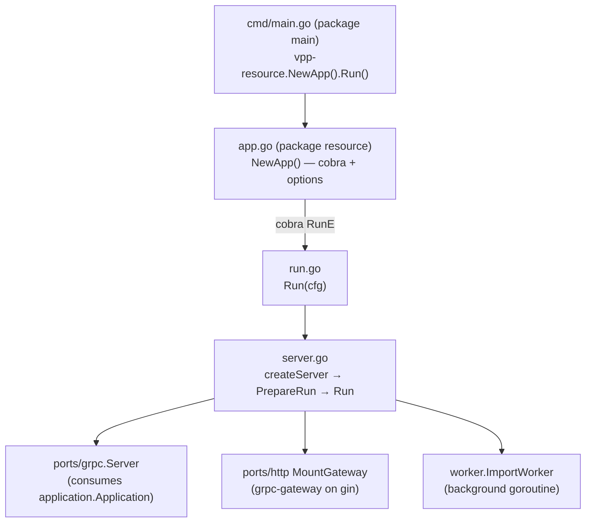
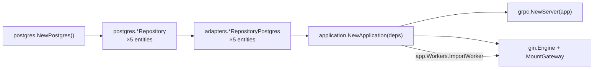

# VPP Resource 服务应用组装方案

## 目标架构



## 新增/修改文件一览

### 新增文件

- **[`internal/resource/cmd/main.go`](internal/resource/cmd/main.go)** — package main，仅三行，调用 `resource.NewApp("vpp-resource").Run()`
- **[`internal/resource/options/options.go`](internal/resource/options/options.go)** — `Options` struct（对应 viper key），含 `Validate()`
- **[`internal/resource/config/config.go`](internal/resource/config/config.go)** — `Config` struct（内部配置），含 `CreateFromOptions(opts)`
- **[`internal/resource/app.go`](internal/resource/app.go)** — `NewApp(basename)` 返回 `*cobra.Command`，注册 `--config` flag，RunE 中加载 viper + validate + 调用 `Run(cfg)`
- **[`internal/resource/run.go`](internal/resource/run.go)** — `Run(cfg)` 调用 `createServer(cfg).PrepareRun().Run()`
- **[`internal/resource/server.go`](internal/resource/server.go)** — `resourceServer` struct + `createServer` + `PrepareRun` + `Run`（含 graceful shutdown）

### 修改文件

- **[`internal/resource/ports/grpc/server.go`](internal/resource/ports/grpc/server.go)** — 将 `NewServer(repos..., metricClient)` 改为 `NewServer(app application.Application)`，从 `app.Commands/Queries` 直接取已组装的 handler，去掉内部重复构造

### 删除文件

- `internal/resource/main.go`（当前仅 `package resource` 占位，替换为 `app.go`）

## 分层职责说明

### Options（CLI + viper）
```go
// options/options.go
type Options struct {
    GRPCAddr    string        `mapstructure:"resource.grpc-addr"`
    HTTPAddr    string        `mapstructure:"resource.http-addr"`
    JaegerURL   string        `mapstructure:"jaeger.url"`
    ServiceName string        `mapstructure:"resource.service-name"`
    PollInterval time.Duration `mapstructure:"resource.worker-poll-interval"`
}
```
postgres 连接参数由 viper 直接提供给 `postgres.NewPostgres()`（现有行为保留）。

### Config（内部配置，传递给 server）
```go
// config/config.go
type Config struct {
    GRPCAddr     string
    HTTPAddr     string
    JaegerURL    string
    ServiceName  string
    WorkerConfig worker.ImportWorkerConfig
}
```

### server.go 关键骨架
```go
type resourceServer struct {
    grpcServer   *grpc.Server
    httpServer   *http.Server
    workerCancel context.CancelFunc
    app          application.Application
}

func createServer(cfg *config.Config) (*resourceServer, error) {
    // 1. postgres.NewPostgres()
    // 2. infra repos (postgres.*Repository)
    // 3. adapters.*RepositoryPostgres
    // 4. application.NewApplication(deps)  ← 已有 wiring
    // 5. grpc.NewServer(app)               ← 改造后接受 Application
    // 6. gin + MountGateway
    // 7. return &resourceServer{...}
}

func (s *resourceServer) PrepareRun() *preparedServer {
    // 注册 shutdown 回调（SIGTERM/SIGINT）
    return &preparedServer{s}
}

func (s *preparedServer) Run() error {
    // go s.grpcServer.Serve(...)
    // go s.app.Workers.ImportWorker.Start(workerCtx)
    // waitSignal → GracefulStop → http.Shutdown
    // s.httpServer.ListenAndServe()
}
```

## Wiring 依赖流（createServer 内）



## 对 ports/grpc/server.go 的改造

现在 `NewServer` 独立组装 handler（与 `application.NewApplication` 重复）。改造后：

```go
// 改造前（现有）
func NewServer(siteRepo, resourceRepo, ..., metricClient) *Server

// 改造后
func NewServer(app application.Application) *Server {
    return &Server{
        createSite:     app.Commands.CreateSite,
        updateSite:     app.Commands.UpdateSite,
        // ...所有 handler 直接从 app 取
    }
}
```

## 启动命令示例
```bash
# 从 internal/resource 模块根运行
go run ./cmd/  --config config/config.yaml

# 构建二进制
go build -o bin/vpp-resource ./cmd/
```
