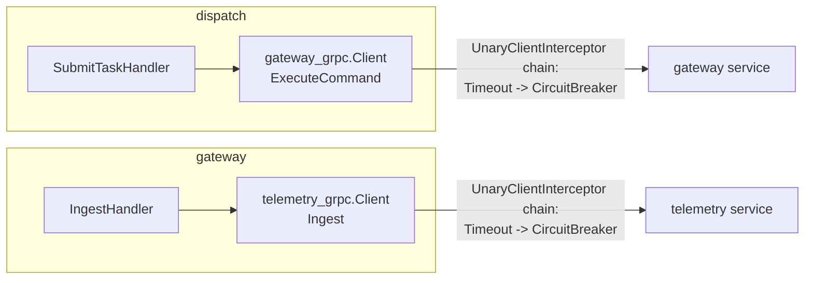

# 熔断实施方案（Circuit Breaker Implementation）

## 范围（已确认）

本次只接入两条链路：**dispatch → gateway**（[internal/dispatch/adapter/outbound/gateway_grpc/client.go](internal/dispatch/adapter/outbound/gateway_grpc/client.go)）和 **gateway → telemetry**（[internal/gateway/adapter/outbound/telemetry_grpc/client.go](internal/gateway/adapter/outbound/telemetry_grpc/client.go)），均为 gRPC。gateway↔simulator（HTTP）、simulator→resource（gRPC）留给后续按同样模式接入（`resilience` 包对协议无关，HTTP 侧只需要一个 `http.RoundTripper` 包装器，届时补一个 `BreakerTransport` 即可，不在本次实现）。

**超时默认值（已确认，是本次唯一非纯 additive 的改动）**：这两条链路默认加 **5s** 超时兜底（无 deadline 时才补，不覆盖调用方已设置的 deadline）。目前这两条出站调用完全没有超时，挂死的请求既拖累调用方也不会被判定为失败——熔断器统计不到失败次数，永远不会跳闸。熔断器本身按现有限流的节奏，**默认 `enabled: false`**，只有显式在 config 打开才生效。

不冲突说明：dispatch 领域层已有的 `Dispatcher.applyCircuitBreaker`（[internal/dispatch/domain/service/dispatcher.go](internal/dispatch/domain/service/dispatcher.go)）是任务失败后的 FailFast 策略（取消同 Action 剩余 Pending 命令），和本次做的"传输层熔断"是完全不同的概念，命名上不复用，两者共存不冲突。

## 架构（沿用设计文档决策）



- 限流保护**被调用方**（挂在 `decorator` 里，已完成）；熔断保护**调用方**（挂在出站 client 的 gRPC dial options 里，本次要做）。
- 每个出站依赖一个独立的 `*gobreaker.CircuitBreaker[any]` 实例（dispatch 只有一个 gateway breaker；gateway 只有一个 telemetry breaker），不做 per-tenant，和限流的粒度决策一致。
- breaker 跳闸（Open）后，`Execute` 立即返回 `gobreaker.ErrOpenState`，client 把它包一层 `resilience.ErrDependencyUnavailable` 后原样返回给调用方——**调用方现有的通用错误处理路径已经能正确处理**，不需要改任何 handler 代码：
  - dispatch 侧：[internal/dispatch/application/command/dispatch_helper.go](internal/dispatch/application/command/dispatch_helper.go) 第 157-160 行，`gwErr != nil` 统一走 `applyFailure(ctx, task, cmd, "gateway_error", gwErr.Error())`，即领域层 `applyCircuitBreaker` FailFast 路径。
  - gateway 侧：telemetry ingest 失败的路径同理是通用 error 返回，无需改动。

## 1. 新增核心包 `internal/platform/resilience/`

### `circuitbreaker.go`

```go
package resilience

import (
	"errors"
	"fmt"
	"time"

	"github.com/sirupsen/logrus"
	"github.com/sony/gobreaker/v2"
)

// ErrDependencyUnavailable wraps gobreaker's open-state errors so call sites
// don't need to import gobreaker directly. Callers can errors.Is() against
// this instead of gobreaker.ErrOpenState.
var ErrDependencyUnavailable = errors.New("resilience: dependency unavailable (circuit open)")

// BreakerConfig configures one CircuitBreaker instance for one outbound
// dependency (e.g. "dispatch->gateway"). Enabled=false (the default) means
// NewBreaker returns nil, and interceptors/transports treat nil as "no breaker".
type BreakerConfig struct {
	Enabled bool
	Name    string // dependency label, used in logs and gobreaker.Settings.Name

	// Trip conditions (OR'd together): either is sufficient to open the breaker.
	ConsecutiveFailures uint32  // 0 disables this condition
	MinRequests         uint32  // sample-based: only consider FailureRatio once Requests >= this
	FailureRatio        float64 // e.g. 0.5

	OpenTimeout time.Duration // how long the breaker stays Open before probing (half-open)

	// IsSuccessful classifies an error as "not a dependency failure" (e.g. a
	// gRPC NotFound is the dependency working correctly). nil = only err==nil
	// counts as success (gobreaker default).
	IsSuccessful func(err error) bool
}

// NewBreaker builds a *gobreaker.CircuitBreaker[T] from cfg, or returns nil
// (disabled) when cfg.Enabled is false. T is the type parameter gobreaker
// uses for Execute's return value; gRPC/HTTP wrappers pick a concrete T.
func NewBreaker[T any](cfg BreakerConfig) *gobreaker.CircuitBreaker[T] {
	if !cfg.Enabled {
		return nil
	}
	return gobreaker.NewCircuitBreaker[T](gobreaker.Settings{
		Name:    cfg.Name,
		Timeout: cfg.OpenTimeout,
		ReadyToTrip: func(counts gobreaker.Counts) bool {
			if cfg.ConsecutiveFailures > 0 && counts.ConsecutiveFailures >= cfg.ConsecutiveFailures {
				return true
			}
			if cfg.MinRequests > 0 && counts.Requests >= cfg.MinRequests {
				return float64(counts.TotalFailures)/float64(counts.Requests) >= cfg.FailureRatio
			}
			return false
		},
		IsSuccessful: cfg.IsSuccessful,
		OnStateChange: func(name string, from, to gobreaker.State) {
			logrus.WithFields(logrus.Fields{
				"component":  "resilience.CircuitBreaker",
				"dependency": name,
				"from":       from.String(),
				"to":         to.String(),
			}).Warn("circuit breaker state changed")
		},
	})
}

// unwrapBreakerErr turns gobreaker's sentinel errors into ErrDependencyUnavailable.
func unwrapBreakerErr(err error) error {
	if errors.Is(err, gobreaker.ErrOpenState) || errors.Is(err, gobreaker.ErrTooManyRequests) {
		return fmt.Errorf("%w: %s", ErrDependencyUnavailable, err.Error())
	}
	return err
}
```

### `grpc.go`

```go
package resilience

import (
	"context"
	"errors"
	"time"

	"github.com/sony/gobreaker/v2"
	"google.golang.org/grpc"
	"google.golang.org/grpc/codes"
	"google.golang.org/grpc/status"
)

// UnaryClientTimeoutInterceptor bounds outbound calls that don't already
// carry a context deadline. Callers that set their own deadline (or
// cancellation) are left untouched — this only fills the gap.
func UnaryClientTimeoutInterceptor(d time.Duration) grpc.UnaryClientInterceptor {
	return func(ctx context.Context, method string, req, reply any, cc *grpc.ClientConn,
		invoker grpc.UnaryInvoker, opts ...grpc.CallOption) error {
		if d > 0 {
			if _, ok := ctx.Deadline(); !ok {
				var cancel context.CancelFunc
				ctx, cancel = context.WithTimeout(ctx, d)
				defer cancel()
			}
		}
		return invoker(ctx, method, req, reply, cc, opts...)
	}
}

// UnaryClientBreakerInterceptor short-circuits calls once cb is Open. A nil
// cb (breaker disabled) is a no-op passthrough.
func UnaryClientBreakerInterceptor(cb *gobreaker.CircuitBreaker[any]) grpc.UnaryClientInterceptor {
	return func(ctx context.Context, method string, req, reply any, cc *grpc.ClientConn,
		invoker grpc.UnaryInvoker, opts ...grpc.CallOption) error {
		if cb == nil {
			return invoker(ctx, method, req, reply, cc, opts...)
		}
		_, err := cb.Execute(func() (any, error) {
			return nil, invoker(ctx, method, req, reply, cc, opts...)
		})
		return unwrapBreakerErr(err)
	}
}

// GRPCIsSuccessful classifies a gRPC error for breaker bookkeeping:
// business-level rejections mean the dependency is healthy and correctly
// rejected the request, so they must NOT count as breaker failures. Only
// transport/availability failures (Unavailable, DeadlineExceeded, Internal,
// Unknown, ResourceExhausted, ...) count as failures.
func GRPCIsSuccessful(err error) bool {
	if err == nil || errors.Is(err, context.Canceled) {
		return true
	}
	st, ok := status.FromError(err)
	if !ok {
		return false
	}
	switch st.Code() {
	case codes.NotFound, codes.FailedPrecondition, codes.InvalidArgument,
		codes.AlreadyExists, codes.PermissionDenied, codes.Unauthenticated:
		return true
	default:
		return false
	}
}
```

### Tests: `circuitbreaker_test.go`, `grpc_test.go`

- `NewBreaker`：`Enabled: false` → 返回 `nil`；`Enabled: true` + `ConsecutiveFailures: 2` → 连续 2 次失败后 `Execute` 返回 `gobreaker.ErrOpenState`。
- `unwrapBreakerErr` 间接测试：breaker Open 后 `UnaryClientBreakerInterceptor` 返回的 error 满足 `errors.Is(err, resilience.ErrDependencyUnavailable)`。
- `UnaryClientTimeoutInterceptor`：无 deadline 时补一个（用一个故意 sleep 超过 timeout 的假 invoker 验证返回 `context.DeadlineExceeded`）；已有 deadline 时不覆盖（验证 invoker 收到的 ctx deadline 不变）。
- `UnaryClientBreakerInterceptor`：`cb == nil` 时直接透传；breaker Open 时 invoker 不被调用。
- `GRPCIsSuccessful` 表驱动：`nil→true`、`codes.NotFound→true`、`codes.Unavailable→false`、`codes.ResourceExhausted→false`、非 status error → `false`。

风格和现有 [internal/platform/decorator/ratelimit_test.go](internal/platform/decorator/ratelimit_test.go) 一致（stdlib `testing` + `t.Parallel()`）。

## 2. 依赖

`internal/platform/go.mod` 新增 `github.com/sony/gobreaker/v2`（`go get github.com/sony/gobreaker/v2@latest` 后 `go mod tidy`）。dispatch、gateway 各自是独立 module（`replace` 指向 `../platform`），需要各跑一次 `go mod tidy` 让 `go.sum` 跟上（和限流引入 `golang.org/x/time` 时的做法一样）。

## 3. 接入 dispatch → gateway

- **[internal/dispatch/adapter/outbound/gateway_grpc/client.go](internal/dispatch/adapter/outbound/gateway_grpc/client.go)**：`Config` 新增两个可选字段：

```go
type Config struct {
	Addr        string
	DialOptions []grpc.DialOption

	// Timeout bounds outbound ExecuteCommand calls that don't already carry
	// a context deadline. 0 disables (no timeout added).
	Timeout time.Duration
	// Breaker short-circuits ExecuteCommand once too many failures accumulate.
	// nil disables (no circuit breaking).
	Breaker *gobreaker.CircuitBreaker[any]
}
```

  `NewClient` 里把 Timeout/Breaker 转成拦截器，插在现有 `cfg.DialOptions` 之前：

```go
func NewClient(cfg Config) (*Client, error) {
	if cfg.Addr == "" {
		return nil, fmt.Errorf("gateway_grpc: addr is required")
	}
	var interceptors []grpc.UnaryClientInterceptor
	if cfg.Timeout > 0 {
		interceptors = append(interceptors, resilience.UnaryClientTimeoutInterceptor(cfg.Timeout))
	}
	if cfg.Breaker != nil {
		interceptors = append(interceptors, resilience.UnaryClientBreakerInterceptor(cfg.Breaker))
	}
	dialOpts := cfg.DialOptions
	if len(interceptors) > 0 {
		dialOpts = append([]grpc.DialOption{grpc.WithChainUnaryInterceptor(interceptors...)}, dialOpts...)
	}
	conn, err := platformserver.DialGRPC(cfg.Addr, dialOpts...)
	// ...unchanged...
}
```

- **[internal/dispatch/options/options.go](internal/dispatch/options/options.go)**：`GatewayOptions` 扩展：

```go
type GatewayOptions struct {
	GRPCAddr string        `mapstructure:"grpc-addr"`
	Timeout  time.Duration `mapstructure:"timeout"`
	CircuitBreaker CircuitBreakerOptions `mapstructure:"circuit-breaker"`
}

type CircuitBreakerOptions struct {
	Enabled             bool          `mapstructure:"enabled"`
	ConsecutiveFailures uint32        `mapstructure:"consecutive-failures"`
	MinRequests         uint32        `mapstructure:"min-requests"`
	FailureRatio        float64       `mapstructure:"failure-ratio"`
	OpenTimeout         time.Duration `mapstructure:"open-timeout"`
}
```

  `NewOptions()` 默认值里给 `Gateway.Timeout` 设 `5 * time.Second`（已确认的默认超时值），`CircuitBreaker` 零值即 `Enabled: false`。

- **[internal/dispatch/config/config.go](internal/dispatch/config/config.go)**：新增 `GatewayTimeout time.Duration` / `GatewayBreaker *gobreaker.CircuitBreaker[any]` 到 `Config`，`CreateFromOptions` 里解析：

```go
GatewayTimeout: opts.Gateway.Timeout,
GatewayBreaker: newBreaker("dispatch->gateway", opts.Gateway.CircuitBreaker),
```

```go
func newBreaker(name string, o options.CircuitBreakerOptions) *gobreaker.CircuitBreaker[any] {
	return resilience.NewBreaker[any](resilience.BreakerConfig{
		Enabled:             o.Enabled,
		Name:                name,
		ConsecutiveFailures: o.ConsecutiveFailures,
		MinRequests:         o.MinRequests,
		FailureRatio:        o.FailureRatio,
		OpenTimeout:         o.OpenTimeout,
		IsSuccessful:        resilience.GRPCIsSuccessful,
	})
}
```

- **[internal/dispatch/app.go](internal/dispatch/app.go)**：`gatewayCfg` 构造挪到 `appCfg := config.CreateFromOptions(opts)` 之后，带上解析好的 Timeout/Breaker：

```go
appCfg := config.CreateFromOptions(opts)
dbCfg := dbConfigFromOptions(opts.Database)
gatewayCfg := gatewaygrpc.Config{
	Addr:    opts.Gateway.GRPCAddr,
	Timeout: appCfg.GatewayTimeout,
	Breaker: appCfg.GatewayBreaker,
}
return Run(appCfg, dbCfg, gatewayCfg)
```

- **[config/dispatch.yaml](config/dispatch.yaml)**：`gateway:` 段扩展为：

```yaml
gateway:
  grpc-addr: 127.0.0.1:5005
  # Outbound-call timeout to gateway; fills the gap when a call has no
  # existing context deadline. Prerequisite for the circuit breaker below.
  timeout: 5s
  # Circuit breaker for dispatch->gateway ExecuteCommand. Disabled by
  # default — purely additive, opt in once you have failure-rate signal.
  circuit-breaker:
    enabled: false
    consecutive-failures: 5
    min-requests: 10
    failure-ratio: 0.5
    open-timeout: 30s
```

## 4. 接入 gateway → telemetry

对称地：

- **[internal/gateway/adapter/outbound/telemetry_grpc/client.go](internal/gateway/adapter/outbound/telemetry_grpc/client.go)**：`Config` 加 `Timeout time.Duration` / `Breaker *gobreaker.CircuitBreaker[any]`，`NewTelemetryGRPCClient` 里同 dispatch 的拦截器拼装逻辑。
- **[internal/gateway/options/options.go](internal/gateway/options/options.go)**：`TelemetryGRPCOptions` 加 `Timeout time.Duration mapstructure:"timeout"` + `CircuitBreaker CircuitBreakerOptions mapstructure:"circuit-breaker"`（`CircuitBreakerOptions` 定义同上，gateway options 包内单独一份，和限流当初每个服务各自一份 `RateLimitRule` 的做法一致）；`NewOptions()` 默认 `TelemetryGRPC.Timeout = 5 * time.Second`。
- **[internal/gateway/app.go](internal/gateway/app.go)**：gateway 的出站 client Config 是直接在 `telemetryConfigFromOptions` 里从 `opts` 组装的（不经过 `config.Config`，和 dispatch 的路径不同），所以直接改这个函数：

```go
func telemetryConfigFromOptions(o options.TelemetryGRPCOptions) telemetrygrpc.Config {
	return telemetrygrpc.Config{
		Addr:    o.Addr,
		Timeout: o.Timeout,
		Breaker: resilience.NewBreaker[any](resilience.BreakerConfig{
			Enabled:             o.CircuitBreaker.Enabled,
			Name:                "gateway->telemetry",
			ConsecutiveFailures: o.CircuitBreaker.ConsecutiveFailures,
			MinRequests:         o.CircuitBreaker.MinRequests,
			FailureRatio:        o.CircuitBreaker.FailureRatio,
			OpenTimeout:         o.CircuitBreaker.OpenTimeout,
			IsSuccessful:        resilience.GRPCIsSuccessful,
		}),
	}
}
```

- **[config/gateway.yaml](config/gateway.yaml)**：`telemetry-grpc:` 段扩展为：

```yaml
telemetry-grpc:
  addr: 127.0.0.1:5003
  timeout: 5s
  circuit-breaker:
    enabled: false
    consecutive-failures: 5
    min-requests: 10
    failure-ratio: 0.5
    open-timeout: 30s
```

## 5. 测试

- `internal/platform/resilience/`：见第 1 节。
- dispatch/gateway 侧：给 `gateway_grpc`/`telemetry_grpc` 各补一个最小的 `client_test.go`（用 bufconn，参考 [tests/integration/env_test.go](tests/integration/env_test.go) 里已有的 bufconn dialer 写法），验证：breaker Open 时 `ExecuteCommand`/`Ingest` 返回的 error 满足 `errors.Is(err, resilience.ErrDependencyUnavailable)`，且不会真的发起 RPC。
- 现有 `submit_task_test.go` 等不需要改动（新增字段是可选的，零值即禁用）。

## 可观测性

- breaker 状态变化（Closed→Open→HalfOpen→Closed）通过 `resilience.NewBreaker` 内置的 `OnStateChange` 打 warn 级别结构化日志（`dependency`/`from`/`to` 字段），走现有 Loki 采集链路，不需要额外接线。
- Prometheus gauge（如 `circuit_breaker_state{dependency}`）留作后续独立小任务，本次先用日志覆盖可观测性，避免为一个默认关闭的功能预先绑定 metrics 基础设施改动。

## 不在本次范围内（明确延后）

- gateway↔simulator（HTTP）、simulator→resource（gRPC）的熔断接入——`resilience` 包是协议无关的，届时补一个 `BreakerTransport`（包装 `http.RoundTripper`，5xx 记为失败）即可复用同一个 `BreakerConfig`/`NewBreaker`，不需要重新设计。
- Optimization → {resource, telemetry, dispatch} 的熔断参数——留给 Optimization 服务落地时按同样模式接入。
- Prometheus 熔断状态 gauge——先用日志观测。
- 重试（Retry）机制——熔断和重试是两个概念，本次不做。
- dispatch 领域层的 `applyCircuitBreaker`（任务级 FailFast）——不改动，两者不冲突不合并。
