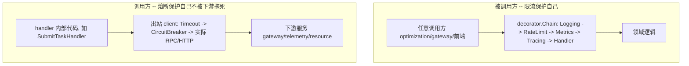

# 限流与熔断设计方案（文档产出，不改代码）

## 背景

`discussion/2026-09-04.md` 风险点 #3 指出："内部服务间调用完全没有限流/熔断（`microservices_framework.md` 早就指出但没做）——Optimization 会是第一个'定时轮询读 telemetry + 高频调 dispatch'的角色"。`microservices_framework.md` 当时只给了一个粗略的 `WithRateLimit` 代码形状示意，没有落到具体架构位置、配置、可观测性、多个出站依赖怎么隔离等细节。本次产出补全这份设计。

调研确认的现状（[限流熔断上下文调研](68c38551-9978-48af-bf2f-56303adb84b5)）：
- `internal/platform/decorator/`：`Chain`/`Middleware[C,R]` 洋葱模型 + `ApplyCommandDecorators`/`ApplyQueryDecorators`（固定顺序 `Logging→Metrics→Tracing→handler`），全部约 50 个 CQRS handler 都走这个统一入口，协议无关。
- `internal/platform/server/grpc_client.go` 的 `DialGRPC`：只有 OTel stats handler，**无 client 端 interceptor、无默认超时、无重试**。
- 服务间同步调用点：dispatch→gateway（gRPC）、gateway→telemetry（gRPC）、gateway↔simulator/simulator↔gateway（HTTP，5s 硬编码超时）、simulator→resource（gRPC）。
- go.mod 里无任何限流/熔断库；dispatch 现有的"熔断"（`applyCircuitBreaker`）是任务级 FailFast，和传输层熔断是两个不同概念，不冲突。
- 已确认决策：v1 限流按 operation 类型隔离（不做 per-tenant），本次只产出设计文档，代码留给后续会话。

## 核心架构决策：限流和熔断分属两个不同的层



- **限流挂在 `platform/decorator`**：因为限流是"保护本服务不被打垮"，粒度天然是"这个 operation 类型"（如 `SubmitTask` vs `GetTask`），decorator 已经是协议无关、按 handler 类型区分的统一入口，不需要新概念。
- **熔断挂在出站 client wrapper（新包 `internal/platform/resilience/`）**：因为熔断的"健康状态"天然是按下游依赖（gateway/telemetry/resource 各自一个 breaker 实例）统计的，不是按本地 handler 类型统计——一个 handler 内部可能调用 0 个或 1 个外部依赖，混进 decorator 会导致隔离粒度错误（例如不调用任何外部服务的 `QueryAggregation` handler 套熔断毫无意义）。现有代码结构里每个下游依赖已经有专属 adapter client 包（`gateway_grpc/`、`telemetry_grpc/`、`simulator/client/`），熔断天然应该包在这些 client 外面。

## 方案一：限流（Rate Limiting）

- **位置**：`internal/platform/decorator/ratelimit.go` 新增 `WithRateLimit[C, R any](limiter *rate.Limiter, metrics MetricsClient) Middleware[C, R]`，用 `golang.org/x/time/rate` 令牌桶，`Allow()` 失败返回 `ErrRateLimited`。
- **顺序**：`Logging → RateLimit → Metrics → Tracing → handler`（被拒绝的请求仍被访问日志记录，但不产生 Metrics 耗时统计和 Tracing span，尽早短路）。
- **兼容性**：用 functional options 扩展现有 `ApplyCommandDecorators`/`ApplyQueryDecorators` 签名（新增可选 `opts ...Option[C,R]`），默认不传等价于现状，现有约 50 个调用点不用改。只在真正需要保护的 handler（如 dispatch 的 `SubmitTask`/`CancelTask`、telemetry 的 `QueryAggregation`/`GetFleetSnapshot`/`Ingest`）显式传入 `decorator.WithRateLimiter(rate.NewLimiter(...))`。
- **粒度（已确认）**：v1 按 operation 类型（每个 handler 一个独立 limiter），不做 per-tenant，避免动态开桶+GC 的复杂度。
- **配置**：各服务 `config/<svc>.yaml` 新增可选 `rate-limit` 段，按 handler 名配 `rps`/`burst`，无配置项时默认不限流（纯 additive）。
- **触发后的错误映射**：`ErrRateLimited` 需要在 inbound adapter 的 error mapping 里加一条 → gRPC `codes.ResourceExhausted` / HTTP 429（具体现有 error mapping 表的位置留给实现阶段核实）。

## 方案二：熔断（Circuit Breaker）

- **新包**：`internal/platform/resilience/circuitbreaker.go`，基于 `github.com/sony/gobreaker/v2`（支持 generics），封装 `BreakerConfig`（连续失败数 / 最小样本数 / 失败率 / open 状态超时）+ `NewBreaker[R](cfg) *gobreaker.CircuitBreaker[R]`。
- **gRPC 接入**：给 `platform/server/grpc_client.go` 新增两个 `grpc.UnaryClientInterceptor`：
  1. `UnaryClientTimeoutInterceptor(d)`：若 ctx 无 deadline 则补一个默认超时——**这是熔断能正确工作的前提**（目前出站调用完全没有超时兜底，挂死的调用不会被判定为失败，breaker 永远不会跳闸）。
  2. `UnaryClientBreakerInterceptor(cb)`：包一层 `cb.Execute(...)`，`gobreaker.ErrOpenState` 时快速失败。
  通过 `DialGRPC(addr, grpc.WithChainUnaryInterceptor(TimeoutInterceptor, BreakerInterceptor))` 接入，各出站 client（`gatewaygrpc.NewClient`、`telemetrygrpc.NewTelemetryGRPCClient`、simulator 的 resource client）各自持有独立 breaker 实例。
- **HTTP 接入**（gateway↔simulator）：`BreakerTransport` 包装 `http.RoundTripper`，5xx 视为失败计入 breaker；已有 5s 超时可以复用，不用重复加超时逻辑。
- **配置**：各服务 yaml 里出站依赖段新增 `circuit-breaker`（连续失败数/最小样本/失败率/open 超时）+ `timeout`（默认单次 RPC 超时），示例：

```yaml
gateway-grpc:
  addr: 127.0.0.1:5002
  timeout: 3s
  circuit-breaker:
    consecutive-failures: 5
    min-requests: 10
    failure-ratio: 0.5
    open-timeout: 30s
```

- **断路后的调用方行为**：client 方法把 `ErrOpenState` 转换成清晰的领域错误（如 `ErrDependencyUnavailable`），上层 handler 走快速失败路径而不是排队等超时（例如 dispatch 的 `SubmitTaskHandler` 遇到 gateway breaker open 时直接标记 Task 失败，不重试）；建议在失败原因里带上"熔断触发"标记，方便 alarm 侧和普通业务失败区分展示（呼应 discussion 里"算法误触发 vs 人工误触发"的类似诉求）。

## 可观测性

- 限流拒绝次数复用现有 `MetricsClient.Count("ratelimit", action, "rejected")`。
- 熔断状态变化用 gobreaker 的 `OnStateChange` 回调接日志 + 新增 gauge `circuit_breaker_state{dependency}`（0=closed/1=half-open/2=open）。

## 依赖新增

- `golang.org/x/time/rate`（限流，标准库扩展，零额外依赖负担）
- `github.com/sony/gobreaker/v2`（熔断，唯一新增第三方库，轻量）

## 建议落地顺序（记录在文档里，本次不实施）

1. 限流 decorator（纯 additive，默认不开启，风险最低）。
2. 出站 gRPC/HTTP 默认超时（熔断生效的前提，目前完全没有）。
3. 熔断 wrapper，先上现有链路（dispatch→gateway、gateway→telemetry），Optimization→{resource,telemetry,dispatch} 等 Optimization 实现时按同样模式接入。
4. 可观测性打点跟进。

## 文档落地位置

- 在 `microservices_framework.md` 末尾追加新的一节"限流/熔断设计方案"，写入以上完整设计（呼应文件开头"限流/熔断 ❌ 缺失"那一行，形成 gap→方案的闭环）。
- 在 `discussion/2026-09-04.md` 第六节"留给下一次设计文档要覆盖的问题清单"里，把"限流/熔断中间件"这一条标记为已产出方案，并加指向 `microservices_framework.md` 新增节的引用。

## 本次不做的事（明确排期到后续会话）

- 不写任何 Go 代码（`ratelimit.go`、`circuitbreaker.go`、client 接入等）。
- 不改 `go.mod`/新增依赖。
- 不决定 Optimization → {resource,telemetry,dispatch} 具体每个 RPC 的限流阈值/熔断参数数值（那属于 Optimization v1 设计文档的范畴）。
