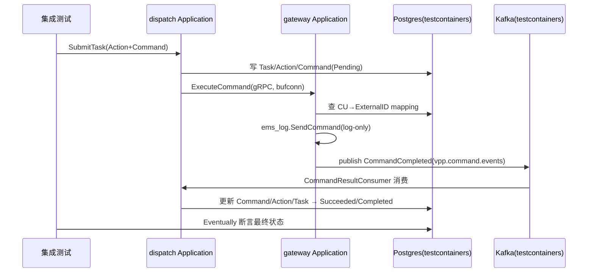
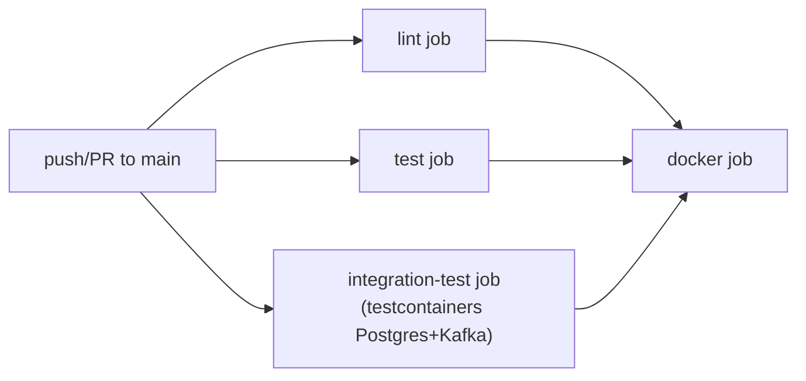

# 集成测试 + K8s 部署前置条件改造方案

## 范围边界

本方案覆盖 [ROADMAP.md](ROADMAP.md) Phase A 的两项：**集成测试**、以及上次讨论中提到的 **K8s 部署前置条件**（健康检查探针、配置外部化）。**不包含** K8s manifests、ClusterIP 收紧、实际部署——这些留给"K8s 基础部署"这一独立阶段。

## 一个调研中发现的重要修正：配置外部化其实已经做好了

上次回答里我说"配置外部化（env 覆盖 YAML）留给 K8s 阶段处理"，这是我的错误判断，需要纠正。实际调研发现：5 个服务的 `app.go`（如 [internal/dispatch/app.go](internal/dispatch/app.go):99-100）都已经统一用了

```go
viper.AutomaticEnv()
viper.SetEnvKeyReplacer(strings.NewReplacer(".", "_", "-", "_"))
```

我用一个最小 Go 程序实测验证过：只要某个配置项（如 `database.host`）已经在 YAML 里出现过，`DATABASE_HOST` 这个环境变量就能在 `viper.Unmarshal` 时正确覆盖嵌套 struct 字段——这正是 K8s ConfigMap/Secret 注入环境变量所需要的机制，**代码层面不需要任何改动**。[internal/resource/docs/APP_WIRING.md](internal/resource/docs/APP_WIRING.md) 也确认了这是有意为之的设计（"面向 CLI / 配置文件 / 环境变量"）。

本方案会顺手把 [ROADMAP.md](ROADMAP.md)「已知限制」表里那条错误的记录改正，并补一份简短的环境变量命名对照文档，方便以后写 K8s manifest 时直接查表。

## K8s 部署前置条件里真正缺的一项：健康检查探针

调研确认：

- `grpc_health_v1`（标准 gRPC 健康检查协议）**完全没有被使用**，`google.golang.org/grpc/health` 已经是 `google.golang.org/grpc` 的子包，4 个 gRPC 服务（resource/telemetry/gateway/dispatch）都已间接依赖，不需要新增外部依赖
- HTTP 侧：`simulator` 已经有 `/healthz`（[internal/simulator/api/handler.go](internal/simulator/api/handler.go):41-43），但 **resource 和 gateway 的 HTTP 路由完全没有**，尽管 [internal/resource/docs/APP_WIRING.md](internal/resource/docs/APP_WIRING.md):106 早就写了"`PrepareRun()` 中可以挂载 `/healthz``/readyz`"的设计意图
- 4 个 gRPC 服务共用同一个工厂 [internal/platform/server/grpc.go](internal/platform/server/grpc.go) 的 `NewGRPCServer()`；resource 和 gateway 的 HTTP 路由共用 [internal/platform/server/http.go](internal/platform/server/http.go) 的 `NewGinEngine()`——这两处各改一次，全部服务同时受益，不用挨个服务改 5 遍

具体改动：

1. **`NewGRPCServer()`**：注册 `grpc_health_v1.HealthServer`（`health.NewServer()`），启动时置为 `SERVING`。K8s 1.24+ 原生支持 `livenessProbe.grpc.port`，到了 K8s 阶段可以直接用，不需要额外的 `grpc_health_probe` 边车工具。
2. **`NewGinEngine()`**：新增 `GET /healthz` 返回 `{"status":"ok","time":...}`，和 simulator 现有的响应体保持一致。
3. **顺手清理**：simulator 的 [internal/simulator/api/handler.go](internal/simulator/api/handler.go):41-43 有它自己单独注册的 `/healthz`——一旦 `NewGinEngine()` 也注册同路径，Gin 会在启动时因路由重复而 panic。需要同步删掉 simulator 里那份重复注册，改用共享实现。

## 集成测试：SubmitTask → ExecuteCommand → Kafka 回调

### 这条链路实际长什么样（调研确认）



关键代码依据：

- [internal/dispatch/application/command/submit_task.go](internal/dispatch/application/command/submit_task.go):111-212 ——`SubmitTask` 落库后同步调用 `dispatchCommands`（内部走 `appport.GatewayPort` → [internal/dispatch/adapter/outbound/gateway_grpc/client.go](internal/dispatch/adapter/outbound/gateway_grpc/client.go)，真正的 gRPC 调用）
- [internal/gateway/application/command/execute_command.go](internal/gateway/application/command/execute_command.go):72-126 ——查 mapping、调用 `ems_log`（[internal/gateway/adapter/outbound/ems_log/client.go](internal/gateway/adapter/outbound/ems_log/client.go)，log-only，不需要真实 EMS/simulator），然后**同步在同一次 Handle 里**发布 `CommandCompleted` 到 Kafka
- [internal/dispatch/adapter/inbound/kafka/command_result_consumer.go](internal/dispatch/adapter/inbound/kafka/command_result_consumer.go) ——dispatch 后台消费 `vpp.command.events`（topic 名来自 [config/dispatch.yaml](config/dispatch.yaml):55，和 gateway 侧 [config/gateway.yaml](config/gateway.yaml):59 一致），驱动 `HandleCommandResult` 更新状态
- 现有单测（如 [internal/dispatch/application/command/command_test.go](internal/dispatch/application/command/command_test.go):194 的 `TestHandleCommandResult_SuccessContinues`）全部是 mock repo/mock gateway，**从未真正跑过 Postgres+Kafka 的异步回环**——这正是集成测试要补的缺口
- `simulator` **不在**这条链路里（v1 的 `ems_log` 是纯日志实现，不调用 simulator），和 ROADMAP 原文措辞一致，不需要覆盖

### 技术方案

新建独立 Go module `tests/integration/`（`go.mod` module path `github.com/mushroomyuan/vpp-backend/tests/integration`，`replace` 指向 `../../internal/dispatch`、`../../internal/gateway`、`../../internal/platform` 及相关 `api/*/proto/gen`）。之所以能这样引用两个服务模块的代码：这些模块的 Go 包路径本身不含 `internal` 关键字（`module github.com/mushroomyuan/vpp-backend/dispatch`，物理目录叫 `internal/dispatch` 只是仓库约定），Go 语言层面没有可见性限制。

- 依赖：`testcontainers-go` + `testcontainers-go/modules/postgres` + `testcontainers-go/modules/kafka`（KRaft 单节点，和 [compose.yaml](compose.yaml) 里的 `bitnamilegacy/kafka` 用法对齐）
- Postgres 容器：用 `postgres.WithInitScripts(...)` 直接执行现有的 [migrations/dispatch/000001_init.up.sql](migrations/dispatch/000001_init.up.sql) 和 [migrations/gateway/000001_init.up.sql](migrations/gateway/000001_init.up.sql)，不重新写一套 schema
- gateway → dispatch 之间的 gRPC 调用用 `bufconn`（内存网络），避免抢占真实端口、避免网络抖动导致的测试不稳定
- 测试内容：1 条正向路径（mapping 存在、SendCommand 成功 → 最终 Command/Action/Task 全部 Completed）+ 1 条异常路径（mapping 不存在 → Command 落 Failed，不阻塞 Task 判定，具体行为以现有 `dispatch_helper.go` 的 `FailurePolicy` 逻辑为准）。用 `require.Eventually`（超时轮询）断言最终状态，因为 Kafka 回调这一跳是异步的

### 接入 CI 和本地命令

- [.github/workflows/ci.yml](.github/workflows/ci.yml) 新增 `integration-test` job，用 `docker/setup-buildx-action` 之外不需要额外配置——GitHub 托管的 `ubuntu-latest` runner 自带可用的 Docker daemon，testcontainers-go 开箱即用
- `docker` job 的 `needs` 从 `[lint, test]` 扩展为 `[lint, test, integration-test]`，让镜像推送前多一道质量门槛
- [Makefile](Makefile) 新增 `test-integration` target（`cd tests/integration && go test ./... -v -timeout=5m`），本地和 CI 用同一条命令



## 文档 / ROADMAP 更新

- [ROADMAP.md](ROADMAP.md)：勾选"集成测试"项；修正"配置外部化"那条已知限制记录（标注为已具备，不是待办）；health check 探针补一条"已完成"记录
- 新增一份简短文档（建议 `docs/CONFIG_ENV_OVERRIDE.md`），列出每个服务关键配置项对应的环境变量名（`database.host` → `DATABASE_HOST` 这种映射表），供以后写 K8s manifest 时直接查

## 验收标准

- `make test-integration` 本地跑通：Postgres/Kafka 容器自动拉起、SubmitTask 全链路走完、最终状态断言通过
- CI 里新增的 `integration-test` job 全绿，且 `docker` job 确认依赖它
- 4 个 gRPC 服务的健康检查用 `grpcurl -plaintext <addr> grpc.health.v1.Health/Check` 能拿到 `SERVING`；resource/gateway 的 `curl <http-addr>/healthz` 返回 200；simulator 原有 `/healthz` 行为不变、且服务能正常启动（不因路由冲突 panic）
- [ROADMAP.md](ROADMAP.md) 更新到位，配置外部化的错误记录被修正

## Todos（执行阶段用）

1. `platform/server`：`NewGRPCServer()` 注册 grpc health server；`NewGinEngine()` 新增 `/healthz`；同步删除 simulator 里重复的 `/healthz` 注册
2. 新建 `tests/integration` module：testcontainers 拉起 Postgres（跑现有 migration）+ Kafka，bufconn 连接 dispatch/gateway，写 SubmitTask 全链路正向 + 异常路径两个测试
3. `.github/workflows/ci.yml` 新增 `integration-test` job，`docker` job 的 `needs` 加上它；`Makefile` 新增 `test-integration`
4. 修正 `ROADMAP.md` 已知限制表里的配置外部化记录，勾选集成测试/健康检查完成项；新增 `docs/CONFIG_ENV_OVERRIDE.md`
5. 本地验证：`make test-integration`、`make vet`/`make test`/`make lint` 全跑一遍确认没有破坏现有内容，再 push 触发 CI 端到端验证
